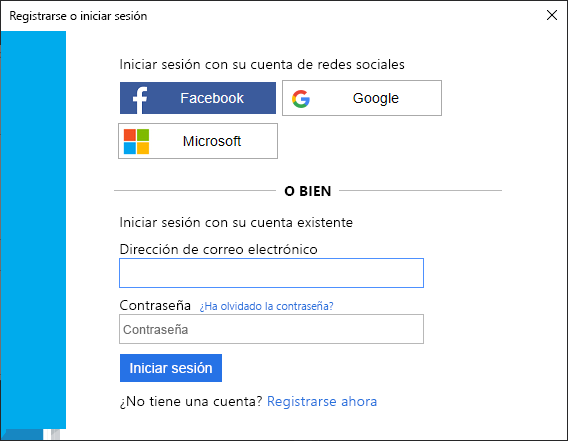
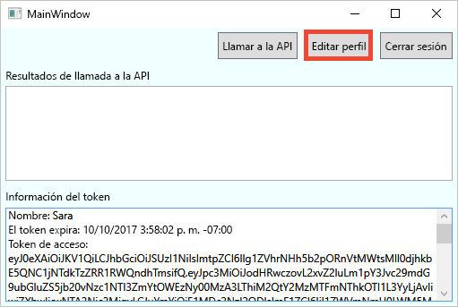
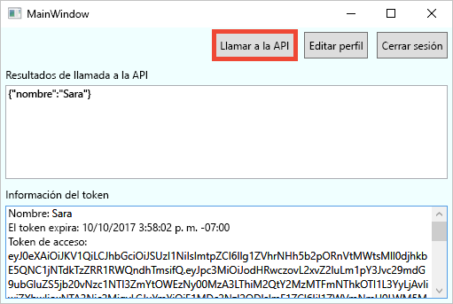

# <a name="quickstart-set-up-sign-in-for-a-desktop-app-using-azure-active-directory-b2c"></a>Inicio rápido: Configuración del inicio de sesión en una aplicación de escritorio mediante Azure Active Directory B2C

Azure Active Directory B2C (Azure AD B2C) proporciona administración de identidades en la nube para mantener la protección de su aplicación, empresa y clientes. Azure AD B2C permite que las aplicaciones puedan autenticarse con cuentas de redes sociales y cuentas de empresa mediante protocolos estándar abiertos. En esta guía de inicio rápido, se utiliza una aplicación de escritorio de Windows Presentation Foundation (WPF) para iniciar sesión mediante un proveedor de identidades de redes sociales y llamar a una API web protegida por Azure AD B2C.

[!INCLUDE [quickstarts-free-trial-note](../../includes/quickstarts-free-trial-note.md)]

## <a name="prerequisites"></a>Prerrequisitos

- [Visual Studio 2019](https://www.visualstudio.com/downloads/) con la carga de trabajo de **ASP.NET y desarrollo web**.
- Una cuenta de redes sociales de Facebook, Google o Microsoft.
- [Descargue un archivo zip](https://github.com/Azure-Samples/active-directory-b2c-dotnet-desktop/archive/msalv3.zip) o clone el repositorio [Azure-Samples/active-directory-b2c-dotnet-desktop](https://github.com/Azure-Samples/active-directory-b2c-dotnet-desktop) de GitHub.

    ```
    git clone https://github.com/Azure-Samples/active-directory-b2c-dotnet-desktop.git
    ```

## <a name="run-the-application-in-visual-studio"></a>Ejecución de la aplicación en Visual Studio

1. En la carpeta de proyecto de la aplicación de ejemplo, abra la solución **active-directory-b2c-wpf.sln** en Visual Studio.
2. Presione **F5** para depurar la aplicación.

## <a name="sign-in-using-your-account"></a>Inicio de sesión mediante su cuenta

1. Haga clic en **Iniciar sesión** para iniciar el flujo de trabajo **Registrarse o iniciar sesión**.

    

    El ejemplo admite varias opciones de registro: usar un proveedor de identidades de redes sociales o crear una cuenta local con una dirección de correo electrónico. Para este inicio rápido, use una cuenta de proveedor de identidades sociales de Facebook, Google o Microsoft.


2. Azure AD B2C presenta una página de inicio de sesión para una empresa ficticia llamada Fabrikam para la aplicación web de ejemplo. Para registrarse con un proveedor de identidades de redes sociales, haga clic en el botón del proveedor de identidades que desee usar.

    

    Debe autenticarse (iniciar sesión) con las credenciales de su cuenta de redes sociales y autorizar a la aplicación para que lea la información de su cuenta de redes sociales. Al conceder acceso, la aplicación puede recuperar la información del perfil de la cuenta de redes sociales como el nombre y la ciudad.

2. Finalice el proceso de inicio de sesión para el proveedor de identidades.

    Los detalles del perfil de la cuenta nueva se rellenan automáticamente con la información de su cuenta de redes sociales.

## <a name="edit-your-profile"></a>Edición del perfil

Azure AD B2C proporciona la funcionalidad necesaria para permitir a los usuarios actualizar sus perfiles. La aplicación web de ejemplo usa un flujo de usuario del perfil de edición de Azure AD B2C para el flujo de trabajo.

1. En la barra de menús de la aplicación, haga clic en **Editar perfil** para editar el perfil que ha creado.

    

2. Elija el proveedor de identidades asociado con la cuenta que ha creado. Por ejemplo, si ha usado Facebook como proveedor de identidades cuando creó su cuenta, elija Facebook para modificar los detalles del perfil asociado.

3. Cambie los valores de **Display name** (Nombre para mostrar) o **City** (Ciudad) y haga clic en **Continue** (Continuar).

    Se muestra un nuevo token de acceso en el cuadro de texto *Información de token*. Si desea comprobar los cambios en el perfil, copie y pegue el token de acceso en el descodificador de token https://jwt.ms.

## <a name="access-a-protected-api-resource"></a>Acceso a un recurso de API protegido

Haga clic en **Llamada a la API** para realizar una solicitud al recurso protegido.



La aplicación incluye el token de acceso de Azure AD en la solicitud al recurso de API web protegido. La API web devuelve el nombre para mostrar contenido en el token de acceso.

Ha utilizado correctamente su cuenta de usuario de Azure AD B2C para realizar una llamada autorizada a una API web de Azure AD B2C protegida.

## <a name="clean-up-resources"></a>Limpieza de recursos

Puede usar el inquilino de Azure AD B2C si tiene previsto leer otros tutoriales o guías de inicio rápido de Azure AD B2C. Cuando ya no sea necesario, puede [eliminar el inquilino de Azure AD B2C](faq.md#how-do-i-delete-my-azure-ad-b2c-tenant).

## <a name="next-steps"></a>Pasos siguientes

En este inicio rápido, ha utilizado una aplicación de escritorio de ejemplo para lo siguiente:

* Iniciar sesión con una página de inicio de sesión personalizada
* Iniciar sesión con un proveedor de identidades de redes sociales
* Crear una cuenta de Azure AD B2C
* Llamar a una API web protegida por Azure AD B2C

Empiece a crear su propio inquilino de Azure AD B2C.

> [!div class="nextstepaction"]
> [Creación de un inquilino de Azure Active Directory B2C en Azure Portal](tutorial-create-tenant.md)
