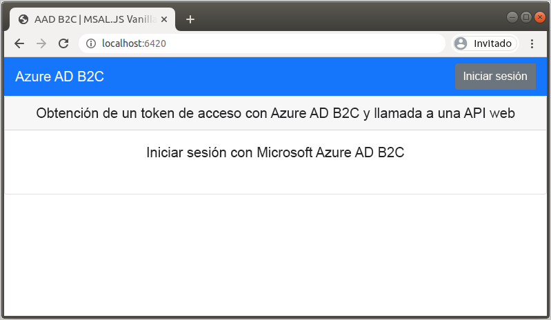
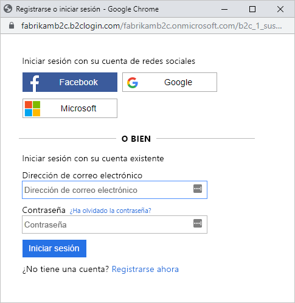
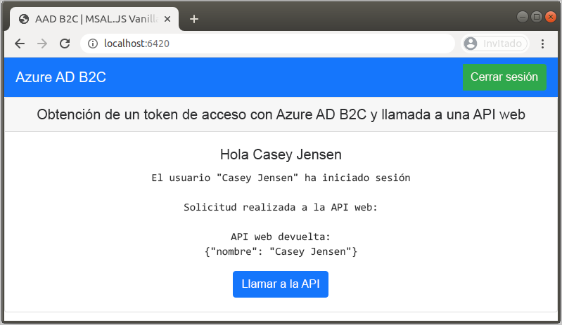

# <a name="quickstart-set-up-sign-in-for-a-single-page-app-using-azure-active-directory-b2c"></a>Inicio rápido: Configuración del inicio de sesión en una aplicación de una sola página mediante Azure Active Directory B2C

Azure Active Directory B2C (Azure AD B2C) proporciona administración de identidades en la nube para mantener la protección de su aplicación, empresa y clientes. Azure AD B2C permite que las aplicaciones puedan autenticarse con cuentas de redes sociales y cuentas de empresa mediante protocolos estándar abiertos. En esta guía de inicio rápido, se utiliza una aplicación de página única para iniciar sesión mediante un proveedor de identidades de redes sociales y llamar a una API web protegida por Azure AD B2C.

[!INCLUDE [quickstarts-free-trial-note](../../includes/quickstarts-free-trial-note.md)]

## <a name="prerequisites"></a>Prerrequisitos

- [Visual Studio 2019](https://www.visualstudio.com/downloads/) con la carga de trabajo de **ASP.NET y desarrollo web**
- [Node.js](https://nodejs.org/en/download/)
- Cuenta de redes sociales de Facebook, Google o Microsoft
- Código de ejemplo de GitHub: [active-directory-b2c-javascript-msal-singlepageapp](https://github.com/Azure-Samples/active-directory-b2c-javascript-msal-singlepageapp)

    Puede [descargar el archivo .zip](https://github.com/Azure-Samples/active-directory-b2c-javascript-msal-singlepageapp/archive/master.zip) o clonar el repositorio:

    ```
    git clone https://github.com/Azure-Samples/active-directory-b2c-javascript-msal-singlepageapp.git
    ```

## <a name="run-the-application"></a>Ejecución de la aplicación

1. Inicie el servidor mediante la ejecución de los siguientes comandos desde el símbolo del sistema de Node.js:

    ```
    cd active-directory-b2c-javascript-msal-singlepageapp
    npm install && npm update
    node server.js
    ```

    Server.js da como resultado el número de puerto que está escuchando en localhost.

    ```
    Listening on port 6420...
    ```

2. Vaya a la dirección URL de la aplicación. Por ejemplo, `http://localhost:6420`.

## <a name="sign-in-using-your-account"></a>Inicio de sesión mediante su cuenta

1. Haga clic en **Iniciar sesión** para iniciar el flujo de trabajo.

    

    El ejemplo admite varias opciones de registro: usar un proveedor de identidades de redes sociales o crear una cuenta local con una dirección de correo electrónico. Para este inicio rápido, use una cuenta de proveedor de identidades sociales de Facebook, Google o Microsoft.

2. Azure AD B2C presenta una página de inicio de sesión para una empresa ficticia llamada Fabrikam para la aplicación web de ejemplo. Para registrarse con un proveedor de identidades de redes sociales, haga clic en el botón del proveedor de identidades que desee usar.

    

    Debe autenticarse (iniciar sesión) con las credenciales de su cuenta de redes sociales y autorizar a la aplicación para que lea la información de su cuenta de redes sociales. Al conceder acceso, la aplicación puede recuperar la información del perfil de la cuenta de redes sociales como el nombre y la ciudad.

3. Finalice el proceso de inicio de sesión para el proveedor de identidades.

## <a name="access-a-protected-api-resource"></a>Acceso a un recurso de API protegido

Haga clic en **Llamar a API web** para obtener el nombre para mostrar de la llamada de API web como un objeto JSON.



La aplicación de página única de ejemplo incluye un token de acceso en la solicitud al recurso de API web protegido.

## <a name="clean-up-resources"></a>Limpieza de recursos

Puede usar el inquilino de Azure AD B2C si tiene previsto leer otros tutoriales o guías de inicio rápido de Azure AD B2C. Cuando ya no sea necesario, puede [eliminar el inquilino de Azure AD B2C](faq.md#how-do-i-delete-my-azure-ad-b2c-tenant).

## <a name="next-steps"></a>Pasos siguientes

En este inicio rápido, ha utilizado una aplicación de una página única de ejemplo para lo siguiente:

* Iniciar sesión con una página de inicio de sesión personalizada
* Iniciar sesión con un proveedor de identidades de redes sociales
* Crear una cuenta de Azure AD B2C
* Llamar a una API web protegida por Azure AD B2C

Empiece a crear su propio inquilino de Azure AD B2C.

> [!div class="nextstepaction"]
> [Creación de un inquilino de Azure Active Directory B2C en Azure Portal](tutorial-create-tenant.md)
