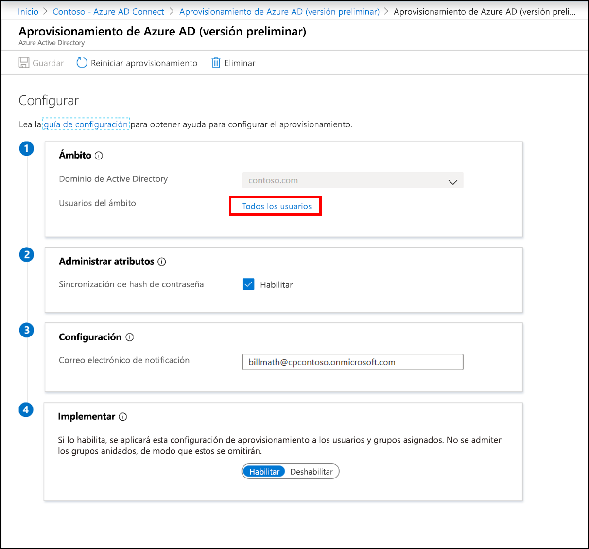

# Configuración del nuevo aprovisionamiento en la nube de Azure AD Connect

Una vez instalado el agente, debe iniciar sesión en Azure Portal y configurar el aprovisionamiento.  Para habilitar el agente, realice los siguientes pasos.

## Configuración del aprovisionamiento
Para configurar el aprovisionamiento, siga estos pasos:

1.  En el portal de Azure AD, haga clic en **Azure Active Directory**.
2.  Haga clic en **Azure AD Connect**.
3.  Seleccione **Administración del aprovisionamiento (versión preliminar)** 
.

4.  Haga clic en **Nueva configuración**.
5.  En la pantalla de configuración, el dominio local se ha rellenado previamente.
6. Escriba un **correo electrónico de notificación de alerta**. Este correo electrónico recibirá una notificación cuando el aprovisionamiento no sea correcto.  
8. Mueva el selector a **Habilitar** y haga clic en **Guardar**.

## Aprovisionamiento del ámbito para usuarios y grupos específicos
Es posible limitar el ámbito del agente para sincronizar solo usuarios y grupos específicos. Puede usar el ámbito mediante grupos de AD locales o unidades organizativas. No se pueden configurar grupos ni unidades organizativas dentro de una configuración. 

1.  En el portal de Azure AD, haga clic en **Azure Active Directory**.
2.  Haga clic en **Azure AD Connect**.
3.  Seleccione **Administración del aprovisionamiento (versión preliminar)** .
4.  En **Configuración**, haga clic en su configuración.  

5.  En **Configurar**, seleccione **Todos los usuarios** para cambiar el ámbito de la regla de configuración.

6. A la derecha, puede cambiar el ámbito para que incluya solo los grupos de seguridad; para ello, especifique el nombre distintivo del grupo y haga clic en **Agregar**.

7. O bien cámbielo para que incluya solo unidades organizativas específicas. Haga clic en **Listo** y en **Guardar**.

## Reinicio del aprovisionamiento 
Si no desea esperar a la siguiente ejecución programada, puede desencadenar la ejecución del aprovisionamiento mediante el botón para reiniciar el aprovisionamiento. 
1.  En el portal de Azure AD, haga clic en **Azure Active Directory**.
2.  Haga clic en **Azure AD Connect**.
3.  Seleccione **Administración del aprovisionamiento (versión preliminar)** .
4.  En **Configuración**, haga clic en su configuración.  

5.  En la parte superior, haga clic en **Reiniciar aprovisionamiento**.

## Eliminación de una configuración
Si desea eliminar una configuración, puede seguir estos pasos.

1.  En el portal de Azure AD, haga clic en **Azure Active Directory**.
2.  Haga clic en **Azure AD Connect**.
3.  Seleccione **Administración del aprovisionamiento (versión preliminar)** .
4.  En **Configuración**, haga clic en su configuración.  

5.  En la parte superior, haga clic en **Eliminar**.

>[!IMPORTANT]
>No hay confirmación antes de eliminar una configuración. Asegúrese de que se trata de la acción que desea realizar antes de hacer clic en **Eliminar**.

## Pasos siguientes 

- [¿Qué es el aprovisionamiento?](what-is-provisioning.md)
- [¿Qué es el aprovisionamiento en la nube de Azure AD Connect?](what-is-cloud-provisioning.md)
