# Aprovisionamiento piloto en la nube para un bosque de AD sincronizado existente 

En este tutorial se explica como realizar una prueba piloto del aprovisionamiento en la nube de un bosque de Active Directory de prueba que ya está sincronizado mediante la sincronización de la conexión de Azure Active Directory (Azure AD).

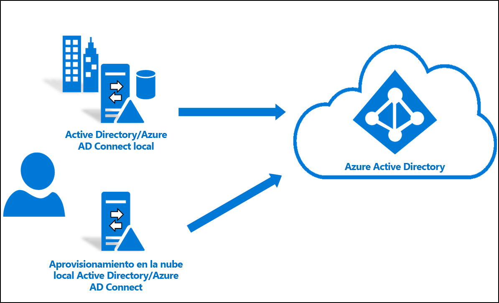

## Consideraciones
Antes de empezar con este tutorial, considere los siguientes elementos:
1. Asegúrese de que conoce los conceptos básicos del aprovisionamiento en la nube. 
2. Asegúrese de que ejecuta la versión 1.4.32.0 de la sincronización de Azure AD Connect, o cualquier versión posterior, y de que ha configurado las reglas de sincronización como se ha documentado. Al realizar una prueba piloto, eliminará una unidad organizativa o grupo de prueba del ámbito de sincronización de Azure AD Connect. Sacar objetos del ámbito provoca la eliminación de esos objetos en Azure AD. En el caso de los objetos de usuario, los objetos de Azure AD se eliminan de manera temporal y se pueden restaurar. En el caso de los objetos de usuario, los objetos de Azure AD se eliminan de forma permanente y no se pueden restaurar. Se ha introducido un nuevo tipo de vínculo en la sincronización de Azure AD Connect que evitará la eliminación en un escenario de prueba piloto. 
3. Asegúrese de que los objetos del ámbito de la prueba tengan ms-ds-consistencyGUID relleno para que el aprovisionamiento en la nube se ajuste de forma fija a los objetos. 

   > [!NOTE]
   > La sincronización de Azure AD Connect no rellena *ms-ds-consistencyGUID* de forma predeterminada para los objetos del grupo. Siga los pasos que se documentan en [esta entrada de blog](https://blogs.technet.microsoft.com/markrenoden/2017/10/13/choosing-a-sourceanchor-for-groups-in-multi-forest-sync-with-aad-connect/) para rellenar *ms-ds-consistencyGUID* para los objetos de grupo.

4. Este es un escenario avanzado. Asegúrese de que sigue los pasos de este tutorial con precisión.

## Prerrequisitos
A continuación, se indican los requisitos previos necesarios para completar este tutorial:
- Un entorno de prueba con la versión 1.4.32.0, o cualquier versión posterior, de la sincronización de Azure AD Connect.
- Una unidad organizativa o un grupo que estén en el ámbito de la sincronización y que pueda usar en la prueba piloto. Se recomienda empezar con un pequeño conjunto de objetos.
- Un servidor que ejecuta Windows Server 2012 R2, o cualquier versión posterior, que hospedará el agente de aprovisionamiento.  El servidor no puede ser el servidor de Azure AD Connect.
- El delimitador de origen para la sincronización de AAD Connect debe ser *objectGuid* o *ms-ds-consistencyGUID*

## Actualización de Azure AD Connect

Como mínimo, debe tener [Azure AD Connect](https://www.microsoft.com/download/details.aspx?id=47594)1.4.32.0. Para actualizar la sincronización de Azure AD Connect, realice los pasos que se describen en [Azure AD Connect: actualización a la versión más reciente](../hybrid/how-to-upgrade-previous-version.md).  

## Detención del programador
La sincronización de Azure AD Connect sincroniza los campos que se incluyen en el directorio local mediante un programador. Para modificar y agregar reglas personalizadas puede que desee deshabilitar el programador para que no se ejecuten sincronizaciones mientras trabaja en esto.  Siga estos pasos:

1.  En el servidor que ejecuta la sincronización de Azure AD Connect, abra PowerShell con privilegios administrativos.
2.  Ejecute `Stop-ADSyncSyncCycle`.  Presione Entrar.
3.  Ejecute `Set-ADSyncScheduler -SyncCycleEnabled $false`.

>[!NOTE] 
>Si está ejecutando su propio programador personalizado para la sincronización de AAD Connect, deshabilite el programador. 

## Creación de una regla entrante de usuarios personalizada

 1. Inicie el editor de sincronización desde el menú de la aplicación de escritorio, tal como se muestra a continuación: 
 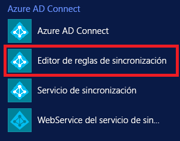 
 
 2. Seleccione **Entrante** en la lista desplegable Dirección y haga clic en **Agregar nueva regla**.
 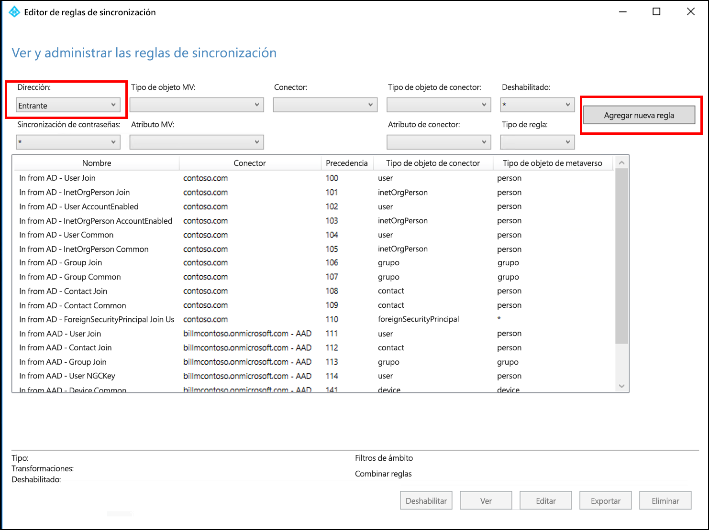 
 
 3. En la página **Descripción**, especifique los siguientes elementos y haga clic en **Siguiente**:

    **Nombre:** asigne un nombre descriptivo a la regla. 
    **Descripción:** agregue una descripción significativa. 
    **Sistema conectado:** elija el conector de AD para el que va a escribir la regla de sincronización personalizada 
    **Tipo de objeto de sistema conectado:** Usuario 
    **Tipo de objeto de metaverso:** Person 
    **Tipo de vínculo:** Join 
    **Prioridad:** especifique un valor que sea único en el sistema. 
    **Etiqueta:** deje esto en blanco. 
    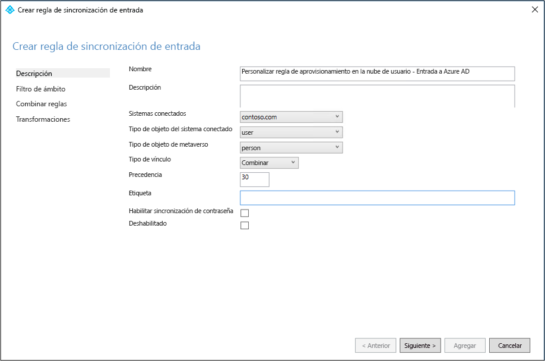 
 
 4. En la página **Scoping filter** (Filtro de ámbito), especifique la unidad organizativa o el grupo de seguridad en que desea que deje de basarse la prueba piloto.  Para filtrar por unidad organizativa, agregue la parte de la unidad organizativa del nombre distintivo. Esta regla se aplicará a todos los usuarios que se encuentren en esa unidad organizativa.  Por tanto, si el nombre de dominio acaba en "OU=CPUsers,DC=contoso,DC=com", debería agregar este filtro.  A continuación, haga clic en **Siguiente**. 

    |Regla|Atributo|Operator|Value|
    |-----|----|----|-----|
    |Ámbito de unidad organizativa|DN|ENDSWITH|Nombre distintivo de la unidad organizativa.|
    |Ámbito de grupo||ISMEMBEROF|Nombre distintivo del grupo de seguridad.|

    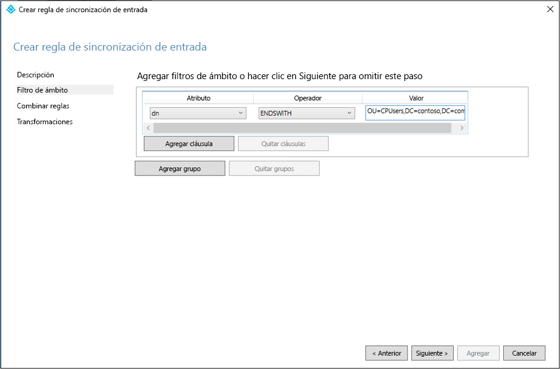 
 
 5. En la página de reglas **Join** (Combinación), haga clic en **Next** (Siguiente).
 6. En la página **Transformations** (Transformaciones), agregue una transformación de tipo Constant, con el atributo cloudNoFlow establecido en True. Haga clic en **Agregar**.
 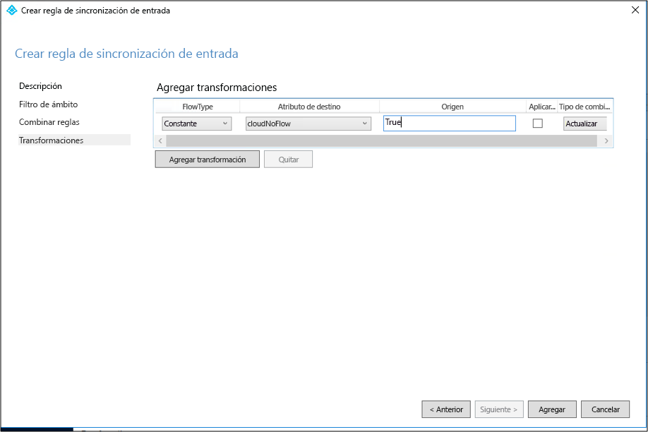 

Los mismos pasos deben seguirse para todos los tipos de objetos (usuario, grupo y contacto). Repita los pasos en todas las instancias de AD Connector configuradas y bosques de AD. 

## Creación de una regla de salida de usuarios personalizada

 1. Seleccione **Saliente** en la lista desplegable Dirección y haga clic en **Agregar regla**.
 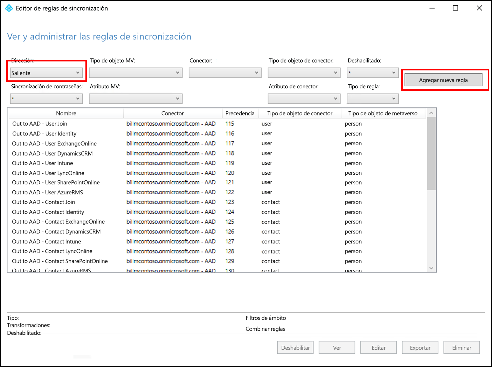 
 
 2. En la página **Descripción**, especifique los siguientes elementos y haga clic en **Siguiente**:

    **Nombre:** asigne un nombre descriptivo a la regla. 
    **Descripción:** agregue una descripción significativa. 
    **Sistema conectado:** elija el conector de AAD para el que va a escribir la regla de sincronización personalizada 
    **Tipo de objeto de sistema conectado:** Usuario 
    **Tipo de objeto de metaverso:** Person 
    **Tipo de vínculo:** JoinNoFlow 
    **Prioridad:** especifique un valor que sea único en el sistema. 
    **Etiqueta:** deje esto en blanco. 
    
    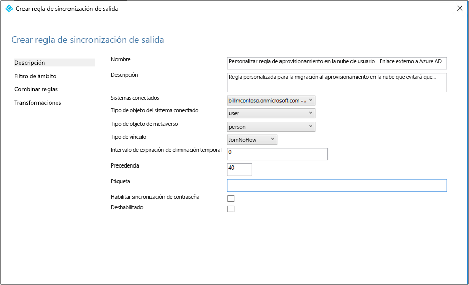 
 
 3. En la página **Scoping filter** (Filtro de ámbito), elija **cloudNoFlow** igual a **True**. A continuación, haga clic en **Siguiente**.
 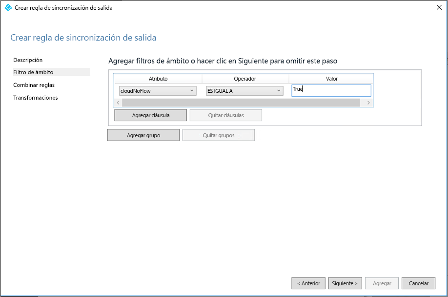 
 
 4. En la página de reglas **Join** (Combinación), haga clic en **Next** (Siguiente).
 5. En la página **Transformations** (Transformaciones), haga clic en **Add** (Agregar).

Los mismos pasos deben seguirse para todos los tipos de objetos (usuario, grupo y contacto).

## Instalación del agente de aprovisionamiento de Azure AD Connect
1. Inicie sesión en el servidor que va a usar con permisos de administrador de empresa.  Si usa el tutorial [Entorno básico de AD y Azure](tutorial-basic-ad-azure.md), sería CP1.
2. Descargue [aquí](https://go.microsoft.com/fwlink/?linkid=2109037) el agente de aprovisionamiento en la nube de Azure AD Connect.
3. Ejecución del aprovisionamiento en la nube de Azure AD Connect (AADConnectProvisioningAgent.Installer)
3. En la pantalla de presentación, **acepte** los términos de la licencia y haga clic en **Install** (Instalar). 
 

4. Una vez que finalice esta operación, se iniciará el asistente para configuración.  Inicie sesión con su cuenta de administrador global de Azure AD.
5. En la pantalla **Connect Active Directory** (Conectar Active Directory), haga clic en **Add directory** (Agregar directorio) e inicie sesión con su cuenta de administrador de Active Directory.  Esta operación permitirá agregar su directorio local.  Haga clic en **Next**. 
 

6. En la pantalla **Configuración completa**, haga clic en **Confirmar**.  Esta operación registrará el agente y lo reiniciará. 
 

7. Una vez que se complete esta operación, debería aparecer un aviso **Your was successfully verified** (Se ha comprobado correctamente).  Puede hacer clic en **Salir**. 
 
8. Si la pantalla de presentación inicial no desaparece, haga clic en **Cerrar**.

## Comprobación de la instalación del agente
La comprobación del agente se produce en Azure Portal y en el servidor local que ejecuta el agente.

### Comprobación del agente en Azure Portal
Para comprobar que Azure ve el agente, siga estos pasos:

1. Inicie sesión en Azure Portal.
2. A la izquierda, seleccione **Azure Active Directory**, haga clic en **Azure AD Connect** y, en el centro, seleccione **Administración del aprovisionamiento (versión preliminar)** . 
 

3.  En la pantalla **Aprovisionamiento de Azure AD (versión preliminar)** , haga clic en **Revisar todos los agentes**.
 
 
4. En la pantalla **On-premises provisioning agents** (Agentes de aprovisionamiento locales) verá los agentes que ha instalado.  Compruebe que el agente en cuestión está ahí y que se ha marcado como **Deshabilitado**.  El agente está deshabilitado de manera predeterminada  

### En el servidor local
Para comprobar que el agente se ejecuta, siga estos pasos:

1.  Inicie sesión en el servidor con una cuenta de administrador.
2.  Abra **Servicios**. Para ello, vaya ahí o a Inicio/Ejecutar/Services.msc.
3.  En **Servicios**, asegúrese de que tanto el **Actualizador del Agente de Microsoft Azure AD Connect** como el **Agente de aprovisionamiento de Microsoft Azure AD Connect** están ahí y que su estado es **En ejecución**.
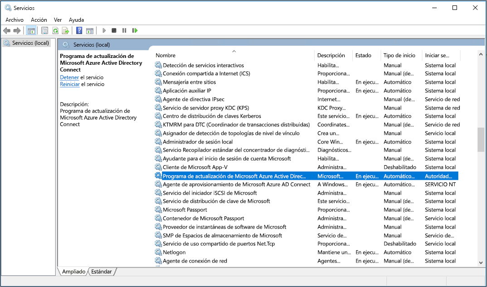

## Configuración del aprovisionamiento en la nube de Azure AD Connect
Use los pasos siguientes para configurar el aprovisionamiento:

 1. Inicie sesión en el portal de Azure AD.
 2. Haga clic en **Azure Active Directory**.
 3. Haga clic en **Azure AD Connect**.
 4. Seleccione **Administración del aprovisionamiento (versión preliminar)** 
 . 
 5.  Haga clic en **Nueva configuración**
 . 
 6.  En la pantalla de configuración, escriba un **correo electrónico de notificación**, mueva el selector a **Habilitar** y haga clic en **Guardar**.
 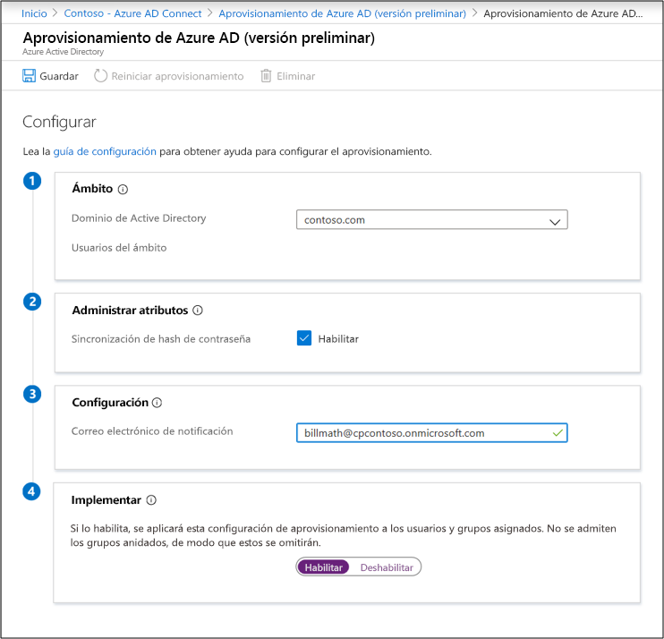 
 7. En **Configurar**, seleccione **Todos los usuarios** para cambiar el ámbito de la regla de configuración.
  
 8. A la derecha, cambie el ámbito para que incluya la unidad organizativa específica que acaba de crear "OU=CPUsers,DC=contoso,DC=com".
 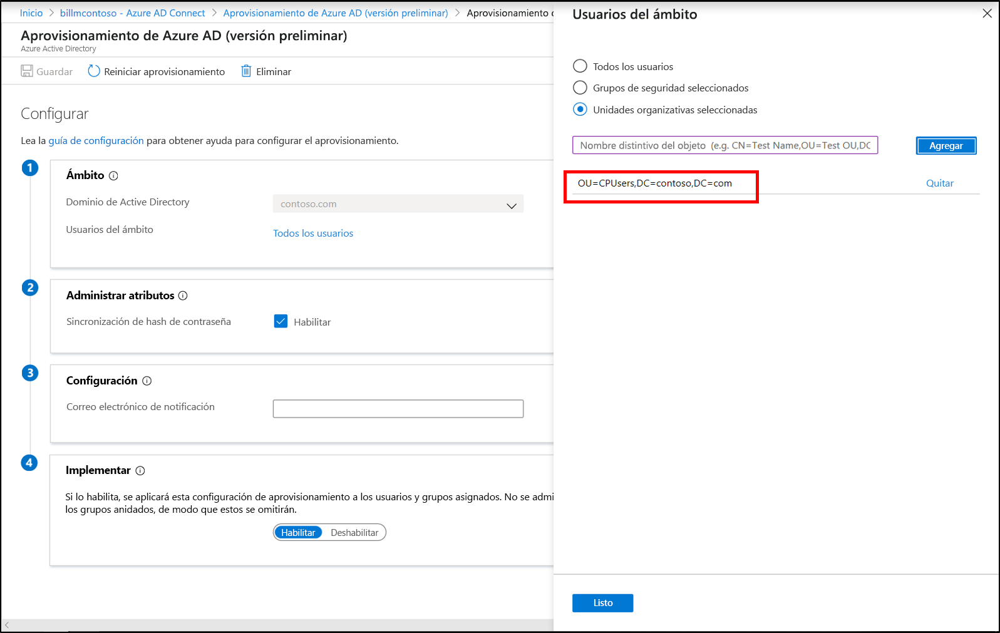 
 9.  Haga clic en **Listo** y en **Guardar**.
 10. Ahora el ámbito se debe establecer en una unidad organizativa. 
 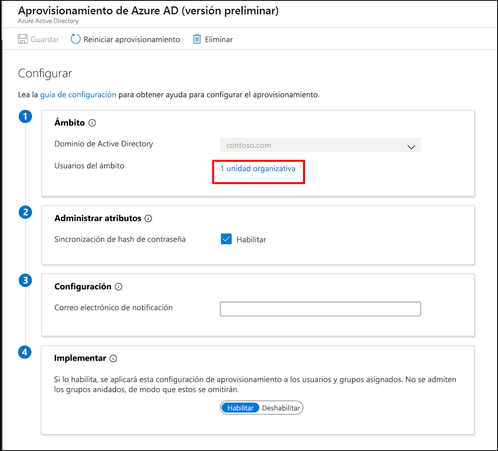 
 

## Comprobación de que el aprovisionamiento en la nube aprovisiona a los usuarios
Ahora vamos a comprobar que los usuarios que tenía en nuestro directorio local se han sincronizado y que ya existen en el inquilino de Azure AD.  Tenga en cuenta que esta acción puede tardar unas horas en completarse.  Para comprobar que el aprovisionamiento en la nube aprovisiona a los usuarios, siga estos pasos:

1. Vaya a [Azure Portal](https://portal.azure.com) e inicie sesión con una cuenta que tenga una suscripción de Azure.
2. En la parte izquierda, seleccione **Azure Active Directory**.
3. Haga clic en **Azure AD Connect**.
4. Haga clic en **Administración del aprovisionamiento (versión preliminar)** .
5. Haga clic en el botón **Registros**.
6. Busque un nombre de usuario para confirmar que el aprovisionamiento en la nube aprovisiona al usuario

Además, puede comprobar que tanto el usuario como el grupo existen en Azure AD.

## Inicio del programador
La sincronización de Azure AD Connect sincroniza los campos que se incluyen en el directorio local mediante un programador. Ahora que ha modificado las reglas, puede volver a iniciar el programador.  Siga estos pasos:

1.  En el servidor que ejecuta la sincronización de Azure AD Connect, abra PowerShell con privilegios administrativos
2.  Ejecute `Set-ADSyncScheduler -SyncCycleEnabled $true`.
3.  Ejecute `Start-ADSyncSyncCycle`.  Presione Entrar.  

>[!NOTE] 
>Si está ejecutando su propio programador personalizado para la sincronización de AAD Connect, habilite el programador. 

## Hubo un problema
Si la prueba piloto no funciona como cabría esperar, puede volver a la configuración de la sincronización de Azure AD Connect siguiendo estos pasos:
1.  Deshabilite la configuración del aprovisionamiento en Azure Portal. 
2.  Deshabilite todas las reglas de sincronización personalizadas creadas para el aprovisionamiento en la nube mediante la herramienta Editor de reglas de sincronización. La deshabilitación debería provocar la sincronización total en todos los conectores.

## Configuración de la sincronización de Azure AD Connect para excluir la unidad organizativa piloto
Una vez que haya comprobado que el aprovisionamiento de la nube administra correctamente los usuarios de la unidad organizativa piloto, puede volver a configurar Azure AD Connect para excluir la unidad organizativa piloto que se creó anteriormente.  El agente de aprovisionamiento en la nube controlará la sincronización de los usuarios que avanzan.  Use los pasos siguientes para asignar un ámbito a Azure AD Connect.

 1. En el servidor en que se ejecuta Azure AD Connect, haga doble clic en el icono de este.
 2. Haga clic en **Configurar**.
 3. Seleccione **Personalizar las opciones de sincronización** y haga clic en Siguiente.
 4. Inicie sesión en Azure AD y haga clic en **Siguiente**.
 5. En la pantalla **Conectar sus directorios**, haga clic en **Siguiente**.
 6. En la pantalla **Filtrado de dominios y unidades organizativas**, seleccione **Sincronizar los dominios y las unidades organizativas seleccionados**.
 7. Expanda el dominio y **anule la selección** de la unidad organizativa **CPUsers**.  Haga clic en **Next**.
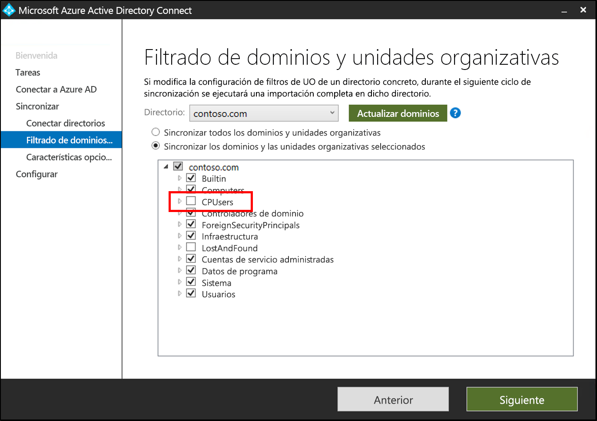 
 9. En la pantalla **Características opcionales**, haga clic en **Siguiente**.
 10. En la pantalla **Listo para configurar**, haga clic en **Configurar**.
 11. Una vez que haya finalizado, haga clic en **Salir**. 

## Pasos siguientes 

- [¿Qué es el aprovisionamiento?](what-is-provisioning.md)
- [¿Qué es el aprovisionamiento en la nube de Azure AD Connect?](what-is-cloud-provisioning.md)

