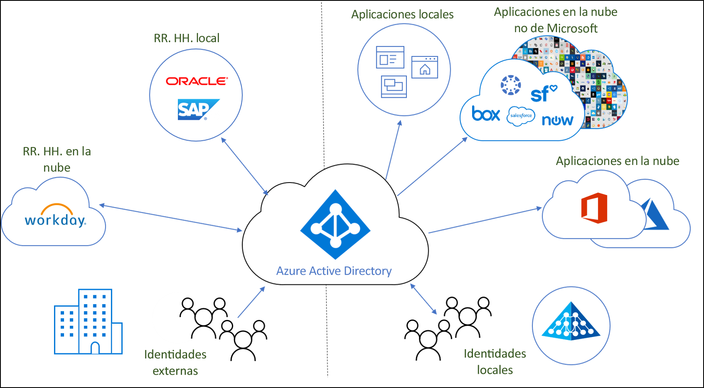
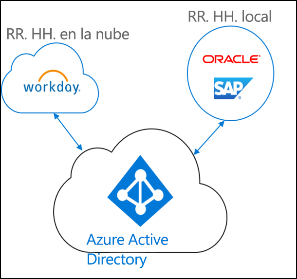
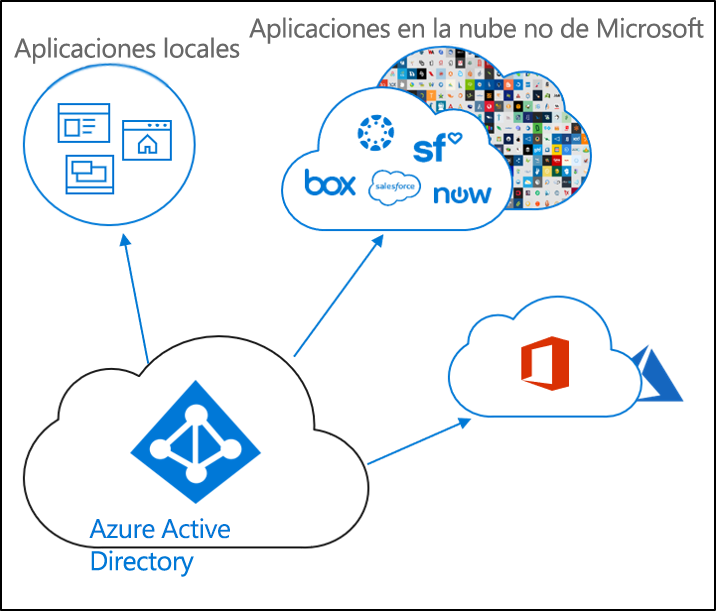
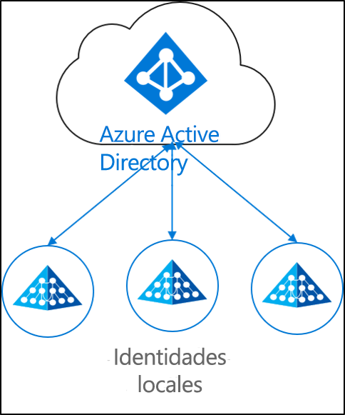

# Qué es el aprovisionamiento de identidades

En la actualidad, tanto en las empresas como en las organizaciones se puede encontrar cada vez más una combinación de aplicaciones locales y en la nube.  Los usuarios requieren acceso tanto a las aplicaciones que se encuentran en un entorno local como a las que están en la nube. Es necesario tener una única identidad para todas estas aplicaciones (las locales y las de la nube).

El aprovisionamiento es el proceso de crear un objeto en función de varias condiciones, mantener el objeto actualizado y eliminar el objeto cuando dejan de cumplirse las condiciones. Por ejemplo, cuando un nuevo usuario se une a una organización, se incorpora al sistema de RR. HH.  En ese momento, el aprovisionamiento puede crear una cuenta de usuario correspondiente en la nube, en Active Directory y en las distintas aplicaciones a las que el usuario necesita acceder.  Esto permite al usuario empezar a trabajar y tener acceso a las aplicaciones y sistemas que necesitan desde el primer día. 

Con respecto a Azure Active Directory, el aprovisionamiento se puede dividir en los siguientes escenarios clave.  

- **[Aprovisionamiento controlado por recursos humanos](#hr-driven-provisioning)**  
- **[Aprovisionamiento de aplicaciones](#app-provisioning)**  
- **[Aprovisionamiento de directorios](#directory-provisioning)** 

## Aprovisionamiento controlado por recursos humanos

El aprovisionamiento desde recursos humanos en la nube implica la creación de objetos (usuarios, roles, grupos, etc.) en función de la información que se encuentra en el sistema de recursos humanos.  

El escenario más común sería el siguiente: cuando un empleado nuevo empleado entra a formar parte de la empresa, se le incorpora al sistema de recursos humanos.  Una vez que esto ocurre, se le aprovisionan en la nube.  En este caso, Azure AD.  El aprovisionamiento desde recursos humanos puede abarcar los siguientes escenarios. 

- **Contratación de nuevos empleados**: cuando se agrega un nuevo empleado a los recursos humanos en la nube, se crea automáticamente una cuenta de usuario en Active Directory, Azure Active Directory y, opcionalmente, en Microsoft 365, así como en otras aplicaciones SaaS compatibles con Azure AD, con escritura diferida de la dirección de correo electrónico en los RR. HH. en la nube.
- **Actualizaciones de atributos y perfiles de los empleados**: si se actualiza un registro de empleado en RR. HH. en la nube (por ejemplo, el nombre, el cargo o el administrador), su cuenta de usuario se actualizará automáticamente en Active Directory, Azure Active Directory y, opcionalmente, en Microsoft 365 y en otras aplicaciones SaaS compatibles con Azure AD.
- **Despidos de empleados**: cuando se prescinde de un empleado en RR. HH. en la nube, su cuenta de usuario se deshabilita automáticamente de Active Directory, Azure Active Directory y, opcionalmente, de Office 365, así como de otras aplicaciones SaaS compatibles con Azure AD.
- **Recontrataciones de empleados**: cuando se vuelve a contratar a un empleado en RR. HH. en la nube, se puede reactivar o volver a aprovisionar automáticamente su cuenta antigua (en función de sus preferencias) en Active Directory, Azure Active Directory y, opcionalmente, en Microsoft 365 y en otras aplicaciones SaaS compatibles con Azure AD.

## Aprovisionamiento de aplicaciones

En Azure Active Directory (Azure AD), el término **[aprovisionamiento de aplicaciones](../app-provisioning/user-provisioning.md)** hace referencia a la creación automática de identidades y roles de usuario en las aplicaciones de nube a las que los usuarios necesitan acceso. Además de crear identidades de usuario, el aprovisionamiento automático incluye el mantenimiento y la eliminación de identidades de usuario a medida que el estado o los roles cambian. Algunos escenarios comunes son el aprovisionamiento de un usuario de Azure AD en aplicaciones como [Dropbox](../saas-apps/dropboxforbusiness-provisioning-tutorial.md), [Salesforce](../saas-apps/salesforce-provisioning-tutorial.md) y [ServiceNow](../saas-apps/servicenow-provisioning-tutorial.md), entre otras.

## Aprovisionamiento de directorios

El aprovisionamiento local implica el aprovisionamiento desde orígenes locales (como Active Directory) en Azure AD.  

El escenario más común sería cuando un usuario de Active Directory se aprovisiona en Azure AD.

Esto lo han logrado la sincronización de Azure AD Connect, el aprovisionamiento en la nube de Azure AD Connect y Microsoft Identity Manager. 
 
## Pasos siguientes 

- [¿Qué es el aprovisionamiento en la nube de Azure AD Connect?](what-is-cloud-provisioning.md)
- [Instalación del aprovisionamiento en la nube](how-to-install.md)