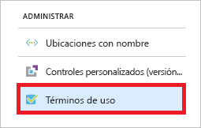
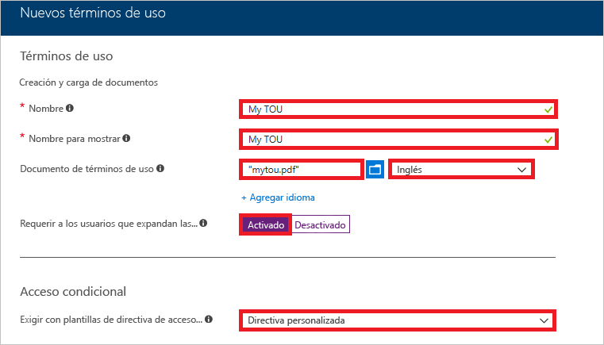
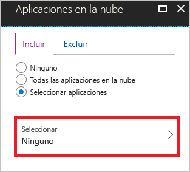

# Inicio rápido: Solicitud de la aceptación de los términos de uso antes de acceder a aplicaciones en la nube

Antes de acceder a determinadas aplicaciones en la nube de su entorno, puede obtener el consentimiento de los usuarios en forma de aceptación de las condiciones de uso (CDU). El acceso condicional de Azure Active Directory (Azure AD) proporciona:

- Un método sencillo para configurar las condiciones de uso
- La opción para solicitar la aceptación de las condiciones de uso mediante una directiva de acceso condicional  

En este inicio rápido se muestra cómo configurar una [directiva de acceso condicional de Azure AD](../active-directory-conditional-access-azure-portal.md) que exija la aceptación de unas condiciones de uso para una aplicación en la nube seleccionada de su entorno.

Si no tiene una suscripción a Azure, cree una [cuenta gratuita](https://azure.microsoft.com/free/?WT.mc_id=A261C142F) antes de empezar.

## Requisitos previos

Para completar el escenario en este inicio rápido, necesita:

- **Acceso a una edición de Azure AD Premium**: el acceso condicional de Azure AD es una funcionalidad de Azure AD Premium.
- **Una cuenta de prueba denominada Isabella Simonsen**: si no sabe cómo crear una cuenta de prueba, consulte [Agregar usuarios basados en la nube](../fundamentals/add-users-azure-active-directory.md#add-a-new-user).

## Prueba del inicio de sesión

El objetivo de este paso es obtener una impresión de la experiencia de inicio de sesión sin una directiva de acceso condicional.

**Para probar el inicio de sesión:**

1. Inicie sesión en [Azure Portal](https://portal.azure.com/) como Isabella Simonsen.
1. Cierre la sesión.

## Creación de condiciones de uso

En esta sección se explican los pasos necesarios para crear unas condiciones de uso de ejemplo. Cuando cree unas condiciones de uso, seleccione el valor de **Exigir con plantillas de directiva de acceso condicional**. Al seleccionar **Directiva personalizada** se abre el cuadro de diálogo para crear una directiva de acceso condicional en cuanto se hayan creado las condiciones de uso.

**Para crear las condiciones de uso:**

1. En Microsoft Word, cree un nuevo documento.
1. Escriba **Mis condiciones de uso**y guárdelo en el equipo como **mytou.pdf**.
1. Inicie sesión en [Azure Portal](https://portal.azure.com) como administrador global, administrador de seguridad o administrador de acceso condicional.
1. En Azure Portal, en la barra de navegación izquierda, haga clic en **Azure Active Directory**.

   

1. En la página **Azure Active Directory**, en la sección **Seguridad**, haga clic en **Acceso condicional**.

   

1. En la sección **Administrar**, haga clic en **Condiciones de uso**.

   

1. En el menú de la parte superior, haga clic en **Nuevos términos**.

   

1. En la página **Nuevos términos de uso**:

   

   1. En el cuadro de texto **Nombre**, escriba un **Mis CDU**.
   1. En el cuadro de texto **Nombre para mostrar**, escriba **Mis CDU**.
   1. Cargue el archivo PDF de las condiciones de uso.
   1. En **Idioma**, seleccione **Inglés**.
   1. En **Requerir a los usuarios que expandan las condiciones de uso**, seleccione **Activado**.
   1. En **Exigir con plantillas de directiva de acceso condicional**, seleccione **Directiva personalizada**.
   1. Haga clic en **Create**(Crear).

## Creación de la directiva de acceso condicional

En esta sección se muestra cómo crear la directiva de acceso condicional necesaria. En el escenario de esta guía de inicio rápido se usa:

- Azure Portal como marcador de posición para las aplicaciones en la nube que requieran que se acepte el CDU. 
- El usuario de ejemplo para probar la directiva de acceso condicional.  

En la directiva, establezca:

| Configuración | Valor |
| --- | --- |
| Usuarios y grupos | Isabella Simonsen |
| Aplicaciones de nube | Microsoft Azure Management (Administración de Microsoft Azure) |
| Conceder acceso | Mi CDU |

**Para configurar la directiva de acceso condicional:**

1. En la página **Nuevo**, en el cuadro de texto **Nombre**, escriba **Requerir CDU para Isabella**.

   

1. En la sección **Asignación**, haga clic en **Usuarios y grupos**.

   

1. En la página **Usuarios y grupos**:

   

   1. Haga clic en **Seleccionar usuarios y grupos** y, luego, seleccione **Usuarios y grupos**.
   1. Haga clic en **Seleccionar**.
   1. En la página **Seleccionar**, seleccione **Isabella Simonsen** y, luego, haga clic en **Seleccionar**.
   1. En la página **Usuarios y grupos**, haga clic en **Listo**.
1. Haga clic en **Aplicaciones en la nube**.

   

1. En la página **Aplicaciones en la nube**:

   

   1. Haga clic en **Seleccionar aplicaciones**.
   1. Haga clic en **Seleccionar**.
   1. En la página **Seleccionar**, seleccione **Microsoft Azure Management** (Administración de Microsoft Azure) y, luego, haga clic en **Seleccionar**.
   1. En la página **Aplicaciones en la nube**, haga clic en **Listo**.
1. En la sección **Controles de acceso**, haga clic en **Conceder**.

   

1. En la página **Conceder**:

   

   1. Seleccione **Conceder acceso**.
   1. Seleccione **Mis CDU**.
   1. Haga clic en **Seleccionar**.
1. En la sección **Habilitar directiva**, haga clic en **Activar**.

   

1. Haga clic en **Create**(Crear).

## Evaluación de un inicio de sesión simulado

Ahora que ha configurado la directiva de acceso condicional, probablemente quiera saber si funciona según lo previsto. Como primer paso, use la herramienta de directivas What If de acceso condicional para simular un inicio de sesión del usuario de prueba. La simulación calcula el impacto que este inicio de sesión tiene en las directivas y genera un informe de simulación.  

Para inicializar la herramienta de evaluación de directivas **What If**, establezca:

- **Isabella Simonsen** como usuario
- **Microsoft Azure Management** (Administración de Microsoft Azure) como aplicación en la nube

Al hacer clic en **What If**, se crea un informe de simulación que muestra:

- **Requerir CDU para Isabella** en **Directivas que se aplicarán**
- **Mi CDU** en **Conceder controles**.

**Para evaluar la directiva de acceso condicional:**

1. En la página [Acceso condicional - Directivas](https://portal.azure.com/#blade/Microsoft_AAD_IAM/ConditionalAccessBlade/Policies), en el menú de la parte superior, haga clic en **What If**.  

   

1. Haga clic en **Usuarios**, seleccione **Isabella Simonsen** y, luego, haga clic en **Seleccionar**.

   

1. Para seleccionar una aplicación en la nube:

   

   1. Haga clic en **Aplicaciones en la nube**.
   1. En la **página Aplicaciones en la nube**, haga clic en **Seleccionar aplicaciones**.
   1. Haga clic en **Seleccionar**.
   1. En la página **Seleccionar**, seleccione **Microsoft Azure Management** (Administración de Microsoft Azure) y, luego, haga clic en **Seleccionar**.
   1. En la página Aplicaciones en la nube, haga clic en **Listo**.
1. Haga clic en **What If**.

## Prueba de la directiva de acceso condicional

En la sección anterior, ha aprendido a evaluar un inicio de sesión de simulado. Además de una simulación, también debe probar la directiva de acceso condicional para asegurarse de que funciona según lo previsto.

Para probar la directiva, intente iniciar sesión en [Azure Portal](https://portal.azure.com) con su cuenta de prueba **Isabella Simonsen**. Debería ver un cuadro de diálogo que requiera que acepte las condiciones de uso.

## Limpieza de recursos

Cuando ya no sean necesarios, elimine el usuario de prueba y la directiva de acceso condicional:

- Si no sabe cómo eliminar un usuario de Azure AD, consulte [Eliminación de usuarios desde Azure AD](../fundamentals/add-users-azure-active-directory.md#delete-a-user).
- Para eliminar la directiva, selecciónela y, a continuación, haga clic en **Eliminar** en la barra de herramientas de acceso rápido.

    

- Para eliminar las condiciones de uso, selecciónelo y haga clic en **Eliminar términos** en la barra de herramientas de la parte superior.

    

## Pasos siguientes

> [!div class="nextstepaction"]
> [Requerir Multi-Factor Authentication para aplicaciones específicas](app-based-mfa.md)
> [Bloquear acceso si se detecta un riesgo para la sesión](app-sign-in-risk.md)
