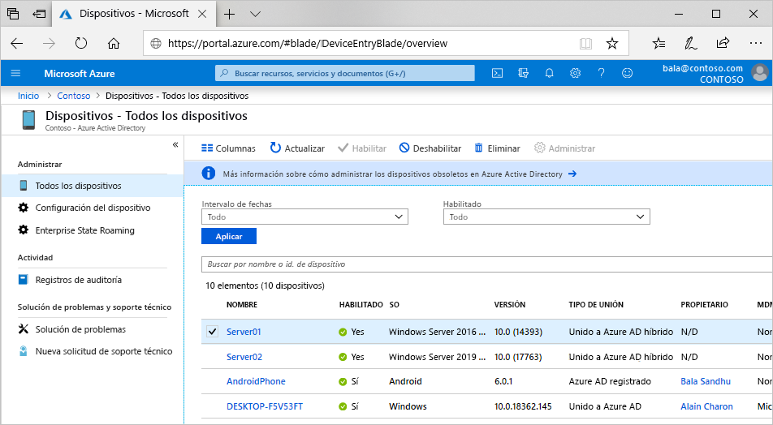

# ¿Qué es una identidad de dispositivo?

Con la proliferación de dispositivos de todas las formas y tamaños, así como las opciones que ofrece el concepto Bring Your Own Device (BYOD), los profesionales de TI se enfrentan con dos objetivos más o menos opuestos:

- Permitir que los usuarios finales sean productivos donde sea y cuando sea.
- Proteger los recursos de la organización.

Para proteger los recursos, los profesionales de IT deben primero administrar las identidades de los dispositivos. Pueden compilar la identidad del dispositivo con herramientas como Microsoft Intune para garantizar que se respetan las normas de seguridad y cumplimiento. Azure Active Directory (Azure AD) habilita el inicio de sesión único en dispositivos, aplicaciones y servicios desde cualquier ubicación mediante estos dispositivos.

- Los usuarios obtienen acceso a los recursos de la organización que necesitan. 
- Los profesionales de IT tienen el control de lo que necesitan proteger en la organización.

La administración de identidades de los dispositivos es la base del [acceso condicional basado en dispositivos](../conditional-access/require-managed-devices.md). Con las directivas de acceso condicional basado en dispositivos puede asegurarse de que el acceso a los recursos del entorno solo es posible con los dispositivos administrados.

## Introducción a los dispositivos de Azure AD

Para obtener un dispositivo en Azure AD, tiene varias opciones:

- **Azure AD registered**
   - Los dispositivos que están registrados en Azure AD normalmente son dispositivos móviles o de propiedad personal y en ellos se inicia sesión con una cuenta Microsoft personal u otra cuenta local.
      - Windows 10
      - iOS
      - Android
      - MacOS
- **Azure AD joined**
   - Los dispositivos que están unidos a Azure AD son propiedad de una organización y en ellos se inicia sesión con una cuenta de Azure AD que pertenece a la organización. Solo existen en la nube.
      - Windows 10 
- **Unido a Azure AD híbrido**
   - Los dispositivos que están unidos a Azure AD híbridos son propiedad de una organización y en ellos se inicia sesión con una cuenta de Azure AD que pertenece a la organización. Existen en la nube y en el entorno local.
      - Windows 7, 8.1 o 10
      - Windows Server 2008 o versiones posteriores

## Administración de dispositivos

Los dispositivos de Azure AD pueden administrarse mediante herramientas de administración de dispositivos móviles (MDM) como Microsoft Intune, System Center Configuration Manager, Directiva de grupo (Unido a Azure AD híbrido), herramientas de administración de aplicaciones móviles (MAM) u otras herramientas de terceros.

## Acceso a los recursos

El registro y la unión ofrecen a los usuarios Inicio de sesión único de conexión directa (SSO) a los recursos en la nube y a los administradores la capacidad de aplicar directivas de acceso condicional a esos recursos. 

Los dispositivos que están unidos a Azure AD o híbridos unidos a Azure AD se benefician del Inicio de sesión único de conexión directa para los recursos locales de la organización, al igual que para los recursos en la nube. Para más información, consulte [How SSO to on-premises resources works on Azure AD joined devices](azuread-join-sso.md) (Funcionamiento del inicio de sesión único en los recursos locales en dispositivos unidos a Azure AD).

## Seguridad de los dispositivos

- Los **dispositivos registrados en Azure AD** utilizan una cuenta administrada por el usuario final; esta es una cuenta Microsoft o protegida localmente mediante la administración de credenciales, con uno o más de los siguientes elementos.
   - Contraseña
   - N.º de pin
   - Patrón
   - Windows Hello
- Los **dispositivos unidos a Azure AD o híbridos unidos a Azure AD** utilizan una cuenta de organización en Azure AD protegida por uno o más de los siguientes elementos.
   - Contraseña
   - Windows Hello para empresas

## Aprovisionamiento

A Azure AD se pueden agregar dispositivos como autoservicio o mediante un proceso de aprovisionamiento controlado por parte de los administradores.

## Resumen

Con la administración de identidades de dispositivos en Azure AD, puede:

- Simplificar el proceso de llevar los dispositivos a Azure AD y administrarlos ahí
- Facilitar a los usuarios el acceso a los recursos de la organización basados en la nube

## Requisitos de licencia

[!INCLUDE [Active Directory P1 license](../../../includes/active-directory-p1-license.md)]

## Pasos siguientes

- Obtenga más información sobre los [dispositivos registrados en Azure AD](concept-azure-ad-register.md).
- Obtenga más información sobre los [dispositivos unidos a Azure AD](concept-azure-ad-join.md).
- Más información sobre los [dispositivos híbridos unidos a Azure AD](concept-azure-ad-join-hybrid.md).
- Para obtener información general sobre cómo administrar identidades de dispositivos en Azure Portal, consulte [Administración de identidades de dispositivos mediante Azure Portal](device-management-azure-portal.md).
- Para obtener más información sobre el acceso condicional basado en dispositivo, consulte [Configuración de directivas de acceso condicional basadas en dispositivo de Azure Active Directory](../conditional-access/require-managed-devices.md).
