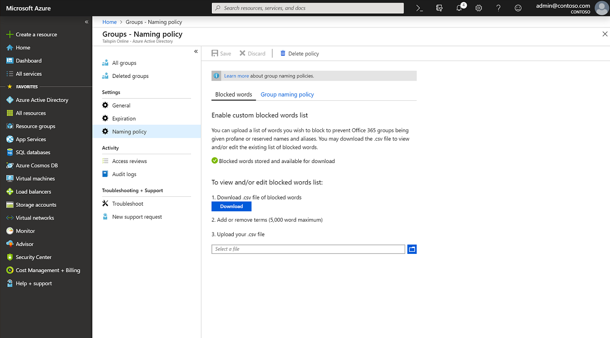

# Guía de inicio rápido: Directiva de nomenclatura para grupos de Azure Active Directory

En este inicio rápido, configurará una directiva de nomenclatura en la organización de Azure Active Directory (Azure AD) para los grupos de Microsoft 365 creados por el usuario, a fin de ayudarle a ordenar y buscar los grupos de la organización. Por ejemplo, podría usar la directiva de nomenclatura para:

* Comunicar la función de un grupo, la pertenencia, la región geográfica o quién creó el grupo.
* Ayudar a clasificar los grupos en la libreta de direcciones.
* Impedir que determinadas palabras se usen en los nombres y alias de grupo.

si no tiene una suscripción a Azure, cree una [cuenta gratuita](https://azure.microsoft.com/free/) antes de empezar.

## Configuración de la directiva de nomenclatura de grupos en Azure Portal

1. Inicie sesión en el [Centro de administración de Azure AD](https://aad.portal.azure.com) con una cuenta de administrador de usuarios.
1. Seleccione **Grupos**, a continuación, seleccione **Directiva de nomenclatura** para abrir la página de la directiva de nomenclatura.

    

### Visualización o edición de la directiva de nomenclatura de prefijo-sufijo

1. En la página **Directiva de nomenclatura**, seleccione **Directiva de nomenclatura de grupos**.
1. Puede ver o editar las directivas de nomenclatura de prefijo o sufijo actuales individualmente seleccionando los atributos o cadenas que desea aplicar como parte de la directiva de nomenclatura.
1. Para quitar un prefijo o sufijo de la lista, seleccione el prefijo o sufijo y luego seleccione **Eliminar**. Se pueden eliminar varios elementos al mismo tiempo.
1. Seleccione **Guardar** para que los cambios en la directiva entren en vigor.

### Visualización o edición de las palabras bloqueadas personalizadas

1. En la página **Directiva de nomenclatura**, seleccione **Palabras bloqueadas**.

    

1. Vea o edite la lista actual de palabras bloqueadas personalizadas seleccionando **Descargar**.
1. Cargue la nueva lista de palabras bloqueadas personalizadas seleccionando el icono del archivo.
1. Seleccione **Guardar** para que los cambios en la directiva entren en vigor.

Eso es todo. Ha establecido la directiva de nomenclatura y ha agregado las palabras bloqueadas personalizadas.

## Limpieza de recursos

### Eliminación de la directiva de nomenclatura mediante Azure Portal

1. En la página **Directiva de nomenclatura**, seleccione **Eliminar directiva**.
1. Después de confirmar la eliminación, se quita la directiva de nomenclatura, incluida toda la directiva de nomenclatura de prefijos y sufijos y cualquier palabra bloqueada personalizada.

## Pasos siguientes

En este inicio rápido, ha aprendido a establecer la directiva de nomenclatura para la organización de Azure AD mediante Azure Portal.

Avance al artículo siguiente para obtener más información acerca de los cmdlets de PowerShell para la directiva de nomenclatura, las limitaciones técnicas, la adición de una lista de palabras bloqueadas personalizadas y las experiencias de usuario final en las aplicaciones de Microsoft 365.
> [!div class="nextstepaction"]
> [Naming policy PowerShell](groups-naming-policy.md) (Directiva de nomenclatura de PowerShell)