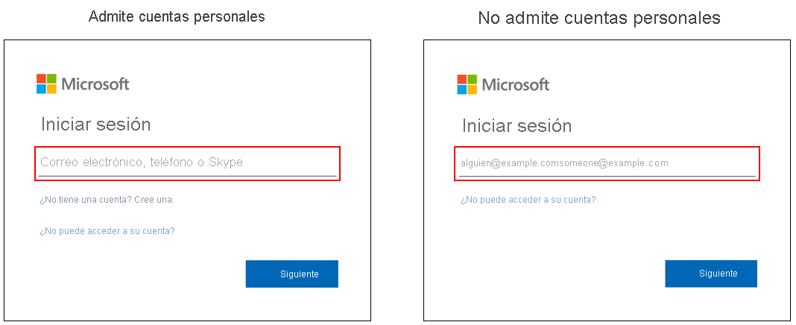

# Opciones de inicio de sesión para cuentas Microsoft en Azure Active Directory

La página de inicio de sesión de Microsoft 365 para Azure Active Directory (Azure AD) admite cuentas educativas o profesionales y cuentas Microsoft, pero según la situación del usuario, podría ser una, la otra o ambas. Por ejemplo, la página de inicio de sesión de Azure AD admite:

* Aplicaciones que aceptan inicios de sesión con ambos tipos de cuenta
* Organizaciones que aceptan invitados

## Identificación
Para saber si la página de inicio de sesión que usa su organización admite cuentas Microsoft, examine el texto de sugerencia en el campo de nombre de usuario. Si en el texto de sugerencia pone "Correo electrónico, teléfono o Skype", la página de inicio de sesión admite cuentas Microsoft.

Las [opciones de inicio de sesión adicionales solo funcionan con cuentas Microsoft personales](https://azure.microsoft.com/updates/microsoft-account-signin-options/ ), no se pueden usar para iniciar sesión en recursos de cuentas profesionales o educativas.

## Pasos siguientes

[Personalización de marca del inicio de sesión](../fundamentals/add-custom-domain.md)