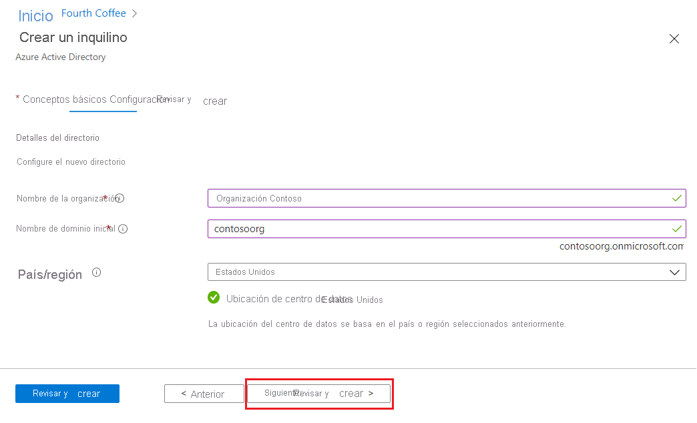

# Inicio rápido: Creación de un inquilino en Azure Active Directory
Puede hacer todas las tareas administrativas mediante el portal de Azure Active Directory (Azure AD), incluida la creación de un inquilino para su organización. 

En este tutorial, obtendrá información sobre cómo acceder a Azure Portal y a Azure Active Directory y sobre cómo crear un inquilino básico para su organización.

Si no tiene una suscripción a Azure, cree una [cuenta gratuita](https://azure.microsoft.com/free/) antes de empezar.

## Inicio de sesión en Azure Portal
Inicie sesión en [Azure Portal](https://portal.azure.com/) en su organización con una cuenta de administrador global.

## Creación de un inquilino para la organización
Después de iniciar sesión en Azure Portal, puede crear un inquilino para su organización. El nuevo inquilino representa a su organización y le ayuda a administrar una instancia específica de Servicios en la nube de Microsoft para los usuarios internos y externos.

### Para crear un inquilino
1. Seleccione **Crear un recurso**, **Identidad** y **Azure Active Directory**.

    Aparece la página **Crear directorio**.

    

2.  En la página **Crear directorio**, escriba la información siguiente:
    
    - Escriba _Contoso_ en el cuadro **Nombre de la organización**.

    - Escriba _Contoso_ en el cuadro **Nombre de dominio inicial**.

    - Deje la opción _Estados Unidos_ en el cuadro **País o región**.

3. Seleccione **Crear**.

El nuevo inquilino se crea con el dominio contoso.onmicrosoft.com.

## Limpieza de recursos
Si no va a seguir usando esta aplicación, puede eliminar el inquilino mediante los siguientes pasos:

- Seleccione **Azure Active Directory** y, después, en la página **Contoso - Información general**, seleccione **Eliminar directorio**.

    El inquilino y su información asociada se eliminarán.

    

## Pasos siguientes
- Para cambiar o agregar nombres de dominio adicionales, vea [Incorporación de su nombre de dominio personalizado a Azure Active Directory](add-custom-domain.md).

- Para agregar usuarios, vea [Incorporación o eliminación de un nuevo usuario](add-users-azure-active-directory.md).

- Para agrear grupos y miembros, vea [Creación de un grupo básico y adición de miembros](active-directory-groups-create-azure-portal.md).

- Obtenga información sobre el [acceso basado en rol mediante Privileged Identity Management](../../role-based-access-control/pim-azure-resource.md) y el [acceso condicional](../../role-based-access-control/conditional-access-azure-management.md) para ayudar a administrar el acceso a aplicaciones y recursos de su organización.

- Obtenga información sobre Azure AD, incluida la [información de licencia básica, terminología y características asociadas](active-directory-whatis.md).
