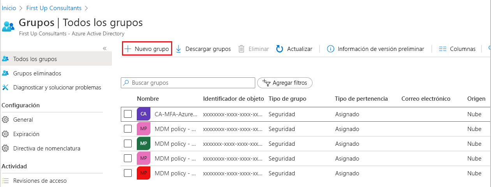
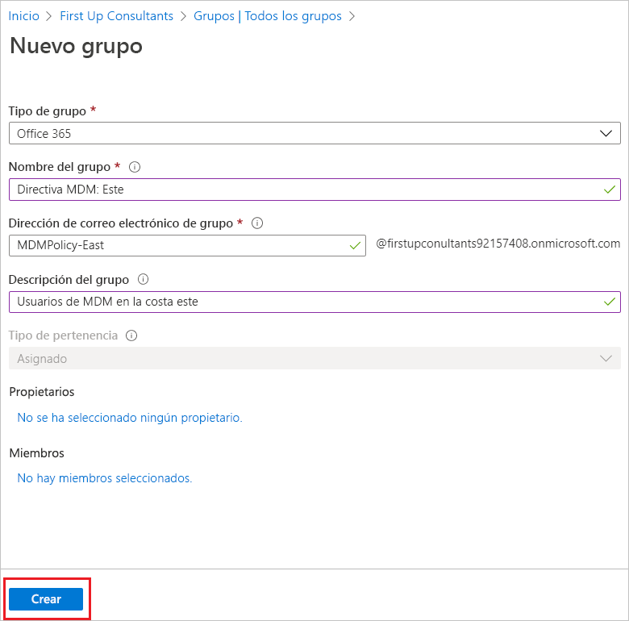
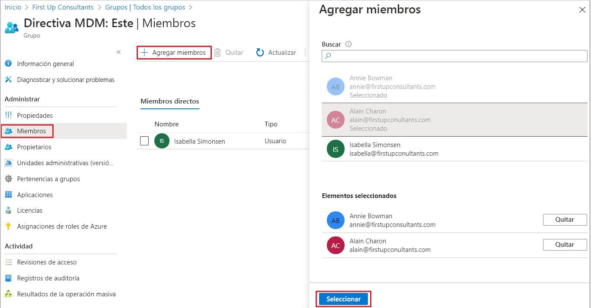
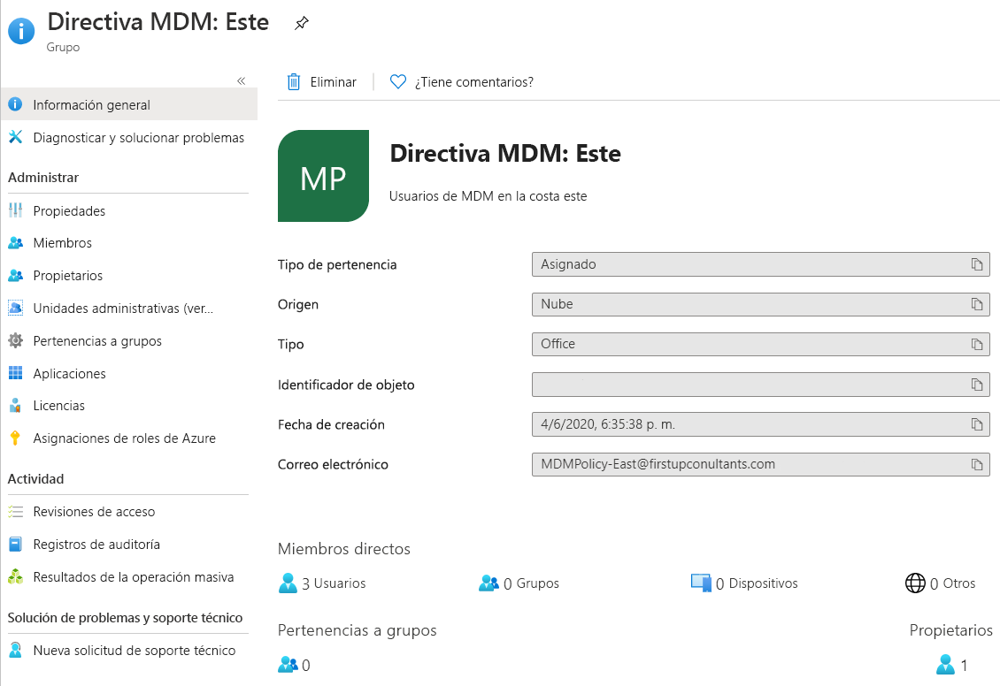

# Creación de un grupo básico e incorporación de miembros con Azure Active Directory
Puede crear un grupo básico con el portal de Azure Active Directory (Azure AD). Para los fines de este artículo, el propietario del recurso (administrador) agrega un grupo básico a un único recurso e incluye miembros específicos (empleados) que necesitan acceder a dicho recurso. Para escenarios más complejos, incluida la creación de reglas y las pertenencias dinámicas, vea la [documentación de administración de usuarios de Azure Active Directory](../enterprise-users/index.yml).

## Tipos de grupo y pertenencia
Hay varios tipos de grupo y de pertenencia. La siguiente información explica cada tipo de grupo y pertenencia, así como el motivo por el que se usan, para ayudarle a decidir las opciones que usará al crear un grupo.

### Tipos de grupo:
- **Seguridad** . Se usa para administrar el acceso de miembros y del equipo a los recursos compartidos de un grupo de usuarios. Por ejemplo, puede crear un grupo de seguridad para una directiva de seguridad específica. De esta forma, puede conceder una serie de permisos a todos los miembros a la vez, en lugar de tener que agregar permisos a cada miembro individualmente. Un grupo de seguridad puede tener usuarios, dispositivos, grupos y entidades de servicio como miembros y usuarios y entidades de servicio como propietarios. Para más información sobre la administración de acceso a los recursos, vea [Administración de acceso a los recursos con grupos de Azure Active Directory](active-directory-manage-groups.md).
- **Microsoft 365** . Ofrece oportunidades de colaboración al conceder acceso a los miembros a un correo compartido, calendarios, archivos, el sitio de SharePoint y mucho más. Esta opción también permite ofrecer a personas de fuera de su organización acceso al grupo. Un grupo de Microsoft 365 solo puede tener usuarios como miembros. Tanto los usuarios como las entidades de servicio pueden ser propietarios de registros de Microsoft 365. Para obtener más información sobre los Grupos de Microsoft 365, vea [Más información sobre los grupos de Microsoft 365](https://support.office.com/article/learn-about-office-365-groups-b565caa1-5c40-40ef-9915-60fdb2d97fa2).

### Tipos de pertenencia:
- **Asignado.** Le permite agregar usuarios específicos para que sean miembros de este grupo y para que tengan permisos exclusivos. Para los fines de este artículo, vamos a usar esta opción.
- **Usuario dinámico.** Permite usar reglas de pertenencia dinámicas para agregar y quitar miembros automáticamente. Si los atributos de un miembro cambian, el sistema examina las reglas del grupo dinámico del directorio para ver si el miembro cumple los requisitos de la regla (se agrega) o ya no cumple los requisitos de las reglas (se elimina).
- **Dispositivo dinámico.** Le permite usar reglas de grupo dinámico para agregar y quitar dispositivos automáticamente. Si los atributos de un dispositivo cambian, el sistema examina las reglas del grupo dinámico del directorio para ver si el dispositivo cumple los requisitos de la regla (se agrega) o ya no cumple los requisitos de las reglas (se elimina).

    > [!IMPORTANT]
    > Puede crear un grupo dinámico para dispositivos o usuarios, pero no para ambos. Tampoco se puede crear un grupo de dispositivos basado en los atributos de los propietarios de los dispositivos. Las reglas de pertenencia de dispositivo solo pueden hacer referencia a atribuciones de dispositivos. Para más información sobre cómo crear un grupo dinámico para usuarios y dispositivos, consulte [Creación de un grupo dinámico y comprobación de su estado](../enterprise-users/groups-create-rule.md).

## Creación de un grupo básico y adición de miembros
Puede crear un grupo básico y agregar los miembros al mismo tiempo. Para crear un grupo básico y agregar miembros, use el procedimiento siguiente:

1. Inicie sesión en [Azure Portal](https://portal.azure.com) con una cuenta de administrador global para el directorio.

1. Busque y seleccione **Azure Active Directory** .

1. En la página **Active Directory** , seleccione **Grupos** y, a continuación, seleccione **Nuevo grupo** .

    

1. Aparecerá el panel **Nuevo grupo** y deberá rellenar la información necesaria.

    

1. Seleccione un valor de **Tipo de grupo** predefinido. Para obtener más información sobre los tipos de grupo, consulte [Tipos de grupo y pertenencia](#group-types).

1. Cree y agregue un **nombre de grupo.** Agregue un nombre que sea fácil de recordar y que tenga sentido para el grupo. Se realizará una comprobación para determinar si el nombre ya se utiliza para otro grupo. Si el nombre ya está en uso, para evitar duplicarlo, se le pedirá que modifique el nombre del grupo.

1. Agregue una **Dirección de correo electrónico de grupo** o deje la dirección de correo electrónico que se rellena automáticamente.

1. **Descripción del grupo.** Agregue una descripción opcional al grupo.

1. Seleccione un **Tipo de pertenencia** (obligatorio) predefinido. Para obtener más información sobre los tipos de pertenencia, consulte [Tipos de grupo y pertenencia](#membership-types).

1. Seleccione **Crear** . El grupo se crea y está listo para que agregue miembros.

1. Seleccione el área **Miembros** de la página **Grupo** y después empiece a buscar los miembros para agregarlos al grupo en la página **Seleccionar miembros** .

    

1. Cuando haya terminado de agregar miembros, elija **Seleccionar** .

    La página **Información general del grupo** se actualiza para mostrar el número de miembros que ahora se agregan al grupo.

    

## Activación o desactivación del correo electrónico de bienvenida al grupo

Siempre que se crea un grupo de Microsoft 365, independientemente de que la pertenencia sea estática o dinámica, se envía una notificación de bienvenida a todos los usuarios que se agregan al grupo. Cuando cambian los atributos de un usuario o dispositivo, se procesan todas las reglas de grupo dinámico de la organización para comprobar si hay posibles cambios de pertenencia. Los usuarios que se agregan también reciben la notificación de bienvenida. Este comportamiento se puede desactivar en [Exchange PowerShell](/powershell/module/exchange/users-and-groups/Set-UnifiedGroup?view=exchange-ps). 

## Pasos siguientes

- [Administrar el acceso a las aplicaciones SaaS mediante grupos](../enterprise-users/groups-saasapps.md)
- [Administrar grupos mediante los comandos de PowerShell](../enterprise-users/groups-settings-v2-cmdlets.md)