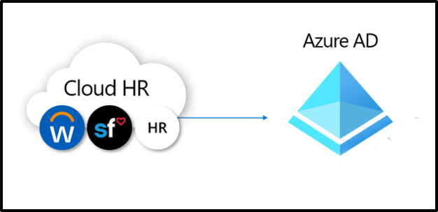

# ¿Qué es el aprovisionamiento controlado por RR. HH.?

El aprovisionamiento controlado por recursos humanos es el proceso de creación de identidades digitales basadas en un sistema de recursos humanos.  Los sistemas de recursos humanos se convierten en el inicio de autoridad de estas identidades digitales recién creadas y, a menudo, son el punto de partida para numerosos procesos de aprovisionamiento.  Por ejemplo, si un nuevo empleado se incorpora a su empresa, este se crea en el sistema de recursos humanos.  La creación, desencadena el aprovisionamiento de una cuenta de usuario en Active Directory y, a continuación, Azure AD Connect aprovisiona esta cuenta en Azure AD, etc.

El aprovisionamiento controlado por recursos humanos puede estar en el entorno local o en la nube.

## Aprovisionamiento de recursos humanos basado en el entorno local
El aprovisionamiento de recursos humanos basado en el entorno local se logra mediante el uso de un sistema local de recursos humanos y un medio para aprovisionar las nuevas identidades digitales.

Los sistemas de recursos humanos vienen en diversos paquetes de software y pueden usar servidores SQL Server, directorios LDAP, etc.

Actualmente, las soluciones locales de aprovisionamiento de recursos humanos de Microsoft usan Microsoft Identity Manager para desencadenar el aprovisionamiento cuando se crea una nueva identidad en estos sistemas de recursos humanos.

Mediante Microsoft Identity Manager, puede aprovisionar usuarios desde los sistemas de recursos humanos locales en Active Directory o Azure AD.

Para más información sobre Microsoft Identity Manager y los sistemas que admite, consulte la documentación sobre [Microsoft Identity Manager](https://docs.microsoft.com/microsoft-identity-manager/microsoft-identity-manager-2016).

[!INCLUDE [active-directory-hr-provisioning.md](../../../includes/active-directory-hr-provisioning.md)]

## Pasos siguientes 
- [¿Qué es la administración del ciclo de vida de la identidad?](what-is-identity-lifecycle-management.md)
- [¿Qué es el aprovisionamiento?](what-is-provisioning.md)
- [¿Qué es el aprovisionamiento de aplicaciones?](what-is-app-provisioning.md)
- [¿Qué es el aprovisionamiento entre directorios?](what-is-inter-directory-provisioning.md)
- [¿Qué es el aprovisionamiento de directorios?](what-is-inter-directory-provisioning.md)