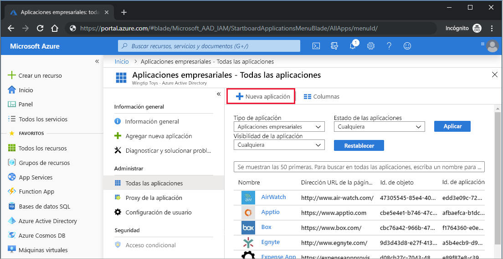

# Inicio rápido: Incorporación de una aplicación al inquilino de Azure Active Directory (Azure AD)

Azure Active Directory (Azure AD) incluye una galería que contiene miles de aplicaciones previamente integradas. Muchas de las aplicaciones que su organización usa probablemente estén ya en la galería. Este inicio rápido usa Azure Portal para agregar una aplicación de la galería a su inquilino de Azure Active Directory (Azure AD). Este inicio rápido se centra en agregar una aplicación que ya forme parte de la galería. Las aplicaciones que no están incluidas en la galería también se pueden integrar con Azure AD pero eso no se trata en este inicio rápido. 

Después de agregar una aplicación a su inquilino de Azure AD, puede:

- Configurar las propiedades de la aplicación.
- Administrar el acceso de usuario a la aplicación con una directiva de acceso condicional.
- Configurar el inicio de sesión único para que los usuarios puedan iniciar sesión en la aplicación con sus credenciales de Azure AD.

## Requisitos previos

Para agregar una aplicación al inquilino de Azure AD, necesita:

- Una cuenta de Azure con una suscripción activa. [Cree una cuenta gratuita](https://azure.microsoft.com/free/?WT.mc_id=A261C142F).
- Uno de los siguientes roles: Administrador global, Administrador de aplicaciones en la nube, Administrador de aplicaciones o Propietario de la entidad de servicio.
- (Opcional: finalización de [Visualización de sus aplicaciones](view-applications-portal.md)).

>[!IMPORTANT]
>Para probar los pasos de este inicio rápido, se recomienda usar un entorno que no sea de producción.

## Incorporación de una aplicación al inquilino de Azure AD

Para agregar una aplicación de la galería a su inquilino de Azure AD:

1. En [Azure Portal](https://portal.azure.com), en el panel de navegación izquierdo, seleccione **Azure Active Directory**.
2. En el panel **Azure Active Directory**, seleccione **Aplicaciones empresariales**. Se abre el panel **Todas las aplicaciones**, en el que se ve una muestra aleatoria de las aplicaciones que hay en su inquilino de Azure AD.
3. En el panel **Aplicaciones empresariales**, seleccione **Nueva aplicación**. 
    
4. Cambie a la nueva experiencia de versión preliminar de la galería: En el banner situado en la parte superior de la **página para agregar una aplicación**, seleccione el vínculo que indica **Haga clic aquí para probar la nueva y mejorada experiencia de la galería de aplicaciones.** .
5. Se abre el panel **Examinar la Galería de Azure AD (versión preliminar)** , que muestra iconos para plataformas en la nube, aplicaciones locales y aplicaciones destacadas. Las aplicaciones que aparecen en la sección **Aplicaciones destacadas** incluyen iconos que indican si admiten el inicio de sesión único federado (SSO) y el aprovisionamiento.
    
6. Puede buscar en la galería la aplicación que quiere agregar o escribir su nombre en el cuadro de búsqueda para localizarla. Después, seleccione la aplicación en los resultados. En el formulario, puede editar el nombre de la aplicación para que se ajuste a las necesidades de su organización. En este ejemplo, hemos cambiado el nombre por **GitHub-test**.
    .
7. Seleccione **Crear**. Aparece una página de introducción con las opciones para configurar la aplicación para su organización.

Ha terminado de agregar una aplicación. El siguiente inicio rápido muestra cómo cambiar el logotipo y modificar otras propiedades de la aplicación.

## Pasos siguientes

- [Configuración de una aplicación](add-application-portal-configure.md)
- [Configuración del inicio de sesión único](add-application-portal-setup-sso.md)
- [Eliminación de una aplicación](delete-application-portal.md)