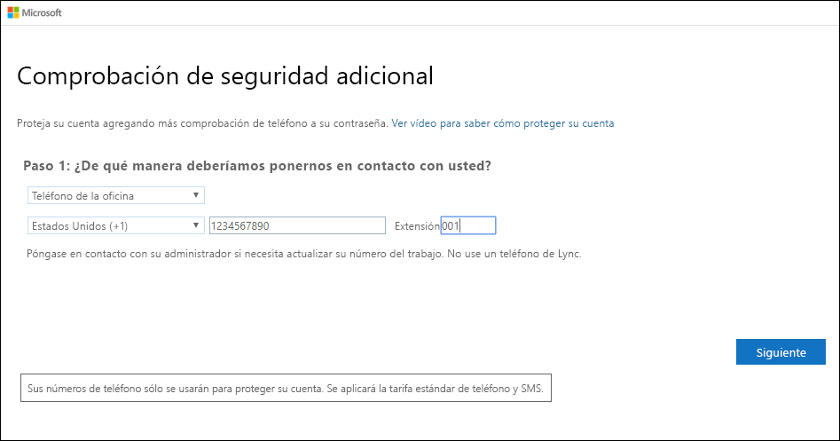
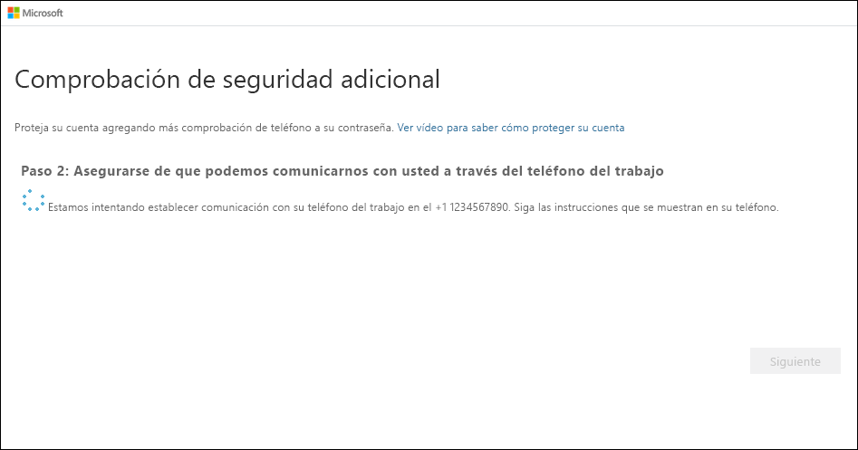

# Configuración del teléfono de la oficina como método de verificación en dos fases

Es posible configurar el teléfono de la oficina para que actúe como método de verificación en dos fases.

>[!Note]
> Si la opción de teléfono de la oficina está atenuada, es posible que su organización no le permita usar un número de teléfono de la oficina para la verificación. En este caso, tendrá que seleccionar otro método o ponerse en contacto con su administrador para obtener más ayuda.

## Configuración del número de teléfono de la oficina como método de verificación

1. En la página **Comprobación de seguridad adicional**, seleccione **Teléfono de la oficina** en el área **Paso 1: ¿De qué manera deberíamos ponernos en contacto con usted?** , seleccione su país o región en la lista desplegable, escriba el número de teléfono de la oficina y, después, escriba la extensión, si procede.

    

2. Recibirá una llamada de teléfono de Microsoft en la que se le pedirá que presione el signo de almohadilla (#) en el teléfono de la oficina para verificar su identidad.

    

3. En el área **Paso 3: Siga usando sus aplicaciones existentes** se indicará una contraseña de aplicación; cópiela y péguela en un lugar seguro.

    

    >[!Note]
    >Para obtener información sobre el uso de la contraseña de aplicación con las aplicaciones antiguas, consulte [Administración de las contraseñas de aplicaciones](multi-factor-authentication-end-user-app-passwords.md). Solo tiene que usar contraseñas de aplicación si va a seguir usando aplicaciones antiguas que no admiten la verificación en dos fases.

4. Seleccione **Listo**.

## Pasos siguientes

Después de configurar el método de verificación en dos fases, puede agregar otros métodos, administrar la configuración y las contraseñas de aplicación, iniciar sesión u obtener ayuda con algunos problemas comunes relacionados con la verificación en dos fases.

- [Administración de la configuración del método de verificación en dos fases](multi-factor-authentication-end-user-manage-settings.md)

- [Administración de las contraseñas de aplicación](multi-factor-authentication-end-user-app-passwords.md)

- [Inicio de sesión con la verificación en dos fases](multi-factor-authentication-end-user-signin.md)

- [Obtención de ayuda con la verificación en dos fases](multi-factor-authentication-end-user-troubleshoot.md)
