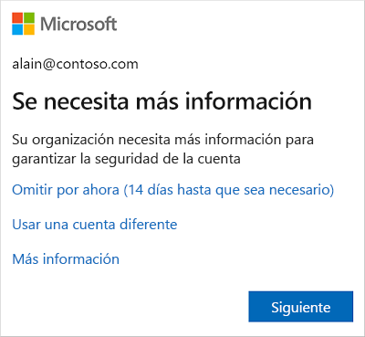
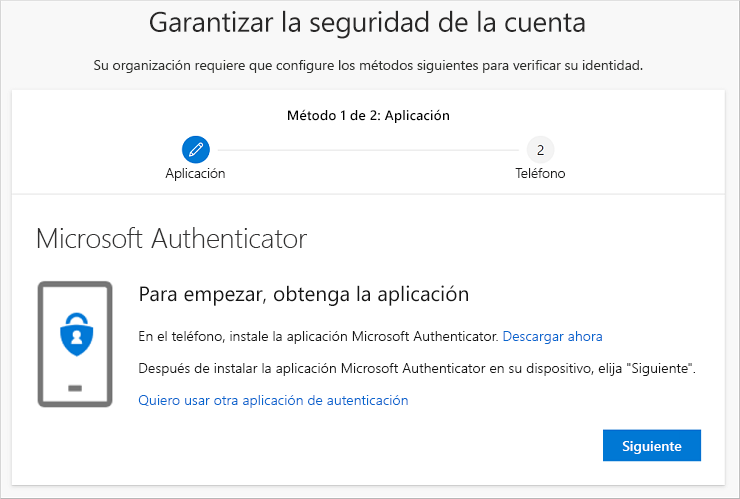
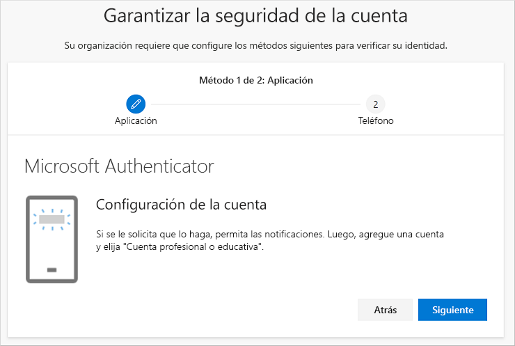
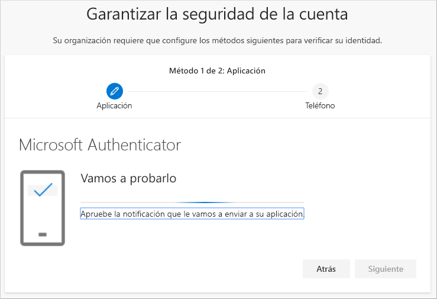
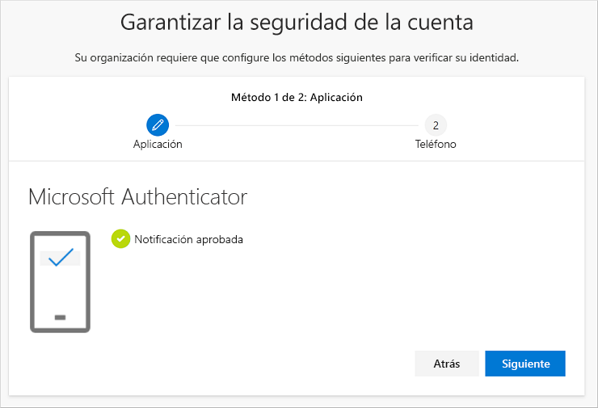
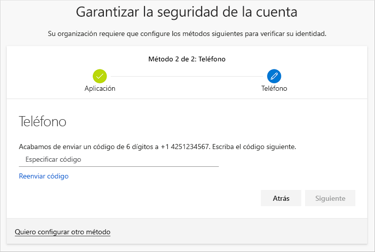
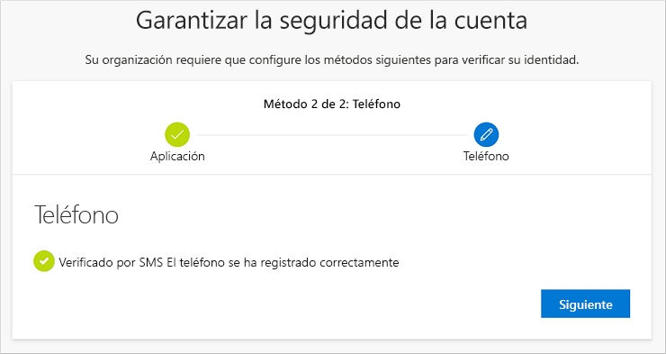
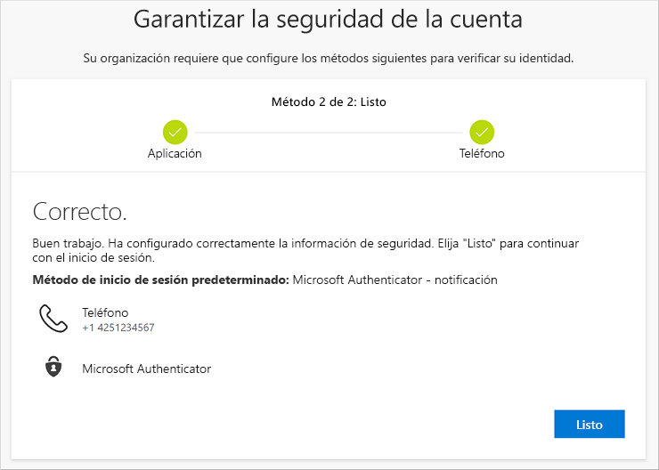
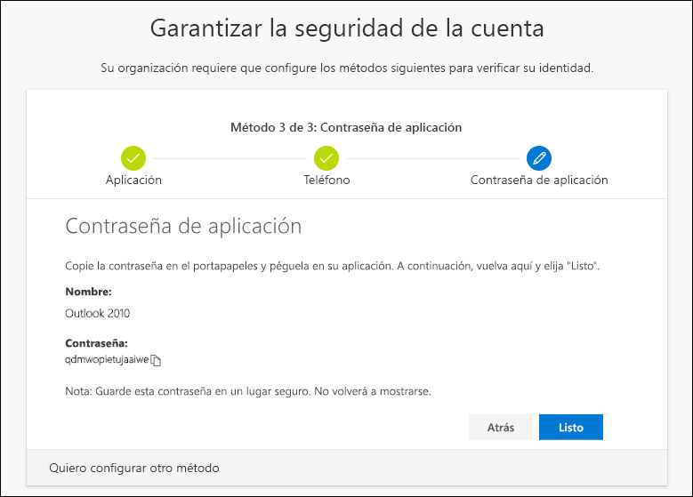
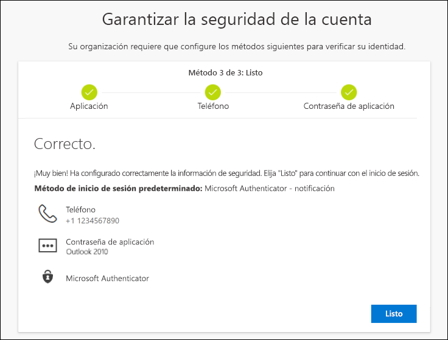

# Configuración de la información de seguridad desde un mensaje de inicio de sesión

Puede seguir estos pasos si se le pide que configure la información de seguridad inmediatamente después de que iniciar sesión con su cuenta profesional o educativa.

Solo verá este mensaje si no ha configurado la información de seguridad que requiere su organización. Si ya ha configurado la información de seguridad, pero desea realizar cualquier cambio, puede seguir los pasos descritos en los distintos artículos de procedimientos basados en métodos. Para más información, consulte [Add or update your security info overview](security-info-add-update-methods-overview.md) (Introducción a la adición o actualización de la información de seguridad).

[!INCLUDE [preview-notice](../../../includes/active-directory-end-user-preview-notice-security-info.md)]

## Autenticación mediante la comprobación de seguridad frente al restablecimiento de la contraseña

Los métodos de la información de seguridad se usan tanto para la comprobación de seguridad de dos factores como para al restablecimiento de la contraseña. Sin embargo, no todos los métodos pueden usarse para ambos.

| Método | Se usa para |
| ------ | -------- |
| Aplicación de autenticación | Autenticación mediante la comprobación de dos factores y restablecimiento de la contraseña. |
| Mensajes de texto | Autenticación mediante la comprobación de dos factores y restablecimiento de la contraseña. |
| Llamadas de teléfono | Autenticación mediante la comprobación de dos factores y restablecimiento de la contraseña. |
| Clave de seguridad | Autenticación mediante la comprobación de dos factores y restablecimiento de la contraseña. |
| Cuenta de correo electrónico | Solo autenticación mediante restablecimiento de contraseña. Deberá elegir otro método para la comprobación mediante dos factores. |
| Preguntas de seguridad | Solo autenticación mediante restablecimiento de contraseña. Deberá elegir otro método para la comprobación mediante dos factores. |

## Inicio de sesión con una cuenta profesional o educativa

Después de iniciar sesión con su cuenta profesional o educativa, verá un mensaje en el que se le pide que proporcione más información para que se le permita acceder a su cuenta.

## Configuración de la información de seguridad mediante el asistente

Siga estos pasos para configurar la información de seguridad de su cuenta profesional o educativa desde el mensaje.

>[!Important]
>Esto es solo un ejemplo del proceso. En función de los requisitos de la organización, el administrador puede haber instalado distintos métodos de comprobación que necesitará configurar durante este proceso. Para este ejemplo, se requieren dos métodos, la aplicación Microsoft Authenticator y un número de teléfono móvil para realizar una llamada o enviar un mensaje de texto de comprobación.

1. Después de seleccionar **Siguiente** en el mensaje, aparece el **Asistente para mantener la cuenta segura**, en el que se muestra el primer método que tanto el administrador como la organización requieren que configure. En este ejemplo, es la aplicación Microsoft Authenticator.

   > [!Note]
   > Si desea usar una aplicación de autenticación que no sea Microsoft Authenticator, seleccione el vínculo **Quiero usar otra aplicación de autenticación**.
   >
   > Si su organización le permite elegir un método que no sea la aplicación de autenticación, puede seleccionar el vínculo **I want to set up a different method** (Quiero configurar otro método).

    

2. Seleccione **Descargar ahora** para descargar e instalar la aplicación Microsoft Authenticator en un dispositivo móvil y, después, seleccione **Siguiente**. Para obtener más información sobre cómo descargar e instalar la aplicación, consulte [Download and install the Microsoft Authenticator app](user-help-auth-app-download-install.md) (Descargar e instalar la aplicación Microsoft Authenticator).

    

3. Permanezca en la página **Configuración de la cuenta** mientras configura la aplicación Microsoft Authenticator en el dispositivo móvil.

4. Abra la aplicación Microsoft Authenticator, seleccione que permita las notificaciones (si se le solicita), **Agregar cuenta** en el icono **Customize and control** (Personalizar y controlar) de la esquina superior derecha y, después, seleccione **Cuenta profesional o educativa**.

    >[!Note]
    >Si es la primera vez que configura la aplicación Microsoft Authenticator, es posible que reciba un mensaje en el que se le pregunta si quiere permitir que la aplicación acceda a la cámara (iOS) o permitir que la aplicación tome fotografías y grabe vídeo (Android). Debe seleccionar **Permitir** para que la aplicación de autenticación pueda acceder a la cámara y tomar una fotografía del código QR en el paso siguiente. Aunque no otorgue permiso a la cámara, podrá configurar la aplicación de autenticación, pero tendrá que agregar la información de código manualmente. Para más información sobre cómo agregar manualmente código, consulte [Agregar manualmente una cuenta a la aplicación](user-help-auth-app-add-account-manual.md).

5. Vuelva a la página **Configuración de la cuenta** en el equipo y seleccione **Siguiente**.

    Aparece la página **Digitalización del código QR** .

    

6. Lea el código que se proporciona, para lo que debe usar el lector de códigos QR de la aplicación Microsoft Authenticator, que apareció en el dispositivo móvil tras crear la cuenta profesional o educativa en el paso 5.

    La aplicación de autenticación debería agregar correctamente la cuenta profesional o educativa sin solicitarle más información. No obstante, si el lector de códigos QR no lee este, puede seleccionar **Can't scan the QR code** (No se puede leer el código QR) y especificar manualmente la dirección URL y el código en la aplicación Microsoft Authenticator. Para obtener más información sobre cómo agregar manualmente un código, consulte [Agregar manualmente una cuenta a la aplicación](user-help-auth-app-add-account-manual.md).

7. Seleccione **Siguiente** en la página **Digitalización del código QR** del equipo.

    Se envía una notificación a la aplicación Microsoft Authenticator del dispositivo móvil para que pruebe la cuenta.

    

8. Apruebe la notificación en la aplicación Microsoft Authenticator y seleccione **Siguiente**.

    

    La información de seguridad se actualiza para usar la aplicación Microsoft Authenticator de forma predeterminada para verificar su identidad cuando se usan la verificación en dos pasos o el restablecimiento de contraseña.

9. En la página de configuración del **teléfono**, elija si desea recibir un mensaje de texto o una llamada de teléfono y seleccione **Siguiente**. En este ejemplo vamos a usar mensajes de texto, por lo que debe usar el número de teléfono de un dispositivo que pueda aceptar mensajes de texto.

    

    Se envía un mensaje de texto al número de teléfono. Si prefiere recibir una llamada telefónica, el proceso es el mismo. Sin embargo, recibirá una llamada telefónica con instrucciones, en lugar de un mensaje de texto.

10. Especifique el código que proporciona el mensaje de texto que se ha enviado al dispositivo móvil y, después, seleccione **Siguiente**.

    

11. Revise que la notificación sea correcta y seleccione **Listo**.

    

    La información de seguridad se actualiza para usar mensajes de texto como método de seguridad para comprobar su identidad al usar la verificación en dos pasos o el restablecimiento de contraseña.

12. Revise la página **Success** (Correcto) para comprobar que ha configurado correctamente tanto la aplicación Microsoft Authenticator como el método del teléfono (llamada de teléfono o mensaje de texto) para la información de seguridad y, después, seleccione **Listo**.

    

    >[!Note]
    >Si la organización requiere que use contraseñas de aplicación, es posible que vea una sección adicional en este asistente, donde puede configurarla. Si ve una tercera sección, denominada **Contraseñas de aplicación**, debe rellenarla para poder completar el asistente. Para conocer los pasos que permiten agregar una contraseña de aplicación, consulte la sección [Administración de las contraseñas de aplicaciones](#manage-your-app-passwords) de este artículo.

### Administración de las contraseñas de aplicaciones

Determinadas aplicaciones, como Outlook 2010, no admiten la verificación en dos pasos. Esta falta de compatibilidad significa que si usa la verificación en dos pasos en la organización, la aplicación no funcionará. Para solucionar este problema, puede crear una contraseña generada automáticamente para usar con cada aplicación sin explorador, independiente de la contraseña normal.

>[!Note]
>Si no ve esta opción en el asistente, significa que el administrador no la ha configurado. Si no está configurada, pero sabe que tiene que usar contraseñas en las aplicaciones, puede seguir los pasos que encontrará en [Configuración de contraseñas de aplicación desde la página Información de seguridad](security-info-app-passwords.md).

Al utilizar las contraseñas de aplicaciones, es importante recordar:

- Las contraseñas de aplicaciones se generan automáticamente y solo se escriben una vez por cada aplicación.

- Hay un límite de 40 contraseñas por usuario. Si intenta crear una después de ese límite, se le pedirá que elimine una contraseña existente antes de que se le permita crear una nueva.

- Utilice una contraseña de aplicación por dispositivo, no por aplicación. Por ejemplo, cree una única contraseña para todas las aplicaciones del equipo portátil y luego otra contraseña única para todas las aplicaciones del equipo de sobremesa.

#### Para agregar contraseñas de aplicación en el Asistente para inicio de sesión

1. Después de finalizar las secciones anteriores del asistente, seleccione **Siguiente** y complete la sección **Contraseña de aplicación**.

2. Escriba el nombre de la aplicación que necesita la contraseña, por ejemplo `Outlook 2010`, y, después, seleccione **Siguiente**.

    

3. Copie el código de contraseña desde la pantalla **Contraseña de aplicación** y péguelo en el área **Contraseña** de la aplicación (en este ejemplo, Outlook 2010).

    

4. Después de copiar la contraseña y pegarla en la aplicación, vuelva a este asistente para asegurarse de que toda la información del método de inicio de sesión es correcta y, después, seleccione **Listo**.

    

## Pasos siguientes

- Para cambiar, eliminar o actualizar los métodos predeterminados de la información de seguridad, consulte:

    - [Configuración de la información de seguridad de una aplicación de autenticación](security-info-setup-auth-app.md).

    - [Configuración de la información de seguridad para usar la mensajería de texto](security-info-setup-text-msg.md).

    - [Configuración de la información de seguridad para usar las llamadas de teléfono](security-info-setup-phone-number.md).

    - [Configuración de la información de seguridad para usar el correo electrónico](security-info-setup-email.md).

    - [Configuración de la información de seguridad para usar las preguntas de seguridad predefinidas](security-info-setup-questions.md).

- Para obtener información acerca de cómo iniciar sesión mediante el método especificado, consulte [Inicio de sesión con la información de seguridad o la verificación en dos pasos](user-help-sign-in.md).

- Restablezca la contraseña si ha perdido u olvidado la que tenía acudiendo al [portal de restablecimiento de contraseña](https://passwordreset.microsoftonline.com/) o siga los pasos descritos en el artículo [Restablecimiento de la contraseña profesional o educativa](active-directory-passwords-update-your-own-password.md).

- Obtenga soluciones de problemas, sugerencias y ayuda para los problemas de inicio de sesión en el artículo [Cuando no puedes iniciar sesión en tu cuenta de Microsoft](https://support.microsoft.com/help/12429/microsoft-account-sign-in-cant).
