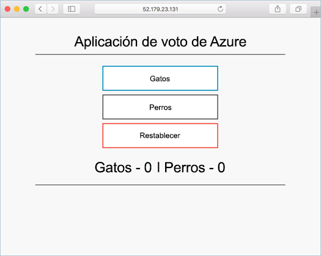

# <a name="tutorial-run-applications-in-azure-kubernetes-service-aks"></a>Tutorial: Ejecución de aplicaciones en Azure Kubernetes Service (AKS)

Kubernetes proporciona una plataforma distribuida para aplicaciones en contenedores. Compile e implemente sus propios servicios y aplicaciones en un clúster de Kubernetes, y deje que el clúster administre la disponibilidad y conectividad. En este tutorial, la cuarta parte de siete, se implementa una aplicación de ejemplo en un clúster de Kubernetes. Aprenderá a:

> [!div class="checklist"]
> * Actualizar los archivos de manifiesto de Kubernetes
> * Ejecutar una aplicación en Kubernetes
> * Prueba de la aplicación

En tutoriales adicionales, esta aplicación se escala horizontalmente y se actualiza.

En esta guía rápida se presupone un conocimiento básico de los conceptos de Kubernetes. Para más información, consulte [Conceptos básicos de Kubernetes de Azure Kubernetes Service (AKS)][kubernetes-concepts].

## <a name="before-you-begin"></a>Antes de empezar

En tutoriales anteriores se empaquetó una aplicación en una imagen de contenedor, se cargó esta imagen en Azure Container Registry y se creó un clúster de Kubernetes.

Para completar este tutorial, necesita el archivo de manifiesto de Kubernetes `azure-vote-all-in-one-redis.yaml` creado previamente. Este archivo se descargó con el código fuente de la aplicación en un tutorial anterior. Confirme que ha clonado el repositorio y que ha cambiado los directorios en el repositorio clonado. Si no ha realizado estos pasos, pero quiere continuar, comience con el [Tutorial 1: Creación de imágenes de contenedor][aks-tutorial-prepare-app].

Para realizar este tutorial es necesario ejecutar la versión 2.0.53, o superior, de la CLI de Azure. Ejecute `az --version` para encontrar la versión. Si necesita instalarla o actualizarla, vea [Instalación de la CLI de Azure][azure-cli-install].

## <a name="update-the-manifest-file"></a>Actualización del archivo de manifiesto

En estos tutoriales, una instancia de Azure Container Registry (ACR) almacena la imagen del contenedor de la aplicación de ejemplo. Para implementar la aplicación, debe actualizar el nombre de la imagen en el archivo de manifiesto de Kubernetes para incluir el nombre del servidor de inicio de sesión de ACR.

Para obtener el nombre del servidor de inicio de sesión de ACR se usa el comando [az acr list][az-acr-list], como se muestra a continuación:

```azurecli
az acr list --resource-group myResourceGroup --query "[].{acrLoginServer:loginServer}" --output table
```

El archivo de manifiesto de ejemplo del repositorio git clonado en el primer tutorial usa el nombre de servidor de inicio de sesión *microsoft*. Asegúrese de que está en el directorio clonaod *azure-voting-app-redis* y abra el archivo de manifiesto con un editor de texto, como `vi`:

```console
vi azure-vote-all-in-one-redis.yaml
```

Reemplace *microsoft* por el nombre del servidor de inicio de sesión de ACR. El nombre de la imagen se encuentra en la línea 51 del archivo de manifiesto. En el ejemplo siguiente se muestra el nombre de imagen predeterminado:

```yaml
containers:
- name: azure-vote-front
  image: microsoft/azure-vote-front:v1
```

Especifique su propio nombre del servidor de inicio de sesión de ACR para que el archivo de manifiesto sea parecido al del ejemplo siguiente:

```yaml
containers:
- name: azure-vote-front
  image: <acrName>.azurecr.io/azure-vote-front:v1
```

Guarde y cierre el archivo. En `vi`, use `:wq`.

## <a name="deploy-the-application"></a>Implementación de la aplicación

Para implementar la aplicación, use el comando [kubectl apply][kubectl-apply]. Este comando analiza el archivo de manifiesto y crea los objetos de Kubernetes definidos. Especifique el archivo de manifiesto de ejemplo, como se muestra en el ejemplo siguiente:

```console
kubectl apply -f azure-vote-all-in-one-redis.yaml
```

La salida de ejemplo siguiente muestra los recursos que se crearon correctamente en el clúster de AKS:

```
$ kubectl apply -f azure-vote-all-in-one-redis.yaml

deployment "azure-vote-back" created
service "azure-vote-back" created
deployment "azure-vote-front" created
service "azure-vote-front" created
```

## <a name="test-the-application"></a>Prueba de la aplicación

Cuando se ejecuta la aplicación, un servicio de Kubernetes expone el front-end de la aplicación a Internet. Este proceso puede tardar unos minutos en completarse.

Para supervisar el progreso, utilice el comando [kubectl get service][kubectl-get] con el argumento `--watch`.

```console
kubectl get service azure-vote-front --watch
```

En un primer momento, el parámetro *EXTERNAL-IP* del servicio *azure-vote-front* se muestra como *pendiente*:

```
azure-vote-front   LoadBalancer   10.0.34.242   <pending>     80:30676/TCP   5s
```

Cuando la dirección *EXTERNAL-IP* cambie de *pendiente* a una dirección IP pública real, use `CTRL-C` para detener el proceso de inspección de `kubectl`. En la salida del ejemplo siguiente se muestra una dirección IP pública válida asignada al servicio:

```
azure-vote-front   LoadBalancer   10.0.34.242   52.179.23.131   80:30676/TCP   67s
```

Para ver la aplicación en acción, abra un explorador web en la dirección IP externa del servicio:



Si no se cargó la aplicación, esto se puede deber a un problema de autorización con el registro de la imagen. Para ver el estado de los contenedores, use el comando `kubectl get pods`. Si las imágenes del contenedor no se pueden extraer, consulte [Autenticación con Azure Container Registry desde Azure Kubernetes Service](cluster-container-registry-integration.md).

## <a name="next-steps"></a>Pasos siguientes

En este tutorial, una instancia de la aplicación Azure Vote de ejemplo se implementó en un clúster de Kubernetes en AKS. Ha aprendido a:

> [!div class="checklist"]
> * Actualizar los archivos de manifiesto de Kubernetes
> * Ejecutar una aplicación en Kubernetes
> * Prueba de la aplicación

Pase al siguiente tutorial para aprender a escalar una aplicación Kubernetes y la infraestructura de Kubernetes subyacente.

> [!div class="nextstepaction"]
> [Escalar infraestructura y aplicación de Kubernetes][aks-tutorial-scale]

<!-- LINKS - external -->
[kubectl-apply]: https://kubernetes.io/docs/reference/generated/kubectl/kubectl-commands#apply
[kubectl-create]: https://kubernetes.io/docs/reference/generated/kubectl/kubectl-commands#create
[kubectl-get]: https://kubernetes.io/docs/reference/generated/kubectl/kubectl-commands#get

<!-- LINKS - internal -->
[aks-tutorial-prepare-app]: ./tutorial-kubernetes-prepare-app.md
[aks-tutorial-scale]: ./tutorial-kubernetes-scale.md
[az-acr-list]: /cli/azure/acr
[azure-cli-install]: /cli/azure/install-azure-cli
[kubernetes-concepts]: concepts-clusters-workloads.md
[kubernetes-service]: concepts-network.md#services
