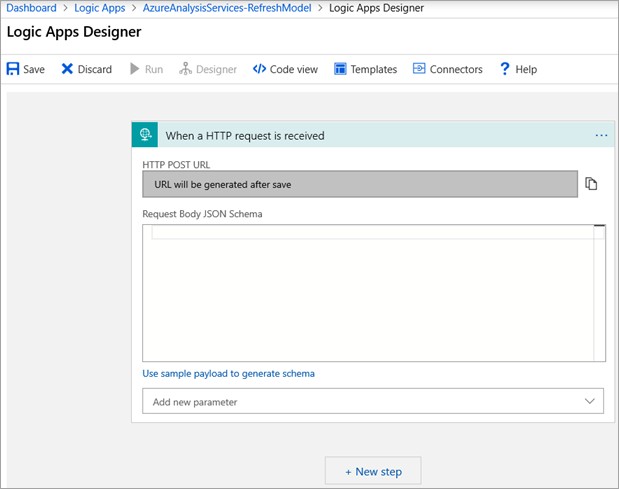
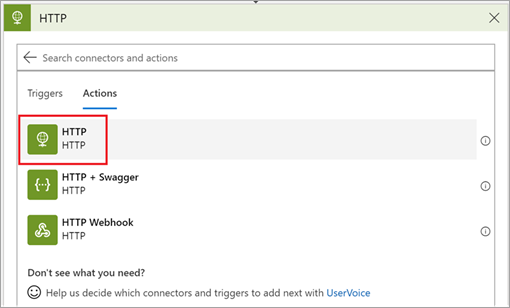
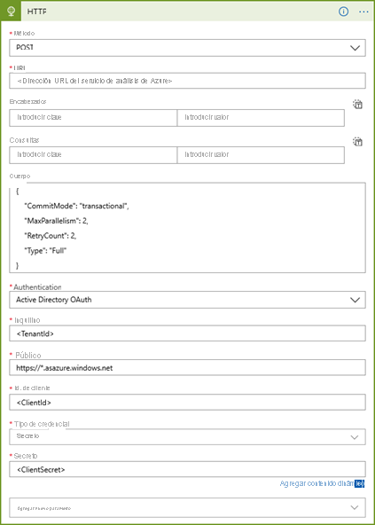
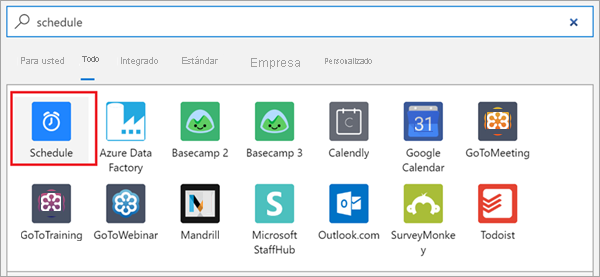
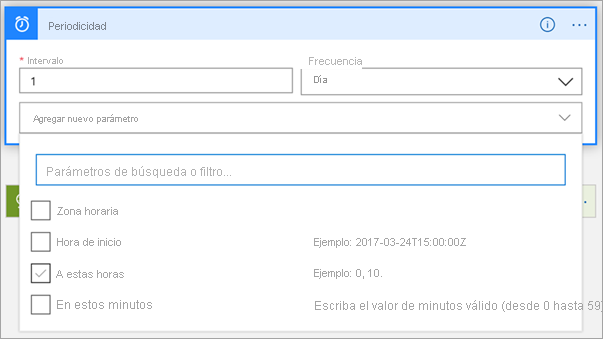
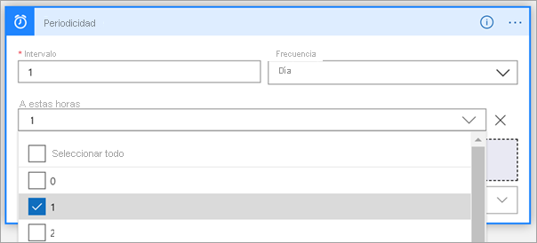

# Actualización con Logic Apps

Al usar Logic Apps y llamadas de REST, puede realizar operaciones de actualización de datos automatizadas en los modelos tabulares de Azure Analysis, incluida la sincronización de réplicas de solo lectura para el escalado horizontal de la consulta.

Para información sobre cómo usar las API de REST con Azure Analysis Services, consulte [Actualización asincrónica con la API de REST](analysis-services-async-refresh.md).

## Authentication

Todas las llamadas se deben autenticar con un token válido de Azure Active Directory (OAuth 2).  En los ejemplos de este artículo se usará una entidad de servicio (SPN) para la autenticación en Azure Analysis Services. Para más información, consulte [Creación de una aplicación mediante Azure Portal](../active-directory/develop/howto-create-service-principal-portal.md).

## Diseño de la aplicación lógica

> [!IMPORTANT]
> En los ejemplos siguientes, se supone que el firewall de Azure Analysis Services está deshabilitado.  Si el firewall está habilitado, la dirección IP pública del iniciador de la solicitud debe figurar en la lista blanca del firewall de Azure Analysis Services. Para información sobre los intervalos de IP de Logic Apps por región, consulte [Información de límites y configuración para Azure Logic Apps](../logic-apps/logic-apps-limits-and-config.md#firewall-configuration-ip-addresses).

### Requisitos previos

#### Creación de una entidad de servicio (SPN)

Para obtener información sobre cómo crear una entidad de servicio, consulte [Creación de una entidad de servicio mediante Azure Portal](../active-directory/develop/howto-create-service-principal-portal.md).

#### Configuración de permisos en Azure Analysis Services
 
La entidad de servicio que cree debe tener permisos de administrador de servidor en el servidor. Para más información, vea [Incorporación de una entidad de servicio al rol de administrador del servidor](analysis-services-addservprinc-admins.md).

### Configuración de la aplicación lógica

En este ejemplo, la aplicación lógica está diseñada para desencadenarse cuando se recibe una solicitud HTTP. De este modo, se podrá usar una herramienta de orquestación, como Azure Data Factory, para desencadenar la actualización del modelo de Azure Analysis Services.

Una vez que haya creado una aplicación lógica:

1. En el diseñador de aplicación lógica, elija la primera acción como **Cuando se recibe una solicitud HTTP**.

   

Con este paso, se rellena con la dirección URL de HTTP POST después de que se guarde la aplicación lógica.

2. Agregue un nuevo paso y busque **HTTP**.  

   

   

3. Seleccione **HTTP** para agregar esta acción.

   

Configure la actividad HTTP tal como se indica abajo:

|Propiedad  |Valor  |
|---------|---------|
|**Método**     |POST         |
|**URI**     | https://*región del servidor*/servers/*nombre del servidor aas*/models/*nombre de la base de datos*/refreshes     Por ejemplo: https:\//westus.asazure.windows.net/servers/myserver/models/AdventureWorks/refreshes|
|**Encabezados**     |   Content-Type, application/json          |
|**Cuerpo**     |   Para más información sobre la forma del cuerpo de la solicitud, consulte [Actualización asincrónica con la API de REST: POST o actualizaciones](analysis-services-async-refresh.md#post-refreshes). |
|**Autenticación**     |Active Directory OAuth         |
|**Inquilino**     |Especifique el id. de inquilino de Azure Active Directory         |
|**Audiencia**     |https://*.asazure.windows.net         |
|**Id. de cliente**     |Especifique el id. de cliente del nombre de entidad de servicio         |
|**Tipo de credencial**     |Secret         |
|**Secreto**     |Especifique el secreto del nombre de entidad de servicio         |

Ejemplo:

Ahora pruebe la aplicación lógica.  En el diseñador de aplicación lógica, haga clic en **Ejecutar**.

## Consumo de la aplicación lógica con Azure Data Factory

Después de guardar la aplicación lógica, consulte la actividad **Cuando se recibe una solicitud HTTP** y luego copie la **URL de HTTP POST** que se habrá generado.  Se trata de la dirección URL que Azure Data Factory puede usar para realizar la llamada asincrónica que desencadenará la aplicación lógica.

A continuación proporcionamos un ejemplo de actividad web de Azure Data Factory que realiza esta acción.

## Uso de una aplicación lógica autocontenida

Si no tiene pensado usar una herramienta de orquestación, como Azure Data Factory, para desencadenar la actualización del modelo, puede establecer la aplicación lógica para que desencadene la actualización según una programación.

Con el ejemplo anterior, elimine la primera actividad y reemplácela por una actividad de **programación**.

En este ejemplo, usaremos **Periodicidad**.

Cuando se haya agregado la actividad, configure el intervalo y la frecuencia, agregue un nuevo parámetro y elija **A estas horas**.

Seleccione las horas deseadas.

Guarde la aplicación lógica.

## Pasos siguientes

[Muestras](analysis-services-samples.md)  
[API DE REST](https://docs.microsoft.com/rest/api/analysisservices/servers)
