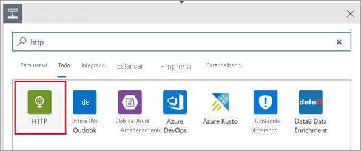
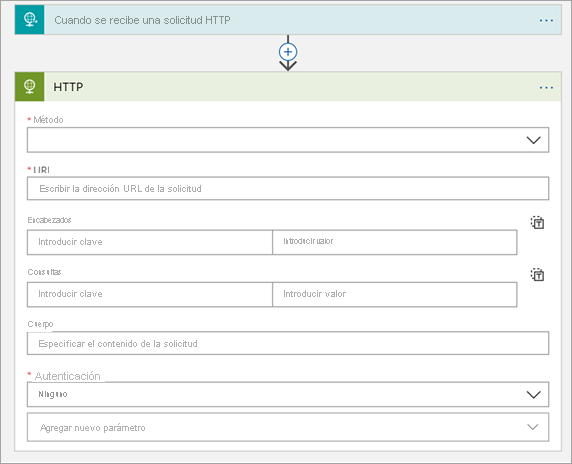
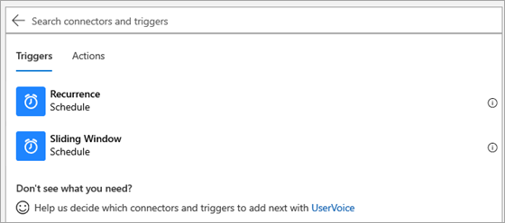

# Actualizar con Logic Apps

Mediante el uso de Logic Apps y llamadas de REST, puede realizar operaciones de actualización de datos automatizada en los modelos tabulares de análisis de Azure, incluida la sincronización de réplicas de solo lectura para el escalado horizontal de la consulta.

Para más información sobre cómo usar las API de REST con Azure Analysis Services, consulte [asincrónico de actualización con la API de REST](analysis-services-async-refresh.md).

## Authentication

Todas las llamadas deben autenticarse con un token válido de Azure Active Directory (OAuth 2).  Los ejemplos de este artículo usará un Principal de servicio (SPN) para autenticarse en Azure Analysis Services. Para obtener más información, consulte [crear una entidad de servicio mediante Azure portal](../active-directory/develop/howto-create-service-principal-portal.md).

## Diseñar la aplicación lógica

> [!IMPORTANT]
> Los ejemplos siguientes se supone que el firewall de Azure Analysis Services está deshabilitado.  Si el firewall está habilitado, la dirección IP pública del iniciador de la solicitud debe ser la lista de permitidos en firewall de Azure Analysis Services. Para más información acerca de los intervalos de IP de la aplicación lógica por región, consulte [límites y la información de configuración para Azure Logic Apps](../logic-apps/logic-apps-limits-and-config.md#firewall-configuration-ip-addresses).

### Requisitos previos

#### Crear a una entidad de servicio (SPN)

Para obtener información acerca de cómo crear una entidad de servicio, consulte [crear una entidad de servicio mediante Azure portal](../active-directory/develop/howto-create-service-principal-portal.md).

#### Configurar permisos en Azure Analysis Services
 
La entidad de servicio que cree debe tener permisos de administrador del servidor en el servidor. Para más información, vea [Incorporación de una entidad de servicio al rol de administrador del servidor](analysis-services-addservprinc-admins.md).

### Configurar la aplicación lógica

En este ejemplo, la aplicación lógica está diseñada para desencadenar cuando se recibe una solicitud HTTP. Esto permitirá el uso de una herramienta de orquestación, como Azure Data Factory, para desencadenar la actualización del modelo de Azure Analysis Services.

Una vez haya creado una aplicación lógica:

1. En el Diseñador de aplicación lógica, elija la primera acción como **cuando recibe una solicitud HTTP es**.

   

Este paso se rellena con la dirección URL de POST de HTTP una vez que se guarda la aplicación lógica.

2. Agregar un nuevo paso y busque **HTTP**.  

   

   

3. Seleccione **HTTP** para agregar esta acción.

   

Configurar la actividad HTTP como sigue:

|Propiedad  |Valor  |
|---------|---------|
|**Método**     |POST         |
|**URI**     | https://*su región de servidor*/Servers /*nombre del servidor aas*/models/*su nombre de la base de datos*/     Por ejemplo: https://westus.asazure.windows.net/servers/myserver/models/AdventureWorks/|
|**Encabezados**     |   Content-Type, application/json          |
|**Cuerpo**     |   Para obtener más información acerca de que forman el cuerpo de solicitud, vea [asincrónico de actualización con la API de REST, / refreshes POST](analysis-services-async-refresh.md#post-refreshes). |
|**Autenticación**     |Active Directory OAuth         |
|**Tenant**     |Rellene el valor de TenantId de Azure Active Directory         |
|**Audiencia**     |https://*.asazure.windows.net         |
|**Id. de cliente**     |Especifique el ClientID de nombre de entidad de servicio         |
|**Tipo de credencial**     |Secret         |
|**Secreto**     |Escriba el secreto del nombre de entidad de servicio         |

Ejemplo:

Probar ahora la aplicación lógica.  En el Diseñador de aplicación lógica, haga clic en **ejecutar**.

## Utilizar la aplicación lógica con Azure Data Factory

Una vez que se guarda la aplicación lógica, revise el **cuando recibe una solicitud HTTP es** actividad y a continuación, copie el **URL de HTTP POST** que ahora se genera.  Se trata de la dirección URL que puede usarse con Azure Data Factory para realizar la llamada asincrónica a la aplicación lógica del desencadenador.

Este es un ejemplo de actividad Azure Data Factory Web que realiza esta acción.

## Usar una aplicación lógica independiente

Si no tiene pensado sobre el uso de una herramienta de orquestación como Data Factory para desencadenar la actualización del modelo, puede establecer la aplicación lógica para desencadenar la actualización según una programación.

Mediante el ejemplo anterior, elimine la primera actividad y reemplazarlo con un **programación** actividad.

Este ejemplo usaremos **periodicidad**.

Una vez que se ha agregado la actividad, configurar el intervalo y la frecuencia, a continuación, agregue un nuevo parámetro y elija **a estas horas**.

Seleccione las horas deseadas.

Guarde la aplicación lógica.

## Pasos siguientes

[Muestras](analysis-services-samples.md)  
[API DE REST](https://docs.microsoft.com/rest/api/analysisservices/servers)
