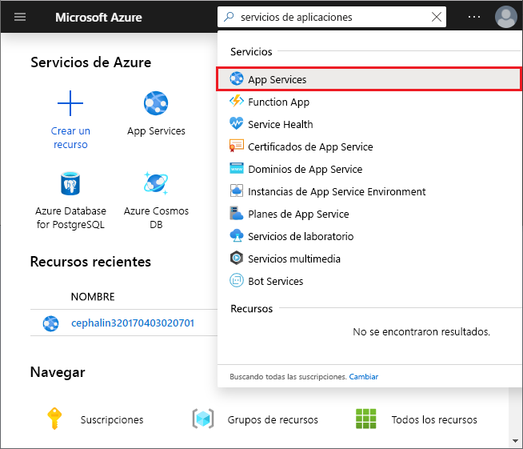
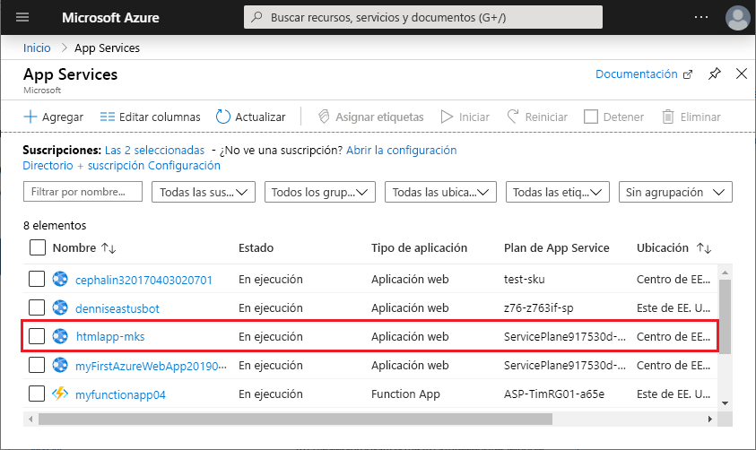
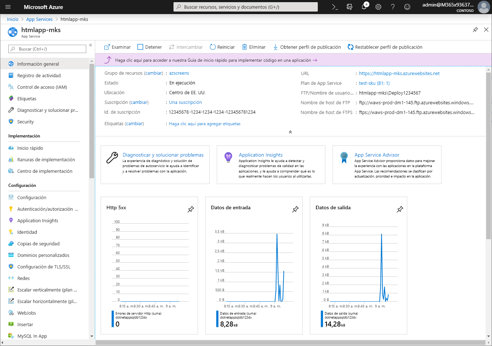

# <a name="create-a-static-html-web-app-in-azure"></a>Creación de una aplicación web HTML estática en Azure

[Azure App Service](overview.md) proporciona un servicio de hospedaje web muy escalable y con aplicación de revisiones de un modo automático. En este inicio rápido se explica cómo implementar un sitio HTML+CSS básico en Azure App Service. Completará esta guía de inicio rápido en [Cloud Shell](https://docs.microsoft.com/azure/cloud-shell/overview), pero también puede ejecutar estos comandos localmente con la [CLI de Azure](/cli/azure/install-azure-cli).


[!INCLUDE [quickstarts-free-trial-note](../../includes/quickstarts-free-trial-note.md)]

[!INCLUDE [cloud-shell-try-it.md](../../includes/cloud-shell-try-it.md)]

## <a name="download-the-sample"></a>Descarga del ejemplo

En Cloud Shell, cree un directorio de inicio rápido y luego cambie a él.

```bash
mkdir quickstart

cd $HOME/quickstart
```

A continuación, ejecute el comando siguiente para clonar el repositorio de la aplicación de ejemplo en el directorio de inicio rápido.

```bash
git clone https://github.com/Azure-Samples/html-docs-hello-world.git
```

## <a name="create-a-web-app"></a>Creación de una aplicación web

Cambie al directorio que contiene el código de ejemplo y ejecute el comando `az webapp up`.

En el siguiente ejemplo, reemplace <app_name > por un nombre único.

```bash
cd html-docs-hello-world
```

```azurecli
az webapp up --location westeurope --name <app_name> --html
```

El comando `az webapp up` realiza las acciones siguientes:

- Crear un grupo de recursos predeterminado.

- Crear un plan de App Service predeterminado.

- Crear una aplicación con el nombre especificado.

- [Implementar con ZIP](https://docs.microsoft.com/azure/app-service/deploy-zip) archivos desde el directorio de trabajo actual a la aplicación web.

Este comando puede tardar varios minutos en ejecutarse. Durante la ejecución, muestra información similar a la del ejemplo siguiente:

```json
{
  "app_url": "https://<app_name>.azurewebsites.net",
  "location": "westeurope",
  "name": "<app_name>",
  "os": "Windows",
  "resourcegroup": "appsvc_rg_Windows_westeurope",
  "serverfarm": "appsvc_asp_Windows_westeurope",
  "sku": "FREE",
  "src_path": "/home/<username>/quickstart/html-docs-hello-world ",
  < JSON data removed for brevity. >
}
```

Anote el valor `resourceGroup`. Lo necesitará en la sección de [limpieza de recursos](#clean-up-resources).

## <a name="browse-to-the-app"></a>Navegación hasta la aplicación

En un explorador, vaya a la dirección URL de la aplicación: `http://<app_name>.azurewebsites.net`.

La página se ejecuta como una aplicación web de Azure App Service.


**¡Enhorabuena!** Ha implementado la primera aplicación HTML en App Service.

## <a name="update-and-redeploy-the-app"></a>Actualización de la aplicación y nueva implementación

En Cloud Shell, escriba `nano index.html` para abrir el editor de texto nano. En la etiqueta del encabezado `<h1>`, cambie "Azure App Service - Sample Static HTML Site" por "Azure App Service", como se muestra a continuación.


Guarde los cambios y salga de nano. Use el comando `^O` para guardar y `^X` para salir.

Ahora podrá volver a implementar la aplicación con el mismo comando `az webapp up`.

```azurecli
az webapp up --location westeurope --name <app_name> --html
```

Una vez que la implementación haya finalizado, vuelva a la ventana del explorador que abrió en el paso **Navegación hasta la aplicación** y actualice la página.


## <a name="manage-your-new-azure-app"></a>Administración de la nueva aplicación de Azure

Para administrar la aplicación web que ha creado, en [Azure Portal](https://portal.azure.com), busque y seleccione **App Services**. 



En la página **App Services**, seleccione el nombre de la aplicación de Azure.



Podrá ver la página de información general de la aplicación web. En este caso, puede realizar tareas de administración básicas como examinar, detener, iniciar, reiniciar y eliminar.



El menú izquierdo proporciona distintas páginas para configurar la aplicación.

## <a name="clean-up-resources"></a>Limpieza de recursos

En los pasos anteriores, creó recursos de Azure en un grupo de recursos. Si prevé que no necesitará estos recursos en el futuro, elimine el grupo de recursos ejecutando el siguiente comando en Cloud Shell. Recuerde que el nombre del grupo de recursos se generó automáticamente para el usuario en el paso [Creación de una aplicación web](#create-a-web-app).

```azurecli
az group delete --name appsvc_rg_Windows_westeurope
```

Este comando puede tardar varios segundos en ejecutarse.

## <a name="next-steps"></a>Pasos siguientes

> [!div class="nextstepaction"]
> [Asignación de un dominio personalizado](app-service-web-tutorial-custom-domain.md)
