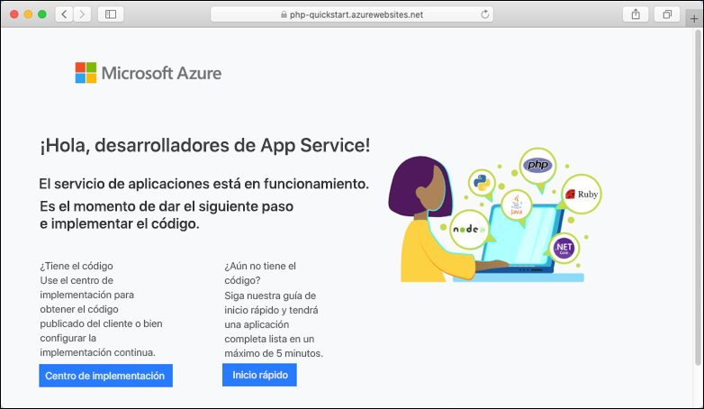
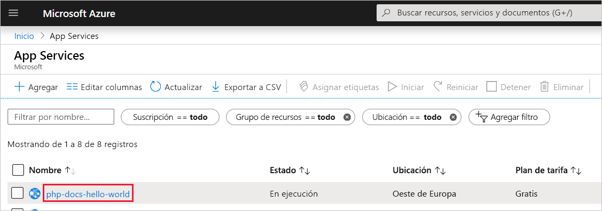
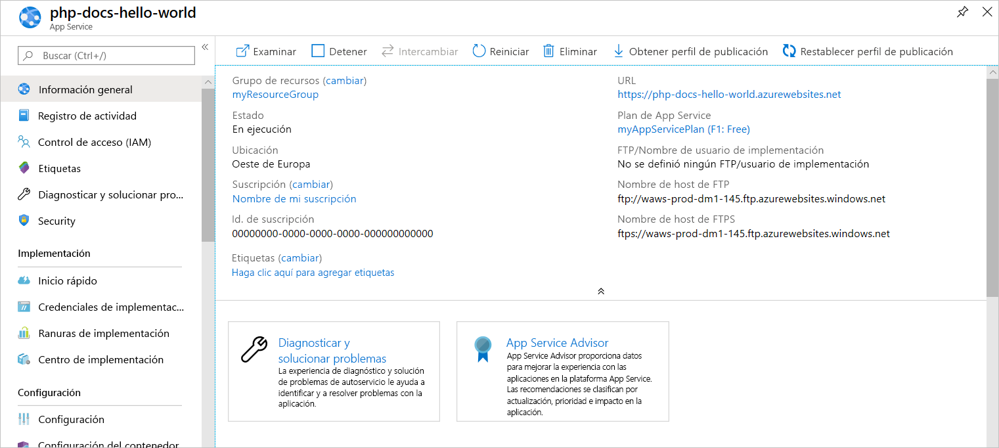

# <a name="create-a-php-web-app-in-azure"></a>Creación de una aplicación web de PHP en Azure

> [!NOTE]
> En este artículo se implementa una aplicación en App Service en Windows. Para realizar implementaciones en App Service en _Linux_, consulte [Creación de una aplicación web de PHP en App Service en Linux](./containers/quickstart-php.md).
>

[Azure App Service](overview.md) proporciona un servicio de hospedaje web muy escalable y con aplicación de revisiones de un modo automático.  En este inicio rápido se explica cómo se implementa una aplicación de PHP en Azure App Service. Se crea la aplicación web con la [CLI de Azure](https://docs.microsoft.com/cli/azure/get-started-with-azure-cli) en Cloud Shell y se usa Git para implementar el código PHP de ejemplo en la aplicación web.


Estos pasos se pueden realizar en este caso con una máquina Mac, Windows o Linux. Una vez instalados los requisitos previos, tardará aproximadamente cinco minutos en completar los pasos.

[!INCLUDE [quickstarts-free-trial-note](../../includes/quickstarts-free-trial-note.md)]

## <a name="prerequisites"></a>Prerrequisitos

Para completar esta guía de inicio rápido:

* <a href="https://git-scm.com/" target="_blank">Instalación de Git</a>
* <a href="https://php.net/manual/install.php" target="_blank">Instalación de PHP</a>

## <a name="download-the-sample-locally"></a>Descarga local del código

Ejecute los siguientes comandos en una ventana de terminal. Con ello, se clonará la aplicación de ejemplo en el equipo local y se desplazará al directorio que contiene el código de ejemplo. 

```bash
git clone https://github.com/Azure-Samples/php-docs-hello-world
cd php-docs-hello-world
```

## <a name="run-the-app-locally"></a>Ejecución de la aplicación de forma local

Ejecute la aplicación localmente para ver cómo debería ser si se implementara en Azure. Abra una ventana de terminal y use el comando `php` para iniciar el servidor web de PHP integrado.

```bash
php -S localhost:8080
```

Abra un explorador web y vaya a la aplicación de ejemplo en `http://localhost:8080`.

Verá el mensaje **Hola mundo** desde la aplicación de ejemplo mostrada en la página.


En la ventana de terminal, presione **Ctrl + C** para salir del servidor web.

[!INCLUDE [cloud-shell-try-it.md](../../includes/cloud-shell-try-it.md)]

[!INCLUDE [Configure deployment user](../../includes/configure-deployment-user.md)]

[!INCLUDE [Create resource group](../../includes/app-service-web-create-resource-group.md)]

[!INCLUDE [Create app service plan](../../includes/app-service-web-create-app-service-plan.md)]

## <a name="create-a-web-app"></a>Creación de una aplicación web

En Cloud Shell, cree una aplicación web en el plan de App Service `myAppServicePlan` con el comando [`az webapp create`](/cli/azure/webapp?view=azure-cli-latest#az-webapp-create). 

En el siguiente ejemplo, reemplace `<app_name>` por un nombre único global de aplicación (los caracteres válidos son `a-z`, `0-9` y `-`). El tiempo de ejecución se establece en `PHP|7.0`. Para ver todos los entornos en tiempo de ejecución admitidos, ejecute [`az webapp list-runtimes`](/cli/azure/webapp?view=azure-cli-latest#az-webapp-list-runtimes). 


```azurecli-interactive
# Bash
az webapp create --resource-group myResourceGroup --plan myAppServicePlan --name <app_name> --runtime "PHP|7.0" --deployment-local-git
# PowerShell
az --% webapp create --resource-group myResourceGroup --plan myAppServicePlan --name <app_name> --runtime "PHP|7.0" --deployment-local-git
```
> [!NOTE]
> El símbolo de detención de análisis `(--%)`, introducido en PowerShell 3.0, indica a PowerShell que no interprete la entrada como expresiones o comandos de PowerShell. 
>

Cuando se haya creado la aplicación web, la CLI de Azure mostrará información similar a la del ejemplo siguiente:

<pre>
Local git is configured with url of 'https://&lt;username&gt;@&lt;app_name&gt;.scm.azurewebsites.net/&lt;app_name&gt;.git'
{
  "availabilityState": "Normal",
  "clientAffinityEnabled": true,
  "clientCertEnabled": false,
  "cloningInfo": null,
  "containerSize": 0,
  "dailyMemoryTimeQuota": 0,
  "defaultHostName": "&lt;app_name&gt;.azurewebsites.net",
  "enabled": true,
  &lt; JSON data removed for brevity. &gt;
}
</pre>

Ha creado una nueva aplicación web vacía, con la implementación de Git habilitada.

> [!NOTE]
> La dirección URL del repositorio de Git remoto se muestra en la propiedad `deploymentLocalGitUrl`, con el formato `https://<username>@<app_name>.scm.azurewebsites.net/<app_name>.git`. Guarde esta dirección URL, ya que la necesitará más adelante.
>

Vaya a la aplicación web recién creada. Reemplace _&lt;nombre de aplicación>_ por el nombre de aplicación único creado en el paso anterior.

```bash
http://<app name>.azurewebsites.net
```

Este es el aspecto que debería tener su nueva aplicación web:



[!INCLUDE [Push to Azure](../../includes/app-service-web-git-push-to-azure.md)] 

```bash
Counting objects: 2, done.
Delta compression using up to 4 threads.
Compressing objects: 100% (2/2), done.
Writing objects: 100% (2/2), 352 bytes | 0 bytes/s, done.
Total 2 (delta 1), reused 0 (delta 0)
remote: Updating branch 'master'.
remote: Updating submodules.
remote: Preparing deployment for commit id '25f18051e9'.
remote: Generating deployment script.
remote: Running deployment command...
remote: Handling Basic Web Site deployment.
remote: Kudu sync from: '/home/site/repository' to: '/home/site/wwwroot'
remote: Copying file: '.gitignore'
remote: Copying file: 'LICENSE'
remote: Copying file: 'README.md'
remote: Copying file: 'index.php'
remote: Ignoring: .git
remote: Finished successfully.
remote: Running post deployment command(s)...
remote: Deployment successful.
To https://<app_name>.scm.azurewebsites.net/<app_name>.git
   cc39b1e..25f1805  master -> master
```

## <a name="browse-to-the-app"></a>Navegación hasta la aplicación

Vaya a la aplicación implementada mediante el explorador web.

```
http://<app_name>.azurewebsites.net
```

El código de ejemplo de PHP se está ejecutando en una aplicación web de Azure App Service.


**¡Enhorabuena!** Ha implementado la primera aplicación PHP en App Service.

## <a name="update-locally-and-redeploy-the-code"></a>Actualización local y nueva implementación del código

Con un editor de texto local, abra el archivo `index.php` dentro de la aplicación PHP y realice un pequeño cambio en el texto dentro de la cadena situada junto a `echo`:

```php
echo "Hello Azure!";
```

En la ventana del terminal local, confirme los cambios en Git e inserte los cambios de código en Azure.

```bash
git commit -am "updated output"
git push azure master
```

Una vez que la implementación haya finalizado, vuelva a la ventana del explorador que abrió en el paso **Navegación hasta la aplicación** y actualice la página.


## <a name="manage-your-new-azure-app"></a>Administración de la nueva aplicación de Azure

1. Vaya a <a href="https://portal.azure.com" target="_blank">Azure Portal</a> para administrar la aplicación web que ha creado. Busque y seleccione **App Services**.

    

2. Seleccione el nombre de la aplicación de Azure.

    

    Se mostrará la página de **información general** de la aplicación web. En ella, puede realizar tareas de administración básicas como **examinar**, **detener**, **reiniciar** y **eliminar**.

    

    En el menú de la aplicación web se proporcionan distintas opciones para configurar la aplicación. 

[!INCLUDE [cli-samples-clean-up](../../includes/cli-samples-clean-up.md)]

## <a name="next-steps"></a>Pasos siguientes

> [!div class="nextstepaction"]
> [PHP con MySQL](app-service-web-tutorial-php-mysql.md)
