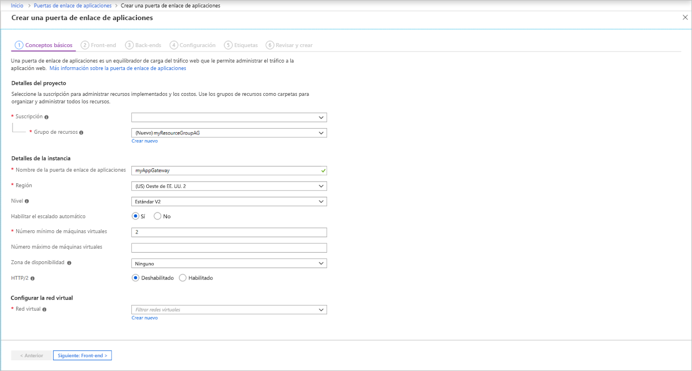
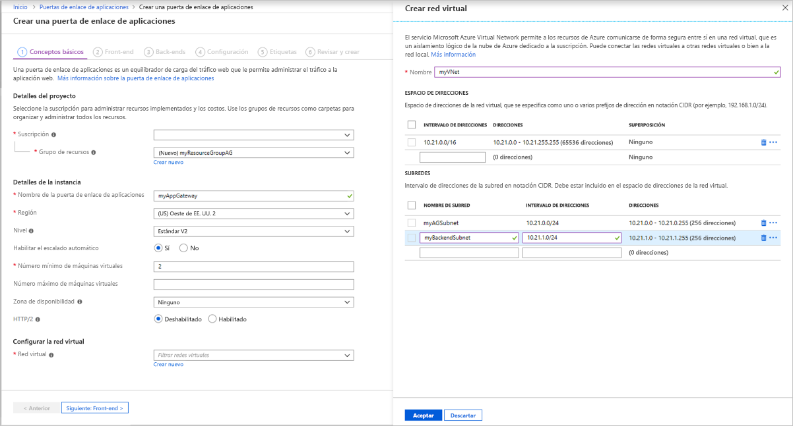
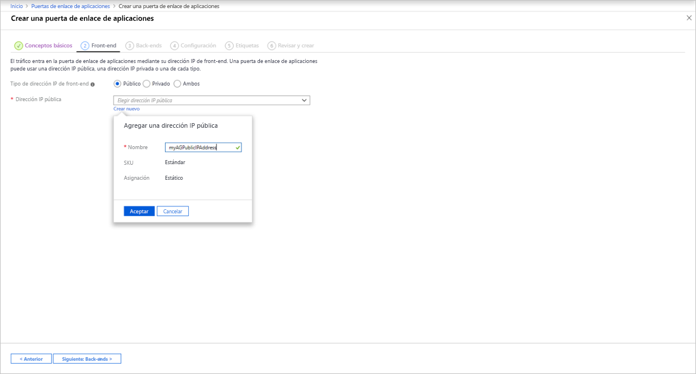

# <a name="tutorial-create-and-configure-an-application-gateway-to-host-multiple-web-sites-using-the-azure-portal"></a>Tutorial: Creación y configuración de una puerta de enlace de aplicaciones que hospede varios sitios web mediante Azure Portal

Puede usar Azure Portal para configurar el [hospedaje de varios sitios web](multiple-site-overview.md) al crear una [puerta de enlace de aplicaciones](overview.md). En este tutorial se definen grupos de direcciones de back-end mediante máquinas virtuales. Después, configurará agentes de escucha y reglas basados en los dominios que posee para asegurarse de que el tráfico web llega a los servidores adecuados en los grupos. En este tutorial se da por supuesto que posee varios dominios y se van a utilizar los ejemplos de *www.contoso.com* y *www.fabrikam.com*.

En este tutorial, aprenderá a:

> [!div class="checklist"]
> * Creación de una puerta de enlace de aplicaciones
> * Crear máquinas virtuales para servidores back-end
> * Crear grupos de back-end con los servidores back-end
> * Crear un agente de escucha de back-end
> * Crear reglas de enrutamiento
> * Creación de un registro CNAME en el dominio


Si no tiene una suscripción a Azure, cree una [cuenta gratuita](https://azure.microsoft.com/free/?WT.mc_id=A261C142F) antes de empezar.

## <a name="sign-in-to-azure"></a>Inicio de sesión en Azure

Inicie sesión en Azure Portal en [https://portal.azure.com](https://portal.azure.com).

## <a name="create-an-application-gateway"></a>Creación de una puerta de enlace de aplicaciones

1. Seleccione **Crear un recurso** en el menú de la izquierda de Azure Portal. Aparece la ventana **Nuevo**.

2. Seleccione **Redes** y **Application Gateway** en la lista **Destacados**.

### <a name="basics-tab"></a>Pestaña Aspectos básicos

1. En la pestaña **Aspectos básicos**, especifique estos valores para la siguiente configuración de puerta de enlace de aplicaciones:

   - **Grupo de recursos**: Seleccione **myResourceGroupAG** como grupo de recursos. Si no existe, seleccione **Crear nuevo** para crearlo.
   - **Nombre de la puerta de enlace de aplicaciones**: Escriba *myAppGateway* como nombre de la puerta de enlace de aplicaciones.

     

2.  Para que Azure se comunique entre los recursos que se crean, se necesita una red virtual. Puede crear una red virtual o usar una existente. En este ejemplo, creará una nueva red virtual a la vez que crea la puerta de enlace de aplicaciones. Se crean instancias de Application Gateway en subredes independientes. En este ejemplo se crean dos subredes: una para la puerta de enlace de aplicaciones y la otra para los servidores back-end.

    En **Configurar la red virtual**, seleccione **Crear nuevo** para crear una nueva red virtual. En la ventana **Crear red virtual** que se abre, escriba los valores siguientes para crear la red virtual y dos subredes:

    - **Nombre**: Escriba *myVnet* como nombre de la red virtual.

    - **Nombre de subred** (subred de Application Gateway): La cuadrícula **Subredes** mostrará una subred llamada *Predeterminada*. Cambie el nombre de esta subred a *myAGSubnet*.<br>La subred de la puerta de enlace de aplicaciones solo puede contener puertas de enlace de aplicaciones. No se permite ningún otro recurso.

    - **Nombre de subred** (subred de servidor de back-end): En la segunda fila de la cuadrícula **Subredes**, escriba *myBackendSubnet* en la columna **Nombre de subred**.

    - **Intervalo de direcciones** (subred de servidor de back-end): En la segunda fila de la cuadrícula **Subredes**, escriba un intervalo de direcciones que no se superponga al intervalo de direcciones de *myAGSubnet*. Por ejemplo, si el intervalo de direcciones de *myAGSubnet* es 10.0.0.0/24, escriba *10.0.1.0/24* para el intervalo de direcciones de *myBackendSubnet*.

    Seleccione **Aceptar** para cerrar la ventana **Crear red virtual** y guarde la configuración de la red virtual.

     
    
3. En la pestaña **Aspectos básicos**, acepte los valores predeterminados para las demás opciones y seleccione **Siguiente: Front-end**.

### <a name="frontends-tab"></a>Pestaña Front-end

1. En la pestaña **Front-end**, compruebe que **Tipo de dirección IP de front-end** esté establecido en **Pública**. <br>Puede configurar la dirección IP de front-end para que sea pública o privada, según el caso de uso. En este ejemplo, elegimos una IP de front-end pública.
   > [!NOTE]
   > Para la SKU de Application Gateway v2, solo puede elegir la configuración IP de front-end **pública**. La configuración de IP de front-end privada no está habilitada actualmente para este SKU v2.

2. Elija **Crear nuevo** para la **Dirección IP pública** y escriba *myAGPublicIPAddress* para el nombre de dirección IP pública y seleccione **Aceptar**. 

     

3. Seleccione **Siguiente: Back-end**.

### <a name="backends-tab"></a>Pestaña Back-end

El grupo de back-end se usa para enrutar las solicitudes a los servidores back-end, que atienden la solicitud. Los grupos de back-end pueden ser NIC, conjuntos de escalado de máquinas virtuales, direcciones IP públicas e internas, nombres de dominio completos (FQDN) y servidores back-end multiinquilino, como Azure App Service. En este ejemplo, creará un grupo de back-end vacío con la puerta de enlace de aplicaciones y, luego, agregará destinos de back-end al grupo de back-end.

1. En la pestaña **Back-end**, seleccione **+Agregar un grupo de back-end**.

2. En la ventana **Agregar un grupo de back-end**, escriba los valores siguientes para crear un grupo de back-end vacío:

    - **Nombre**: Escriba *contosoPool* como nombre del grupo back-end.
    - **Agregar grupo de back-end sin destinos**: Seleccione **Sí** para crear un grupo de back-end sin destinos. Agregará destinos de back-end después de crear la puerta de enlace de aplicaciones.

3. En la ventana **Agregar un grupo de back-end**, seleccione **Agregar** para guardar la configuración del grupo de back-end y vuelva a la pestaña **Back-end**.
4. Ahora, agregue otro grupo de back-end denominado *fabrikamPool*.

     

4. En la pestaña **Back-end**, seleccione **Siguiente: Configuración**.

### <a name="configuration-tab"></a>Pestaña Configuración

En la pestaña **Configuración**, conecte el grupo de front-end y back-end que ha creado con una regla de enrutamiento.

1. Seleccione **Agregar una regla** en la columna **Reglas de enrutamiento**.

2. En la ventana **Agregar una regla de enrutamiento** que se abre, escriba *contosoRule* para **Nombre de regla**.

3. Una regla de enrutamiento necesita un cliente de escucha. En la pestaña **Cliente de escucha** de la ventana **Agregar una regla de enrutamiento**, escriba los valores siguientes para el cliente de escucha:

    - **Nombre del cliente de escucha**: Escriba *contosoListener* como nombre del cliente de escucha.
    - **Dirección IP de front-end**: Seleccione **Pública** para elegir la dirección IP pública que ha creado para el front-end.

   En **Configuración adicional**:
   - **Tipo de cliente de escucha**: Varios sitios
   - **Nombre de host**: **www.contoso.com**

   Acepte los valores predeterminados para las demás opciones de la pestaña **Cliente de escucha** y, a continuación, seleccione la pestaña **Destinos de back-end** para configurar el resto de opciones de la regla de enrutamiento.

   

4. En la pestaña **Destinos de back-end**, seleccione **contosoPool** para el **Destino de back-end**.

5. Para la **Configuración de HTTP**, seleccione **Crear nueva** para crear una nueva configuración de HTTP. La configuración de HTTP determinará el comportamiento de la regla de enrutamiento. En la ventana **Agregar una configuración de HTTP** que se abre, escriba *contosoHTTPSetting* en **Nombre de la configuración HTTP**. Acepte los valores predeterminados para las demás opciones de la ventana **Agregar una configuración de HTTP** y, a continuación, seleccione **Agregar** para volver a la ventana **Agregar una regla de enrutamiento**. 

6. En la ventana **Agregar una regla de enrutamiento**, seleccione **Agregar** para guardar la regla de enrutamiento y volver a la pestaña **Configuración**.
7. Seleccione **Agregar una regla** y agregue una regla, un cliente de escucha, un destino de back-end y una configuración de HTTP similares para Fabrikam.

     

7. Seleccione **Siguiente: Etiquetas** y, a continuación, **Siguiente: Review + create** (Revisar y crear).

### <a name="review--create-tab"></a>Pestaña Revisar y crear

Revise la configuración en la pestaña **Revisar y crear** y seleccione **Crear** para crear la red virtual, la dirección IP pública y la puerta de enlace de aplicaciones. Azure puede tardar varios minutos en crear la puerta de enlace de aplicaciones.

Espere hasta que finalice la implementación correctamente antes de continuar con la siguiente sección.

## <a name="add-backend-targets"></a>Agregar destinos de back-end

En este ejemplo, se usan máquinas virtuales como back-end de destino. Pueden usarse máquinas virtuales existentes o crear otras nuevas. En este ejemplo, se crean dos máquinas virtuales que Azure usa como servidores back-end para la puerta de enlace de aplicaciones.

Para agregar destinos de back-end, puede:

1. Crear dos nuevas máquinas virtuales, *contosoVM* y *fabrikamVM*, que se usarán como servidores back-end.
2. Instalar IIS en las máquinas virtuales para comprobar que la puerta de enlace de aplicaciones se ha creado correctamente.
3. Agregar los servidores back-end a los grupos de back-end.

### <a name="create-a-virtual-machine"></a>de una máquina virtual

1. En Azure Portal, seleccione **Crear un recurso**. Aparece la ventana **Nuevo**.
2. Haga clic en **Compute** y, a continuación, seleccione **Windows Server 2016 Datacenter** en la lista **Popular**. Aparecerá la página **Creación de una máquina virtual**.<br>Application Gateway puede enrutar el tráfico a cualquier tipo de máquina virtual que se use en el grupo de back-end. En este ejemplo se usa un Windows Server 2016 Datacenter.
3. Especifique estos valores en la pestaña **Datos básicos** de la siguiente configuración de máquina virtual:

    - **Grupo de recursos**: Seleccione **myResourceGroupAG** como nombre del grupo de recursos.
    - **Nombre de la máquina virtual**: Escriba *contosoVM* como nombre de la máquina virtual.
    - **Nombre de usuario**: Escriba *azureuser* como nombre del usuario administrador.
    - **Contraseña**: Escriba *Azure123456!* como la contraseña de administrador.
4. Acepte los valores predeterminados y haga clic en **Siguiente: Discos**.  
5. Acepte los valores predeterminados de la pestaña **Discos** y seleccione **Siguiente: Redes**.
6. En la pestaña **Redes**, compruebe que **myVNet** está seleccionada como **red virtual** y que la **subred** es **myBackendSubnet**. Acepte los valores predeterminados y haga clic en **Siguiente: Administración**.<br>Application Gateway puede comunicarse con instancias fuera de la red virtual en la que se encuentra, pero hay que comprobar que haya conectividad IP.
7. En la pestaña **Administración**, establezca **Diagnósticos de arranque** en **Desactivado**. Acepte los demás valores predeterminados y seleccione **Revisar y crear**.
8. En la pestaña **Revisar y crear**, revise la configuración, corrija los errores de validación y, después, seleccione **Crear**.
9. Espere a que se complete la creación de la máquina virtual antes de continuar.

### <a name="install-iis-for-testing"></a>Instalación de IIS para pruebas

En este ejemplo se instala IIS en las máquinas virtuales con el fin de comprobar que Azure creó correctamente la puerta de enlace de aplicaciones.

1. Abra [Azure PowerShell](https://docs.microsoft.com/azure/cloud-shell/quickstart-powershell). Para ello, seleccione **Cloud Shell** en la barra de navegación superior de Azure Portal y, a continuación, seleccione **PowerShell** en la lista desplegable. 

    

2. Ejecute el siguiente comando para instalar IIS en la máquina virtual: 

    ```azurepowershell-interactive
    Set-AzVMExtension `
      -ResourceGroupName myResourceGroupAG `
      -ExtensionName IIS `
      -VMName contosoVM `
      -Publisher Microsoft.Compute `
      -ExtensionType CustomScriptExtension `
      -TypeHandlerVersion 1.4 `
      -SettingString '{"commandToExecute":"powershell Add-WindowsFeature Web-Server; powershell Add-Content -Path \"C:\\inetpub\\wwwroot\\Default.htm\" -Value $($env:computername)"}' `
      -Location EastUS
    ```

3. Cree una segunda máquina virtual e instale IIS con los pasos que acaba de finalizar. Use *fabrikamVM* como nombre de la máquina virtual y como valor de **VMName** para el cmdlet **Set-AzVMExtension**.

### <a name="add-backend-servers-to-backend-pools"></a>Adición de servidores back-end a grupos de back-end

1. Seleccione **Todos los recursos** y, después, seleccione **myAppGateway**.

2. Seleccione los **grupos back-end** en el menú de la izquierda.

3. Seleccione **contosoPool**.

4. En **Destinos**, seleccione **Máquina virtual** de la lista desplegable.

5. En **MÁQUINA VIRTUAL** e **INTERFACES DE RED**, seleccione la máquina virtual **contosoVM** y su interfaz de red asociada de las listas desplegables.

    

6. Seleccione **Guardar**.
7. Repita el procedimiento para agregar *fabrikamVM* y la interfaz a *fabrikamPool*.

Espere a que la implementación se complete antes de continuar con el paso siguiente.

## <a name="create-a-www-a-record-in-your-domains"></a>Creación de un registro de www A en los dominios

Después de crear la puerta de enlace de aplicaciones con la dirección IP pública, puede obtener la dirección IP y usarla para crear un registro A en los dominios. 

1. Haga clic en **Todos los recursos** y, a continuación, haga clic en **myAGPublicIPAddress**.

    

2. Copie la dirección IP y utilícela como valor en un nuevo registro *www* A del dominio.

## <a name="test-the-application-gateway"></a>Prueba de la puerta de enlace de aplicaciones

1. Escriba el nombre de dominio en la barra de direcciones del explorador. Por ejemplo, http://www.contoso.com.

    

2. Cambie la dirección al otro dominio. Debería ver algo parecido al ejemplo siguiente:

    

## <a name="clean-up-resources"></a>Limpieza de recursos

Cuando ya no necesite los recursos que ha creado con la puerta de enlace de aplicaciones, elimine el grupo de recursos. Cuando quite el grupo de recursos, también quita la puerta de enlace de aplicaciones y todos sus recursos relacionados.

Para eliminar el grupo de recursos:

1. En el menú de la izquierda de Azure Portal, seleccione **Grupos de recursos**.
2. En la página **Grupos de recursos**, busque **myResourceGroupAG** en la lista y selecciónelo.
3. En la **página del grupo de recursos**, seleccione **Eliminar grupo de recursos**.
4. Escriba *myResourceGroupAG* en **ESCRIBA EL NOMBRE DEL GRUPO DE RECURSOS** y seleccione **Eliminar**.

## <a name="next-steps"></a>Pasos siguientes

> [!div class="nextstepaction"]
> [Más información sobre lo que se puede hacer con Azure Application Gateway](application-gateway-introduction.md)