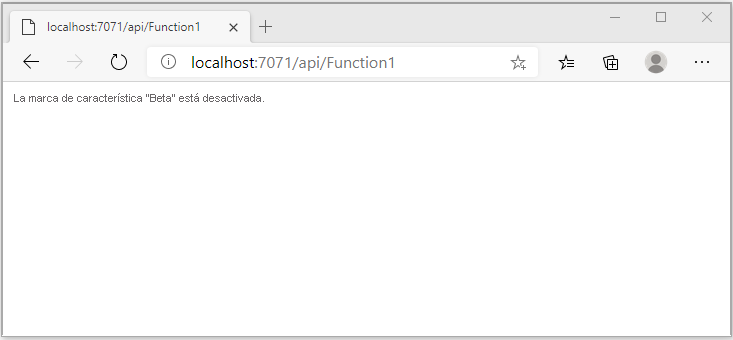
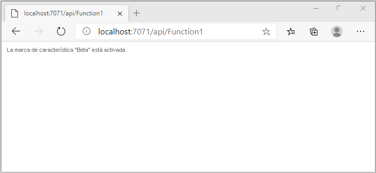

# <a name="quickstart-add-feature-flags-to-an-azure-functions-app"></a>Inicio rápido: Adición de marcas de características a una aplicación de Azure Functions

En este inicio rápido, se crear una implementación de la administración de características en una aplicación de Azure Functions mediante Azure App Configuration. Podrá usar el servicio App Configuration para almacenar en una ubicación central todas las marcas de características y controlar sus estados. 

Las bibliotecas de administración de características de .NET amplían la plataforma con compatibilidad con las marcas de características. Estas bibliotecas se compilan a partir del sistema de configuración de .NET. Se integran con App Configuration mediante su proveedor de configuración de .NET.

## <a name="prerequisites"></a>Requisitos previos

- Una suscripción a Azure: [cree una cuenta gratuita](https://azure.microsoft.com/free/)
- [Visual Studio 2019](https://visualstudio.microsoft.com/vs) con la carga de trabajo de **desarrollo de Azure**.
- [Herramientas de Azure Functions](../azure-functions/functions-develop-vs.md#check-your-tools-version)

## <a name="create-an-app-configuration-store"></a>Creación de un almacén de App Configuration

[!INCLUDE [azure-app-configuration-create](../../includes/azure-app-configuration-create.md)]

6. Seleccione **Administrador de características** >  **+Agregar** para agregar una marca de características denominada `Beta`.

    > [!div class="mx-imgBorder"]
    > 

    Deje `label` y `Description` sin definir por ahora.

7. Seleccione **Aplicar** para guardar la nueva marca de características.

## <a name="create-a-functions-app"></a>Creación de una aplicación de Functions

[!INCLUDE [Create a project using the Azure Functions template](../../includes/functions-vstools-create.md)]

## <a name="connect-to-an-app-configuration-store"></a>Conexión a un almacén de App Configuration

1. Haga clic con el botón derecho en el proyecto y seleccione **Administrar paquetes NuGet**. En la pestaña **Examinar**, busque y agregue los siguientes paquetes NuGet al proyecto. Verifique en `Microsoft.Extensions.DependencyInjection` que se encuentra en la compilación estable más reciente. 

    ```
    Microsoft.Extensions.DependencyInjection
    Microsoft.Extensions.Configuration
    Microsoft.FeatureManagement
    ```


1. Abra *Function1.cs* y agregue los espacios de nombres de estos paquetes.

    ```csharp
    using Microsoft.Extensions.Configuration;
    using Microsoft.FeatureManagement;
    using Microsoft.Extensions.DependencyInjection;
    ```

1. Agregue el constructor estático de `Function1` siguiente para arrancar el proveedor de Azure App Configuration. Luego, agregue dos miembros `static`, un campo denominado `ServiceProvider` para crear una instancia singleton de `ServiceProvider` y una propiedad a continuación de `Function1` denominada `FeatureManager` para crear una instancia singleton de `IFeatureManager`. Después establezca una conexión con App Configuration en `Function1`, para lo que debe llamar a `AddAzureAppConfiguration()`. Este proceso cargará la configuración cuando se inicia la aplicación. La misma instancia de configuración se usará para todas las llamadas posteriores de Functions. 

    ```csharp
        // Implements IDisposable, cached for life time of function
        private static ServiceProvider ServiceProvider; 

        static Function1()
        {
            IConfigurationRoot configuration = new ConfigurationBuilder()
                .AddAzureAppConfiguration(options =>
                {
                    options.Connect(Environment.GetEnvironmentVariable("ConnectionString"))
                           .UseFeatureFlags();
                }).Build();

            var services = new ServiceCollection();                                                                             
            services.AddSingleton<IConfiguration>(configuration).AddFeatureManagement();

            ServiceProvider = services.BuildServiceProvider(); 
        }

        private static IFeatureManager FeatureManager => ServiceProvider.GetRequiredService<IFeatureManager>();
    ```

1. Actualice el método `Run` para cambiar el valor del mensaje que se muestra en función del estado de la marca de la característica.

    ```csharp
        [FunctionName("Function1")]
        public static async Task<IActionResult> Run(
                [HttpTrigger(AuthorizationLevel.Anonymous, "get", "post", Route = null)] HttpRequest req,
                ILogger log)
            {
                string message = await FeatureManager.IsEnabledAsync("Beta")
                     ? "The Feature Flag 'Beta' is turned ON"
                     : "The Feature Flag 'Beta' is turned OFF";
                
                return (ActionResult)new OkObjectResult(message); 
            }
    ```

## <a name="test-the-function-locally"></a>Prueba local de la función

1. Establezca una variable de entorno denominada **ConnectionString**, cuyo valor es la clave de acceso que recuperó anteriormente en el almacén de App Configuration en **Claves de acceso**. Si usa el símbolo del sistema de Windows, ejecute el siguiente comando y reinícielo para que se aplique el cambio:

    ```cmd
        setx ConnectionString "connection-string-of-your-app-configuration-store"
    ```

    Si usa Windows PowerShell, ejecute el siguiente comando:

    ```azurepowershell
        $Env:ConnectionString = "connection-string-of-your-app-configuration-store"
    ```

    Si usa macOS o Linux, ejecute el siguiente comando:

    ```bash
        export ConnectionString='connection-string-of-your-app-configuration-store'
    ```

1. Presione F5 para probar la función. Si se le solicita, acepte la solicitud de Visual Studio para descargar e instalar las herramientas de **Azure Functions Core (CLI)** . También es preciso que habilite una excepción de firewall para que las herramientas para controlen las solicitudes de HTTP.

1. Copie la dirección URL de la función de los resultados del runtime de Azure Functions.

    

1. Pegue la dirección URL de la solicitud HTTP en la barra de direcciones del explorador. En la imagen siguiente se muestra la respuesta que indica que la marca de la característica `Beta` está deshabilitada. 

    

1. Inicie sesión en [Azure Portal](https://portal.azure.com). Seleccione **Todos los recursos** y, después, seleccione la instancia del almacén de App Configuration que creó.

1. Seleccione **Feature Manager** (Administrador de características) y cambie el estado de la clave **Beta** a **On** (Activado).

1. Vuelva al símbolo del sistema y cancele el proceso de ejecución; para ello, presione `Ctrl-C`.  Presione F5 para reiniciar la aplicación. 

1. Copie la dirección URL de la función de la salida del runtime de Azure Functions y use para ello el mismo proceso que en el paso 3. Pegue la dirección URL de la solicitud HTTP en la barra de direcciones del explorador. La respuesta del explorador debe haber cambiado para indicar que la marca de la característica `Beta` está activada, como se muestra en la imagen siguiente.
 
    

## <a name="clean-up-resources"></a>Limpieza de recursos

[!INCLUDE [azure-app-configuration-cleanup](../../includes/azure-app-configuration-cleanup.md)]

## <a name="next-steps"></a>Pasos siguientes

En este inicio rápido, ha creado una marca de característica y la ha usado con una aplicación de Azure Functions mediante el [proveedor de App Configuration](https://go.microsoft.com/fwlink/?linkid=2074664).

- Más información sobre la [administración de características](./concept-feature-management.md).
- [Administración de marcas de características](./manage-feature-flags.md).
- [Uso de la configuración dinámica en una aplicación de Azure Functions](./enable-dynamic-configuration-azure-functions-csharp.md)
