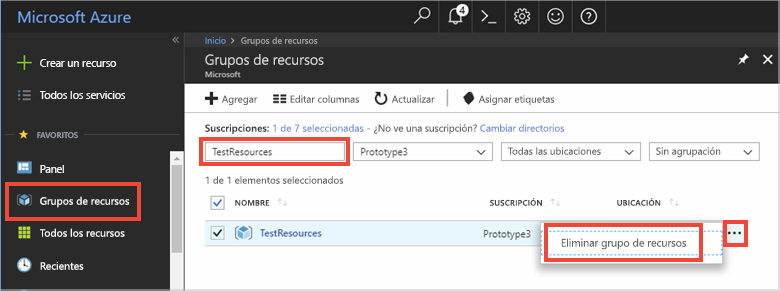

# <a name="quickstart-use-azure-cache-for-redis-with-java"></a>Inicio rápido: Uso de Azure Redis Cache con Java

En este inicio rápido incorporará Azure Redis Cache en una aplicación Java mediante el cliente de Redis [Jedis](https://github.com/xetorthio/jedis) para acceder a una caché dedicada y segura, a la que se puede acceder desde cualquier aplicación de Azure.

## <a name="prerequisites"></a>Prerrequisitos

- Una suscripción a Azure: [cree una cuenta gratuita](https://azure.microsoft.com/free/)
- [Apache Maven](https://maven.apache.org/download.cgi)

## <a name="create-an-azure-cache-for-redis"></a>Creación de una instancia de Azure Redis Cache

[!INCLUDE [redis-cache-create](../../includes/redis-cache-create.md)]

[!INCLUDE [redis-cache-access-keys](../../includes/redis-cache-access-keys.md)]

## <a name="setting-up-the-working-environment"></a>Configuración del entorno de trabajo 

En función del sistema operativo, agregue variables de entorno en **Nombre de host** y **Clave de acceso primaria**. Abra un símbolo del sistema o una ventana de terminal y configure los siguientes valores:

```CMD 
set REDISCACHEHOSTNAME=<YOUR_HOST_NAME>.redis.cache.windows.net
set REDISCACHEKEY=<YOUR_PRIMARY_ACCESS_KEY>
```

```bash
export REDISCACHEHOSTNAME=<YOUR_HOST_NAME>.redis.cache.windows.net
export REDISCACHEKEY=<YOUR_PRIMARY_ACCESS_KEY>
```

Reemplace los marcadores de posición por los siguientes valores:

- `<YOUR_HOST_NAME>`: El nombre de host DNS, que se obtiene en la sección *Propiedades* del recurso Azure Cache for Redis en Azure Portal.
- `<YOUR_PRIMARY_ACCESS_KEY>`: El nombre de host DNS, que se obtiene en la sección *Claves de acceso* del recurso Azure Cache for Redis en Azure Portal.

## <a name="create-a-new-java-app"></a>Creación de una nueva aplicación Java

Con Maven, genere una nueva aplicación de inicio rápido:

```CMD
mvn archetype:generate -DarchetypeGroupId=org.apache.maven.archetypes -DarchetypeArtifactId=maven-archetype-quickstart -DarchetypeVersion=1.3 -DgroupId=example.demo -DartifactId=redistest -Dversion=1.0
```

Cambie al nuevo directorio del proyecto *redistest*.

Abra el archivo *pom.xml* y agregue una dependencia para [Jedis](https://github.com/xetorthio/jedis):

```xml
    <dependency>
        <groupId>redis.clients</groupId>
        <artifactId>jedis</artifactId>
        <version>3.2.0</version>
        <type>jar</type>
        <scope>compile</scope>
    </dependency>
```

Guarde el archivo *pom.xml* .

Abra *App.java* y reemplace el código por el código siguiente:

```java
package example.demo;

import redis.clients.jedis.Jedis;
import redis.clients.jedis.JedisShardInfo;

/**
 * Redis test
 *
 */
public class App 
{
    public static void main( String[] args )
    {

        boolean useSsl = true;
        String cacheHostname = System.getenv("REDISCACHEHOSTNAME");
        String cachekey = System.getenv("REDISCACHEKEY");

        // Connect to the Azure Cache for Redis over the TLS/SSL port using the key.
        JedisShardInfo shardInfo = new JedisShardInfo(cacheHostname, 6380, useSsl);
        shardInfo.setPassword(cachekey); /* Use your access key. */
        Jedis jedis = new Jedis(shardInfo);      

        // Perform cache operations using the cache connection object...

        // Simple PING command        
        System.out.println( "\nCache Command  : Ping" );
        System.out.println( "Cache Response : " + jedis.ping());

        // Simple get and put of integral data types into the cache
        System.out.println( "\nCache Command  : GET Message" );
        System.out.println( "Cache Response : " + jedis.get("Message"));

        System.out.println( "\nCache Command  : SET Message" );
        System.out.println( "Cache Response : " + jedis.set("Message", "Hello! The cache is working from Java!"));

        // Demonstrate "SET Message" executed as expected...
        System.out.println( "\nCache Command  : GET Message" );
        System.out.println( "Cache Response : " + jedis.get("Message"));

        // Get the client list, useful to see if connection list is growing...
        System.out.println( "\nCache Command  : CLIENT LIST" );
        System.out.println( "Cache Response : " + jedis.clientList());

        jedis.close();
    }
}
```

Este código muestra cómo conectarse a una instancia de Azure Redis Cache usando las variables de entorno de nombre de host de caché y clave. El código también almacena y recupera un valor de cadena en la memoria caché. También se ejecutan los comandos `PING` y `CLIENT LIST`. 

Guarde *App.java*.

## <a name="build-and-run-the-app"></a>Compilación y ejecución de la aplicación

Ejecute el siguiente comando de Maven para compilar y ejecutar la aplicación:

```CMD
mvn compile
mvn exec:java -D exec.mainClass=example.demo.App
```

En el ejemplo siguiente, puede ver que la clave `Message` tenía anteriormente un valor almacenado en caché, que se estableció mediante la Consola de Redis en Azure Portal. La aplicación actualizó ese valor almacenado en caché. La aplicación también ejecutó los comandos `PING` y `CLIENT LIST`.


## <a name="clean-up-resources"></a>Limpieza de recursos

Si va a seguir con el tutorial siguiente, puede mantener los recursos creados en esta guía de inicio rápido y volverlos a utilizar.

En caso contrario, si ya ha terminado con la aplicación de ejemplo de la guía de inicio rápido, puede eliminar los recursos de Azure creados en este tutorial para evitar cargos. 

> [!IMPORTANT]
> La eliminación de un grupo de recursos es irreversible y el grupo de recursos y todos los recursos que contiene se eliminarán de forma permanente. Asegúrese de no eliminar por accidente el grupo de recursos o los recursos equivocados. Si ha creado los recursos para hospedar este ejemplo dentro de un grupo de recursos existente que contiene recursos que desea mantener, puede eliminar cada recurso individualmente de sus hojas respectivas, en lugar de eliminar el grupo de recursos.
>

1. Inicie sesión en [Azure Portal](https://portal.azure.com) y después seleccione **Grupos de recursos**.

1. Escriba el nombre del grupo de recursos en el cuadro de texto **Filtrar por nombre**. En las instrucciones de este artículo se usa un grupo de recursos llamado *TestResources*. En el grupo de recursos de la lista de resultados, seleccione **...** y, después, **Eliminar grupo de recursos**.

   

1. Se le pedirá que confirme la eliminación del grupo de recursos. Escriba el nombre del grupo de recursos para confirmar y seleccione **Eliminar**.

Transcurridos unos instantes, el grupo de recursos y todos los recursos que contiene se eliminan.

## <a name="next-steps"></a>Pasos siguientes

En este inicio rápido, ha aprendido a usar Azure Redis Cache desde una aplicación Java. Continúe con el siguiente inicio rápido para usar Azure Redis Cache con una aplicación web ASP.NET.

> [!div class="nextstepaction"]
> [Creación de una aplicación web ASP.NET que usa Azure Redis Cache.](./cache-web-app-howto.md)
