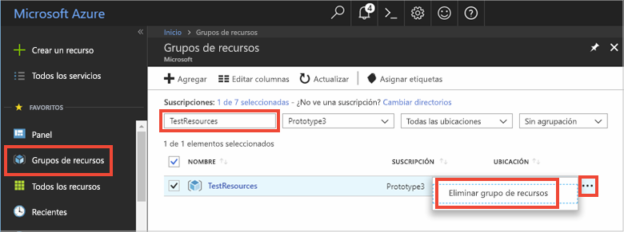

# <a name="quickstart-use-azure-cache-for-redis-with-nodejs"></a>Inicio rápido: Uso de Azure Redis Cache con Node.js

En este inicio rápido incorporará Azure Redis Cache en una aplicación Node.js para acceder a una caché dedicada y segura, a la que se puede acceder desde cualquier aplicación de Azure.

## <a name="prerequisites"></a>Prerrequisitos

- Una suscripción a Azure: [cree una cuenta gratuita](https://azure.microsoft.com/free/)
- [node_redis](https://github.com/mranney/node_redis), que se puede instalar con el comando `npm install redis`. 

Para ver ejemplos del uso de otros clientes de Node.js, consulte la documentación individual de los clientes de Node.js, que encontrará en [clientes Redis de Node.js](https://redis.io/clients#nodejs).

## <a name="create-a-cache"></a>Creación de una caché
[!INCLUDE [redis-cache-create](../../includes/redis-cache-create.md)]

[!INCLUDE [redis-cache-access-keys](../../includes/redis-cache-access-keys.md)]


Agregue variables de entorno para el **nombre de host** y la clave de acceso **Principal**. Utilizará estas variables desde el código en lugar de incluir la información confidencial directamente en el código.

```
set REDISCACHEHOSTNAME=contosoCache.redis.cache.windows.net
set REDISCACHEKEY=XXXXXXXXXXXXXXXXXXXXXXXXXXXXXXXXXXXXXXXXXXXX
```

## <a name="connect-to-the-cache"></a>Conexión a la memoria caché

Las compilaciones más recientes de [node_redis](https://github.com/mranney/node_redis) permiten conectarse a Azure Redis Cache mediante TLS. En el ejemplo siguiente se muestra cómo conectarse a Azure Redis Cache con el punto de conexión TLS de 6380. 

```js
var redis = require("redis");

// Add your cache name and access key.
var client = redis.createClient(6380, process.env.REDISCACHEHOSTNAME,
    {auth_pass: process.env.REDISCACHEKEY, tls: {servername: process.env.REDISCACHEHOSTNAME}});
```

No cree una conexión nueva para cada operación en el código. En su lugar, reutilice las conexiones tanto como sea posible. 

## <a name="create-a-new-nodejs-app"></a>Creación de una nueva aplicación Node.js

Cree un nuevo archivo de script llamado *redistest.js*. Use el comando `npm install redis bluebird` para instalar los paquetes necesarios.

Agregue el siguiente ejemplo de JavaScript en el archivo. Este código muestra cómo conectarse a una instancia de Azure Redis Cache usando las variables de entorno de nombre de host de caché y clave. El código también almacena y recupera un valor de cadena en la memoria caché. También se ejecutan los comandos `PING` y `CLIENT LIST`. Para ver otros ejemplos sobre el uso de Redis con el cliente [node_redis](https://github.com/mranney/node_redis), consulte [https://redis.js.org/](https://redis.js.org/).

```js
var redis = require("redis");
var bluebird = require("bluebird");

// Convert Redis client API to use promises, to make it usable with async/await syntax
bluebird.promisifyAll(redis.RedisClient.prototype);
bluebird.promisifyAll(redis.Multi.prototype);

async function testCache() {

    // Connect to the Azure Cache for Redis over the TLS port using the key.
    var cacheConnection = redis.createClient(6380, process.env.REDISCACHEHOSTNAME, 
        {auth_pass: process.env.REDISCACHEKEY, tls: {servername: process.env.REDISCACHEHOSTNAME}});
        
    // Perform cache operations using the cache connection object...

    // Simple PING command
    console.log("\nCache command: PING");
    console.log("Cache response : " + await cacheConnection.pingAsync());

    // Simple get and put of integral data types into the cache
    console.log("\nCache command: GET Message");
    console.log("Cache response : " + await cacheConnection.getAsync("Message"));    

    console.log("\nCache command: SET Message");
    console.log("Cache response : " + await cacheConnection.setAsync("Message",
        "Hello! The cache is working from Node.js!"));    

    // Demonstrate "SET Message" executed as expected...
    console.log("\nCache command: GET Message");
    console.log("Cache response : " + await cacheConnection.getAsync("Message"));    

    // Get the client list, useful to see if connection list is growing...
    console.log("\nCache command: CLIENT LIST");
    console.log("Cache response : " + await cacheConnection.clientAsync("LIST"));    
}

testCache();
```

Ejecute el script con Node.js.

```
node redistest.js
```

En el ejemplo siguiente, puede ver que la clave `Message` tenía anteriormente un valor almacenado en caché, que se estableció mediante la Consola de Redis en Azure Portal. La aplicación actualizó ese valor almacenado en caché. La aplicación también ejecutó los comandos `PING` y `CLIENT LIST`.


## <a name="clean-up-resources"></a>Limpieza de recursos

Si va a seguir con el tutorial siguiente, puede mantener los recursos creados en esta guía de inicio rápido y volverlos a utilizar.

En caso contrario, si ya ha terminado con la aplicación de ejemplo de la guía de inicio rápido, puede eliminar los recursos de Azure creados en este tutorial para evitar cargos. 

> [!IMPORTANT]
> La eliminación de un grupo de recursos es irreversible y el grupo de recursos y todos los recursos que contiene se eliminarán de forma permanente. Asegúrese de no eliminar por accidente el grupo de recursos o los recursos equivocados. Si ha creado los recursos para hospedar este ejemplo dentro de un grupo de recursos existente que contiene recursos que desea mantener, puede eliminar cada recurso individualmente de sus hojas respectivas, en lugar de eliminar el grupo de recursos.
>

Inicie sesión en [Azure Portal](https://portal.azure.com) y después seleccione **Grupos de recursos**.

En el cuadro de texto **Filtrar por nombre**, escriba el nombre del grupo de recursos. En las instrucciones de este artículo se usa un grupo de recursos llamado *TestResources*. En el grupo de recursos de la lista de resultados, seleccione **...** y, después, **Eliminar grupo de recursos**.



Se le pedirá que confirme la eliminación del grupo de recursos. Escriba el nombre del grupo de recursos para confirmar y seleccione **Eliminar**.

Transcurridos unos instantes, el grupo de recursos y todos los recursos que contiene se eliminan.

## <a name="next-steps"></a>Pasos siguientes

En este inicio rápido, ha aprendido a usar Azure Redis Cache desde una aplicación Node.js. Continúe con el siguiente inicio rápido para usar Azure Redis Cache con una aplicación web ASP.NET.

> [!div class="nextstepaction"]
> [Creación de una aplicación web ASP.NET que usa Azure Redis Cache.](./cache-web-app-howto.md)
