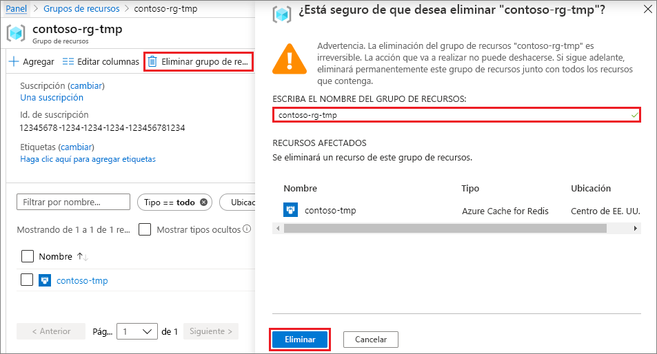

# <a name="quickstart-create-a-python-app-that-uses-azure-cache-for-redis"></a>Inicio rápido: Creación de una aplicación de Python que use Azure Cache for Redis

En este artículo incorporará Azure Cache for Redis en una aplicación de Python para acceder a una caché dedicada y segura, a la que se puede acceder desde cualquier aplicación de Azure.

## <a name="prerequisites"></a>Prerrequisitos

- Una suscripción a Azure: [cree una cuenta gratuita](https://azure.microsoft.com/free/)
- [Python 2 o 3](https://www.python.org/downloads/)

## <a name="create-an-azure-cache-for-redis-instance"></a>Creación de una instancia de Azure Redis Cache
[!INCLUDE [redis-cache-create](../../includes/redis-cache-create.md)]

[!INCLUDE [redis-cache-create](../../includes/redis-cache-access-keys.md)]

## <a name="install-redis-py"></a>Instalación de redis-py

[Redis-py](https://github.com/andymccurdy/redis-py) es una interfaz de Python para Azure Redis Cache. Use la herramienta de paquetes de Python, *pip*, para instalar el paquete *redis-py* desde un símbolo del sistema. 

En el ejemplo siguiente se usa *pip3* para Python 3 para instalar *redis-py* en Windows 10 desde un símbolo del sistema de administrador.


## <a name="read-and-write-to-the-cache"></a>Lectura y escritura en la memoria caché

Ejecute Python desde la línea de comandos y pruebe la memoria caché mediante el código siguiente. Reemplace `<Your Host Name>` y `<Your Access Key>` con los valores de su instancia de Azure Cache for Redis. El nombre de host tiene el formato *\<nombre DNS>.redis.cache.windows.net*.

```python
>>> import redis
>>> r = redis.StrictRedis(host='<Your Host Name>',
        port=6380, db=0, password='<Your Access Key>', ssl=True)
>>> r.set('foo', 'bar')
True
>>> r.get('foo')
b'bar'
```

> [!IMPORTANT]
> En Azure Cache for Redis, versión 3.0 o posterior, se aplica la comprobación del certificado TLS/SSL. ssl_ca_certs debe establecerse explícitamente al conectar con Azure Cache for Redis. En el caso de RedHat Linux, ssl_ca_certs puede encontrarse en el módulo de certificado */etc/pki/tls/certs/ca-bundle.crt*.

## <a name="create-a-python-sample-app"></a>Creación de una aplicación de Python de ejemplo

Cree un nuevo archivo de texto, agregue el siguiente script y guarde el archivo como *PythonApplication1.py*. Reemplace `<Your Host Name>` y `<Your Access Key>` con los valores de su instancia de Azure Cache for Redis. El nombre de host tiene el formato *\<nombre DNS>.redis.cache.windows.net*.

```python
import redis

myHostname = "<Your Host Name>"
myPassword = "<Your Access Key>"

r = redis.StrictRedis(host=myHostname, port=6380,
                      password=myPassword, ssl=True)

result = r.ping()
print("Ping returned : " + str(result))

result = r.set("Message", "Hello!, The cache is working with Python!")
print("SET Message returned : " + str(result))

result = r.get("Message")
print("GET Message returned : " + result.decode("utf-8"))

result = r.client_list()
print("CLIENT LIST returned : ")
for c in result:
    print("id : " + c['id'] + ", addr : " + c['addr'])
```

Ejecute *PythonApplication1.py* con Python. Debería ver resultados parecidos a este ejemplo:


## <a name="clean-up-resources"></a>Limpieza de recursos

Si ya ha terminado con el grupo de recursos y los recursos de Azure que creó en esta guía de inicio rápido, puede eliminarlos para evitar cargos.

> [!IMPORTANT]
> La eliminación de un grupo de recursos es irreversible, y el grupo de recursos y todos los recursos que contiene se eliminarán de forma permanente. Si ha creado la instancia de Azure Cache for Redis en un grupo de recursos existente que desea conservar, puede eliminar solo la memoria caché si selecciona **Eliminar** en la página **Introducción** de la memoria caché. 

Para eliminar el grupo de recursos y su instancia de Azure Cache for Redis:

1. En [Azure Portal](https://portal.azure.com), busque y seleccione **Grupos de recursos**.
1. En el cuadro de texto **Filtrar por nombre**, escriba el nombre del grupo de recursos que contiene la instancia de caché y, a continuación, selecciónela en los resultados de la búsqueda. 
1. En la página del grupo de recursos, seleccione **Eliminar grupo de recursos**.
1. Escriba el nombre del grupo de recursos y, a continuación, seleccione **Eliminar**.
   
   

## <a name="next-steps"></a>Pasos siguientes

> [!div class="nextstepaction"]
> [Creación de una aplicación web ASP.NET sencilla que use Azure Redis Cache.](./cache-web-app-howto.md)

