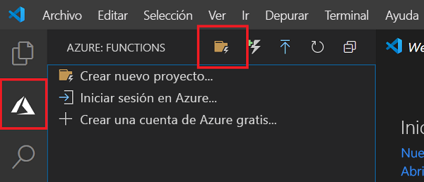

# Inicio rápido: Creación de una función de Java con Visual Studio Code

[!INCLUDE [functions-language-selector-quickstart-vs-code](../../includes/functions-language-selector-quickstart-vs-code.md)]

En este artículo se usa Visual Studio Code para crear una función de Java que responda a solicitudes HTTP. Después de probar el código localmente, se implementa en el entorno sin servidor de Azure Functions.

Este inicio rápido supone un pequeño costo en su cuenta de Azure.

> [!NOTE]
> Si Visual Studio Code no es su herramienta de desarrollo preferida, consulte nuestros tutoriales análogos para desarrolladores de Java con [Maven](create-first-function-cli-java.md), [Gradle](./functions-create-first-java-gradle.md) e [IntelliJ IDEA](/azure/developer/java/toolkit-for-intellij/quickstart-functions).

## Configurar su entorno

Antes de empezar, asegúrese de que cumple los siguientes requisitos:

+ Una cuenta de Azure con una suscripción activa. [Cree una cuenta gratuita](https://azure.microsoft.com/free/?ref=microsoft.com&utm_source=microsoft.com&utm_medium=docs&utm_campaign=visualstudio).

+ [Kit para desarrolladores de Java](/azure/developer/java/fundamentals/java-jdk-long-term-support), versión 8 u 11.

+ [Apache Maven](https://maven.apache.org), versión 3.0 o posterior.

+ [Visual Studio Code](https://code.visualstudio.com/) en una de las [plataformas admitidas](https://code.visualstudio.com/docs/supporting/requirements#_platforms).

+ [Paquete de la extensión de Java](https://marketplace.visualstudio.com/items?itemName=vscjava.vscode-java-pack)  

+ La [extensión de Azure Functions](https://marketplace.visualstudio.com/items?itemName=ms-azuretools.vscode-azurefunctions) para Visual Studio Code. 

## Creación del proyecto local

En esta sección se usa Visual Studio Code para crear un proyecto local de Azure Functions en Java. Más adelante en este artículo, publicará el código de función en Azure. 

1. Seleccione el icono de Azure en la barra de actividades y después en el área **Azure: Functions**, seleccione el icono **Crear un proyecto**.

    

1. Elija una ubicación de directorio para el área de trabajo del proyecto y elija **Seleccionar**.

    > [!NOTE]
    > Estos pasos se han diseñado para completarse fuera de un área de trabajo. Por tanto, no seleccione una carpeta de proyecto que forme parte de un área de trabajo.

1. Escriba la siguiente información cuando se le indique:

    + **Seleccione un lenguaje para el proyecto de funciones**: Elija `Java`.

    + **Seleccione una versión de Java**: Elija `Java 8` o `Java 11`, la versión de Java en la que se ejecutan las funciones en Azure. Elija una versión de Java que haya comprobado localmente.

    + **Proporcione un identificador de grupo**: Elija `com.function`.

    + **Proporcione un identificador de artefacto**: Elija `myFunction`.

    + **Proporcione una versión**: Elija `1.0-SNAPSHOT`.

    + **Proporcione un nombre de paquete**: Elija `com.function`.

    + **Proporcione un nombre de aplicación**: Elija `myFunction-12345`.

    + **Nivel de autorización**: Elija `Anonymous`, que permite que cualquier llame al punto de conexión de la función. Para obtener información sobre el nivel de autorización, consulte [Claves de autorización](functions-bindings-http-webhook-trigger.md#authorization-keys).

    + **Seleccione cómo desea que se abra el proyecto**: Elija `Add to workspace`.

1. Con esta información, Visual Studio Code genera un proyecto de Azure Functions con un desencadenador HTTP. Los archivos del proyecto locales se pueden ver en Explorer. Para obtener más información sobre los archivos que se crean, consulte [Archivos del proyecto generados](functions-develop-vs-code.md#generated-project-files). 

[!INCLUDE [functions-run-function-test-local-vs-code](../../includes/functions-run-function-test-local-vs-code.md)]

Después de comprobar que la función se ejecuta correctamente en el equipo local, es el momento de usar Visual Studio Code para publicar el proyecto directamente en Azure.

[!INCLUDE [functions-sign-in-vs-code](../../includes/functions-sign-in-vs-code.md)]

[!INCLUDE [functions-publish-project-vscode](../../includes/functions-publish-project-vscode.md)]

[!INCLUDE [functions-vs-code-run-remote](../../includes/functions-vs-code-run-remote.md)]

[!INCLUDE [functions-cleanup-resources-vs-code.md](../../includes/functions-cleanup-resources-vs-code.md)]

## Pasos siguientes

Ha usado Visual Studio Code para crear una aplicación de función con una función simple desencadenada por HTTP. En el siguiente artículo, esa función se expande mediante la adición de un enlace de salida. Este enlace escribe la cadena de la solicitud HTTP en un mensaje en una cola de Azure Queue Storage. 

> [!div class="nextstepaction"]
> [Conexión a una cola de Azure Storage](functions-add-output-binding-storage-queue-vs-code.md?pivots=programming-language-java)

[Azure Functions Core Tools]: functions-run-local.md
[Azure Functions extension for Visual Studio Code]: https://marketplace.visualstudio.com/items?itemName=ms-azuretools.vscode-azurefunctions
