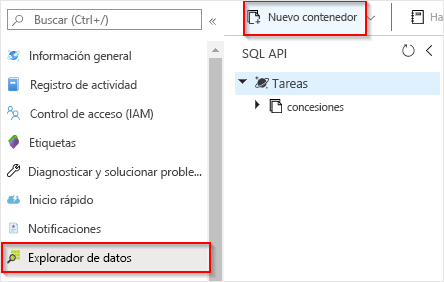
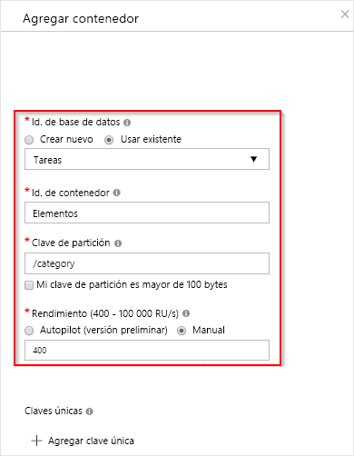

# Creación de una función desencadenada por Azure Cosmos DB

Aprenda a crear una función que se desencadena cuando se agregan o se cambian datos en Azure Cosmos DB. Para más información acerca de Azure Cosmos DB, consulte [Azure Cosmos DB: Informática de base de datos sin servidor con Azure Cosmos DB y Azure Functions](../cosmos-db/serverless-computing-database.md).

:::image type="content" source="./media/functions-create-cosmos-db-triggered-function/quickstart-completed.png" alt-text="Código de Azure Cosmos DB":::

## Requisitos previos

Para completar este tutorial:

+ Si no tiene una suscripción a Azure, cree una [cuenta gratuita](https://azure.microsoft.com/free/?WT.mc_id=A261C142F) antes de empezar.

> [!NOTE]
> [!INCLUDE [SQL API support only](../../includes/functions-cosmosdb-sqlapi-note.md)]

## Inicio de sesión en Azure
Inicie sesión en [Azure Portal](https://portal.azure.com/) con su cuenta de Azure.

## Creación de una cuenta de Azure Cosmos DB

Debe tener una cuenta de Azure Cosmos DB que use la API de SQL para poder crear el desencadenador.

[!INCLUDE [cosmos-db-create-dbaccount](../../includes/cosmos-db-create-dbaccount.md)]

## Creación de una Function App de Azure

[!INCLUDE [Create function app Azure portal](../../includes/functions-create-function-app-portal.md)]

Después, cree una función en la nueva Function App.

## Creación de un desencadenador de Azure Cosmos DB

1. En la aplicación de funciones, seleccione **Funciones** en el menú de la izquierda y, a continuación, seleccione **Agregar** en el menú superior. 

1. En la página **Nueva función**, escriba `cosmos` en el campo de búsqueda y, después, elija la plantilla **Desencadenador de Azure Cosmos DB**.

   :::image type="content" source="./media/functions-create-cosmos-db-triggered-function/function-choose-cosmos.png" alt-text="Página Funciones en Azure Portal":::

1. Configure el nuevo desencadenador según la configuración especificada en la tabla siguiente:

    | Configuración      | Valor sugerido  | Descripción                                |
    | ------------ | ---------------- | ------------------------------------------ |
    | **Nueva función** | Aceptar el nombre predeterminado | El nombre de la función. |
    | **Conexión de la cuenta de Cosmos DB** | Aceptar el nuevo nombre predeterminado | Seleccione **Nuevo**, a continuación, la **cuenta de la base de datos** que creó anteriormente y, después, **Aceptar**. Con esta acción se crea una configuración de la aplicación para la conexión de la cuenta. Esta configuración la usa el enlace para establecer la conexión a la base de datos. |
    | **Nombre de la base de datos** | Tareas | Nombre de la base de datos que incluye la colección que se va a supervisar. |
    | **Nombre de colección** | Elementos | Nombre de la colección que se va a supervisar. |
    | **Nombre de la colección de concesiones** | concesiones | Nombre de la colección para almacenar las concesiones. |
    | **Crear colección de concesiones si no existe** | Sí | Comprueba si existe la colección de concesiones y la crea automáticamente. |

    :::image type="content" source="./media/functions-create-cosmos-db-triggered-function/functions-cosmosdb-trigger-settings.png" alt-text="Creación de la función de desencadenador de Azure Cosmos DB":::

1. Seleccione **Crear función**. 

    Azure crea la función de desencadenador de Cosmos DB.

1. Para mostrar el código de función basado en plantilla, seleccione **Código y prueba**.

    :::image type="content" source="./media/functions-create-cosmos-db-triggered-function/function-cosmosdb-template.png" alt-text="Plantilla de función de Cosmos DB en C#":::

    Esta plantilla de función escribe el número de documentos y el identificador del primer documento en los registros.

A continuación, se conectará a la cuenta de Azure Cosmos DB y creará el contenedor `Items` en la base de datos `Tasks`.

## Creación del contenedor de elementos

1. Abra una segunda instancia de [Azure Portal](https://portal.azure.com) en una nueva pestaña del explorador.

1. En el lado izquierdo del portal, expanda la barra de iconos, escriba `cosmos` en el campo de búsqueda y seleccione **Azure Cosmos DB**.

    

1. Elija la cuenta de Azure Cosmos DB y luego seleccione el **Explorador de datos**. 

1. En **SQL API**, elija la base de datos **Tasks** y seleccione **Nuevo contenedor**.

    

1. En **Agregar contenedor**, use la configuración que se muestra en la tabla situada debajo de la imagen. 

    

    | Configuración|Valor sugerido|Descripción |
    | ---|---|--- |
    | **Identificador de base de datos** | Tareas |Nombre de la nueva base de datos. Debe coincidir con el nombre definido en el enlace de función. |
    | **ID de contenedor** | Elementos | El nombre del nuevo contenedor. Debe coincidir con el nombre definido en el enlace de función.  |
    | **[Clave de partición](../cosmos-db/partition-data.md)** | /categoría|Una clave de partición que distribuye los datos uniformemente a cada partición. La selección de la clave de partición correcta es importante al crear un contenedor con rendimiento. | 
    | **Rendimiento** |400 RU| Use el valor predeterminado. Si quiere reducir la latencia, puede escalar verticalmente el rendimiento más adelante. |    

1. Haga clic en **Aceptar** para crear el contenedor Items. Puede que el contenedor tarde un poco en crearse.

Una vez que el contenedor especificado en el enlace de función existe, puede probar la función mediante la adición de elementos a este nuevo contenedor.

## Prueba de la función

1. Expanda el nuevo contenedor **Items** en Data Explorer, elija **Elementos** y, a continuación, seleccione **Nuevo elemento**.

    :::image type="content" source="./media/functions-create-cosmos-db-triggered-function/create-item-in-container.png" alt-text="Creación de un elemento en el contenedor Items":::

1. Reemplace el contenido del nuevo elemento por el siguiente contenido, y luego elija **Guardar**.

        {
            "id": "task1",
            "category": "general",
            "description": "some task"
        }

1. Cambie a la primera pestaña del explorador que contiene la función del portal. Expanda los registros de función y compruebe que el nuevo documento ha desencadenado la función. Compruebe que el valor de identificador de documento `task1` se escribe en los registros. 

    

1. (Opcional) Vuelva a su documento, realice un cambio y haga clic en **Actualizar**. A continuación, vuelva a los registros de función y compruebe que la actualización también ha desencadenado la función.

## Limpieza de recursos

[!INCLUDE [Next steps note](../../includes/functions-quickstart-cleanup.md)]

## Pasos siguientes

Ha creado una función que se ejecuta cuando se agrega o modifica un documento en su instancia de Azure Cosmos DB. Para más información sobre los desencadenadores de Azure Cosmos DB, consulte [Enlaces de Azure Cosmos DB para Azure Functions](functions-bindings-cosmosdb.md).

[!INCLUDE [Next steps note](../../includes/functions-quickstart-next-steps.md)]
