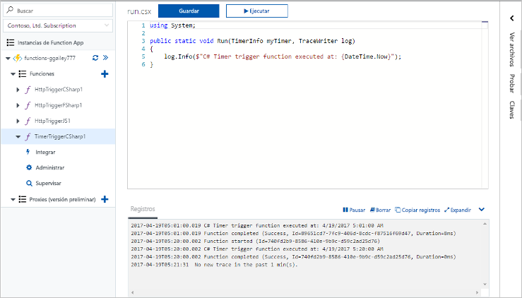
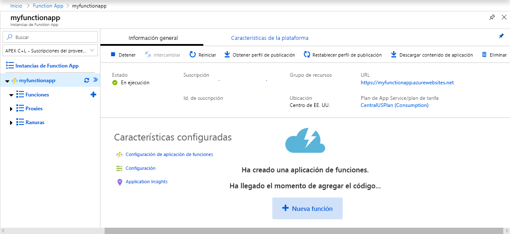
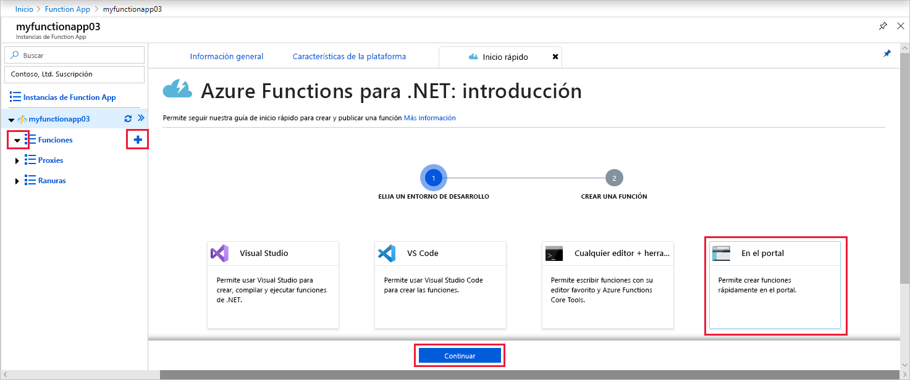
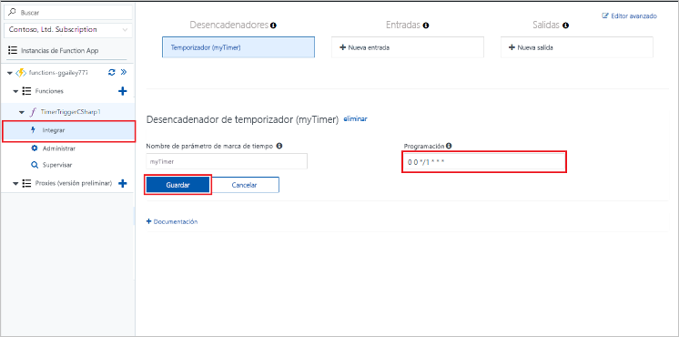

# Cree una función en Azure que se desencadena mediante un temporizador

Aprenda a usar Azure Functions para crear una función [sin servidor](https://azure.microsoft.com/solutions/serverless/) que se ejecute según la programación que se defina.

## Prerequisites

Para completar este tutorial:

+ Si no tiene una suscripción a Azure, cree una [cuenta gratuita](https://azure.microsoft.com/free/?WT.mc_id=A261C142F) antes de empezar.

## Creación de una Function App de Azure

[!INCLUDE [Create function app Azure portal](../../includes/functions-create-function-app-portal.md)]

Después, cree una función en la nueva Function App.

## Creación de una función desencadenada por un temporizador

1. Expanda su instancia de Function App y haga clic en el botón **+** , que se encuentra junto a **Functions**. Si se trata de la primera función de Function App, seleccione **En el portal** y, después, **Continuar**. En caso contrario, vaya al paso 3.

   

2. Elija **Más plantillas** y, a continuación, **Finish and view templates** (Finalizar y ver plantillas).

    

3. En el campo de búsqueda, escriba `timer` y configure el nuevo desencadenador según la configuración especificada en la tabla que aparece debajo de la imagen.

    

    | Configuración | Valor sugerido | Descripción |
    |---|---|---|
    | **Nombre** | Valor predeterminado | Define el nombre de la función desencadenada por el temporizador. |
    | **Programación** | 0 \*/1 \* \* \* \* | [Expresión CRON](functions-bindings-timer.md#ncrontab-expressions) de seis campos que programa la función para que se ejecute cada minuto. |

4. Haga clic en **Crear**. Se crea una función en el lenguaje elegido que se ejecuta cada minuto.

5. Vea la información de seguimiento que se escribe en los registros para comprobar la ejecución.

    

Ahora puede cambiar la programación de la función para que se ejecute una vez cada hora, en lugar de cada minuto.

## Actualizar la programación del temporizador

1. Expanda la función y haga clic en **Integrar**. Aquí es donde se definen los enlaces de entrada y salida de la función y se establece la programación. 

2. Escriba el nuevo valor de **Programación**`0 0 */1 * * *` y, después, haga clic en **Guardar**.  

Ahora tiene una función que se ejecuta una vez cada hora.

## Limpieza de recursos

[!INCLUDE [Next steps note](../../includes/functions-quickstart-cleanup.md)]

## Pasos siguientes

Ha creado una función que se ejecuta según una programación. Para más información sobre los desencadenadores del temporizador, consulte [Programación de la ejecución de código con Azure Functions](functions-bindings-timer.md).

[!INCLUDE [Next steps note](../../includes/functions-quickstart-next-steps.md)]
