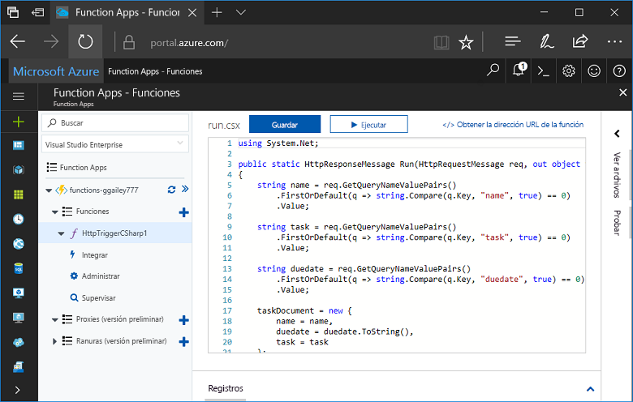
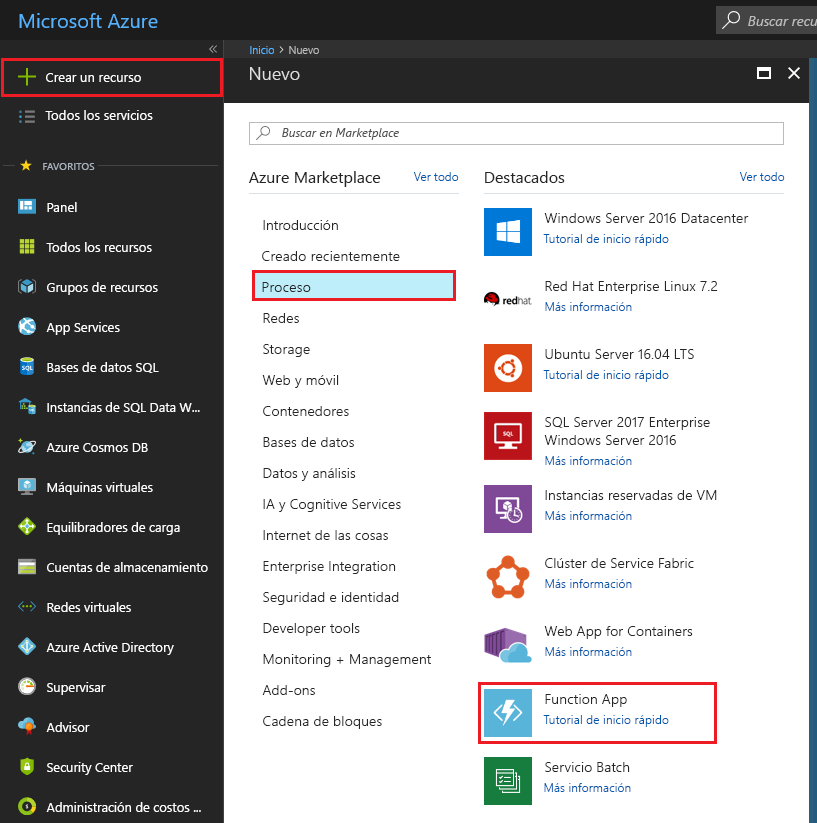
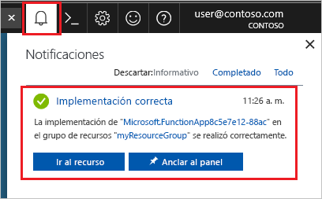
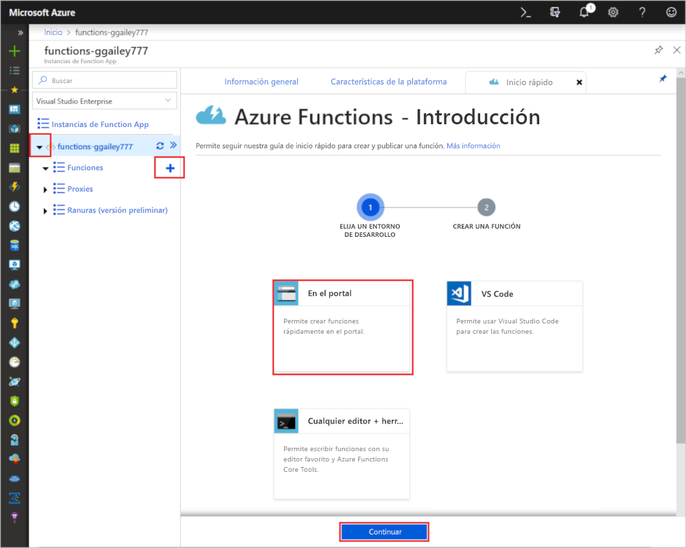
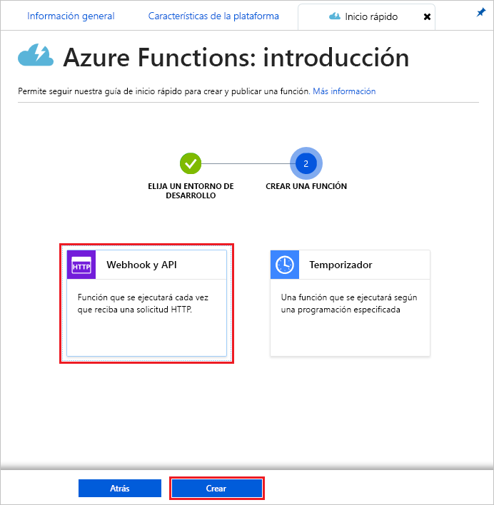
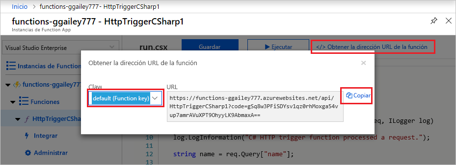

# Creación de una función con Microsoft Azure for Students Starter

En este tutorial, vamos a crear una función HTTP de Hola mundo en una suscripción a Microsoft Azure for Students Starter. También se ofrecerá información sobre qué se encuentra disponible en Azure Functions con este tipo de suscripción.

Microsoft *Azure for Students Starter* le inicia en el uso de los productos de Azure que necesita para desarrollar soluciones en la nube sin costo alguno. [Obtenga más información aquí sobre esta oferta](https://azure.microsoft.com/offers/ms-azr-0144p/).

Azure Functions permite ejecutar el código en un entorno [sin servidor](https://azure.microsoft.com/solutions/serverless/) sin necesidad de crear una máquina virtual o publicar una aplicación web. [Obtenga más información aquí sobre Azure Functions](./functions-overview.md).

## Creación de una función

 En este tema, obtendrá información sobre cómo usar Functions para crear una función "Hola mundo" desencadenada por HTTP en Azure Portal.

## Inicio de sesión en Azure

Inicie sesión en Azure Portal en <https://portal.azure.com> con su cuenta de Azure.

## Creación de una aplicación de función

Debe tener una Function App para hospedar la ejecución de las funciones. Una Function App permite agrupar funciones como una unidad lógica para facilitar la administración, la implementación y el uso compartido de recursos. 

1. Seleccione el botón **Nuevo** de la esquina superior izquierda de Azure Portal y, después, **Proceso** > **Function App**.

    

2. Use la configuración de Function App especificada en la tabla debajo de la imagen.

    

    | Configuración      | Valor sugerido  | DESCRIPCIÓN                                        |
    | ------------ |  ------- | -------------------------------------------------- |
    | **Nombre de la aplicación** | Nombre único globalmente | Nombre que identifica la nueva Function App. Los caracteres válidos son `a-z`, `0-9` y `-`.  | 
    | **Suscripción** | Su suscripción | Suscripción en la que se creará esta nueva aplicación de función. | 
    | **[Grupo de recursos](../azure-resource-manager/resource-group-overview.md)** |  myResourceGroup | Nombre para el nuevo grupo de recursos en el que se va a crear la Function App. |
   | **[Plan/ubicación de App Service](./functions-scale.md)** | Nuevo | El plan de hospedaje que controla en qué región se implementa la aplicación de función y la densidad de los recursos. Varias aplicaciones de función implementadas en el mismo plan compartirán la misma instancia gratuita única. Se trata de una restricción del plan Student Starter. Las opciones de hospedaje completas [se explican aquí](./functions-scale.md).|
    | **Pila en tiempo de ejecución** | Lenguaje preferido | Elija un tiempo de ejecución que admita su lenguaje de programación de funciones preferido. Elija **.NET** para funciones de C# y F#. |
    |**[Application Insights](./functions-monitoring.md)**| habilitado | Application Insights se usa para almacenar y analizar los registros de la aplicación de función. Está habilitado de forma predeterminada si elige una ubicación compatible con Application Insights. Application Insights pueden habilitarse para cualquier función al elegir manualmente una región cercana para implementar Application Insights. Sin Application Insights, solo podrá ver los registros de streaming en vivo.

3. Seleccione la opción **Plan/ubicación de App Service** anterior para elegir una ubicación diferente.

4. Seleccione **Crear nuevo** y, a continuación, asigne al plan un nombre único.

5. Seleccione la ubicación más cercana a la suya. [Aquí puede consultar un mapa completo de las regiones de Azure](https://azure.microsoft.com/global-infrastructure/regions/). 

    

6. Seleccione **Crear** para aprovisionar e implementar la aplicación de función.

    

7. Seleccione el icono de notificación de la esquina superior derecha del portal y observe el mensaje **Implementación correcta**.

    

8. Seleccione **Ir al recurso** para ver la nueva aplicación de función.

Después, cree una función en la nueva Function App.

## Crear una función desencadenada por HTTP

1. Expanda la nueva aplicación de función, después, seleccione el botón **+** situado junto a **Functions**, elija **En el portal** y seleccione **Continuar**.

    

1. Elija **WebHook y API** y, a continuación, seleccione **Crear**.

    

Se crea una función mediante una plantilla específica del idioma para una función desencadenada por HTTP.

Ahora, puede ejecutar la nueva función mediante el envío de una solicitud HTTP.

## Prueba de la función

1. En la nueva función, haga clic en **</> Obtener la dirección URL de la función** en la parte superior derecha, seleccione **default (Function key)** y, después, haga clic en **Copiar**. 

    

2. Pegue la dirección URL de la función en la barra de direcciones de su explorador. Anexe el valor `&name=<yourname>` de la cadena de consulta al final de esta dirección URL y presione la tecla `Enter` en el teclado para ejecutar la solicitud. Debería ver la respuesta devuelta por la función mostrada en el explorador.  

    El ejemplo siguiente muestra la respuesta en el explorador:

    

    La dirección URL de la solicitud incluye una clave que, de forma predeterminada, es necesaria para tener acceso a la función a través de HTTP.

3. Cuando se ejecuta la función, se escribe información de seguimiento en los registros. Para ver el resultado del seguimiento de la ejecución anterior, vuelva a la función en el portal y haga clic en la flecha que encontrará en la parte inferior de la pantalla para expandir **Registros**.

   

## Limpieza de recursos

[!INCLUDE [Clean-up resources](../../includes/functions-quickstart-cleanup.md)]

## Características admitidas en Microsoft Azure for Students Starter

En Microsoft Azure for Students Starter, puede acceder a la mayoría de las características de Azure Functions en tiempo de ejecución, con varias limitaciones fundamentales que se enumeran a continuación:

* El desencadenador HTTP es el único tipo de desencadenador compatible.
    * Se admiten todos los enlaces de entrada y salida. [Consulte la lista completa aquí](functions-triggers-bindings.md).
* Lenguajes compatibles: 
    * C# (.NET Core 2)
    * JavaScript (Node.js 8 y 10)
    * F# (.NET Core 2)
    * [Consulte los lenguajes admitidos en los planes superiores aquí](supported-languages.md).
* Windows es el único sistema operativo compatible.
* El escalado está restringido a [una instancia de nivel Gratis](https://azure.microsoft.com/pricing/details/app-service/windows/) en ejecución durante un máximo de 60 minutos cada día. Podrá escalar sin servidor de 0 a 1 instancia automáticamente a medida que se recibe el tráfico HTTP, pero ninguna otra.
* Solo es compatible la [versión 2.x en tiempo de ejecución](functions-versions.md).
* Se admiten todas las herramientas de desarrolladores para editar y publicar funciones. Esto incluye VS Code, Visual Studio, la CLI de Azure y Azure Portal. Si desea usar algo distinto del portal, deberá crear primero una aplicación en el portal y, a continuación, elegirla como un destino de implementación en su herramienta preferida.

## Pasos siguientes

Ha creado una aplicación de función con una función simple desencadenada por HTTP. Ahora puede explorar herramientas locales, más lenguajes, supervisión e integraciones.

 * [Creación de la primera función mediante Visual Studio](./functions-create-your-first-function-visual-studio.md)
 * [Creación de la primera función mediante Visual Studio Code](./functions-create-first-function-vs-code.md)
 * [Guía para el desarrollador de JavaScript para Azure Functions](./functions-reference-node.md)
 * [Uso de Azure Functions para conectarse a una base de datos de Azure SQL Database](./functions-scenario-database-table-cleanup.md)
 * [Más información sobre enlaces HTTP en Azure Functions](./functions-bindings-http-webhook.md)
 * [Supervisión de Azure Functions](./functions-monitoring.md)
