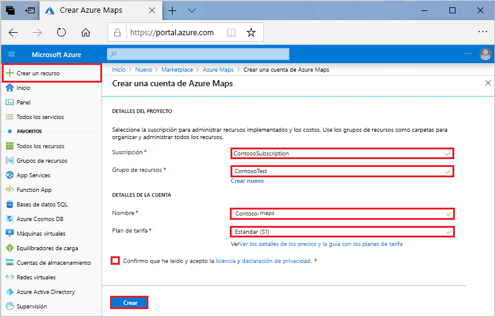
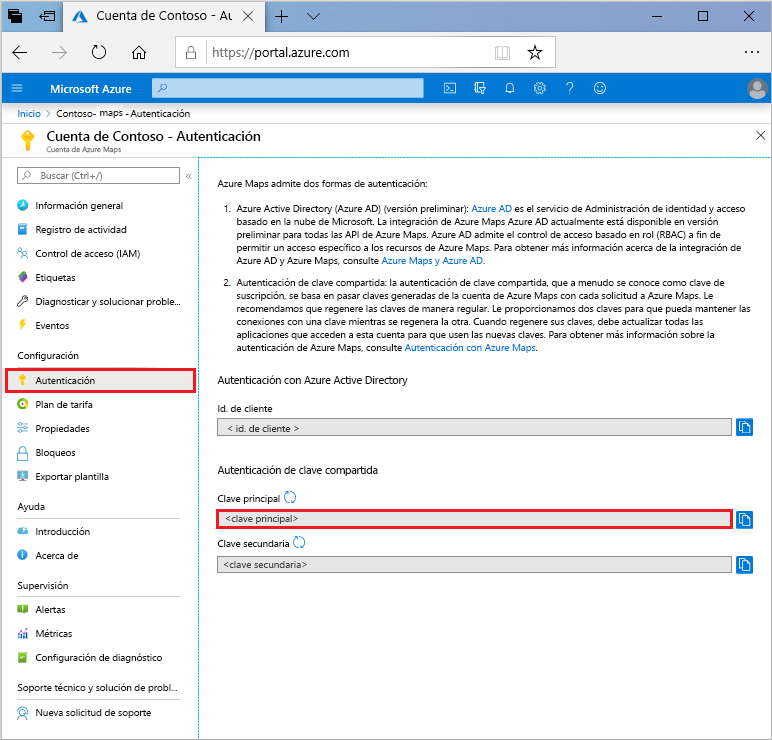

# Inicio rápido: Creación de una búsqueda interactiva de mapas mediante Azure Maps

En este artículo se muestran las funcionalidades de Azure Maps para crear un mapa que dé a los usuarios una experiencia de búsqueda interactiva. Le guía por estos pasos básicos:
* Cree su propia cuenta de Azure Maps.
* Obtenga la clave de cuenta que se usará en la aplicación web de demostración.

Si no tiene una suscripción a Azure, cree una [cuenta gratuita](https://azure.microsoft.com/free/?WT.mc_id=A261C142F) antes de empezar.

## Inicio de sesión en Azure Portal

Inicie sesión en [Azure Portal](https://portal.azure.com).

## Crear una cuenta con Azure Maps

Cree una nueva cuenta de Maps con los pasos siguientes:

1. En la esquina superior izquierda de [Azure Portal](https://portal.azure.com), haga clic en **Crear un recurso**.
2. En el campo *Buscar en el Marketplace*, escriba **Maps**.
3. En *Resultados*, seleccione **Maps**. Haga clic en el botón **Crear** que aparece debajo del mapa.
4. En la página **Create Maps Account** (Crear una cuenta de Azure Maps), escriba los siguientes valores:
    * La *suscripción* que quiere usar para esta cuenta.
    * El nombre del *grupo de recursos* para esta cuenta. Puede elegir *Crear nuevo* o *Usar existente* para el grupo de recursos.
    * El *nombre* de la nueva cuenta.
    * El *Plan de tarifa* de la cuenta.
    * Lea la *licencia* y la *declaración de privacidad* y active la casilla para aceptar los términos.
    * Haga clic en el botón **Crear**.

## Obtención de la clave principal de una cuenta

Una vez que se haya creado correctamente la cuenta de Maps, recupere la clave que le permite consultar las API de Maps. Se recomienda el uso de la clave principal de la cuenta como clave de suscripción al llamar a los servicios Azure Maps.

1. Abra su cuenta de Maps en el portal.
2. En la sección de configuración, seleccione **Autenticación**.
3. Copie la **clave principal** al Portapapeles. Guárdela localmente para usarla más adelante en este tutorial.

## Descarga de la aplicación

1. Descargue o copie el contenido del archivo [interactiveSearch.html](https://github.com/Azure-Samples/AzureMapsCodeSamples/blob/master/AzureMapsCodeSamples/Tutorials/interactiveSearch.html).
2. Guarde el contenido de este archivo localmente como **AzureMapDemo.html**. Ábralo en un editor de texto.
3. Busque la cadena `<Your Azure Maps Key>`. Reemplácela por el valor de **Clave principal** de la sección anterior.

## Abrir la aplicación

1. Abra el archivo **AzureMapDemo.html** en un explorador de su preferencia.
2. Observe el mapa que se muestra de la Ciudad de Los Ángeles. Acerque y aleje para ver de qué manera el mapa se representa automáticamente con más o menos información según el nivel de zoom. 
3. Cambie el centro predeterminado del mapa. En el archivo **AzureMapDemo.html**, busque la variable denominada **center**. Reemplace el par de valores de longitud y latitud de esta variable con los nuevos valores **[-74.0060, 40.7128]** . Guarde el archivo y actualice el explorador.
4. Pruebe la experiencia de búsqueda interactiva. En el cuadro de búsqueda de la esquina superior izquierda de la aplicación web de demostración, busque **restaurants**.
5. Mueva el mouse sobre la lista de direcciones y ubicaciones que aparecen debajo del cuadro de búsqueda. Observe cómo el correspondiente alfiler en el mapa muestra información sobre esa ubicación. Para proteger la privacidad de empresas privadas, se muestran nombres y direcciones ficticios.

    

## Limpieza de recursos

Los tutoriales incluyen detalles sobre cómo usar y configurar Azure Maps con su cuenta. Si tiene pensado seguir con los tutoriales, no elimine los recursos que se crearon con este inicio rápido. Si no tiene pensado continuar, siga estos pasos para eliminar los recursos:

1. Cierre el explorador donde se ejecuta la aplicación web **AzureMapDemo.html**.
2. Seleccione **Todos los recursos** en el menú izquierdo de Azure Portal. A continuación, seleccione la cuenta de Azure Maps. En la parte superior de la hoja **Todos los recursos**, seleccione **Eliminar**.

## Pasos siguientes

En este inicio rápido, creó una cuenta de Azure Maps y una aplicación de demostración. Eche un vistazo a los siguientes tutoriales para obtener información sobre Azure Maps:

> [!div class="nextstepaction"]
> [Búsqueda de puntos cercanos de interés mediante Azure Maps](tutorial-search-location.md)

Para ver más ejemplos de código y obtener una experiencia de codificación interactiva, consulte estas guías:

> [!div class="nextstepaction"]
> [Búsqueda de una dirección mediante el servicio de búsqueda de Azure Maps](how-to-search-for-address.md)

> [!div class="nextstepaction"]
> [Uso del Control de mapa de Azure Maps](how-to-use-map-control.md)
