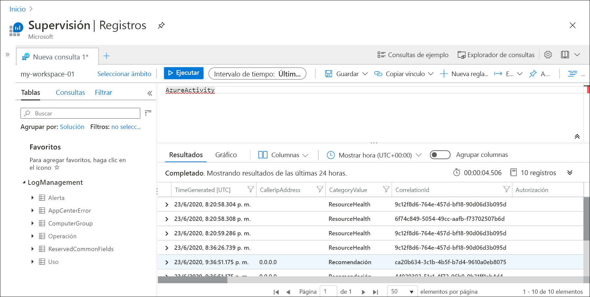
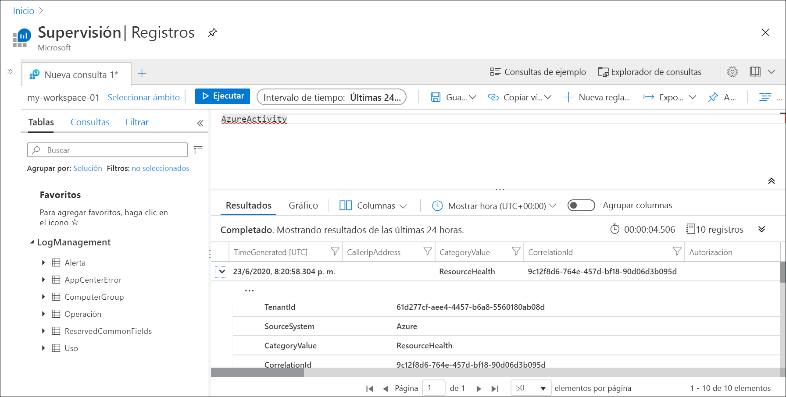
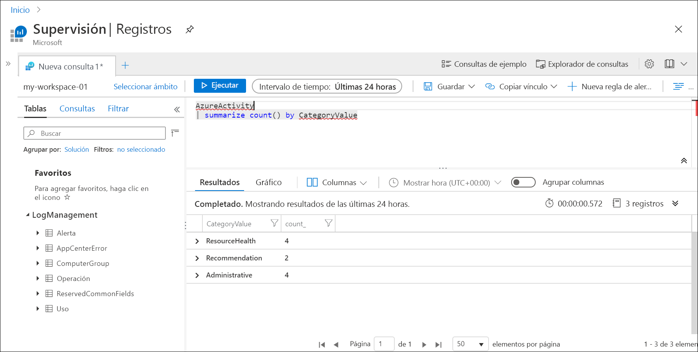

# <a name="quickstart-send-azure-activity-log-to-log-analytics-workspace-using-an-arm-template"></a>Inicio rápido: Envío del registro de actividad de Azure al área de trabajo de Log Analytics mediante una plantilla de Resource Manager

El registro de actividad es un registro de la plataforma de Azure que proporciona información de los eventos en el nivel de suscripción. Este registro incluye información como, por ejemplo, cuándo se modificó un recurso o cuándo se inició una máquina virtual. Puede ver el registro de actividad en Azure Portal o recuperar entradas con PowerShell y la CLI. En este inicio rápido se muestra cómo usar plantillas de Resource Manager para crear un área de trabajo de Log Analytics y una configuración de diagnóstico para enviar el registro de actividad a los registros de Azure Monitor donde podrá analizarlo mediante [consultas de registro](../log-query/log-query-overview.md) y habilitar otras características como [alertas de registro](../platform/alerts-log-query.md) y [libros](../platform/workbooks-overview.md).

[!INCLUDE [About Azure Resource Manager](../../../includes/resource-manager-quickstart-introduction.md)]

## <a name="prerequisites"></a>Requisitos previos

- Si no tiene una suscripción a Azure, cree una [cuenta gratuita](https://azure.microsoft.com/free/?WT.mc_id=A261C142F) antes de empezar.
- Para ejecutar los comandos desde la máquina local, instale la CLI de Azure o los módulos de Azure PowerShell. Para más información, consulte [Instalación de la CLI de Azure](/cli/azure/install-azure-cli) e [Instalar Azure Powershell](/powershell/azure/install-az-ps).

## <a name="create-a-log-analytics-workspace"></a>Creación de un área de trabajo de Log Analytics

### <a name="review-the-template"></a>Revisión de la plantilla

La siguiente plantilla permite crear una área de trabajo de Log Analytics vacía. Guarde esta plantilla como *CreateWorkspace.json*.

```json
{
  "$schema": "https://schema.management.azure.com/schemas/2019-04-01/deploymentTemplate.json#",
  "contentVersion": "1.0.0.0",
  "parameters": {
    "workspaceName": {
      "type": "string",
        "metadata": {
          "description": "Name of the workspace."
        }
    },
    "sku": {
      "type": "string",
      "allowedValues": [
        "pergb2018",
        "Free",
        "Standalone",
        "PerNode",
        "Standard",
        "Premium"
      ],
      "defaultValue": "pergb2018",
      "metadata": {
        "description": "Pricing tier: PerGB2018 or legacy tiers (Free, Standalone, PerNode, Standard or Premium) which are not available to all customers."
      }
    },
    "location": {
      "type": "string",
      "allowedValues": [
        "australiacentral",
        "australiaeast",
        "australiasoutheast",
        "brazilsouth",
        "canadacentral",
        "centralindia",
        "centralus",
        "eastasia",
        "eastus",
        "eastus2",
        "francecentral",
        "japaneast",
        "koreacentral",
        "northcentralus",
        "northeurope",
        "southafricanorth",
        "southcentralus",
        "southeastasia",
        "switzerlandnorth",
        "switzerlandwest",
        "uksouth",
        "ukwest",
        "westcentralus",
        "westeurope",
        "westus",
        "westus2"
      ],
      "metadata": {
        "description": "Specifies the location for the workspace."
      }
    },
    "retentionInDays": {
      "type": "int",
      "defaultValue": 120,
      "metadata": {
        "description": "Number of days to retain data."
      }
    },
    "resourcePermissions": {
      "type": "bool",
      "defaultValue": true,
      "metadata": {
        "description": "true to use resource or workspace permissions. false to require workspace permissions."
      }
    }
  },
  "resources": [
    {
      "type": "Microsoft.OperationalInsights/workspaces",
      "apiVersion": "2020-03-01-preview",
      "name": "[parameters('workspaceName')]",
      "location": "[parameters('location')]",
      "properties": {
        "sku": {
          "name": "[parameters('sku')]"
        },
        "retentionInDays": "[parameters('retentionInDays')]",
        "features": {
          "searchVersion": 1,
          "legacy": 0,
          "enableLogAccessUsingOnlyResourcePermissions": "[parameters('resourcePermissions')]"
        }
      }
    }
  ]
}
```

Esta plantilla define un recurso:

- [Microsoft.OperationalInsights/workspaces](/azure/templates/microsoft.operationalinsights/workspaces)

### <a name="deploy-the-template"></a>Implementación de la plantilla

Implemente la plantilla mediante cualquier método estándar de [implementación de una plantilla de Resource Manager](../../azure-resource-manager/templates/deploy-portal.md) como en los ejemplos siguientes con la CLI y PowerShell. Reemplace los valores de ejemplo del **grupo de recursos**, **nombre del área de trabajo** y **ubicación** por los valores adecuados para su entorno. El nombre del área de trabajo debe ser único entre todas las suscripciones de Azure.

# <a name="cli"></a>[CLI](#tab/CLI)

```azurecli
az login
az deployment group create \
    --name CreateWorkspace \
    --resource-group my-resource-group \
    --template-file CreateWorkspace.json \
    --parameters workspaceName='my-workspace-01' location='eastus'

```

# <a name="powershell"></a>[PowerShell](#tab/PowerShell)

```powershell
Connect-AzAccount
Select-AzSubscription -SubscriptionName my-subscription
New-AzResourceGroupDeployment -Name AzureMonitorDeployment -ResourceGroupName my-resource-group -TemplateFile CreateWorkspace.json -workspaceName my-workspace-01 -location eastus
```

---

### <a name="validate-the-deployment"></a>Validación de la implementación

Para comprobar que se ha creado el área de trabajo, utilice uno de los comandos siguientes. Reemplace los valores de ejemplo del **grupo de recursos** y el **nombre del área de trabajo** por los valores que usó anteriormente.

# <a name="cli"></a>[CLI](#tab/CLI)

```azurecli
az monitor log-analytics workspace show --resource-group my-workspace-01 --workspace-name my-resource-group
```

# <a name="powershell"></a>[PowerShell](#tab/PowerShell)

```powershell
Get-AzOperationalInsightsWorkspace -Name my-workspace-01 -ResourceGroupName my-resource-group
```

---

## <a name="create-diagnostic-setting"></a>Creación de la configuración de diagnóstico

### <a name="review-the-template"></a>Revisión de la plantilla

La siguiente plantilla crea una configuración de diagnóstico que envía el registro de actividad a un área de trabajo de Log Analytics. Guarde esta plantilla como *CreateDiagnosticSetting.json*.

```json
{
  "$schema": "https://schema.management.azure.com/schemas/2019-04-01/deploymentTemplate.json#",
  "contentVersion": "1.0.0.0",
  "parameters": {
    "settingName": {
        "type": "String"
    },
    "workspaceId": {
        "type": "String"
    }
  },
  "resources": [
    {
      "type": "Microsoft.Insights/diagnosticSettings",
      "apiVersion": "2017-05-01-preview",
      "name": "[parameters('settingName')]",
      "dependsOn": [],
      "properties": {
        "workspaceId": "[parameters('workspaceId')]",
        "logs": [
          {
          "category": "Administrative",
          "enabled": true
          },
          {
          "category": "Alert",
          "enabled": true
          },
          {
          "category": "Autoscale",
          "enabled": true
          },
          {
          "category": "Policy",
          "enabled": true
          },
          {
          "category": "Recommendation",
          "enabled": true
          },
          {
          "category": "ResourceHealth",
          "enabled": true
          },
          {
          "category": "Security",
          "enabled": true
          },
          {
          "category": "ServiceHealth",
          "enabled": true
          }
        ]
      }
    }
  ]
}
```

Esta plantilla define un recurso:

- [Microsoft.Insights/diagnosticSettings](/azure/templates/microsoft.insights/diagnosticsettings)

### <a name="deploy-the-template"></a>Implementación de la plantilla

Implemente la plantilla mediante cualquier método estándar de [implementación de una plantilla de Resource Manager](../../azure-resource-manager/templates/deploy-portal.md) como en los ejemplos siguientes con la CLI y PowerShell. Reemplace los valores de ejemplo del **grupo de recursos**, **nombre del área de trabajo** y **ubicación** por los valores adecuados para su entorno. El nombre del área de trabajo debe ser único entre todas las suscripciones de Azure.

# <a name="cli"></a>[CLI](#tab/CLI)

```azurecli
az deployment sub create --name CreateDiagnosticSetting --location eastus --template-file CreateDiagnosticSetting.json --parameters settingName='Send Activity log to workspace' workspaceId='/subscriptions/00000000-0000-0000-0000-000000000000/resourcegroups/my-resource-group/providers/microsoft.operationalinsights/workspaces/my-workspace-01'

```

# <a name="powershell"></a>[PowerShell](#tab/PowerShell)

```powershell
New-AzSubscriptionDeployment -Name CreateDiagnosticSetting -location eastus -TemplateFile CreateDiagnosticSetting.json -settingName="Send Activity log to workspace" -workspaceId "/subscriptions/00000000-0000-0000-0000-000000000000/resourcegroups/my-resource-group/providers/microsoft.operationalinsights/workspaces/my-workspace-01"
```
---

### <a name="validate-the-deployment"></a>Validación de la implementación

Para comprobar que se ha creado la configuración de diagnóstico, utilice uno de los comandos siguientes. Reemplace los valores de ejemplo de la suscripción y el nombre de la configuración por los valores que usó anteriormente.

> [!NOTE]
> Actualmente no se puede recuperar la configuración de diagnóstico en el nivel de suscripción mediante PowerShell.

```azurecli
az monitor diagnostic-settings show --resource '/subscriptions/00000000-0000-0000-0000-000000000000' --name 'Send Activity log to workspace'
```

## <a name="generate-log-data"></a>Generación de datos del registro

Solo se enviarán las nuevas entradas del registro de actividad al área de trabajo de Log Analytics, por lo que deberá realizar algunas acciones en la suscripción para que se registren, como iniciar o detener una máquina virtual, o crear o modificar otro recurso. Es posible que tenga que esperar unos minutos para que se cree la configuración de diagnóstico y los datos se escriban inicialmente en el área de trabajo. Después de este retraso, todos los eventos escritos en el registro de actividad se enviarán al área de trabajo en cuestión de segundos.

## <a name="retrieve-data-with-a-log-query"></a>Recuperación de datos con una consulta de registro

Use Azure Portal para que utilice Log Analytics para recuperar datos del área de trabajo. En Azure Portal, busque y seleccione **Monitor**.


Seleccione **Registros** en el menú **Azure Monitor**. Cierre la página **Consultas de ejemplo**. Si el ámbito no está establecido en el área de trabajo que ha creado, haga clic en **Seleccionar ámbito** y búsquelo.


En la ventana de consulta, escriba `AzureActivity` y haga clic en **Ejecutar**. Se trata de una consulta simple que devuelve todos los registros de la tabla *AzureActivity*, que contiene todos los registros enviados desde el registro de actividad.



Expanda uno de los registros para ver sus propiedades detalladas.



Pruebe una consulta más compleja, como `AzureActivity | summarize count() by CategoryValue`, que proporcione un recuento de eventos resumidos por categoría.



## <a name="clean-up-resources"></a>Limpieza de recursos

Si planea seguir trabajando en otros inicios rápidos y tutoriales, considere la posibilidad de dejar estos recursos activos. Cuando ya no lo necesite, elimine el grupo de recursos; de este modo, se eliminarán también la regla de alertas y los recursos relacionados. Para eliminar el grupo de recursos mediante la CLI de Azure o Azure PowerShell

# <a name="cli"></a>[CLI](#tab/CLI)

```azurecli
az group delete --name my-resource-group
```

# <a name="powershell"></a>[PowerShell](#tab/PowerShell)

```powershell
Remove-AzResourceGroup -Name my-resource-group
```

---

## <a name="next-steps"></a>Pasos siguientes

En este inicio rápido, ha configurado el registro de actividad que se va a enviar a un área de trabajo de Log Analytics. Ahora puede configurar el resto de datos que se van a recopilar en el área de trabajo, donde podrá analizarlos juntos mediante [consultas de registro](../log-query/log-query-overview.md) de Azure Monitor y podrá aprovechar características como [alertas de registro](../platform/alerts-log-query.md) y [libros](../platform/workbooks-overview.md). A continuación, debe recopilar [registros de recursos](../platform/resource-logs.md) de los recursos de Azure que complementen los datos del registro de actividad lo cual proporcionará información sobre las operaciones que se realizaron en cada recurso.

> [!div class="nextstepaction"]
> [Recopilación y análisis de registros de recurso con Azure Monitor](tutorial-resource-logs.md)