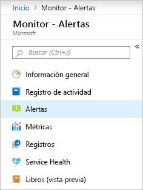
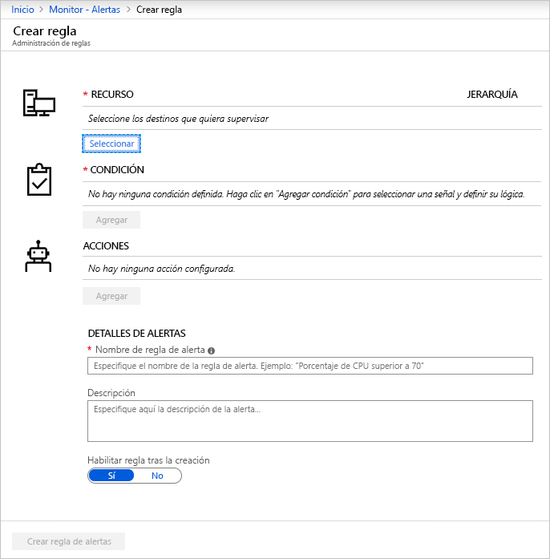
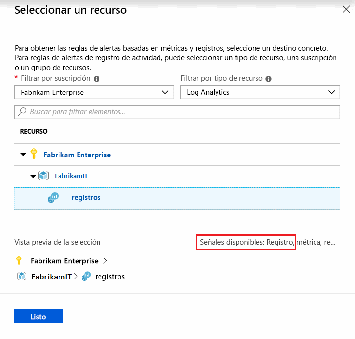
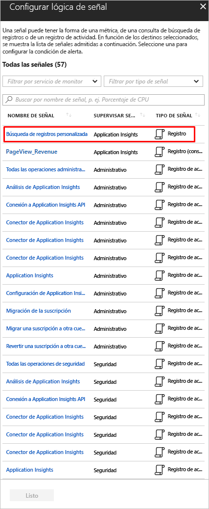
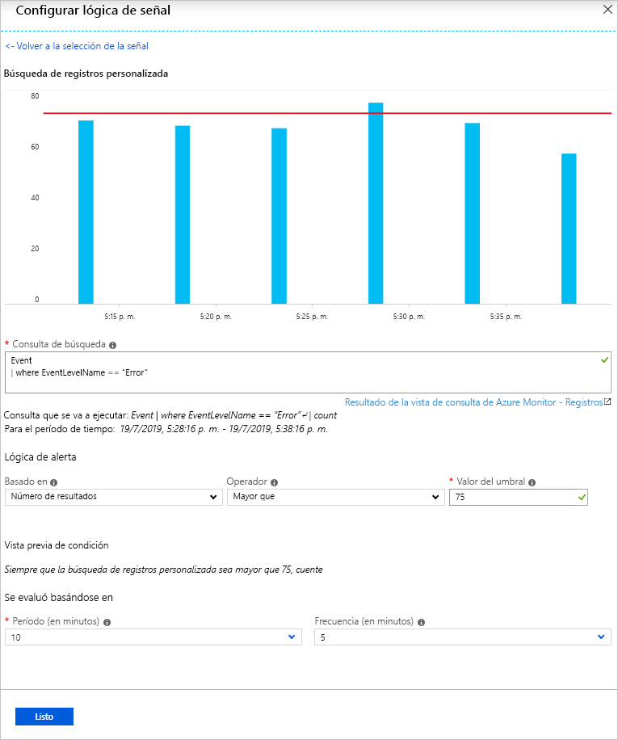
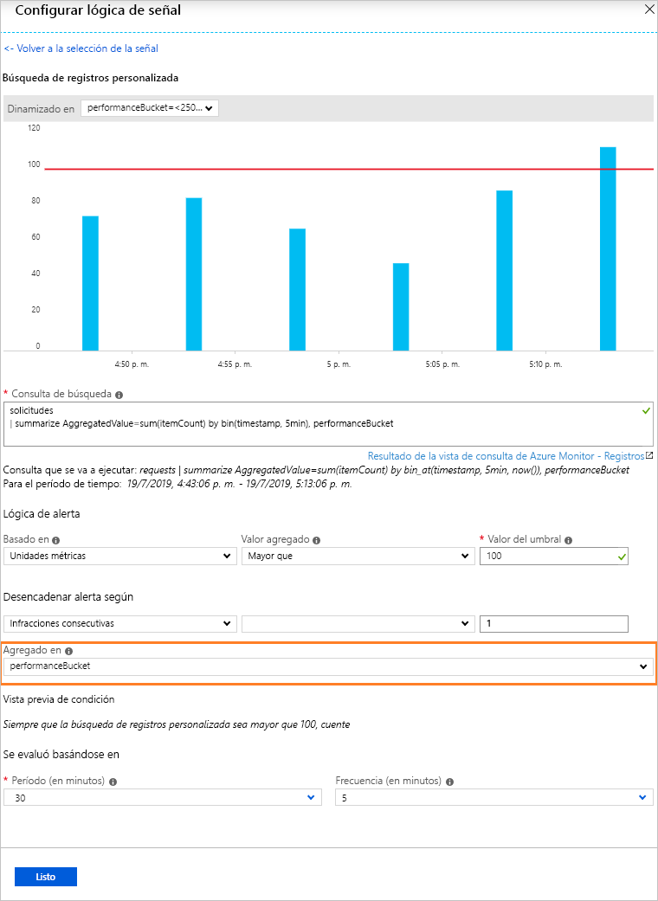
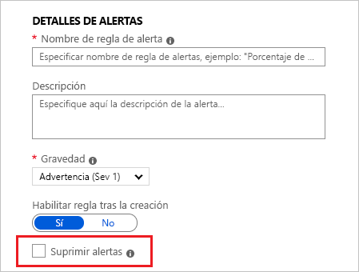
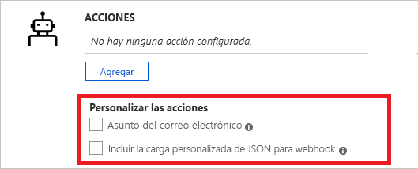
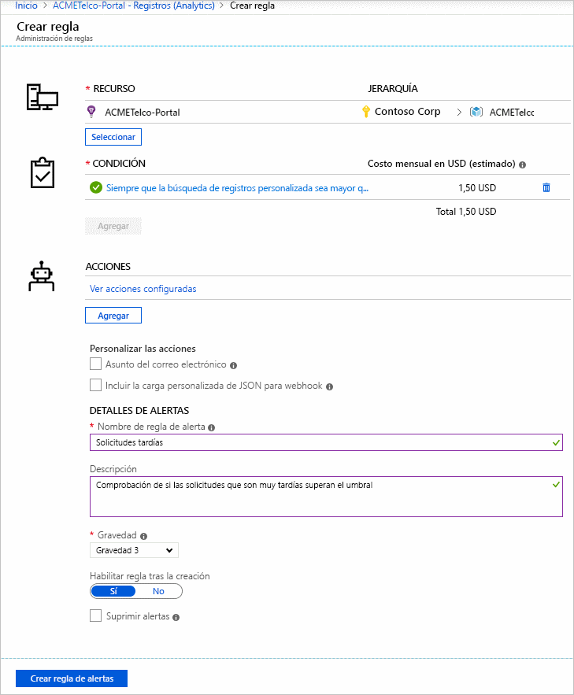

# <a name="create-view-and-manage-log-alerts-using-azure-monitor"></a>Creación, visualización y administración de alertas de registro mediante Azure Monitor

## <a name="overview"></a>Información general
En este artículo se muestra cómo crear y administrar alertas de registro con la interfaz de alertas en Azure Portal. Las reglas de alertas se definen mediante tres componentes:
- Destino: Un recurso de Azure específico para supervisar.
- Criterios: Una condición o lógica que se va a evaluar para determinar si es verdadera. Si es verdadera, la alerta se activa.  
- Acción: llamada específica enviada a un receptor de una notificación (correo electrónico, SMS, webhook, etc.).

El término **alerta de registro** describe las alertas en las que se evalúa una consulta de registro en el [área de trabajo de Log Analytics](../learn/tutorial-viewdata.md) o en [Application Insights](../app/analytics.md), y se desencadena una alerta si el resultado es verdadero. Obtenga más información acerca de la funcionalidad, la terminología y los tipos de [Alertas de registro: información general](alerts-unified-log.md).

> [!NOTE]
> Los datos de registro de un [área de trabajo de Log Analytics](../../azure-monitor/learn/tutorial-viewdata.md) también se pueden enrutar a la base de datos de métricas Azure Monitor. Las alertas de métricas tienen [diferentes comportamientos](alerts-metric-overview.md), lo que puede ser más conveniente en función de los datos con los que esté trabajando.   Para saber más sobre cómo se pueden enrutar los registros a las métricas, vea [Alerta de métricas para los registros](alerts-metric-logs.md).

## <a name="create-a-log-alert-rule-with-the-azure-portal"></a>Creación de una regla de alertas de registro en Azure Portal

1. En el [portal](https://portal.azure.com/), seleccione **Monitor**. En esa sección, elija **Alertas**.

    

1. Haga clic en **Nueva regla de alertas**. 

    

1. Aparece el panel **Crear alerta**. Tiene cuatro partes: 
    - el recurso al que se aplica la alerta;
    - la condición que se va a comprobar;
    - acción que se realizará si la condición es verdadera,
    - los detalles para asignar un nombre y una descripción de la alerta. 

    

1. Para definir la condición de la alerta, use primero el vínculo **Seleccionar recurso** y especifique el destino mediante la selección de un recurso. Para filtrar, elija la *Suscripción*, el *Tipo de recurso* y el *Recurso* necesario. 

   

1. Asegúrese de que **Tipo de recurso** es un origen de análisis como *Log Analytics* o *Application Insights* y el tipo de señal es *Registro*. Haga clic en **Done**(Listo). Después, use el botón **Agregar criterios** para ver la lista de opciones de señal disponibles para el recurso. Busque y elija la opción **Custom log search** (Búsqueda de registros personalizada) para *Log Analytics* o *Application Insights*, en función de dónde residan los datos de las alertas de registro.

   

   > [!NOTE]
   > 
   > Las listas de las alertas pueden importar una consulta de análisis como tipo de señal (**Log (Saved Query)** (Registro [consulta guardada])), tal como se muestra en la ilustración anterior. De este modo, los usuarios pueden perfeccionar la consulta en Analytics y guardarla para su uso futuro en las alertas. Para más información sobre el uso de consultas guardadas, vea [uso de consultas de registros en Azure Monitor](../log-query/log-query-overview.md) y [consultas compartidas en Application Insights Analytics](../app/app-insights-overview.md).

1. Una vez seleccionada, cree la consulta de alertas en el campo **Consulta de búsqueda**. Si la sintaxis de la consulta es incorrecta, el campo muestra un error en rojo. 

1. Si la sintaxis de la consulta es correcta, los datos históricos de la consulta aparecen como un gráfico con la opción de cambiar el período de tiempo de las últimas seis horas a la última semana.

    

   La visualización de los datos históricos solo se muestra si los resultados de la consulta tienen detalles temporales. Si la consulta genera datos resumidos o valores de columna específicos, estos se representan en un gráfico singular.
  
   Para las medidas métricas mediante Application Insights o [la API de Log Analytics](https://docs.microsoft.com/rest/api/monitor/scheduledqueryrules), puede especificar por qué variable concreta se agruparán los datos mediante la opción **Agregado en**, tal y como muestra aquí: 
  
   


1. Después, elija la condición, la agregación y el umbral de **Lógica de alerta**. 

1. Elija el período de tiempo durante el que se va a evaluar la condición especificada, mediante la opción **Período**. 

1. Elija la frecuencia con la que se ejecuta la alerta en **Frecuencia**. 

    Las **alertas de registro** se pueden basar en lo siguiente:
    - [Número de registros](../../azure-monitor/platform/alerts-unified-log.md#number-of-results-alert-rules): se crea una alerta si el número de registros devueltos por la consulta es mayor o menor que el valor que proporcione.
    - [Unidades métricas](../../azure-monitor/platform/alerts-unified-log.md#metric-measurement-alert-rules): se crea una alerta si cada *valor agregado* en los resultados excede el valor de umbral proporcionado y se *agrupa por* el valor elegido. El número de infracciones de una alerta es el número de veces que se supera el umbral en el período de tiempo seleccionado. Puede especificar Infracciones totales para cualquier combinación de infracciones en el conjunto de resultados o Infracciones consecutivas para que las infracciones deban tener lugar en muestras consecutivas.


1. Haga clic en **Done**(Listo). 

1. Asigne un nombre a la alerta en el campo **Nombre de la regla de alertas** junto con una **Descripción**, en la que debe proporcionar información específica sobre la alerta, y debe indicar también un valor de **Gravedad** entre las opciones proporcionadas. Estos detalles se reutilizan en todos los correos electrónicos, las notificaciones o las notificaciones push de alerta enviados por Azure Monitor. Además, puede elegir activar inmediatamente la regla de alertas al crearla si hace clic en **Habilitar regla tras la creación**.

1. Elija si quiere **Suprimir alertas** durante un período de tiempo.  Al activar la supresión de la regla de alerta, las acciones de la regla se deshabilitan durante un período de tiempo definido después de crear una nueva alerta. La regla se sigue ejecutando y crea registros de alertas si se cumplen los criterios. Esta opción ofrece tiempo para corregir el problema sin ejecutar acciones duplicadas.

   

    > [!TIP]
    > Especifique un valor de desactivar las alertas mayor que la frecuencia de alertas para garantizar que las notificaciones se detengan sin superposición

1. Como tercer y último paso, especifique si la regla de alerta debe desencadenar un **Grupo de acciones** o varios cuando se cumpla la condición de alerta. Puede elegir cualquier grupo de acciones existente o crear uno nuevo. Con los grupos de acciones, puede enviar una serie de acciones, como por ejemplo, enviar correos electrónicos, enviar SMS, llamar a webhook, corregir mediante Azure Runbooks, realizar una inserción en la herramienta ITSM y mucho más. Obtenga más información sobre los [grupos de acciones](action-groups.md).

    > [!NOTE]
    > Para conocer los límites de las acciones que se pueden realizar, vea [Límites de servicio de suscripción de Azure](../../azure-resource-manager/management/azure-subscription-service-limits.md).  

    Hay disponibles otras funciones para reemplazar las acciones predeterminadas:

    - **Notificación por correo electrónico**: Invalida *asunto de correo electrónico* en el correo electrónico enviado a través del grupo de acciones. No se puede modificar el cuerpo del mensaje de correo y este campo **no** es para la dirección de correo electrónico.
    - **Incluir carga de JSON personalizada**: Invalida el JSON de webhook que usan los grupos de acciones suponiendo que el grupo de acciones contenga un tipo de webhook. Para más información sobre los formatos de webhook, vea [Acciones de webhook para alertas de registro](../../azure-monitor/platform/alerts-log-webhook.md). La opción de vista de webhook se proporciona para comprobar el formato con datos JSON de ejemplo.

        


1. Si todos los campos son válidos y tienen una marca verde, se puede hacer clic en el botón **Crear regla de alertas** y se crea la alerta en Azure Monitor: Alertas. Todas las alertas pueden verse en el panel de las alertas.

     

     En cuestión de minutos, se activa la alerta y se desencadena tal como se describió anteriormente.

Los usuarios también pueden finalizar la consulta de análisis en [Log Analytics](../log-query/portals.md) e insertarla para crear una alerta mediante el botón "Establecer alerta" y, a continuación, seguir las instrucciones del paso 6 en adelante del tutorial anterior.

 

### <a name="view--manage-log-alerts-in-azure-portal"></a>Visualización y administración de las alertas de registro en Azure Portal

1. En [Azure Portal](https://portal.azure.com/), seleccione **Supervisar** y, en la sección SUPERVISAR, elija **Alertas**.

1. Se muestra el **panel de alertas**, de forma que aparecen todas las alertas de Azure (incluidas las alertas de registro) en un único panel, incluidas todas las instancias de cuando se ha activado la regla de la alerta de registro. Para obtener más información, consulte [Alert Management](https://aka.ms/managealertinstances).
    > [!NOTE]
    > Las reglas de la alerta de registro se componen de una lógica personalizada basada en la consulta proporcionada por los usuarios y, por lo tanto, sin un estado resuelto. Debido a esto, cada vez que se cumplen las condiciones especificadas en la regla de la alerta de registro, se activa.

1. Seleccione el botón **Administrar reglas** situado en la barra superior para navegar hasta la sección de administración de reglas, donde se enumeran todas las reglas de alerta creadas, incluidas las alertas que se han deshabilitado.
    

## <a name="managing-log-alerts-using-azure-resource-template"></a>Administración de alertas de registro mediante la plantilla de recursos de Azure

Las alertas del registro de Azure Monitor están asociadas con el tipo de recurso `Microsoft.Insights/scheduledQueryRules/`. Para más información sobre este tipo de recurso, vea [Azure Monitor: referencia de la API de reglas de consulta programada](https://docs.microsoft.com/rest/api/monitor/scheduledqueryrules/). Las alertas de registro de Application Insights o Log Analytics se pueden crear mediante la [API de Reglas de consulta programadas](https://docs.microsoft.com/rest/api/monitor/scheduledqueryrules/).

> [!NOTE]
> Las alertas de registro de Log Analytics también se puede administrar mediante [Alert API de Log Analytics](api-alerts.md) y las plantillas heredadas de [búsquedas y alertas guardadas de Log Analytics](../insights/solutions-resources-searches-alerts.md) también. Para más información acerca del uso de la nueva API de Reglas de consulta programadas detallada aquí de forma predeterminada, consulte [Switch to new API for Log Analytics Alerts](alerts-log-api-switch.md) (Cambio a una API nueva de alertas de Log Analytics).


### <a name="sample-log-alert-creation-using-azure-resource-template"></a>Creación de una alerta de registro de ejemplo mediante la plantilla de recursos de Azure

Esta es la estructura de la plantilla de recursos basada en la [creación de reglas de consulta programada](https://docs.microsoft.com/rest/api/monitor/scheduledqueryrules/createorupdate) mediante una consulta de búsqueda de registros estándar de una [alerta de registro del tipo número de resultados](alerts-unified-log.md#number-of-results-alert-rules), con datos de ejemplo establecidos como variables.

```json
{
    "$schema": "https://schema.management.azure.com/schemas/2015-01-01/deploymentTemplate.json#",
    "contentVersion": "1.0.0.0",
    "parameters": {
    },
    "variables": {
        "alertLocation": "southcentralus",
        "alertName": "samplelogalert",
        "alertDescription": "Sample log search alert",
        "alertStatus": "true",
        "alertSource":{
            "Query":"requests",
            "SourceId": "/subscriptions/a123d7efg-123c-1234-5678-a12bc3defgh4/resourceGroups/myRG/providers/microsoft.insights/components/sampleAIapplication",
            "Type":"ResultCount"
        },
        "alertSchedule":{
            "Frequency": 15,
            "Time": 60
        },
        "alertActions":{
            "SeverityLevel": "4"
        },
        "alertTrigger":{
            "Operator":"GreaterThan",
            "Threshold":"1"
        },
        "actionGrp":{
            "ActionGroup": "/subscriptions/a123d7efg-123c-1234-5678-a12bc3defgh4/resourceGroups/myRG/providers/microsoft.insights/actiongroups/sampleAG",
            "Subject": "Customized Email Header",
            "Webhook": "{ \"alertname\":\"#alertrulename\", \"IncludeSearchResults\":true }"
        }
    },
    "resources":[ {
        "name":"[variables('alertName')]",
        "type":"Microsoft.Insights/scheduledQueryRules",
        "apiVersion": "2018-04-16",
        "location": "[variables('alertLocation')]",
        "properties":{
            "description": "[variables('alertDescription')]",
            "enabled": "[variables('alertStatus')]",
            "source": {
                "query": "[variables('alertSource').Query]",
                "dataSourceId": "[variables('alertSource').SourceId]",
                "queryType":"[variables('alertSource').Type]"
            },
            "schedule":{
                "frequencyInMinutes": "[variables('alertSchedule').Frequency]",
                "timeWindowInMinutes": "[variables('alertSchedule').Time]"
            },
            "action":{
                "odata.type": "Microsoft.WindowsAzure.Management.Monitoring.Alerts.Models.Microsoft.AppInsights.Nexus.DataContracts.Resources.ScheduledQueryRules.AlertingAction",
                "severity":"[variables('alertActions').SeverityLevel]",
                "aznsAction":{
                    "actionGroup":"[array(variables('actionGrp').ActionGroup)]",
                    "emailSubject":"[variables('actionGrp').Subject]",
                    "customWebhookPayload":"[variables('actionGrp').Webhook]"
                },
                "trigger":{
                    "thresholdOperator":"[variables('alertTrigger').Operator]",
                    "threshold":"[variables('alertTrigger').Threshold]"
                }
            }
        }
    } ]
}

```

El JSON del ejemplo anterior puede guardarse como (digamos) sampleScheduledQueryRule.json a efectos de este tutorial y puede implementarse mediante [Azure Resource Manager en Azure Portal](../../azure-resource-manager/templates/deploy-portal.md#deploy-resources-from-custom-template).


### <a name="log-alert-with-cross-resource-query-using-azure-resource-template"></a>Alerta de registro con consulta entre registros mediante la plantilla de recursos de Azure

Esta es la estructura de la plantilla de recursos basada en la [creación de reglas de consulta programada](https://docs.microsoft.com/rest/api/monitor/scheduledqueryrules/createorupdate) mediante una [consulta de búsqueda de registros entre recursos](../../azure-monitor/log-query/cross-workspace-query.md) de una [alerta de registro del tipo unidad métrica](../../azure-monitor/platform/alerts-unified-log.md#metric-measurement-alert-rules), con datos de ejemplo establecidos como variables.

```json

{
    "$schema": "https://schema.management.azure.com/schemas/2015-01-01/deploymentTemplate.json#",
    "contentVersion": "1.0.0.0",
    "parameters": {
    },
    "variables": {
        "alertLocation": "Region Name for your Application Insights App or Log Analytics Workspace",
        "alertName": "sample log alert",
        "alertDescr": "Sample log search alert",
        "alertStatus": "true",
        "alertSource":{
            "Query":"union workspace(\"servicews\").Update, app('serviceapp').requests | summarize AggregatedValue = count() by bin(TimeGenerated,1h), Classification",
            "Resource1": "/subscriptions/a123d7efg-123c-1234-5678-a12bc3defgh4/resourceGroups/contosoRG/providers/microsoft.OperationalInsights/workspaces/servicews",
            "Resource2": "/subscriptions/a123d7efg-123c-1234-5678-a12bc3defgh4/resourceGroups/contosoRG/providers/microsoft.insights/components/serviceapp",
            "SourceId": "/subscriptions/a123d7efg-123c-1234-5678-a12bc3defgh4/resourceGroups/contosoRG/providers/microsoft.OperationalInsights/workspaces/servicews",
            "Type":"ResultCount"
        },
        "alertSchedule":{
            "Frequency": 15,
            "Time": 60
        },
        "alertActions":{
            "SeverityLevel": "4",
            "SuppressTimeinMin": 20
        },
        "alertTrigger":{
            "Operator":"GreaterThan",
            "Threshold":"1"
        },
        "metricMeasurement": {
            "thresholdOperator": "Equal",
            "threshold": "1",
            "metricTriggerType": "Consecutive",
            "metricColumn": "Classification"
        },
        "actionGrp":{
            "ActionGroup": "/subscriptions/a123d7efg-123c-1234-5678-a12bc3defgh4/resourceGroups/contosoRG/providers/microsoft.insights/actiongroups/sampleAG",
            "Subject": "Customized Email Header",
            "Webhook": "{ \"alertname\":\"#alertrulename\", \"IncludeSearchResults\":true }"
        }
    },
    "resources":[ {
        "name":"[variables('alertName')]",
        "type":"Microsoft.Insights/scheduledQueryRules",
        "apiVersion": "2018-04-16",
        "location": "[variables('alertLocation')]",
        "properties":{
            "description": "[variables('alertDescr')]",
            "enabled": "[variables('alertStatus')]",
            "source": {
                "query": "[variables('alertSource').Query]",
                "authorizedResources": "[concat(array(variables('alertSource').Resource1), array(variables('alertSource').Resource2))]",
                "dataSourceId": "[variables('alertSource').SourceId]",
                "queryType":"[variables('alertSource').Type]"
            },
            "schedule":{
                "frequencyInMinutes": "[variables('alertSchedule').Frequency]",
                "timeWindowInMinutes": "[variables('alertSchedule').Time]"
            },
            "action":{
                "odata.type": "Microsoft.WindowsAzure.Management.Monitoring.Alerts.Models.Microsoft.AppInsights.Nexus.DataContracts.Resources.ScheduledQueryRules.AlertingAction",
                "severity":"[variables('alertActions').SeverityLevel]",
                "throttlingInMin": "[variables('alertActions').SuppressTimeinMin]",
                "aznsAction":{
                    "actionGroup": "[array(variables('actionGrp').ActionGroup)]",
                    "emailSubject":"[variables('actionGrp').Subject]",
                    "customWebhookPayload":"[variables('actionGrp').Webhook]"
                },
                "trigger":{
                    "thresholdOperator":"[variables('alertTrigger').Operator]",
                    "threshold":"[variables('alertTrigger').Threshold]",
                    "metricTrigger":{
                        "thresholdOperator": "[variables('metricMeasurement').thresholdOperator]",
                        "threshold": "[variables('metricMeasurement').threshold]",
                        "metricColumn": "[variables('metricMeasurement').metricColumn]",
                        "metricTriggerType": "[variables('metricMeasurement').metricTriggerType]"
                    }
                }
            }
        }
    } ]
}

```

> [!IMPORTANT]
> Si usa una consulta entre recursos en la alerta de registros, el uso de [authorizedResources](https://docs.microsoft.com/rest/api/monitor/scheduledqueryrules/createorupdate#source) es obligatorio y el usuario debe acceder a la lista de los recursos indicados.

El JSON del ejemplo anterior puede guardarse como (digamos) sampleScheduledQueryRule.json a efectos de este tutorial y puede implementarse mediante [Azure Resource Manager en Azure Portal](../../azure-resource-manager/templates/deploy-portal.md#deploy-resources-from-custom-template).

## <a name="managing-log-alerts-using-powershell"></a>Administración de alertas de registro con PowerShell

[!INCLUDE [updated-for-az](../../../includes/updated-for-az.md)]

Azure Monitor: [API de Reglas de consulta programadas](https://docs.microsoft.com/rest/api/monitor/scheduledqueryrules/) es una API REST totalmente compatible con la API REST de Azure Resource Manager. Y los cmdlets de PowerShell que se enumeran a continuación están disponibles para aprovechar la [API de Reglas de consulta programadas](https://docs.microsoft.com/rest/api/monitor/scheduledqueryrules/).

- [New-AzScheduledQueryRule](https://docs.microsoft.com/powershell/module/az.monitor/new-azscheduledqueryrule): cmdlet de PowerShell para crear una nueva regla de alerta de registro.
- [Set-AzScheduledQueryRule](https://docs.microsoft.com/powershell/module/az.monitor/set-azscheduledqueryrule): cmdlet de PowerShell para actualizar una regla de alerta de registro.
- [New-AzScheduledQueryRuleSource](https://docs.microsoft.com/powershell/module/az.monitor/new-azscheduledqueryrulesource): cmdlet de PowerShell para crear o actualizar el objeto que especifica los parámetros de origen para una alerta de registro. Se usa como entrada en los cmdlets [New-AzScheduledQueryRule](https://docs.microsoft.com/powershell/module/az.monitor/new-azscheduledqueryrule) y [Set-AzScheduledQueryRule](https://docs.microsoft.com/powershell/module/az.monitor/set-azscheduledqueryrule).
- [New-AzScheduledQueryRuleSchedule](https://docs.microsoft.com/powershell/module/az.monitor/New-AzScheduledQueryRuleSchedule): cmdlet de PowerShell para crear o actualizar el objeto que especifica los parámetros de programación para una alerta de registro. Se usa como entrada en los cmdlets [New-AzScheduledQueryRule](https://docs.microsoft.com/powershell/module/az.monitor/new-azscheduledqueryrule) y [Set-AzScheduledQueryRule](https://docs.microsoft.com/powershell/module/az.monitor/set-azscheduledqueryrule).
- [New-AzScheduledQueryRuleAlertingAction](https://docs.microsoft.com/powershell/module/az.monitor/New-AzScheduledQueryRuleAlertingAction): cmdlet de PowerShell para crear o actualizar el objeto que especifica los parámetros de acción para una alerta de registro. Se usa como entrada en los cmdlets [New-AzScheduledQueryRule](https://docs.microsoft.com/powershell/module/az.monitor/new-azscheduledqueryrule) y [Set-AzScheduledQueryRule](https://docs.microsoft.com/powershell/module/az.monitor/set-azscheduledqueryrule).
- [New-AzScheduledQueryRuleAznsActionGroup](https://docs.microsoft.com/powershell/module/az.monitor/new-azscheduledqueryruleaznsactiongroup): cmdlet de PowerShell para crear o actualizar el objeto que especifica los parámetros de grupos para una alerta de registro. Se usa como entrada en el cmdlet [New-AzScheduledQueryRuleAlertingAction](https://docs.microsoft.com/powershell/module/az.monitor/New-AzScheduledQueryRuleAlertingAction).
- [New-AzScheduledQueryRuleTriggerCondition](https://docs.microsoft.com/powershell/module/az.monitor/new-azscheduledqueryruletriggercondition): cmdlet de PowerShell para crear o actualizar el objeto que especifica los parámetros de condición de desencadenador para una alerta de registro. Se usa como entrada en el cmdlet [New-AzScheduledQueryRuleAlertingAction](https://docs.microsoft.com/powershell/module/az.monitor/New-AzScheduledQueryRuleAlertingAction).
- [New-AzScheduledQueryRuleLogMetricTrigger](https://docs.microsoft.com/powershell/module/az.monitor/new-azscheduledqueryrulelogmetrictrigger): cmdlet de PowerShell para crear o actualizar el objeto que especifica los parámetros de condición de desencadenador para una [alerta de registro de tipo de medida de métrica](../../azure-monitor/platform/alerts-unified-log.md#metric-measurement-alert-rules). Se usa como entrada en el cmdlet [New-AzScheduledQueryRuleTriggerCondition](https://docs.microsoft.com/powershell/module/az.monitor/new-azscheduledqueryruletriggercondition).
- [Get-AzScheduledQueryRule](https://docs.microsoft.com/powershell/module/az.monitor/get-azscheduledqueryrule): cmdlet de PowerShell para enumerar las reglas de alerta de registro o una regla de alerta de registro específica
- [Update-AzScheduledQueryRule](https://docs.microsoft.com/powershell/module/az.monitor/update-azscheduledqueryrule): cmdlet de PowerShell para habilitar o deshabilitar la regla de alerta de registro
- [Remove-AzScheduledQueryRule](https://docs.microsoft.com/powershell/module/az.monitor/remove-azscheduledqueryrule): cmdlet de PowerShell para eliminar una regla de alerta de registro

> [!NOTE]
> Los cmdlets de PowerShell ScheduledQueryRules solo pueden administrar las reglas creadas por el propio cmdlet o mediante Azure Monitor: [API de Reglas de consulta programadas](https://docs.microsoft.com/rest/api/monitor/scheduledqueryrules/). Las reglas de alerta de registro creadas con la [API de alertas de Log Analytics](api-alerts.md) antiguas y las plantillas antiguas de [alertas y búsquedas guardadas de Log Analytics](../insights/solutions-resources-searches-alerts.md) pueden administrarse mediante los cmdlets de PowerShell ScheduledQueryRules solo después de que el usuario [cambie la preferencia de API a las alertas de Log Analytics](alerts-log-api-switch.md).

A continuación, se muestran los pasos para crear una regla de alertas de registro de ejemplo con los cmdlets scheduledQueryRules de PowerShell.

```powershell
$source = New-AzScheduledQueryRuleSource -Query 'Heartbeat | summarize AggregatedValue = count() by bin(TimeGenerated, 5m), _ResourceId' -DataSourceId "/subscriptions/a123d7efg-123c-1234-5678-a12bc3defgh4/resourceGroups/contosoRG/providers/microsoft.OperationalInsights/workspaces/servicews"

$schedule = New-AzScheduledQueryRuleSchedule -FrequencyInMinutes 15 -TimeWindowInMinutes 30

$metricTrigger = New-AzScheduledQueryRuleLogMetricTrigger -ThresholdOperator "GreaterThan" -Threshold 2 -MetricTriggerType "Consecutive" -MetricColumn "_ResourceId"

$triggerCondition = New-AzScheduledQueryRuleTriggerCondition -ThresholdOperator "LessThan" -Threshold 5 -MetricTrigger $metricTrigger

$aznsActionGroup = New-AzScheduledQueryRuleAznsActionGroup -ActionGroup "/subscriptions/a123d7efg-123c-1234-5678-a12bc3defgh4/resourceGroups/contosoRG/providers/microsoft.insights/actiongroups/sampleAG" -EmailSubject "Custom email subject" -CustomWebhookPayload "{ `"alert`":`"#alertrulename`", `"IncludeSearchResults`":true }"

$alertingAction = New-AzScheduledQueryRuleAlertingAction -AznsAction $aznsActionGroup -Severity "3" -Trigger $triggerCondition

New-AzScheduledQueryRule -ResourceGroupName "contosoRG" -Location "Region Name for your Application Insights App or Log Analytics Workspace" -Action $alertingAction -Enabled $true -Description "Alert description" -Schedule $schedule -Source $source -Name "Alert Name"
```

## <a name="managing-log-alerts-using-cli-or-api"></a>Administración de alertas de registro con la CLI o la API

Azure Monitor: [API de Reglas de consulta programadas](https://docs.microsoft.com/rest/api/monitor/scheduledqueryrules/) es una API REST totalmente compatible con la API REST de Azure Resource Manager. Por lo tanto, se puede utilizar a través de Powershell con los comandos de Resource Manager para la CLI de Azure.


> [!NOTE]
> Las alertas de registro de Log Analytics también se puede administrar mediante [Alert API de Log Analytics](api-alerts.md) y las plantillas heredadas de [búsquedas y alertas guardadas de Log Analytics](../insights/solutions-resources-searches-alerts.md) también. Para más información acerca del uso de la nueva API de Reglas de consulta programadas detallada aquí de forma predeterminada, consulte [Switch to new API for Log Analytics Alerts](alerts-log-api-switch.md) (Cambio a una API nueva de alertas de Log Analytics).

Actualmente, las alertas de registro no tienen comandos de la CLI dedicados; pero, como se muestra a continuación, se pueden usar mediante el cmdlet de la CLI de Azure Resource Manager para la plantilla de recursos de muestra que se mostró anteriormente (sampleScheduledQueryRule.json) en la sección Plantilla de recursos:

```azurecli
az group deployment create --resource-group contosoRG --template-file sampleScheduledQueryRule.json
```

Si la operación se realiza correctamente, se devolverá 201 para indicar que se ha creado la regla de alertas o 200 si se ha modificado una regla de alerta existente.

## <a name="next-steps"></a>Pasos siguientes

* Más información sobre las [alertas de registro en las alertas de Azure](../../azure-monitor/platform/alerts-unified-log.md).
* Conocer las [acciones de webhook para alertas de registro](../../azure-monitor/platform/alerts-log-webhook.md)
* Más información sobre [Application Insights](../../azure-monitor/app/analytics.md)
* Obtenga más información sobre las [consultas de registro](../log-query/log-query-overview.md).
