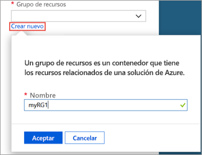
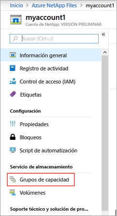

# <a name="quickstart-set-up-azure-netapp-files-and-create-an-nfs-volume"></a>Inicio rápido: Configuración de Azure NetApp Files y creación de un volumen de NFS 

En este artículo se muestra cómo configurar Azure NetApp Files y crear un volumen rápidamente. 

En este inicio rápido, configurará los elementos siguientes:

- Registro de Azure NetApp Files y proveedor de recursos de NetApp
- Cuenta de NetApp
- Grupo de capacidad
- Volumen de NFS para Azure NetApp Files

Si no tiene una suscripción a Azure, cree una [cuenta gratuita](https://azure.microsoft.com/free/?WT.mc_id=A261C142F) antes de empezar.

## <a name="before-you-begin"></a>Antes de empezar 

> [!IMPORTANT] 
> Se le debe conceder acceso al servicio Azure Files de NetApp.  Para solicitar acceso al servicio, consulte la [página de envío de la lista de espera de Azure Files de NetApp](https://aka.ms/azurenetappfiles).  Antes de continuar, debe esperar un correo electrónico de confirmación oficial del equipo de Azure NetApp Files. 

[!INCLUDE [cloud-shell-try-it.md](../../includes/cloud-shell-try-it.md)]

---

## <a name="register-for-azure-netapp-files-and-netapp-resource-provider"></a>Registro de Azure NetApp Files y del proveedor de recursos de NetApp

> [!NOTE]
> El proceso de registro puede tardar algún tiempo en completarse.
>

# <a name="portal"></a>[Portal](#tab/azure-portal)

Para obtener los pasos de registro mediante el portal, abra una sesión de Cloud Shell como se indicó anteriormente y siga estos pasos de la CLI de Azure:

[!INCLUDE [azure-netapp-files-cloudshell-include](../../includes/azure-netapp-files-azure-cloud-shell-window.md)]

# <a name="powershell"></a>[PowerShell](#tab/azure-powershell)

Este artículo de procedimientos requiere la versión 2.6.0 del módulo Az de Azure PowerShell o cualquier versión posterior. Ejecute `Get-Module -ListAvailable Az` para buscar la versión actual. Si necesita instalarla o actualizarla, consulte el artículo sobre [cómo instalar el módulo de Azure PowerShell](/powershell/azure/install-Az-ps). Si lo prefiere, puede usar la consola de Cloud Shell en una sesión de PowerShell en su lugar.

1. En un símbolo del sistema de PowerShell (o en la sesión de Cloud Shell de PowerShell), especifique la suscripción que se ha incorporado a la lista de permitidos para Azure NetApp Files:
    ```powershell-interactive
    Select-AzSubscription -Subscription <subscriptionId>
    ```

2. Registre el proveedor de recursos de Azure:
    ```powershell-interactive
    Register-AzResourceProvider -ProviderNamespace Microsoft.NetApp
    ```

# <a name="azure-cli"></a>[CLI de Azure](#tab/azure-cli)

[!INCLUDE [azure-netapp-files-cloudshell-include](../../includes/azure-netapp-files-azure-cloud-shell-window.md)]

---

## <a name="create-a-netapp-account"></a>Creación de una cuenta de NetApp

# <a name="portal"></a>[Portal](#tab/azure-portal)

1. En el cuadro de búsqueda de Azure Portal, escriba **Azure NetApp Files** y seleccione **Azure NetApp Files** en la lista que aparece.

      

2. Haga clic en **+ Agregar** para crear una nueva cuenta de NetApp.

     

3. En la ventana Nueva cuenta de NetApp, especifique la siguiente información: 
   1. Escriba **myaccount1** como nombre de la cuenta. 
   2. Seleccione su suscripción.
   3. Selección **Crear nuevo** para crear un grupo de recursos. Escriba **myRG1** como nombre del grupo de recursos. Haga clic en **OK**. 
   4. Seleccione la ubicación de la cuenta.  

        

      

4. Haga clic en **Crear** para crear una cuenta de NetApp.

# <a name="powershell"></a>[PowerShell](#tab/azure-powershell)

1. Defina algunas variables para que podamos hacer referencia a ellas en el resto de los ejemplos:

    ```powershell-interactive
    $resourceGroup = "myRG1"
    $location = "eastus"
    $anfAccountName = "myaccount1"
    ``` 

    > [!NOTE]
    > Consulte [Productos disponibles por región](https://azure.microsoft.com/global-infrastructure/services/?products=netapp&regions=all) para conocer la lista actual de regiones admitidas.
    > Para obtener el nombre de la región compatible con nuestras herramientas de línea de comandos, use `Get-AzLocation | select Location`.
    >

1. Cree un nuevo grupo de recursos con el comando [New-AzResourceGroup](/powershell/module/az.resources/new-azresourcegroup):

    ```powershell-interactive
    New-AzResourceGroup -Name $resourceGroup -Location $location
    ```

2. Cree la cuenta de Azure NetApp Files con el comando [New-AzNetAppFilesAccount](/powershell/module/az.netappfiles/New-AzNetAppFilesAccount):
   
    ```powershell-interactive
    New-AzNetAppFilesAccount -ResourceGroupName $resourceGroup -Location $location -Name $anfAccountName
    ```

# <a name="azure-cli"></a>[CLI de Azure](#tab/azure-cli)

1. Defina algunas variables para que podamos hacer referencia a ellas en el resto de los ejemplos:

    ```azurecli-interactive
    RESOURCE_GROUP="myRG1"
    LOCATION="eastus"
    ANF_ACCOUNT_NAME="myaccount1"
    ``` 

    > [!NOTE]
    > Consulte [Productos disponibles por región](https://azure.microsoft.com/global-infrastructure/services/?products=netapp&regions=all) para conocer la lista actual de regiones admitidas.
    > Para obtener el nombre de la región compatible con nuestras herramientas de línea de comandos, use `az account list-locations -query "[].{Region:name}" --out table`.
    >

2. Cree un nuevo grupo de recursos con el comando [az group create](/cli/azure/group#az-group-create):

    ```azurecli-interactive
    az group create \
        --name $RESOURCE_GROUP \
        --location $LOCATION
    ```

3. Cree la cuenta de Azure NetApp Files con [az netappfiles account create](/cli/azure/netappfiles/account#az-netappfiles-account-create):
   
    ```azurecli-interactive
    az netappfiles account create \
        --resource-group $RESOURCE_GROUP \
        --location $LOCATION \
        --account-name $ANF_ACCOUNT_NAME
    ```
---

## <a name="set-up-a-capacity-pool"></a>Configuración de un grupo de capacidad

# <a name="portal"></a>[Portal](#tab/azure-portal)

1. En la hoja de administración de Azure NetApp Files, seleccione la cuenta de NetApp (**myaccount1**).

      

2. En la hoja de administración de Azure NetApp Files de la cuenta de NetApp, haga clic en **Grupos de capacidad**.

      

3. Haga clic en **+ Agregar grupos**. 

      

4. Especifique la información del grupo de capacidad: 
    1. Escriba **mypool1** como nombre del grupo.
    2. Seleccione **Premium** como nivel de servicio. 
    3. Especifique **4 (TiB)** como tamaño del grupo. 

5. Haga clic en **OK**.

# <a name="powershell"></a>[PowerShell](#tab/azure-powershell)

1. Definición de algunas variables nuevas para futuras referencias

    ```powershell-interactive
    $poolName = "mypool1"
    $poolSizeBytes = 4398046511104 # 4TiB
    $serviceLevel = "Premium" # Valid values are Standard, Premium and Ultra
    ```

1. Cree un nuevo grupo de capacidad mediante el comando [New-AzNetAppFilesPool](/powershell/module/az.netappfiles/new-aznetappfilespool)

    ```powershell-interactive
    New-AzNetAppFilesPool -ResourceGroupName $resourceGroup -Location $location -AccountName $anfAccountName -Name $poolName -PoolSize $poolSizeBytes -ServiceLevel $serviceLevel
    ```

# <a name="azure-cli"></a>[CLI de Azure](#tab/azure-cli)

1. Definición de algunas variables nuevas para futuras referencias

    ```azurecli-interactive
    POOL_NAME="mypool1"
    POOL_SIZE_TiB=4 # Size in Azure CLI needs to be in TiB unit (minimum 4 TiB)
    SERVICE_LEVEL="Premium" # Valid values are Standard, Premium and Ultra
    ```

2. Cree un nuevo grupo de capacidad mediante el comando [az netappfiles pool create](/cli/azure/netappfiles/pool#az-netappfiles-pool-create). 

    ```azurecli-interactive
    az netappfiles pool create \
        --resource-group $RESOURCE_GROUP \
        --location $LOCATION \
        --account-name $ANF_ACCOUNT_NAME \
        --pool-name $POOL_NAME \
        --size $POOL_SIZE_TiB \
        --service-level $SERVICE_LEVEL
    ```

---

## <a name="create-nfs-volume-for-azure-netapp-files"></a>Creación de un volumen de NFS para Azure NetApp Files

# <a name="portal"></a>[Portal](#tab/azure-portal)

1. En la hoja de administración de Azure NetApp Files de la cuenta de NetApp, haga clic en **Volúmenes**.

      

2. Haga clic en **+ Agregar volumen**.

      

3. En la ventana Crear un volumen, especifique la información del volumen: 
   1. Escriba **myvol1** como nombre del volumen. 
   2. Seleccione el grupo de capacidad (**mypool1**).
   3. Use el valor predeterminado de la cuota. 
   4. En la red virtual, haga clic en **Crear nueva** para crear una red virtual de Azure.  Luego, rellene la siguiente información:
       * Escriba **myvnet1** como nombre de la red virtual.
       * Especifique un espacio de direcciones para el valor, por ejemplo, 10.7.0.0/16
       * Escriba **myANFsubnet** como nombre de subred.
       * Especifique el intervalo de direcciones de la subred, por ejemplo, 10.7.0.0/24. La subred dedicada no se puede compartir con otros recursos.
       * Seleccione **Microsoft.NetApp/volumes** como delegación de la subred.
       * Haga clic en **Aceptar** para crear la red virtual.
   5. En la subred, seleccione la red virtual recién creada (**myvnet1**) como subred de delegado.

        

        

4. Haga clic en **Protocolo** y realice las siguientes acciones: 
    * Seleccione **NFS** como tipo de protocolo para el volumen.  
    * Escriba **myfilepath1** como la ruta de acceso de archivo que se usará para crear la ruta de acceso de exportación del volumen.  
    * Seleccione la versión de NFS (**NFSv3** o **NFSv4.1**) del volumen.  
      Consulte las [consideraciones](azure-netapp-files-create-volumes.md#considerations) y los [procedimientos recomendados](azure-netapp-files-create-volumes.md#best-practice) sobre las versiones de NFS. 
      
  

5. Haga clic en **Revisar + crear**.

      

6. Examine la información del volumen y haga clic en **Crear**.  
    El volumen creado aparece en la hoja Volúmenes.

      

# <a name="powershell"></a>[PowerShell](#tab/azure-powershell)

1. Cree una delegación de subred en "Microsoft.NetApp/Volumes" con el comando [New-AzDelegation](/powershell/module/az.network/new-azdelegation).

    ```powershell-interactive
    $anfDelegation = New-AzDelegation -Name ([guid]::NewGuid().Guid) -ServiceName "Microsoft.NetApp/volumes"
    ```

2. Cree una configuración de subred mediante el comando [New-AzVirtualNetworkSubnetConfig](/powershell/module/az.network/new-azvirtualnetworksubnetconfig).

    ```powershell-interactive
    $subnet = New-AzVirtualNetworkSubnetConfig -Name "myANFSubnet" -AddressPrefix "10.7.0.0/24" -Delegation $anfDelegation
    ```

3. Cree la red virtual mediante el comando [New-AzVirtualNetwork](/powershell/module/az.network/new-azvirtualnetwork).
    
    ```powershell-interactive
    $vnet = New-AzVirtualNetwork -Name "myvnet1" -ResourceGroupName $resourceGroup -Location $location -AddressPrefix "10.7.0.0/16" -Subnet $subnet
    ```

4. Cree el volumen mediante el comando [New-AzNetAppFilesVolume](/powershell/module/az.netappfiles/new-aznetappfilesvolume).
   
    ```powershell-interactive
    $volumeSizeBytes = 1099511627776 # 100GiB
    $subnetId = $vnet.Subnets[0].Id

    New-AzNetAppFilesVolume -ResourceGroupName $resourceGroup `
        -Location $location `
        -AccountName $anfAccountName `
        -PoolName $poolName `
        -Name "myvol1" `
        -UsageThreshold $volumeSizeBytes `
        -SubnetId $subnetId `
        -CreationToken "myfilepath1" `
        -ServiceLevel $serviceLevel `
        -ProtocolType NFSv3
    ```

# <a name="azure-cli"></a>[CLI de Azure](#tab/azure-cli)

1. Definición de algunas variables para su uso posterior.
    
    ```azurecli-interactive
    VNET_NAME="myvnet1"
    SUBNET_NAME="myANFSubnet"
    ```

1. Cree una red virtual sin subred mediante el comando [az network vnet create](/cli/azure/network/vnet#az-network-vnet-create).
    
    ```azurecli-interactive
    az network vnet create \
        --resource-group $RESOURCE_GROUP \
        --name $VNET_NAME \
        --location $LOCATION \
        --address-prefix "10.7.0.0/16"

    ```

2. Cree una subred delegada con el comando [az network vnet subnet create](/cli/azure/network/vnet/subnet#az-network-vnet-subnet-create).

    ```azurecli-interactive
    az network vnet subnet create \
        --resource-group $RESOURCE_GROUP \
        --vnet-name $VNET_NAME \
        --name $SUBNET_NAME \
        --address-prefixes "10.7.0.0/24" \
        --delegations "Microsoft.NetApp/volumes"
    ```

3. Cree el volumen mediante el comando [az netappfiles volume create](/cli/azure/netappfiles/volume#az-netappfiles-volume-create).
   
    ```azurecli-interactive
    VNET_ID=$(az network vnet show --resource-group $RESOURCE_GROUP --name $VNET_NAME --query "id" -o tsv)
    SUBNET_ID=$(az network vnet subnet show --resource-group $RESOURCE_GROUP --vnet-name $VNET_NAME --name $SUBNET_NAME --query "id" -o tsv)
    VOLUME_SIZE_GiB=100 # 100 GiB
    UNIQUE_FILE_PATH="myfilepath2" # Please note that creation token needs to be unique within subscription and region

    az netappfiles volume create \
        --resource-group $RESOURCE_GROUP \
        --location $LOCATION \
        --account-name $ANF_ACCOUNT_NAME \
        --pool-name $POOL_NAME \
        --name "myvol1" \
        --service-level $SERVICE_LEVEL \
        --vnet $VNET_ID \
        --subnet $SUBNET_ID \
        --usage-threshold $VOLUME_SIZE_GiB \
        --file-path $UNIQUE_FILE_PATH \
        --protocol-types "NFSv3"
    ```

---

## <a name="clean-up-resources"></a>Limpieza de recursos

# <a name="portal"></a>[Portal](#tab/azure-portal)

Cuando haya terminado, y si lo desea, puede eliminar el grupo de recursos. La acción de eliminar un grupo de recursos es irreversible.  

> [!IMPORTANT]
> Todos los recursos dentro de los grupos de recursos se eliminarán de forma permanente y esta acción no se puede deshacer. 

1. En el cuadro de búsqueda de Azure Portal, escriba **Azure NetApp Files** y seleccione **Azure NetApp Files** en la lista que aparece.

2. En la lista de suscripciones, haga clic en el grupo de recursos (myRG1) que quiere eliminar. 

    


3. En la página del grupo de recursos, seleccione **Eliminar grupo de recursos**.

     

    Se abre una ventana con una advertencia acerca de los recursos que se eliminarán con el grupo de recursos.

4. Escriba el nombre del grupo de recursos (myRG1) para confirmar que quiere eliminar de forma permanente el grupo de recursos y todos los recursos que contiene y, luego, haga clic en **Eliminar**.

     

# <a name="powershell"></a>[PowerShell](#tab/azure-powershell)

Cuando haya terminado, y si lo desea, puede eliminar el grupo de recursos. La acción de eliminar un grupo de recursos es irreversible.  

> [!IMPORTANT]
> Todos los recursos dentro de los grupos de recursos se eliminarán de forma permanente y esta acción no se puede deshacer.

1. Elimine el grupo de recursos con el comando [Remove-AzResourceGroup](/powershell/module/az.resources/remove-azresourcegroup).
   
    ```powershell-interactive
    Remove-AzResourceGroup -Name $resourceGroup
    ```

# <a name="azure-cli"></a>[CLI de Azure](#tab/azure-cli)

Cuando haya terminado, y si lo desea, puede eliminar el grupo de recursos. La acción de eliminar un grupo de recursos es irreversible.  

> [!IMPORTANT]
> Todos los recursos dentro de los grupos de recursos se eliminarán de forma permanente y esta acción no se puede deshacer.

1. Elimine el grupo de recursos con el comando [az group delete](/cli/azure/group#az-group-delete).
   
    ```azurecli-interactive
    az group delete \
        --name $RESOURCE_GROUP
    ```
---

## <a name="next-steps"></a>Pasos siguientes  

> [!div class="nextstepaction"]
> [Administración de volúmenes mediante Azure NetApp Files](azure-netapp-files-manage-volumes.md)  
