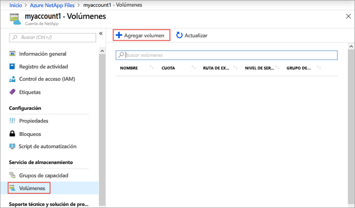
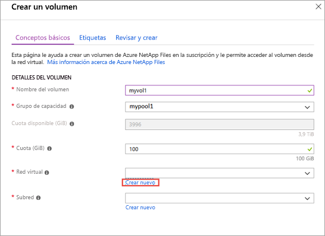
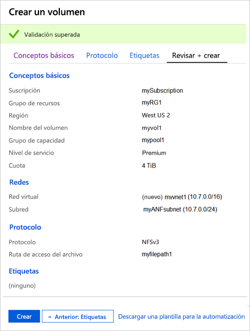
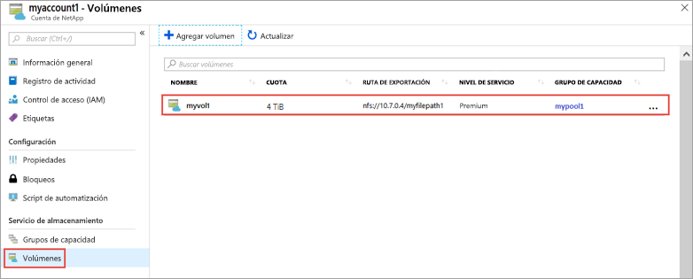

# Configuración de Azure NetApp Files y creación de un volumen 

Este artículo muestra cómo configurar los archivos de NetApp Azure rápidamente y crear un volumen. 

## Antes de empezar 

Tiene que formar parte del programa de la versión preliminar pública y figurar en la lista blanca para acceder al proveedor de recursos de Microsoft.NetApp. Para conocer más detalles sobre cómo unirse al programa de versión preliminar pública, visite la [página de registro en la versión preliminar pública de Azure NetApp Files](https://aka.ms/nfspublicpreview). 

## Regístrese para obtener los archivos de Azure de NetApp y proveedor de recursos de NetApp

1. En el portal de Azure, haga clic en el icono de Azure Cloud Shell en la esquina superior derecha.

      

2. Especifique la suscripción que ha estado en la lista blanca de NetApp de Azure Files:
    
        az account set --subscription <subscriptionId>

3. Registre el proveedor de recursos de Azure: 
    
        az provider register --namespace Microsoft.NetApp --wait  

    El proceso de registro puede tardar algún tiempo en completarse.

## Creación de una cuenta de NetApp

1. En el cuadro de búsqueda del portal de Azure, escriba **Azure Files de NetApp** y, a continuación, seleccione **NetApp de Azure Files (versión preliminar)** en la lista que aparece.

      

2. Haga clic en **+ Agregar** para crear una nueva cuenta de NetApp.

     

3. En la ventana de la nueva cuenta de NetApp, proporcione la siguiente información: 
   1. Escriba **myaccount1** del nombre de cuenta. 
   2. Seleccione su suscripción.
   3. Seleccione **crear nuevo** para crear nuevo grupo de recursos. Escriba **myRG1** para el nombre del grupo de recursos. Haga clic en **OK**. 
   4. Seleccione la ubicación de la cuenta.  

        

      

4. Haga clic en **crear** para crear la nueva cuenta de NetApp.

## Configuración de un grupo de capacidad

1. En la hoja de administración de Azure Files de NetApp, seleccione la cuenta de NetApp (**myaccount1**).

      

2. En la hoja de administración de Azure Files de NetApp de la cuenta de NetApp, haga clic en **grupos de capacidad**.

      

3. Haga clic en **+ agregar grupos**. 

      

4. Proporciona información para el grupo de capacidad: 
    1. Escriba **mypool1** como el nombre del grupo.
    2. Seleccione **Premium** para el nivel de servicio. 
    3. Especificar **4 (TiB)** como el tamaño del grupo. 

5. Haga clic en **OK**.

## Creación de un volumen de Azure NetApp Files

1. En la hoja de administración de Azure Files de NetApp de la cuenta de NetApp, haga clic en **volúmenes**.

      

2. Haga clic en **+ Agregar volumen**.

      

3. En la creación de una ventana de volumen, proporcione información para el volumen: 
   1. Escriba **myvol1** como el nombre del volumen. 
   2. Escriba **myfilepath1** como la ruta de acceso de archivo que se usará para crear la ruta de acceso de exportación para el volumen.
   3. Seleccione el grupo de capacidades (**mypool1**).
   4. Use el valor predeterminado para la cuota. 
   5. En la red virtual, haga clic en **crear nuevo** para crear una nueva red virtual de Azure (Vnet).  A continuación, rellene la información siguiente:
       * Escriba **myvnet1** como el nombre de red virtual.
       * Especifique un espacio de direcciones para la configuración, por ejemplo, 10.7.0.0/16
       * Escriba **myANFsubnet** como el nombre de subred.
       * Especifique el intervalo de direcciones de subred, por ejemplo, 10.7.0.0/24. Tenga en cuenta que no se puede compartir con otros recursos de la subred dedicada.
       * Seleccione **Microsoft.NetApp/volumes** para la delegación de la subred.
       * Haga clic en **Aceptar** para crear la red virtual.
   6. En la subred, seleccione la red virtual recién creada (**myvnet1**) como la subred de delegado.

        

        

4. Haga clic en **Revisar + crear**.

      

5. Revise la información para el volumen y, después, haga clic en **crear**.  
    El volumen creado aparece en la hoja volúmenes.

      

## Pasos siguientes  

* [Información sobre la jerarquía del almacenamiento de Azure NetApp Files](azure-netapp-files-understand-storage-hierarchy.md)
* [Administrar volúmenes mediante el uso de Azure Files de NetApp](azure-netapp-files-manage-volumes.md) 
