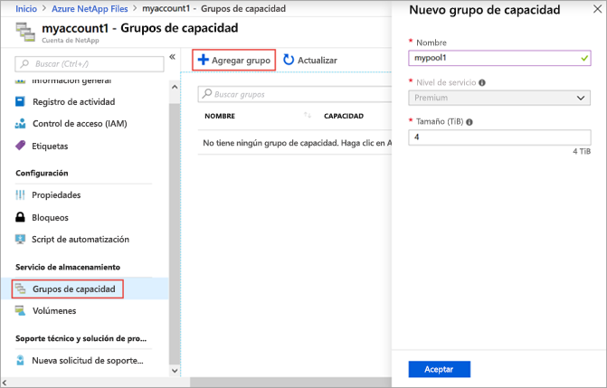
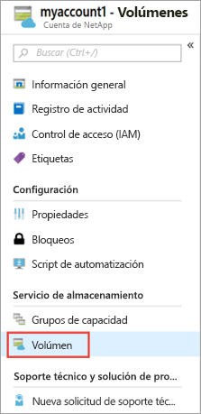
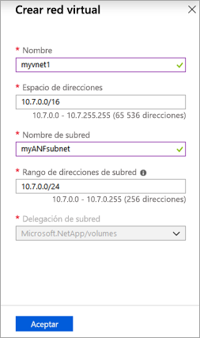

# Configuración de Azure NetApp Files y creación de un volumen 

En este artículo se muestra cómo configurar Azure NetApp Files y crear un volumen rápidamente. 

## Antes de empezar 

Tiene que formar parte del programa de la versión preliminar pública y figurar en la lista blanca para acceder al proveedor de recursos de Microsoft.NetApp. Para conocer más detalles sobre cómo unirse al programa de versión preliminar pública, visite la [página de registro en la versión preliminar pública de Azure NetApp Files](https://aka.ms/nfspublicpreview). 

## Registro de Azure NetApp Files y del proveedor de recursos de NetApp

1. En Azure Portal, haga clic en el icono de Azure Cloud Shell en la esquina superior derecha.

      

2. Especifique la suscripción que se ha incluido en la lista blanca de Azure NetApp Files:
    
        az account set --subscription <subscriptionId>

3. Registre el proveedor de recursos de Azure: 
    
        az provider register --namespace Microsoft.NetApp --wait  

    El proceso de registro puede tardar algún tiempo en completarse.

## Creación de una cuenta de NetApp

1. En el cuadro de búsqueda de Azure Portal, escriba **Azure NetApp Files** y seleccione **Azure NetApp Files (versión preliminar)** en la lista que aparece.

      

2. Haga clic en **+ Agregar** para crear una nueva cuenta de NetApp.

     

3. En la ventana Nueva cuenta de NetApp, especifique la siguiente información: 
   1. Escriba **myaccount1** como nombre de la cuenta. 
   2. Seleccione su suscripción.
   3. Selección **Crear nuevo** para crear un grupo de recursos. Escriba **myRG1** como nombre del grupo de recursos. Haga clic en **OK**. 
   4. Seleccione la ubicación de la cuenta.  

        

      

4. Haga clic en **Crear** para crear una cuenta de NetApp.

## Configuración de un grupo de capacidad

1. En la hoja de administración de Azure NetApp Files, seleccione la cuenta de NetApp (**myaccount1**).

      

2. En la hoja de administración de Azure NetApp Files de la cuenta de NetApp, haga clic en **Grupos de capacidad**.

      

3. Haga clic en **+ Agregar grupos**. 

      

4. Especifique la información del grupo de capacidad: 
    1. Escriba **mypool1** como nombre del grupo.
    2. Seleccione **Premium** como nivel de servicio. 
    3. Especifique **4 (TiB)** como tamaño del grupo. 

5. Haga clic en **OK**.

## Creación de un volumen de Azure NetApp Files

1. En la hoja de administración de Azure NetApp Files de la cuenta de NetApp, haga clic en **Volúmenes**.

      

2. Haga clic en **+ Agregar volumen**.

      

3. En la ventana Crear un volumen, especifique la información del volumen: 
   1. Escriba **myvol1** como nombre del volumen. 
   2. Escriba **myfilepath1** como la ruta de acceso de archivo que se usará para crear la ruta de acceso de exportación del volumen.
   3. Seleccione el grupo de capacidad (**mypool1**).
   4. Use el valor predeterminado de la cuota. 
   5. En la red virtual, haga clic en **Crear nueva** para crear una red virtual de Azure.  Luego, rellene la siguiente información:
       * Escriba **myvnet1** como nombre de la red virtual.
       * Especifique un espacio de direcciones para el valor, por ejemplo, 10.7.0.0/16
       * Escriba **myANFsubnet** como nombre de subred.
       * Especifique el intervalo de direcciones de la subred, por ejemplo, 10.7.0.0/24. Tenga en cuenta que la subred dedicada no se puede compartir con otros recursos.
       * Seleccione **Microsoft.NetApp/volumes** como delegación de la subred.
       * Haga clic en **Aceptar** para crear la red virtual.
   6. En la subred, seleccione la red virtual recién creada (**myvnet1**) como subred de delegado.

        

        

4. Haga clic en **Revisar + crear**.

      

5. Examine la información del volumen y haga clic en **Crear**.  
    El volumen creado aparece en la hoja Volúmenes.

      

## Pasos siguientes  

* [Información sobre la jerarquía del almacenamiento de Azure NetApp Files](azure-netapp-files-understand-storage-hierarchy.md)
* [Administración de volúmenes mediante Azure NetApp Files](azure-netapp-files-manage-volumes.md) 
