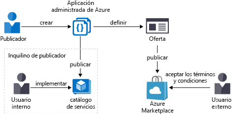
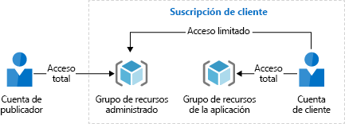

# Introducción a las aplicaciones administradas de Azure

Las aplicaciones administradas de Azure le permiten ofrecer soluciones en la nube que los consumidores pueden implementar y utilizar fácilmente. Puede implementar la infraestructura y proporcionar soporte continuo. Para poner a disposición de todos los clientes una aplicación administrada, publíquela en Azure Marketplace. Si quiere que esté disponible solo para los usuarios de su organización, publíquela en un catálogo interno. 

Una aplicación administrada es similar a una plantilla de solución de Marketplace, aunque hay una diferencia importante. En una aplicación administrada, los recursos se implementan en un grupo de recursos que está administrado por el editor de la aplicación. El grupo de recursos está presente en la suscripción del consumidor, pero una identidad en el inquilino del editor tiene acceso al grupo de recursos. Como editor, puede especificar el costo del soporte técnico continuado de la solución.

> [!NOTE]
> Anteriormente, la documentación de los proveedores personalizados de Azure se incluía con la documentación de las aplicaciones administradas. Esa documentación ha cambiado de lugar. Ahora, debe consultar [Proveedores personalizados de Azure](../custom-providers/overview.md).

## Ventajas de las aplicaciones administradas

Las aplicaciones administradas reducen las barreras que existen para los consumidores que utilizan sus soluciones. No es necesario que tengan conocimientos de la infraestructura de nube para usar la solución. Los consumidores tienen acceso limitado a los recursos críticos, no es necesario preocuparse de cometer un error al administrarlos. 

Las aplicaciones administradas le permiten establecer una relación continuada con los consumidores. Defina los términos de administración de la aplicación y todos los cargos se controlarán a través de la facturación de Azure.

A pesar de que los clientes implementan estas aplicaciones administradas en sus suscripciones, no es necesario que las mantengan, actualicen ni atiendan. Puede estar seguro de que todos los clientes usan versiones aprobadas. No es necesario que los clientes desarrollen un conocimiento ni dominio específico para administrar estas aplicaciones. Los clientes adquieren de inmediato las actualizaciones de las aplicaciones sin tener que preocuparse de solucionar ni diagnosticar problemas de estas. 

En el caso de los equipos de TI, las aplicaciones administradas le permiten ofrecer soluciones aprobadas previamente a los usuarios de la organización. Estas soluciones se sabe que son compatibles con los estándares de la organización.

Las aplicaciones administradas admiten las [identidades administradas para recursos de Azure](./publish-managed-identity.md).

## Tipos de aplicaciones administradas

Puede publicar la aplicación administrada externa o internamente.

### Catálogo de servicios

El catálogo de servicios es un catálogo interno de soluciones aprobadas para los usuarios de una organización. Usará el catálogo para cumplir los estándares organizativos y ofrecer al mismo tiempo soluciones para las organizaciones. Los empleados usarán el catálogo para encontrar fácilmente las aplicaciones que el departamento de TI recomienda y aprueba. También pueden ver las aplicaciones administradas que otras personas de su organización comparten con ellos.

Para más información sobre cómo publicar una aplicación administrada del catálogo de servicios, consulte [Creación de la aplicación de catálogo de servicios](publish-service-catalog-app.md).

### Marketplace

Los proveedores que deseen facturar sus servicios pueden disponer de una aplicación administrada a través de Azure Marketplace. Después de que el proveedor publica una aplicación, esta está disponible para los usuarios de fuera de la organización. Con este método, los proveedores de servicios administrados (MSP), los fabricantes de software independientes (ISV) y los integradores del sistema (SIs) pueden ofrecer sus soluciones a todos los clientes de Azure.

Para más información sobre cómo publicar una aplicación administrada en Azure Marketplace, consulte [Creación de la aplicación de Marketplace](publish-marketplace-app.md).

## Grupos de recursos para aplicaciones administradas

Normalmente, los recursos de una aplicación administrada residen en dos grupos de recursos. El consumidor administra un grupo de recursos y el editor administra el otro. Al definir la aplicación administrada, el editor especifica los niveles de acceso. El publicador puede solicitar una asignación de roles permanentes, o [acceso Just-In-Time](request-just-in-time-access.md) para una asignación que esté restringida a un período de tiempo.

No se admite actualmente la restricción del acceso para las [operaciones de datos](../../role-based-access-control/role-definitions.md) para todos los proveedores de datos en Azure.

La siguiente imagen muestra un escenario en el que el editor solicita el rol de propietario del grupo de recursos administrados. El editor puso un bloqueo de solo lectura en este grupo de recursos para el consumidor. Las identidades del publicador a las que se concede acceso al grupo de recursos administrado están exentas del bloqueo.

### Grupo de recursos de la aplicación

Este grupo de recursos mantiene la instancia de la aplicación administrada. Este grupo de recursos solo puede contener un recurso. El tipo de recurso de la aplicación administrada es **Microsoft.Solutions/applications**.

El consumidor tiene acceso total al grupo de recursos y lo utiliza para administrar el ciclo de vida de la aplicación administrada.

### Grupo de recursos administrado

Este grupo de recursos contiene todos los recursos que requiere la aplicación administrada. Por ejemplo, este grupo de recursos contiene las máquinas virtuales, cuentas de almacenamiento y redes virtuales para la solución. El consumidor tiene acceso limitado a este grupo de recursos ya que no puede administrar los recursos individuales de la aplicación administrada. El acceso del editor a este grupo de recursos se corresponde con el rol especificado en la definición de la aplicación administrada. Por ejemplo, el editor puede solicitar el rol de propietario o colaborador para este grupo de recursos. El acceso es permanente o está limitado a un momento específico.

Al publicar [la aplicación administrada en Marketplace](publish-marketplace-app.md), el editor puede conceder a los consumidores la capacidad de desempeñar acciones específicas en recursos del grupo de recursos administrado. Por ejemplo, el editor puede especificar que los consumidores puedan reiniciar máquinas virtuales. Se continuarán rechazando el resto de acciones que no sean de lectura.

Cuando el consumidor elimina la aplicación administrada, también se elimina el grupo de recursos administrados.

## Azure Policy

Puede aplicar una directiva de [Azure Policy](../../governance/policy/overview.md) a la aplicación administrada. Las directivas se aplican para garantizar que las instancias implementadas de la aplicación administrada cumplan con los requisitos de seguridad y datos. Si la aplicación interactúa con datos confidenciales, asegúrese de que se ha evaluado cómo debe protegerse. Por ejemplo, si la aplicación interactúa con datos de Office 365, aplique una directiva para asegurarse de que está habilitado el cifrado de datos.

## Pasos siguientes

En este artículo, ha aprendido acerca de las ventajas de uso de las aplicaciones administradas. Vaya al siguiente artículo para crear una definición de aplicación administrada.

> [!div class="nextstepaction"]
> [Inicio rápido: Publicación de una definición de aplicación administrada de Azure](publish-managed-app-definition-quickstart.md)
