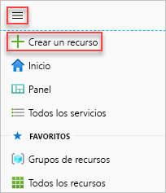
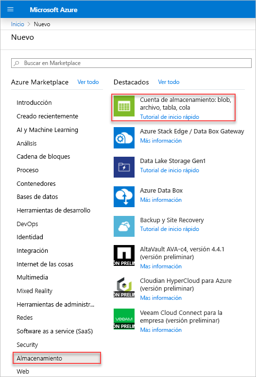
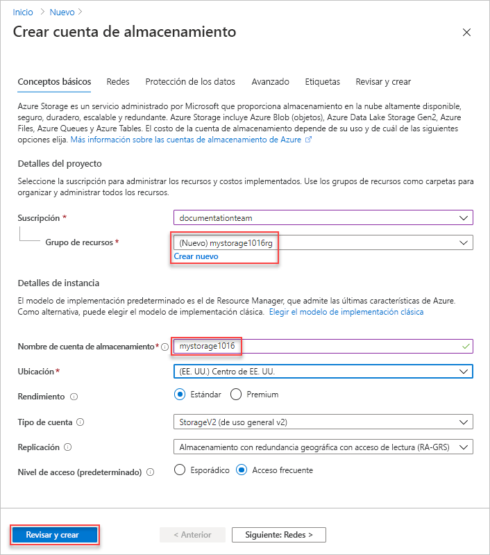
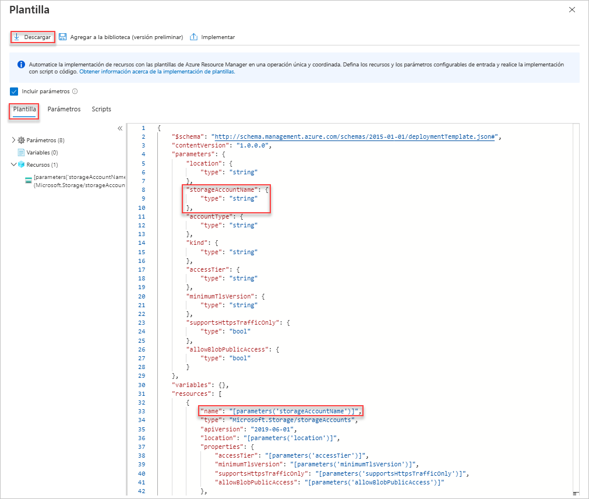
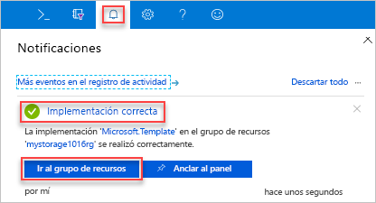
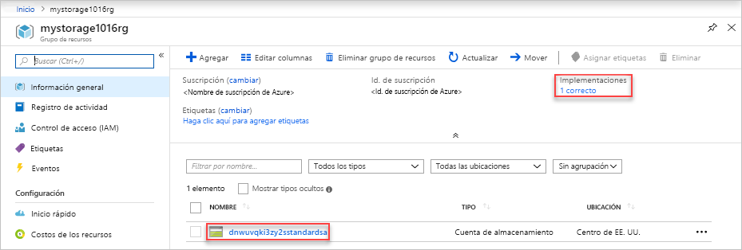

# <a name="quickstart-create-and-deploy-arm-templates-by-using-the-azure-portal"></a>Inicio rápido: Creación e implementación de plantillas de Azure Resource Manager mediante Azure Portal

Aprenda a generar una plantilla de Azure Resource Manager (ARM) desde Azure Portal, así como el proceso de editar e implementar la plantilla desde el portal. Las plantillas de Azure Resource Manager son archivos JSON que definen los recursos que necesita para implementar la solución. Para entender los conceptos asociados a la implementación y administración de sus soluciones de Azure, consulte la [introducción a la implementación de plantillas](overview.md).


Tras completar el tutorial implemente una cuenta de Azure Storage. El mismo proceso se puede usar para implementar otros recursos de Azure.

Si no tiene una suscripción a Azure, cree una [cuenta gratuita](https://azure.microsoft.com/free/) antes de empezar.

## <a name="generate-a-template-using-the-portal"></a>Generación de una plantilla con el portal

La creación de una plantilla de Azure Resource Manager desde cero no es una tarea fácil, sobre todo si es la primera vez que se realiza una implementación de Azure y no se conoce el formato JSON. Desde Azure Portal se puede configurar un recurso, por ejemplo una cuenta de Azure Storage. Antes de implementar el recurso, puede exportar la configuración a una plantilla. Puede guardar la plantilla y volver a usarla en el futuro.

Muchos desarrolladores de plantillas experimentados usan este método para generar plantillas cuando intentan implementar recursos de Azure con los que no están familiarizados. Para más información acerca de cómo exportar plantillas mediante el portal, consulte [Exportar grupos de recursos en plantillas](../management/manage-resource-groups-portal.md#export-resource-groups-to-templates). La otra forma de encontrar una plantilla de trabajo es entre las [plantillas de inicio rápido de Azure](https://azure.microsoft.com/resources/templates/).

1. En un explorador web, vaya a [Azure Portal](https://portal.azure.com) e inicie sesión.
1. En el menú de Azure Portal, seleccione **Crear un recurso**.

    

1. Seleccione **Storage** > **Cuenta de Storage**.

    
1. Escriba la siguiente información:

    |Nombre|Value|
    |----|----|
    |**Grupos de recursos**|seleccione **Crear nuevo** y especifique el nombre que prefiera para el grupo de recursos. En la captura de pantalla, el nombre del grupo de recursos es *mystorage1016rg*. Un grupo de recursos es un contenedor para recursos de Azure. El grupo de recursos facilita la administración de recursos de Azure. |
    |**Nombre**|escriba un nombre único para la cuenta de almacenamiento. El nombre de la cuenta de almacenamiento proporcionado debe ser único entre todos los de Azure y contener solo letras minúsculas y números. El nombre debe tener entre 3 y 24 caracteres. Si recibe el mensaje de error "The storage account name 'mystorage1016' is already taken" (El nombre de cuenta de almacenamiento 'mystorage1016' no está disponible), pruebe a usar **&lt;su nombre>storage&lt;fecha de hoy en MMDD>** , por ejemplo, **johndolestorage1016**. Para más información, consulte [Reglas y restricciones de nomenclatura](/azure/architecture/best-practices/resource-naming).|

    Puede usar los valores predeterminados para el resto de propiedades.

    

    > [!NOTE]
    > Algunas de las plantillas exportadas requieren algunas modificaciones antes de poder implementarlas.

1. Seleccione **Revisar y crear** en la parte inferior de la pantalla. No seleccione **Crear** en el paso siguiente.
1. Seleccione **Descargar una plantilla para la automatización** en la parte inferior de la pantalla. El portal muestra la plantilla generada:

    

    El panel principal muestra la plantilla. Es un archivo JSON con seis elementos de nivel superior: `schema`, `contentVersion`, `parameters`, `variables`, `resources` y `output`. Para más información, vea [Nociones sobre la estructura y la sintaxis de las plantillas de Azure Resource Manager](./template-syntax.md).

    Hay ocho parámetros definidos. Uno de ellos se denomina **storageAccountName**. La segunda parte resaltada de la captura de pantalla anterior muestra cómo hacer referencia a este parámetro en la plantilla. En la sección siguiente, edite la plantilla para usar un nombre generado para la cuenta de almacenamiento.

    En la plantilla, se define un recurso de Azure. El tipo es `Microsoft.Storage/storageAccounts`. Observe cómo se define el recurso y la estructura de definición.
1. Seleccione **Descargar** en la parte superior de la pantalla.
1. Abra el archivo zip descargado y guarde **template.json** en su equipo. En la siguiente sección, usará una herramienta de implementación de plantilla para modificar la plantilla.
1. Seleccione la pestaña **Parámetro** para ver los valores proporcionados para los parámetros. Anote estos valores, porque los necesitará en la sección siguiente al implementar la plantilla.

    

    Mediante la plantilla y el archivo de parámetros, puede crear un recurso, que en este tutorial será una cuenta de Azure Storage.

## <a name="edit-and-deploy-the-template"></a>Edición e implementación de la plantilla

Azure Portal puede utilizarse para realizar algunas modificaciones básicas de la plantilla. En esta guía de inicio rápido, va a usar una herramienta del portal denominada *Template Deployment*. *Template Deployment* se utiliza en este tutorial, por lo que puede completar todo el tutorial mediante una interfaz: Azure Portal. Para editar una plantilla más compleja, considere la posibilidad de usar [Visual Studio Code](quickstart-create-templates-use-visual-studio-code.md), que proporciona mejores funcionalidades de edición.

> [!IMPORTANT]
> Template Deployment ofrece una interfaz para probar plantillas sencillas. No se recomienda usar esta característica en el entorno de producción. En su lugar, almacene las plantillas en una cuenta de Azure Storage o en un repositorio de código fuente como GitHub.

Azure requiere que cada servicio de Azure tenga un nombre único. Se podría producir un error en la implementación si ha escrito un nombre de cuenta de almacenamiento que ya existe. Para evitar este problema, modifique la plantilla para que use una llamada de función de plantilla `uniquestring()` para generar un nombre de cuenta de almacenamiento único.

1. En el menú Azure Portal, en el cuadro de búsqueda, escriba **implementar** y, a continuación, seleccione **Implementar una plantilla personalizada**.

    

1. Seleccione **Cree su propia plantilla en el editor**.
1. Seleccione **Cargar archivo** y, después, siga las instrucciones para cargar template.json que descargó en la última sección.
1. Realice los siguientes tres cambios en la plantilla:

    

   - Quite el parámetro **storageAccountName** como aparece en la captura de pantalla anterior.
   - Agregue una variable denominada **storageAccountName** como se muestra en la captura de pantalla anterior:

       ```json
       "storageAccountName": "[concat(uniqueString(subscription().subscriptionId), 'storage')]"
       ```

       Aquí se usan dos funciones de plantilla: `concat()` y `uniqueString()`.
   - Actualice el elemento name del recurso **Microsoft.Storage/storageAccounts** para usar la variable recién definida en lugar del parámetro:

       ```json
       "name": "[variables('storageAccountName')]",
       ```

     La plantilla final debe parecerse a esta:

     ```json
     {
       "$schema": "http://schema.management.azure.com/schemas/2015-01-01/deploymentTemplate.json#",
       "contentVersion": "1.0.0.0",
       "parameters": {
         "location": {
           "type": "string"
         },
         "accountType": {
           "type": "string"
         },
         "kind": {
           "type": "string"
         },
         "accessTier": {
           "type": "string"
         },
         "minimumTlsVersion": {
           "type": "string"
         },
         "supportsHttpsTrafficOnly": {
          "type": "bool"
         },
         "allowBlobPublicAccess": {
           "type": "bool"
         }
       },
       "variables": {
         "storageAccountName": "[concat(uniqueString(subscription().subscriptionId), 'storage')]"
       },
       "resources": [
         {
           "name": "[variables('storageAccountName')]",
           "type": "Microsoft.Storage/storageAccounts",
           "apiVersion": "2019-06-01",
           "location": "[parameters('location')]",
           "properties": {
             "accessTier": "[parameters('accessTier')]",
             "minimumTlsVersion": "[parameters('minimumTlsVersion')]",
             "supportsHttpsTrafficOnly": "[parameters('supportsHttpsTrafficOnly')]",
             "allowBlobPublicAccess": "[parameters('allowBlobPublicAccess')]"
           },
           "dependsOn": [],
           "sku": {
             "name": "[parameters('accountType')]"
           },
           "kind": "[parameters('kind')]",
           "tags": {}
         }
       ],
       "outputs": {}
     }
     ```

1. Seleccione **Guardar**.
1. Escriba los siguientes valores:

    |Nombre|Value|
    |----|----|
    |**Grupos de recursos**|Seleccione el nombre del grupo de recursos creado en la última sección. |
    |**Región**|Seleccione una ubicación para el grupo de recursos. Por ejemplo, **Centro de EE. UU**. |
    |**Ubicación**|Seleccione la ubicación para la cuenta de almacenamiento. Por ejemplo, **Centro de EE. UU**. |
    |**Tipo de cuenta**|escriba **Standard_LRS** para este artículo de inicio rápido. |
    |**Variante**|escriba **StorageV2** para este artículo de inicio rápido. |
    |**Nivel de acceso**|escriba **Frecuente** para este artículo de inicio rápido. |
    |**Minimum Tls Version** (Versión de TLS mínima)|Escriba **TLS1_0**. |
    |**Supports Https Traffic Only** (Admite solo tráfico Https)| Seleccione **true** para esta guía de inicio rápido. |
    |**Allow Blob Public Access** (Permitir acceso público a blobs)| Seleccione **false** para esta guía de inicio rápido. |

1. Seleccione **Revisar + crear**.
1. Seleccione **Crear**.
1. Seleccione el icono de campana (notificaciones) en la parte superior de la pantalla para ver el estado de implementación. Verá **Implementación en curso**. Espere hasta que se complete la implementación.

    

1. Seleccione **Ir al grupo de recursos** desde el panel de notificación. Debería ver una pantalla parecida a:

    

    Puede ver que el estado de la implementación fue correcto y que solo hay una cuenta de almacenamiento en el grupo de recursos. El nombre de cuenta de almacenamiento es una cadena única generada por la plantilla. Para más información sobre las cuentas de almacenamiento de Azure, consulte [Inicio rápido: Carga, descarga y enumeración de blobs mediante Azure Portal](../../storage/blobs/storage-quickstart-blobs-portal.md).

## <a name="clean-up-resources"></a>Limpieza de recursos

Cuando los recursos de Azure ya no sean necesarios, limpie los recursos que implementó eliminando el grupo de recursos.

1. En Azure Portal, seleccione **Grupos de recursos** en el menú de la izquierda.
1. Escriba el nombre del grupo de recursos en el campo **Filtrar por nombre**.
1. Seleccione el nombre del grupo de recursos.  Verá la cuenta de almacenamiento en el grupo de recursos.
1. Seleccione **Eliminar grupo de recursos** en el menú superior.

## <a name="next-steps"></a>Pasos siguientes

En este tutorial, ha aprendido cómo generar una plantilla desde Azure Portal y cómo implementar la plantilla mediante el portal. La plantilla usada en esta guía de inicio rápido es una plantilla sencilla con un recurso de Azure. Cuando la plantilla es compleja, es más fácil de usar Visual Studio Code o Visual Studio para desarrollarla. Para más información sobre el desarrollo de plantillas, consulte nuestra nueva serie de tutoriales para principiantes:

> [!div class="nextstepaction"]
> [Tutoriales para principiantes](./template-tutorial-create-first-template.md)
