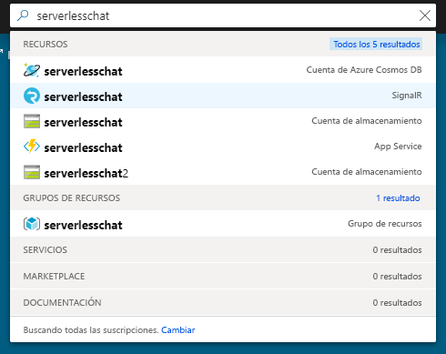

# <a name="quickstart-create-a-chat-room-with-azure-functions-and-signalr-service-using-javascript"></a>Guía de inicio rápido: Creación de un salón de chat con Azure Functions y SignalR Service mediante JavaScript

El servicio Azure SignalR le permite agregar fácilmente funcionalidad en tiempo real a la aplicación. Azure Functions es una plataforma sin servidor que le permite ejecutar el código sin tener que administrar ninguna infraestructura. En esta guía de inicio rápido, obtenga información sobre cómo usar el servicio SignalR y Functions para crear una aplicación de chat sin servidor en tiempo real.

## <a name="prerequisites"></a>Requisitos previos

Esta guía de inicio rápido se puede ejecutar en macOS, Windows o Linux.

Asegúrese de tener instalado un editor de código como [Visual Studio Code](https://code.visualstudio.com/).

Instale [Azure Functions Core Tools (v2)](https://github.com/Azure/azure-functions-core-tools#installing) para ejecutar las aplicaciones de Azure Functions de forma local.

Para instalar extensiones, Azure Functions Core Tools requiere actualmente de la instalación del [SDK de .NET Core](https://www.microsoft.com/net/download). Sin embargo, no se requiere de ningún conocimiento de .NET para compilar aplicaciones de Azure Function de JavaScript.

[!INCLUDE [quickstarts-free-trial-note](../../includes/quickstarts-free-trial-note.md)]

## <a name="log-in-to-azure"></a>Inicio de sesión en Azure

Inicie sesión en Azure Portal en <https://portal.azure.com/> con su cuenta de Azure.

[!INCLUDE [Create instance](includes/signalr-quickstart-create-instance.md)]

[!INCLUDE [Clone application](includes/signalr-quickstart-clone-application.md)]

## <a name="configure-and-run-the-azure-function-app"></a>Configuración y ejecución de la aplicación Azure Function

1. En el explorador que se muestra al abrir Azure Portal, confirme que la instancia del servicio SignalR que implementó anteriormente se ha creado correctamente buscando su nombre en el cuadro de búsqueda de la parte superior del portal. Seleccione la instancia para abrirla.

    

1. Seleccione **Claves** para ver las cadenas de conexión para la instancia del servicio SignalR.

1. Seleccione y copie la cadena de conexión principal.

    

1. En el editor de código, abra la carpeta *src/chat/javascript* en el repositorio clonado.

1. Cambie el nombre de *local.settings.sample.json* a *local.settings.json*.

1. En **local.settings.json**, pegue la cadena de conexión en el valor de la configuración **AzureSignalRConnectionString**. Guarde el archivo.

1. Las funciones de JavaScript se organizan en carpetas. En cada carpeta hay dos archivos: *function.json*, que define los enlaces que se usan en la función, e *index.js*, que es el cuerpo de la función. Hay dos funciones desencadenadas por HTTP en esta aplicación de función:

    - **negotiate**: usa el enlace de entrada *SignalRConnectionInfo* para generar y devolver información de conexión válida.
    - **messages**: recibe un mensaje de chat en el cuerpo de la solicitud y usa el enlace de salida *SignalR* para difundir el mensaje a todas las aplicaciones cliente conectadas.

1. En el terminal, asegúrese de que se encuentra en la carpeta *src/chat/javascript*. Use Azure Functions Core Tools para instalar las extensiones necesarias para ejecutar la aplicación.

    ```bash
    func extensions install
    ```

1. Ejecute la aplicación de función.

    ```bash
    func start
    ```

    

[!INCLUDE [Run web application](includes/signalr-quickstart-run-web-application.md)]

[!INCLUDE [Cleanup](includes/signalr-quickstart-cleanup.md)]

## <a name="next-steps"></a>Pasos siguientes

En este inicio rápido, ha compilado y ejecutado una aplicación sin servidor en tiempo real en VS Code. A continuación, obtenga más información sobre cómo implementar Azure Functions desde VS Code.

> [!div class="nextstepaction"]
> [Implementación de Azure Functions con VS Code](https://docs.microsoft.com/azure/azure-functions/tutorial-javascript-vscode-get-started)