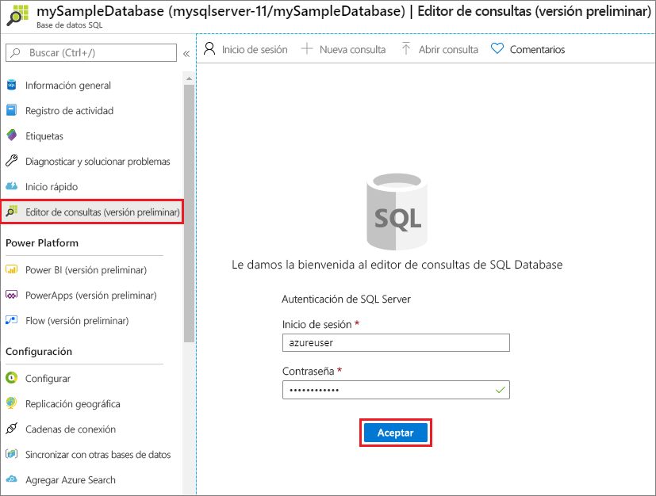
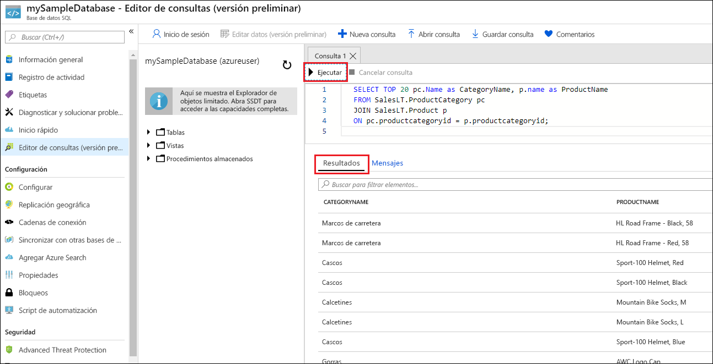

# <a name="quickstart-create-an-azure-sql-database-single-database"></a>Inicio rápido: Creación de una base de datos única de Azure SQL Database

En este inicio rápido, usará Azure Portal, un script de PowerShell o un script de la CLI de Azure para crear una base de datos única en Azure SQL Database. A continuación, realizará una consulta de la base de datos mediante el **editor de consultas** en Azure Portal.

Una [base de datos única](single-database-overview.md) es la opción más rápida y sencilla para Azure SQL Database. Puede administrar una base de datos única dentro de un [servidor](logical-servers.md), que se encuentre dentro de un [grupo de recursos de Azure](../../active-directory-b2c/overview.md) en una región de Azure especificada. En este inicio rápido, se crea un grupo de recursos y un servidor para la nueva base de datos.

Se puede crear una base de datos única en el nivel de proceso *aprovisionado* o *sin servidor*. Una base de datos aprovisionada tiene asignada previamente una cantidad fija de recursos de proceso, que incluyen memoria y CPU, y utiliza uno o dos [modelos de compra](purchasing-models.md). En este inicio rápido se crea una base de datos aprovisionada mediante el modelo de compra [basado en núcleo virtual](service-tiers-vcore.md), pero también puede elegir un modelo [basado en DTU](service-tiers-dtu.md).

El nivel de proceso sin servidor solo está disponible en los modelos de compra basados en núcleo virtual, y tiene una gama de recursos de proceso, como memoria y CPU, que se escalan automáticamente. Para crear una base de datos única en el nivel de proceso sin servidor, consulte [Creación de una base de datos sin servidor](serverless-tier-overview.md#create-a-new-database-in-the-serverless-compute-tier).

## <a name="prerequisite"></a>Requisito previo

- Una suscripción de Azure activa. En caso de no tener ninguna, [cree una cuenta gratuita](https://azure.microsoft.com/free/).

## <a name="create-a-single-database"></a>Crear una base de datos única

[!INCLUDE [sql-database-create-single-database](../includes/sql-database-create-single-database.md)]

## <a name="query-the-database"></a>Consulta de la base de datos

Una vez que haya creado la base de datos, use el **editor de consultas** integrado en Azure Portal para conectarse a la base de datos y realizar consultas en los datos.

1. En el portal, busque y seleccione **Bases de datos SQL** y, a continuación, seleccione su base de datos en la lista.
1. En la página **SQL Database** de su base de datos, seleccione **Editor de consultas (versión preliminar)** en el menú de la izquierda.
1. Escriba la información de inicio de sesión del administrador del servidor y seleccione **Aceptar**.

   

1. Escriba la siguiente consulta en el panel del **Editor de consultas**.

   ```sql
   SELECT TOP 20 pc.Name as CategoryName, p.name as ProductName
   FROM SalesLT.ProductCategory pc
   JOIN SalesLT.Product p
   ON pc.productcategoryid = p.productcategoryid;
   ```

1. Seleccione **Ejecutar** y examine los resultados de la consulta en el panel **Resultados**.

   

1. Cierre la página **Editor de consultas** y seleccione **Aceptar** cuando se le pida que descarte los cambios que no se hayan guardado.

## <a name="clean-up-resources"></a>Limpieza de recursos

Mantenga el grupo de recursos, el servidor y la base de datos única para los pasos siguientes y aprenda a conectarse y consultar la base de datos con distintos métodos.

Cuando haya terminado de usar estos recursos, puede eliminar el grupo de recursos que creó, lo que también eliminará el servidor y la base de datos única que se encuentran del grupo.

### <a name="the-azure-portal"></a>[Portal de Azure](#tab/azure-portal)

Para eliminar **myResourceGroup** y todos sus recursos con Azure Portal:

1. En el portal, busque y seleccione **Grupos de recursos** y, después, seleccione **myResourceGroup** en la lista.
1. En la página del grupo de recursos, seleccione **Eliminar grupo de recursos**.
1. En **Escriba el nombre del grupo de recursos** escriba *myResourceGroup* y luego seleccione **Eliminar**.

### <a name="the-azure-cli"></a>[La CLI de Azure](#tab/azure-cli)

Para eliminar el grupo de recursos y todos sus respectivos recursos, ejecute el siguiente comando de la CLI de Azure con el nombre del grupo de recursos:

```azurecli-interactive
az group delete --name <your resource group>
```

### <a name="powershell"></a>[PowerShell](#tab/azure-powershell)

Para eliminar el grupo de recursos y todos sus respectivos recursos, ejecute el siguiente cmdlet de PowerShell con el nombre del grupo de recursos:

```azurepowershell-interactive
Remove-AzResourceGroup -Name <your resource group>
```

---

## <a name="next-steps"></a>Pasos siguientes

[Conéctese y consulte](connect-query-content-reference-guide.md) la base de datos con diferentes herramientas e idiomas:
> [!div class="nextstepaction"]
> [Conexión y consulta con SQL Server Management Studio](connect-query-ssms.md)
>
> [Conexión y consulta de datos con Azure Data Studio](/sql/azure-data-studio/quickstart-sql-database?toc=/azure/sql-database/toc.json)

¿Quiere optimizar y ahorrar en el gasto en la nube?

> [!div class="nextstepaction"]
> [Comience a analizar los costos con Cost Management](https://docs.microsoft.com/azure/cost-management-billing/costs/quick-acm-cost-analysis?WT.mc_id=costmanagementcontent_docsacmhorizontal_-inproduct-learn)