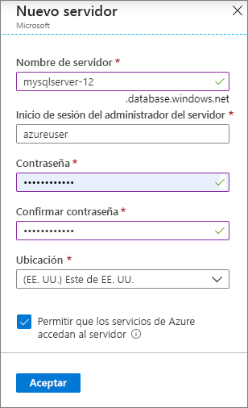
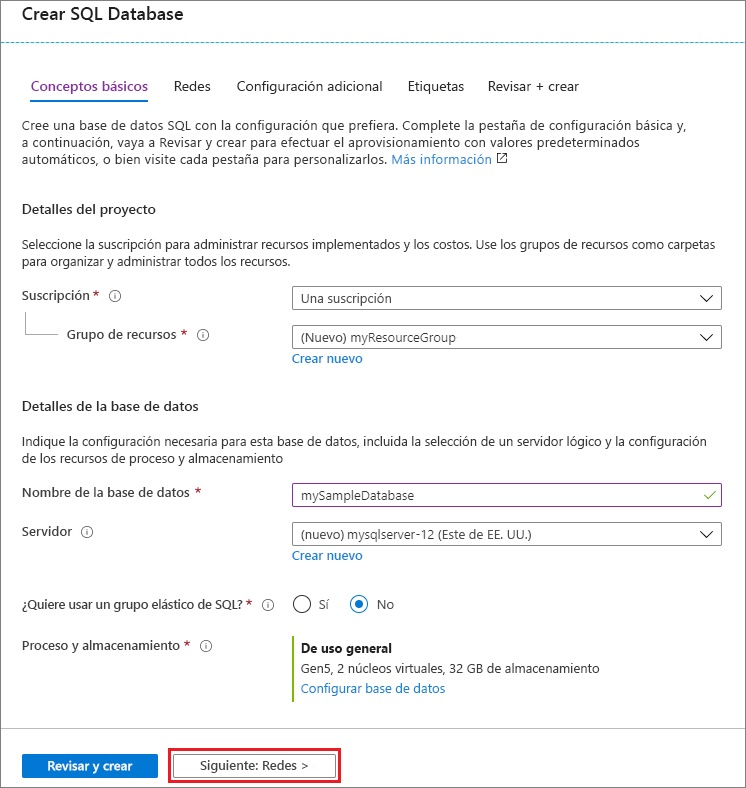
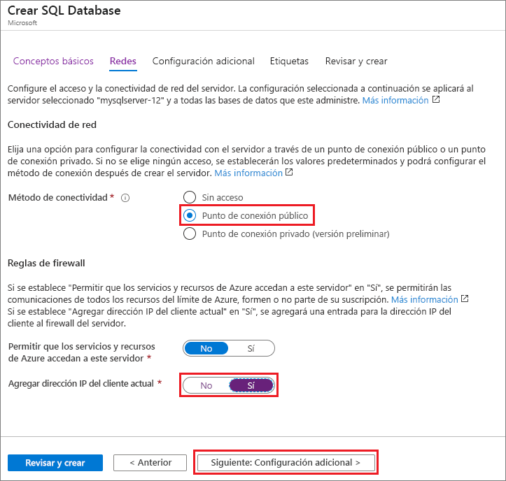
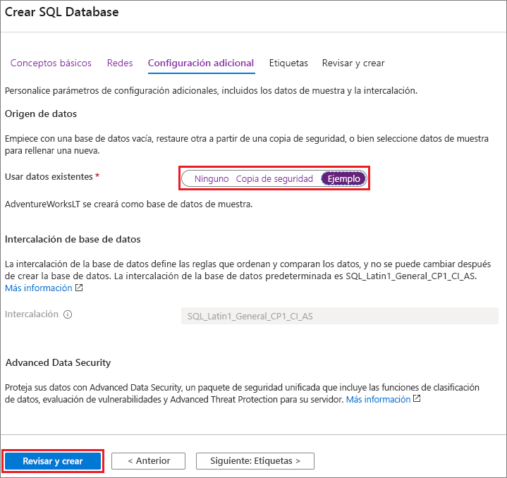

En este paso, se crea un [servidor de SQL Server lógico](../database/logical-servers.md) y una [base de datos única](../database/single-database-overview.md) que use los datos de ejemplo de AdventureWorksLT. Puede crear la base de datos mediante menús y pantallas de Azure Portal, o mediante un script de la CLI de Azure o de PowerShell en Azure Cloud Shell.

Todos los métodos incluyen la configuración de una regla de firewall en el nivel de servidor que permita a la dirección IP pública del equipo que está usando acceder al servidor. Para más información acerca de cómo crear reglas de firewall de nivel de servidor, consulte [Creación de un firewall de nivel de servidor](../database/firewall-create-server-level-portal-quickstart.md). También puede establecer reglas de firewall en el nivel de base de datos. Consulte [Creación de una regla de firewall de nivel de base de datos](/sql/relational-databases/system-stored-procedures/sp-set-database-firewall-rule-azure-sql-database).

# <a name="portal"></a>[Portal](#tab/azure-portal)

Para crear un grupo de recursos, un servidor y una base de datos única en Azure Portal:

1. Inicie sesión en el [portal](https://portal.azure.com).
1. En la barra de búsqueda, busque y seleccione **Azure SQL**.
1. En la página **Azure SQL**, seleccione **Agregar**.

   

1. En la página **Seleccione una opción de implementación de SQL**, seleccione el icono **Bases de datos SQL**, con **Base de datos única** en **Tipo de recurso**. Puede ver más información sobre las diferentes bases de datos si selecciona **Mostrar detalles**.
1. Seleccione **Crear**.

   

1. En la pestaña **Básico** del formulario **Crear base de datos SQL**, en **Detalles del proyecto**, seleccione la **Suscripción** de Azure correcta, si aún no lo está.
1. En **Grupo de recursos**, seleccione **Crear nuevo**, escriba *miGrupoDeRecursos* y seleccione **Aceptar**.
1. En **Detalles de la base de datos**, en **Nombre de la base de datos** escriba *miBaseDeDatosDeEjemplo*.
1. En **Servidor**, seleccione **Crear nuevo** y rellene el formulario **Nuevo servidor** como se indica a continuación:
   - **Nombre del servidor**: escriba *miservidorsql* y algunos caracteres para que el nombre sea único.
   - **Inicio de sesión del administrador del servidor**: escriba *usuarioazure*.
   - **Contraseña**: escriba una contraseña que cumpla los requisitos y escríbala de nuevo en el campo **Confirmar contraseña**.
   - **Ubicación**: despliegue los campos y elija una ubicación, como **(EE. UU.) Este de EE. UU.** .

   Seleccione **Aceptar**.

   

   Registre el inicio de sesión y la contraseña del administrador del servidor para poder iniciar sesión en el servidor y en sus bases de datos. Si olvida el inicio de sesión o la contraseña, puede obtener el nombre de inicio de sesión o restablecer la contraseña en la página **SQL Server** tras crear la base de datos. Para abrir la página **SQL Server**, seleccione el nombre del servidor en la página **Información general** de la base de datos.

1. En **Proceso y almacenamiento**, si desea volver a configurar los valores predeterminados, seleccione **Configurar base de datos**.

   En la página **Configurar**, puede:
   - Cambiar el **Nivel de proceso** de **Aprovisionado** a **Sin servidor**.
   - Revisar y cambiar la configuración de **Núcleos virtuales** y **Tamaño máximo de datos**.
   - Seleccionar **Cambiar configuración** para cambiar la generación del hardware.

   Después de realizar cambios, seleccione **Aplicar**.

1. Seleccione **Siguiente: Redes** en la parte inferior de la página.

   

1. En la pestaña **Redes**, en **Método de conectividad**, seleccione **Punto de conexión público**.
1. En **Reglas de firewall**, establezca **Agregar dirección IP del cliente actual** en **Sí**.
1. Seleccione **Siguiente: Configuración adicional** en la parte inferior de la página.

   
  
   Para más información sobre la configuración del firewall, consulte [Permitir que los servicios y recursos de Azure accedan a este servidor](../database/network-access-controls-overview.md) e [Incorporación de un punto de conexión privado](../database/private-endpoint-overview.md).

1. En la pestaña **Configuración adicional**, en la sección **Orígenes de datos**, en **Usar datos existentes**, seleccione **Ejemplo**.
1. En la parte inferior de la página, seleccione **Revisar y crear**.

   

1. Después de revisar la configuración, seleccione **Crear**.

# <a name="azure-cli"></a>[CLI de Azure](#tab/azure-cli)

Puede crear un grupo de recursos de Azure, un servidor y una base de datos única desde la interfaz de la línea de comandos de Azure (CLI de Azure). Si no desea usar Azure Cloud Shell, [instale la CLI de Azure](/cli/azure/install-azure-cli) en el equipo.

Para ejecutar el ejemplo de código siguiente en Azure Cloud Shell, seleccione **Probar** en la barra de título del ejemplo de código. Cuando se abra Cloud Shell, seleccione **Copiar** en la barra de título del ejemplo de código y pegue el ejemplo de código en la ventana de Cloud Shell. En el código, reemplace `<Subscription ID>` por su identificador de suscripción de Azure y, en `$startip` y `$endip`, reemplace `0.0.0.0` por la dirección IP pública del equipo que está usando.

Siga las indicaciones en pantalla para iniciar sesión en Azure y ejecutar el código.

También puede usar Azure Cloud Shell desde Azure Portal; para ello, seleccione el icono de Cloud Shell en la barra superior.

   

La primera vez que use Cloud Shell en el portal, seleccione **Bash** en el cuadro de diálogo de **bienvenida**. Las sesiones posteriores usarán la CLI de Azure en un entorno de Bash o bien puede seleccionar **Bash** en la barra de control de Cloud Shell.

El siguiente código de la CLI de Azure crea un grupo de recursos, un servidor, una base de datos única y una regla de firewall de IP de nivel de servidor para el acceso al servidor. Asegúrese de registrar el grupo de recursos y los nombres de servidor generados, para poder administrar estos recursos más adelante.

```azurecli-interactive
#!/bin/bash

# Sign in to Azure and set execution context (if necessary)
az login
az account set --subscription <Subscription ID>

# Set the resource group name and location for your server
resourceGroupName=myResourceGroup-$RANDOM
location=westus2

# Set an admin login and password for your database
adminlogin=azureuser
password=Azure1234567

# Set a server name that is unique to Azure DNS (<server_name>.database.windows.net)
servername=server-$RANDOM

# Set the ip address range that can access your database
startip=0.0.0.0
endip=0.0.0.0

# Create a resource group
az group create \
    --name $resourceGroupName \
    --location $location

# Create a server in the resource group
az sql server create \
    --name $servername \
    --resource-group $resourceGroupName \
    --location $location  \
    --admin-user $adminlogin \
    --admin-password $password

# Configure a server-level firewall rule for the server
az sql server firewall-rule create \
    --resource-group $resourceGroupName \
    --server $servername \
    -n AllowYourIp \
    --start-ip-address $startip \
    --end-ip-address $endip

# Create a gen5 2 vCore database in the server
az sql db create \
    --resource-group $resourceGroupName \
    --server $servername \
    --name mySampleDatabase \
    --sample-name AdventureWorksLT \
    --edition GeneralPurpose \
    --family Gen5 \
    --capacity 2 \
```

El código anterior usa estos comandos de la CLI de Azure:

| Get-Help | Descripción |
|---|---|
| [az account set](/cli/azure/account?view=azure-cli-latest#az-account-set) | Establece una suscripción como la suscripción activa actual. |
| [az group create](/cli/azure/group#az-group-create) | Crea un grupo de recursos en el que se almacenan todos los recursos. |
| [az sql server create](/cli/azure/sql/server#az-sql-server-create) | Crea un servidor que hospeda las bases de datos y los grupos elásticos. |
| [az sql server firewall-rule create](/cli/azure/sql/server/firewall-rule##az-sql-server-firewall-rule-create) | Crea una regla de firewall en el nivel de servidor. |
| [az sql db create](/cli/azure/sql/db#az-sql-db-create?view=azure-cli-latest) | Crea una base de datos. |

Para obtener más ejemplos de la CLI de Azure de Azure SQL Database, consulte [Ejemplos de la CLI de Azure](../database/az-cli-script-samples-content-guide.md).

# <a name="powershell"></a>[PowerShell](#tab/azure-powershell)

Puede crear un grupo de recursos, un servidor y una base de datos única mediante Windows PowerShell. Si no desea usar Azure Cloud Shell, [instale el módulo de Azure PowerShell](/powershell/azure/install-az-ps).

[!INCLUDE [updated-for-az](../../../includes/updated-for-az.md)]

Para ejecutar el ejemplo de código siguiente en Azure Cloud Shell, seleccione **Probar** en la barra de título del código. Cuando se abra Cloud Shell, seleccione **Copiar** en la barra de título del ejemplo de código y pegue el ejemplo de código en la ventana de Cloud Shell. En el código, reemplace `<Subscription ID>` por su identificador de suscripción de Azure y, en `$startIp` y `$endIp`, reemplace `0.0.0.0` por la dirección IP pública del equipo que está usando.

Siga las indicaciones en pantalla para iniciar sesión en Azure y ejecutar el código.

También puede usar Azure Cloud Shell desde Azure Portal; para ello, seleccione el icono de Cloud Shell en la barra superior.

   

La primera vez que use Cloud Shell en el portal, seleccione **PowerShell** en el cuadro de diálogo de **bienvenida**. Las sesiones posteriores usarán PowerShell o puede seleccionarlo en la barra de control de Cloud Shell.

El siguiente código de PowerShell crea un grupo de recursos de Azure, un servidor, una base de datos única y una regla de firewall para el acceso al servidor. Asegúrese de registrar el grupo de recursos y los nombres de servidor generados, para poder administrar estos recursos más adelante.

   ```powershell-interactive
   # Set variables for your server and database
   $subscriptionId = '<SubscriptionID>'
   $resourceGroupName = "myResourceGroup-$(Get-Random)"
   $location = "West US"
   $adminLogin = "azureuser"
   $password = "Azure1234567"
   $serverName = "mysqlserver-$(Get-Random)"
   $databaseName = "mySampleDatabase"

   # The ip address range that you want to allow to access your server
   $startIp = "0.0.0.0"
   $endIp = "0.0.0.0"

   # Show randomized variables
   Write-host "Resource group name is" $resourceGroupName
   Write-host "Server name is" $serverName

   # Connect to Azure
   Connect-AzAccount

   # Set subscription ID
   Set-AzContext -SubscriptionId $subscriptionId

   # Create a resource group
   Write-host "Creating resource group..."
   $resourceGroup = New-AzResourceGroup -Name $resourceGroupName -Location $location -Tag @{Owner="SQLDB-Samples"}
   $resourceGroup

   # Create a server with a system wide unique server name
   Write-host "Creating primary server..."
   $server = New-AzSqlServer -ResourceGroupName $resourceGroupName `
      -ServerName $serverName `
      -Location $location `
      -SqlAdministratorCredentials $(New-Object -TypeName System.Management.Automation.PSCredential `
      -ArgumentList $adminLogin, $(ConvertTo-SecureString -String $password -AsPlainText -Force))
   $server

   # Create a server firewall rule that allows access from the specified IP range
   Write-host "Configuring firewall for primary server..."
   $serverFirewallRule = New-AzSqlServerFirewallRule -ResourceGroupName $resourceGroupName `
      -ServerName $serverName `
      -FirewallRuleName "AllowedIPs" -StartIpAddress $startIp -EndIpAddress $endIp
   $serverFirewallRule

   # Create General Purpose Gen4 database with 1 vCore
   Write-host "Creating a gen5 2 vCore database..."
   $database = New-AzSqlDatabase  -ResourceGroupName $resourceGroupName `
      -ServerName $serverName `
      -DatabaseName $databaseName `
      -Edition GeneralPurpose `
      -VCore 2 `
      -ComputeGeneration Gen5 `
      -MinimumCapacity 2 `
      -SampleName "AdventureWorksLT"
   $database
   ```

En el código anterior se usan estos cmdlets de PowerShell:

| Get-Help | Notas |
|---|---|
| [New-AzResourceGroup](/powershell/module/az.resources/new-azresourcegroup) | Crea un grupo de recursos en el que se almacenan todos los recursos. |
| [New-AzSqlServer](/powershell/module/az.sql/new-azsqlserver) | Crea un servidor que hospeda las bases de datos y los grupos elásticos. |
| [New-AzSqlServerFirewallRule](/powershell/module/az.sql/new-azsqlserverfirewallrule) | Crea una regla de firewall en el nivel de servidor para un servidor. |
| [New-AzSqlDatabase](/powershell/module/az.sql/new-azsqldatabase) | Crea una base de datos. |

Para obtener más ejemplos de PowerShell de Azure SQL Database, consulte [Ejemplos de Azure PowerShell](../database/powershell-script-content-guide.md).

---
