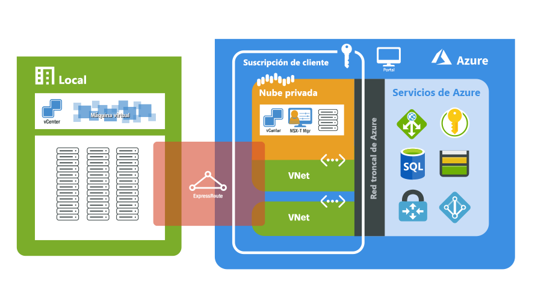

# ¿Qué es Azure VMware Solution?

Azure VMware Solution le proporciona nubes privadas que contienen clústeres de vSphere, creados a partir de una infraestructura dedicada de Azure sin sistema operativo. La implementación mínima inicial es de tres hosts, pero se pueden agregar más hosts de uno en uno, hasta un máximo de 16 hosts por clúster.  Todas las nubes privadas aprovisionadas tienen vCenter Server, vSAN, vSphere y NSX-T. Puede migrar cargas de trabajo de sus entornos locales, implementar nuevas máquinas virtuales y usar servicios de Azure desde sus nubes privadas.

Azure VMware Solution es una solución validada de VMware con validación y pruebas continuas de sus mejoras y actualizaciones. Microsoft administra y mantiene el software y la infraestructura en la nube privada. Esto le permite centrarse en el desarrollo y la ejecución de cargas de trabajo en las nubes privadas. 

En este diagrama se muestra la adyacencia entre las nubes privadas y las redes virtuales en Azure, los servicios de Azure y los entornos locales. El acceso a la red desde nubes privadas a servicios o redes virtuales de Azure proporciona una integración controlada mediante Acuerdo de Nivel de Servicio de los puntos de conexión de servicio de Azure. Global Reach de ExpressRoute conecta su entorno local y la nubes privada de Azure VMware Solution. 

## Hosts, clústeres y nubes privadas

Las nubes privadas y los clústeres de Azure VMware Solution se crean a partir de un host de infraestructura de Azure hiperconvergida completa. Los hosts de gama alta tienen 576 GB de RAM y dos procesadores Intel de 18 núcleos a 2,3 GHz. Los hosts de gama alta tienen dos grupos de discos vSAN con un nivel de capacidad de vSAN sin procesar de 15,36 TB (SSD) y un nivel de caché de vSAN de 3,2 TB (NVMe).

Las nubes privadas nuevas se implementan desde Azure Portal o la CLI de Azure.

## Redes

[!INCLUDE [avs-networking-description](includes/azure-vmware-solution-networking-description.md)]

Para más información, consulte [Conceptos de redes](concepts-networking.md).

## Acceso y seguridad

Para mejorar la seguridad, las nubes privadas de Azure VMware Solution usan el control de acceso basado en rol de vSphere. Puede integrar las funcionalidades LDAP del inicio de sesión único de vSphere con Azure Active Directory. Para más información, consulte [Conceptos de acceso y de identidad](concepts-identity.md).  

El cifrado de datos en reposo de vSAN está habilitado de forma predeterminada y se usa para proporcionar seguridad al almacén de datos de vSAN. Para más información, consulte [Conceptos sobre Storage](concepts-storage.md).

## Mantenimiento del ciclo de vida del host y del software

Las actualizaciones periódicas del software de VMware y de la nube privada de Azure VMware Solution garantizan que las nubes privadas disfruten de la seguridad, estabilidad y los conjuntos de características más recientes. Para más información, consulte [Actualizaciones y mejoras de la nube privada](concepts-upgrades.md).

## Supervisión de una nube privada

Una vez que se ha implementado Azure VMware Solution en la suscripción, se generan [registros de Azure Monitor](../azure-monitor/overview.md) automáticamente. 

En la nube privada, puede:
- Recopilar registros en cada una de las máquinas virtuales.
- [Descargar e instalar el agente MMA](../azure-monitor/platform/log-analytics-agent.md#installation-options) en máquinas virtuales Linux y Windows.
- Habilite la [extensión de Azure Diagnostics](../azure-monitor/platform/diagnostics-extension-overview.md).
- [Creación y ejecución de nuevas consultas](../azure-monitor/platform/data-platform-logs.md#log-queries).
- Ejecute las mismas consultas que normalmente ejecuta en las máquinas virtuales.

Los patrones de supervisión dentro de Azure VMware Solution son similares a los de Azure Virtual Machines en la plataforma IaaS. Para obtener información adicional y de procedimientos, consulte [Supervisión de máquinas virtuales de Azure con Azure Monitor](../azure-monitor/insights/monitor-vm-azure.md).

## Pasos siguientes

El siguiente paso es obtener información sobre los [conceptos clave clústeres y nubes privadas](concepts-private-clouds-clusters.md).

<!-- LINKS - external -->

<!-- LINKS - internal -->
[concepts-private-clouds-clusters]: ./concepts-private-clouds-clusters.md
