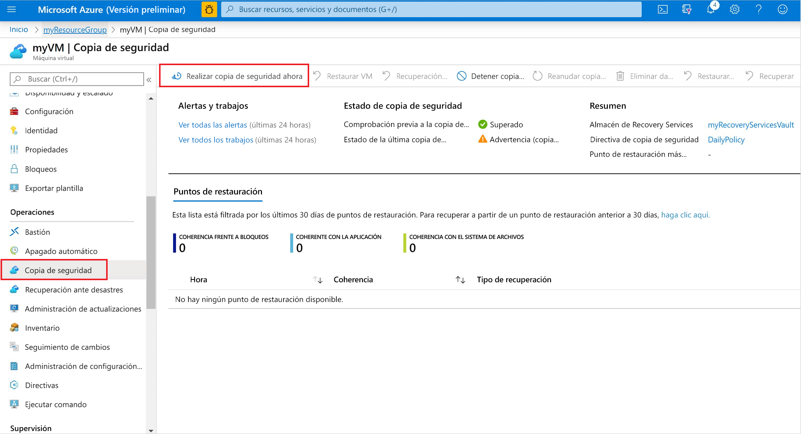
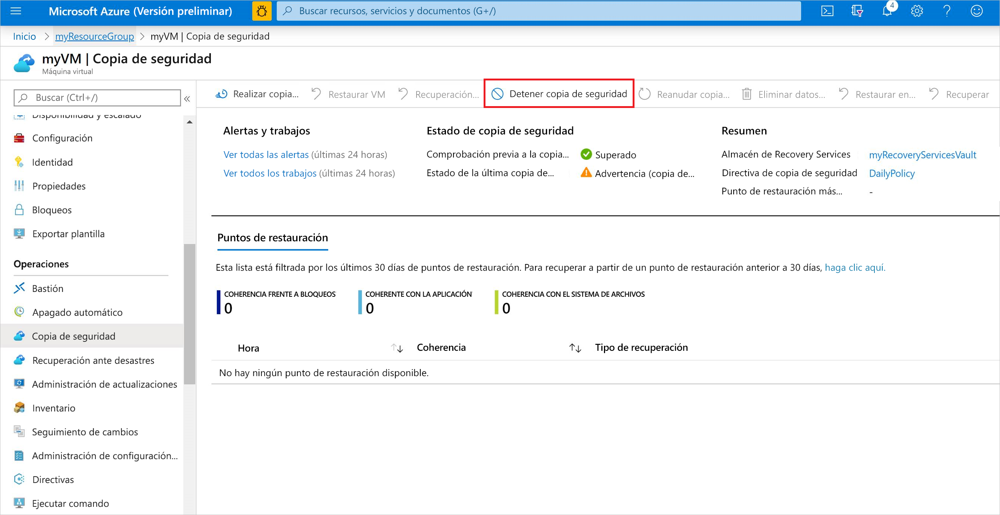

# Copia de seguridad de una máquina virtual en Azure

Se pueden crear copias de seguridad de Azure a través de Azure Portal. Este método proporciona una interfaz de usuario basada en el explorador para crear y configurar copias de seguridad de Azure y todos los recursos asociados. Para proteger sus datos realice copias de seguridad a intervalos regulares. Azure Backup crea puntos de recuperación que se guardan en almacenes de recuperación con redundancia geográfica. En este artículo se explica cómo realizar una copia de seguridad de una máquina virtual (VM) con Azure Portal.

Esta guía de inicio rápido permite realizar copias de seguridad en una máquina virtual de Azure existente. Si necesita crear una máquina virtual, puede [crearla con Azure Portal](../virtual-machines/windows/quick-create-portal.md).

## Inicio de sesión en Azure

Inicie sesión en el [Azure Portal](https://portal.azure.com).

## Selección de la máquina virtual de la que desea realizar una copia de seguridad

Cree una copia de seguridad diaria programada simple en un almacén de Recovery Services.

1. En el menú de la izquierda, haga clic en **Máquinas virtuales**.
2. En la lista, elija la máquina virtual de la que desea realizar una copia de seguridad. Si ha usado los comandos del ejemplo de la guía de inicio rápido de máquinas virtuales, la máquina virtual se denomina *myVM* y se encuentra en el grupo de recursos *myResourceGroup*.
3. En la sección **Configuración**, elija **Copia de seguridad**. Se abre la ventana **Habilitar copia de seguridad**.

## Habilitar la copia de seguridad en una máquina virtual

Un almacén de Recovery Services es un contenedor lógico que almacena los datos de copia de seguridad de los recursos protegidos, como las máquinas virtuales de Azure. Cuando se ejecuta el trabajo de copia de seguridad para un recurso protegido, crea un punto de recuperación en el almacén de Recovery Services. Posteriormente, se puede usar uno de estos puntos de recuperación para restaurar los datos a un momento dado en el tiempo.

1. Seleccione **Crear nuevo** y especifique el nombre del nuevo almacén, como por ejemplo, *myRecoveryServicesVault*.
2. Si no está seleccionada, elija la opción **Usar existente** y, después, seleccione el grupo de recursos de la máquina virtual en el menú desplegable.

    

    De forma predeterminada, el almacén se establece para el almacenamiento con redundancia geográfica. Para proteger aún más los datos, este nivel de redundancia del almacenamiento garantiza que los datos de las copia de seguridad se replican en una región de Azure secundaria que se encuentra a cientos de kilómetros de la región primaria.

    Cree y use directivas para definir cuándo se ejecuta un trabajo de copia de seguridad y durante cuánto tiempo se almacenan los puntos de recuperación. La directiva de protección predeterminada ejecuta un trabajo de copia de seguridad cada día y conserva los puntos de seguridad durante 30 días. Estos valores de la directiva predeterminada se pueden usar para proteger rápidamente la máquina virtual.

3. Para aceptar los valores de la directiva de copia de seguridad predeterminada, seleccione **Habilitar copia de seguridad**.

El proceso de crear el almacén de Recovery Services lleva algunos minutos.

## Inicio de un trabajo de copia de seguridad

Puede iniciar una copia de seguridad ahora, en lugar de esperar a que la directiva predeterminada ejecute el trabajo en el momento programado. El primer trabajo de copia de seguridad crea un punto de recuperación completa. Cada uno de los trabajo de copia de seguridad posteriores a esta copia de seguridad inicial crea puntos de recuperación incremental. Los puntos de recuperación incremental ahorran tiempo y espacio de almacenamiento, ya que solo transfieren los cambios realizados desde la última copia de seguridad.

1. En la ventana **Copia de seguridad** de la máquina virtual, seleccione **Realizar copia de seguridad ahora**.

    

2. Para aceptar la directiva de retención de 30 días de las copias de seguridad, deje la fecha predeterminada en **Conservar copia de seguridad hasta**. Para iniciar el trabajo, seleccione **Copia de seguridad**.

## Supervisión del trabajo de copia de seguridad

En la ventana **Copia de seguridad** de la máquina virtual, se muestran el estado de la copia de seguridad y el número de puntos de restauración completados. Una vez que el trabajo de copia de seguridad de la máquina virtual haya finalizado, la información acerca de la **hora de la última copia de seguridad**, el **último punto de restauración** y el **punto de restauración más antiguo** se muestra en el lado derecho de la ventana **Información general**.

## Limpieza de la implementación

Cuando deje de ser necesaria, puede deshabilitar la protección en la máquina virtual, quitar los puntos de restauración y el almacén de Recovery Services, y eliminar tanto el grupo de recursos como los recursos de la máquina virtual asociados

Si va a continuar con un tutorial de Backup en el que se explique cómo restaurar los datos en una máquina virtual, omita los pasos de esta sección y vaya a [Pasos siguientes](#next-steps).

1. Seleccione la opción **Copia de seguridad** en la máquina virtual.

2. Seleccione **... Más** para mostrar las opciones adicionales y, después, elija **Detener copia de seguridad**.

    

3. Seleccione **Eliminar datos de copia de seguridad** en el menú desplegable.

4. En el cuadro de diálogo **Type the name of the Backup item** (Escriba el nombre del elemento de copia de seguridad), escriba el nombre de la máquina virtual, por ejemplo *myVM*. Seleccione **Detener copia de seguridad**.

    Una vez que la copia de seguridad de la máquina virtual se haya detenido y se hayan quitado los puntos de recuperación, puede eliminar el grupo de recursos. Si ha utilizado una máquina virtual existente, puede dejar el mismo grupo de recursos y la misma máquina virtual.

5. En el menú de la izquierda, seleccione **Grupos de recursos**.
6. En la lista, seleccione un grupo de recursos. Si ha usado los comandos del ejemplo de la guía de inicio rápido de máquinas virtuales, el grupo de recursos se denominará *myResourceGroup*.
7. Seleccione **Eliminar grupo de recursos**. Para confirmar, escriba el nombre del grupo de recursos y seleccione **Eliminar**.

    

## Pasos siguientes

En esta guía de inicio rápido, ha creado un almacén de Recovery Services, ha habilitado la protección en una máquina virtual y ha creado el punto de recuperación inicial. Para más información acerca de Azure Backup, y Recovery Services, continúe con los tutoriales.

> [!div class="nextstepaction"]
> [Copia de seguridad de varias máquinas virtuales de Azure](./tutorial-backup-vm-at-scale.md)
