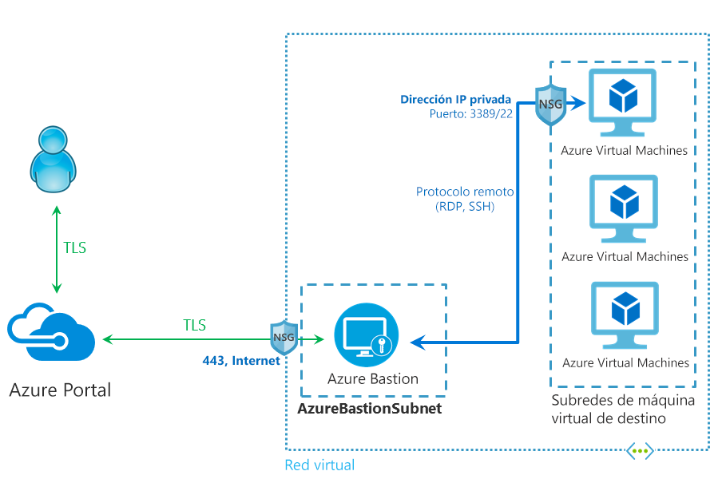

# ¿Qué es Azure Bastion?

Azure Bastion es un nuevo servicio PaaS totalmente administrado por la plataforma que se aprovisiona en redes virtuales. Proporciona una conexión RDP/SSH segura e ininterrumpida a las máquinas virtuales directamente en Azure Portal a través de SSL. Cuando se conecta a través de Azure Bastion, las máquinas virtuales no necesitan una dirección IP pública.

Bastion proporciona conectividad segura de RDP y SSH a todas las máquinas virtuales de la red virtual en la que se aprovisiona. El uso de Azure Bastion protege las máquinas virtuales frente a la exposición de los puertos de RDP/SSH al mundo exterior, al tiempo que ofrece acceso seguro mediante RDP/SSH. Con Azure bastión, puede contarse a la máquina virtual directamente desde Azure Portal. No es necesario un cliente, agente o componente de software adicional.

## Architecture

La implementación de Azure Bastion se realiza por red virtual, no por suscripción o cuenta, ni por máquina virtual. Una vez que haya aprovisionado un servicio Azure Bastion en su red virtual, la experiencia de RDP/SSH estará disponible para todas las máquinas virtuales de la misma red virtual.

RDP y SSH son algunos de los medios fundamentales a mediante los que puede conectarse a las cargas de trabajo que se ejecutan en Azure. La exposición de los puertos RDP/SSH a través de Internet no se conveniente y se considera una superficie de amenaza considerable. Esto suele deberse a las vulnerabilidades del protocolo. Para contener esta superficie de amenaza, puede implementar hosts de bastión (también conocidos como servidores de salto) en la parte pública de la red perimetral. Los servidores host de bastión están diseñados y configurados para resistir los ataques. Los servidores de bastión también proporcionan conectividad RDP y SSH con las cargas de trabajo que se encuentran detrás del bastión, así como más adentro en la red.

Esta ilustración muestra la arquitectura de una implementación de Azure Bastion. En este diagrama:

* El host de Bastion se implementa en la red virtual.
* El usuario se conecta a Azure Portal con cualquier explorador HTML5.
* El usuario selecciona la máquina virtual a la que conectarse.
* Con un solo clic, la sesión RDP/SSH se abre en el explorador.
* No se requiere ninguna dirección IP pública en la máquina virtual de Azure.

## Principales características

Las siguientes características están disponibles:

* **RDP y SSH directamente en Azure Portal:** Puede ir directamente a la sesión RDP y SSH en Azure Portal con un solo clic y sin problemas.
* **Sesión remota a través de SSL y firewall para RDP/SSH:** Azure Bastion usa un cliente web basado en HTML5 que automáticamente se transmite al dispositivo local, para que obtenga la sesión de RDP/SSH a través de SSL en el puerto 443, lo que le permite recorrer los firewalls corporativos de forma segura.
* **No se requiere ninguna dirección IP pública en la máquina virtual de Azure:** Azure Bastion abre la conexión RDP/SSH a la máquina virtual de Azure con la dirección IP privada en la máquina virtual. No necesita una dirección IP pública en su máquina virtual.
* **No hay problemas de administración de los NSG:** Azure Bastion es un servicio PaaS de Azure de plataforma totalmente administrada que se refuerza internamente para proporcionar una conexión RDP/SSH segura. No es necesario aplicar los NSG en la subred de Azure Bastion. Dado que Azure Bastion se conecta a las máquinas virtuales a través de la dirección IP privada, puede configurar los NSG para permitir RDP o SSH solo desde Azure Bastion. De este modo se evita tener que administrar los NSG cada vez que necesite conectarse de forma segura a las máquinas virtuales.
* **Protección frente al examen de puertos:** Ya no es necesario exponer las máquinas virtuales a Internet pública, las máquinas virtuales están protegidas contra la exploración de puertos por parte de usuarios malintencionados o no autorizados que se encuentran fuera de la red virtual.
* **Protección frente a explotaciones de día cero. Protección en un solo lugar:** Azure Bastion es un servicio PaaS totalmente administrado de plataforma. Dado que se encuentra en el perímetro de la red virtual, no es necesario preocuparse por proteger cada una de las máquinas virtuales de la red virtual. La plataforma de Azure protege contra ataques de día cero manteniendo automáticamente el servicio Azure Bastion protegido y siempre actualizado.

## Preguntas más frecuentes

[!INCLUDE [Bastion FAQ](../../includes/bastion-faq-include.md)]

## Pasos siguientes

* [Crear un recurso de un host de Azure Bastion](bastion-create-host-portal.md).
* Obtenga información sobre las demás [funcionalidades de red](../networking/networking-overview.md) clave de Azure.
