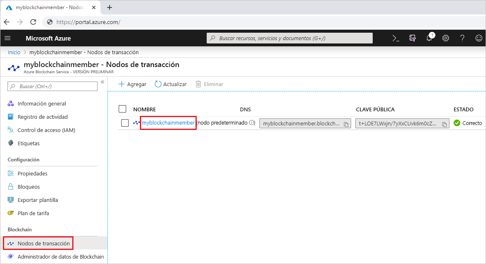
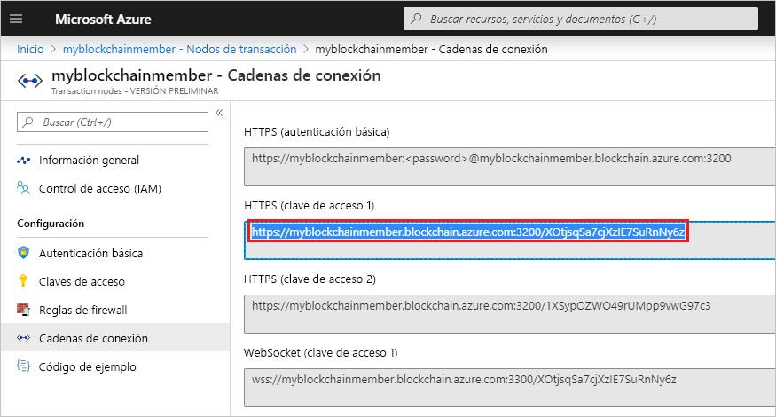
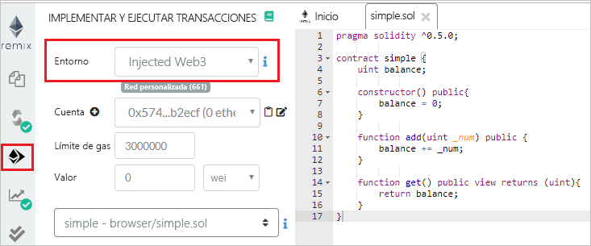
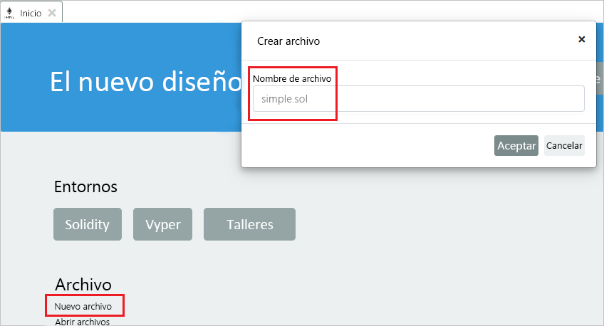
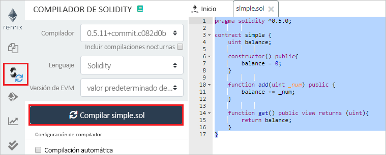
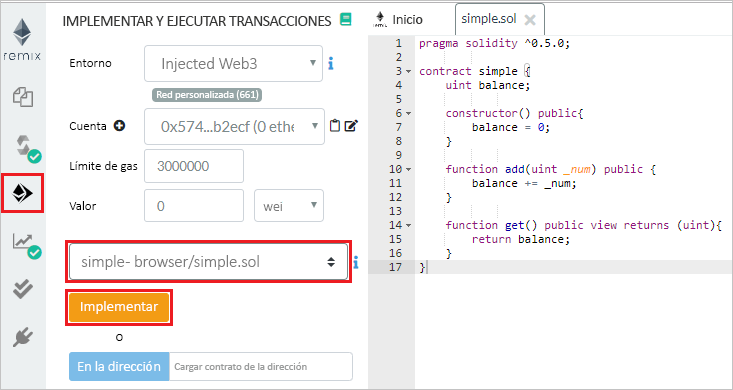
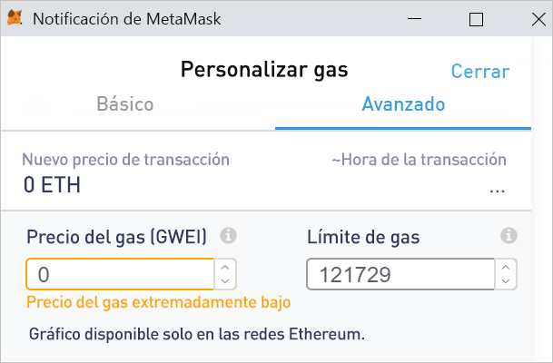
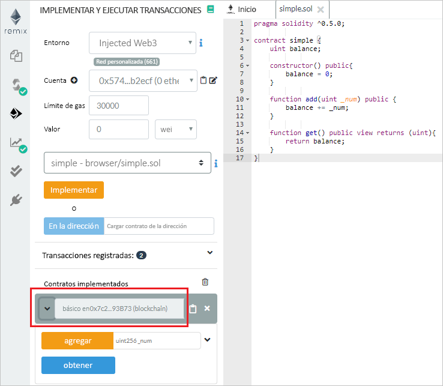

# <a name="quickstart-use-metamask-to-connect-and-deploy-a-smart-contract"></a>Inicio rápido: Uso de MetaMask para conectarse a un contrato inteligente e implementarlo

En este inicio rápido, usará MetaMask para conectarse a una red de Azure Blockchain Service y usará Remix para implementar un contrato inteligente. MetaMask es una extensión del navegador para administrar una cartera de Ether y realizar acciones de contrato inteligente.

[!INCLUDE [quickstarts-free-trial-note](../../../includes/quickstarts-free-trial-note.md)]

## <a name="prerequisites"></a>Requisitos previos

* [Crear un miembro de Azure Blockchain](create-member.md)
* Instalar la [extensión del explorador MetaMask](https://metamask.io)
* Generar una [cartera](https://metamask.zendesk.com/hc/en-us/articles/360015488971-New-to-MetaMask-Learn-How-to-Setup-MetaMask-the-First-Time) de MetaMask

## <a name="get-endpoint-address"></a>Obtención de la dirección de punto de conexión

Necesitará la dirección de punto de conexión de Azure Blockchain Service para conectarse a la red de cadena de bloques. Puede encontrar la dirección de punto de conexión y las claves de acceso en Azure Portal.

1. Inicie sesión en el [Azure Portal](https://portal.azure.com).
1. Vaya al miembro de Azure Blockchain Service. Seleccione **Nodos de transacción** y el vínculo al nodo de transacción predeterminado.

    

1. Seleccione **Cadenas de conexión > Claves de acceso**.
1. Copie la dirección de punto de conexión de **HTTPS (Access key 1)** (HTTPS [clave de acceso 1]). La necesitará en la próxima sección.

    

## <a name="connect-metamask"></a>Conexión de MetaMask

1. Abra la extensión del explorador MetaMask e inicie sesión.
1. En la lista desplegable de redes, seleccione **Custom RPC** (RPC personalizado).

    

1. En **New Network > New RPC URL** (Nueva red > Nueva URL de RPC), especifique la dirección de punto de conexión copiada de la sección anterior.
1. Seleccione **Guardar**.

    Si la conexión se realizó correctamente, la red privada se muestra en la lista desplegable de redes.

    

## <a name="deploy-smart-contract"></a>Implementación de un contrato inteligente

Remix es un entorno de desarrollo de Solidity basado en explorador. Cuando se usan MetaMask y Remix juntos, puede implementar y realizar acciones sobre los contratos inteligentes.

1. Abra el explorador y vaya a `https://remix.ethereum.org`.
1. Seleccione **Run** (Ejecutar). 

    MetaMask establece **Environment** (Entorno) en **Injected Web3** (Web3 insertado) y **Account** (Cuenta) en su red.

    

1. Seleccione **Create new file** (Crear archivo).

    Asigne el nombre `simple.sol` al archivo nuevo.

    

    Seleccione **Aceptar**.

1. En el editor Remix, pegue el siguiente código de **contrato inteligente sencillo**.

    ```solidity
    pragma solidity ^0.5.0;
             
    contract simple {
        uint balance;
                 
        constructor() public{
            balance = 0;
        }
                 
        function add(uint _num) public {
            balance += _num;
        }
                 
        function get() public view returns (uint){
            return balance;
        }
    }
    ```

    El **contrato simple** declara una variable de estado denominada **balance**. Hay dos funciones definidas. La función **add** agrega un número a **balance**. La función **get** devuelve el valor de **balance**.

1. Para compilar el contrato, seleccione **Compile > Start to compile** (Compilar > Empezar a compilar). Si la operación tiene éxito, se muestra un recuadro verde con el nombre del contrato.

    

1. Para ejecutar el contrato, seleccione la pestaña **Run** (Ejecutar). Seleccione el contrato **simple** (sencillo) y haga clic en **Deploy** (Implementar).

    

1. Se muestra una notificación de MetaMask que le avisa de que no hay fondos suficientes para realizar la transacción.

    Con una red pública de cadena de bloques, necesitaría Ether para pagar el costo de la transacción. Puesto que se trata de una red privada de un consorcio, puede establecer el precio del gas en cero.

1.  Seleccione **Gas Fee > Edit > Advanced** (Tarifa de gas > Editar > Avanzado) y establezca **Gas Price** (Precio del gas) en 0.

    

    Seleccione **Guardar**.

1. Seleccione **Confirm** (Confirmar) para implementar el contrato inteligente en la cadena de bloques.
1. En la sección **Deployed Contracts** (Contratos implementados), expanda el contrato **simple** (sencillo).

    

    Hay dos acciones **add** (agregar) y **get** (obtener) que se asignan a las funciones definidas en el contrato.

1. Para realizar una transacción **add** sobre la cadena de bloques, escriba un número para agregar y, luego, seleccione **add** (agregar).
1. Al igual que cuando implementó el contrato, se muestra una notificación de MetaMask que le avisa de que no hay fondos suficientes para realizar la transacción.

    Puesto que se trata de una red privada de un consorcio, podemos establecer el precio del gas en cero.

1.  Seleccione **Gas Fee > Edit > Advanced** (Tarifa de gas > Editar > Avanzado), establezca **Gas Price** (Precio del gas) en 0 y seleccione **Save** (Guardar).
1. Seleccione **Confirm** (Confirmar) para realizar la transacción sobre la cadena de bloques.
1. Seleccione la acción **get** (obtener). Esta es una llamada a los datos del nodo de consulta. No es necesaria una transacción.
1. En el panel de depuración de Remix, puede ver detalles acerca de las transacciones sobre la cadena de bloques.

    

    Puede ver la creación del contrato **simple** (sencillo), la transacción de **simple.add** y la llamada a **simple.get**.

1. También puede ver el historial de transacciones en MetaMask. Abra la extensión del explorador MetaMask.
1. En la sección **History** (Historial), puede ver un registro del contrato implementado y de las transacciones.

## <a name="next-steps"></a>Pasos siguientes

En este tutorial, usó la extensión del explorador MetaMask para conectarse a un nodo de transacción de Azure Blockchain Service, implementar un contrato inteligente y enviar una transacción a la cadena de bloques. Pruebe el siguiente tutorial para implementar y enviar una transacción con Truffle.

> [!div class="nextstepaction"]
> [Envío de una transacción](send-transaction.md)