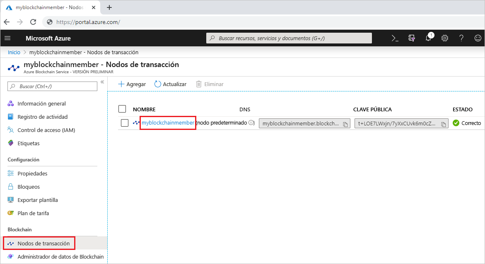

# <a name="quickstart-use-truffle-to-connect-to-an-azure-blockchain-service-network"></a>Inicio rápido: Uso de Truffle para conectarse a una red de Azure Blockchain Service

Truffle es un entorno de desarrollo de cadena de bloques que puede usarse para conectarse a un nodo de Azure Blockchain Service.

[!INCLUDE [quickstarts-free-trial-note](../../../includes/quickstarts-free-trial-note.md)]

## <a name="prerequisites"></a>Requisitos previos

* [Crear un miembro de Azure Blockchain](create-member.md)
* Instale [Truffle](https://github.com/trufflesuite/truffle). Para usar Truffle es necesario instalar varias herramientas, como [Node.js](https://nodejs.org) y [Git](https://git-scm.com/book/en/v2/Getting-Started-Installing-Git).
* Instale [Python 2.7.15](https://www.python.org/downloads/release/python-2715/). Python es necesario para Web3.

## <a name="create-truffle-project"></a>Creación de un proyecto de Truffle

1. Abra un símbolo del sistema o shell de Node.js.
1. Cambie el directorio por el lugar donde quiere crear el directorio del proyecto de Truffle.
1. Cree un directorio para el proyecto y cambie la ruta de acceso para que señale al nuevo directorio. Por ejemplo,

    ``` bash
    mkdir truffledemo
    cd truffledemo
    ```

1. Inicialice el proyecto de Truffle.

    ``` bash
    truffle init
    ```

1. Instale Ethereum JavaScript API web3 en la carpeta del proyecto. Actualmente, se requiere web3 1.0.0-beta.37.

    ``` bash
    npm install web3@1.0.0-beta.37
    ```

    Puede que reciba advertencias de npm durante la instalación.

1. Inicie la consola de desarrollo interactiva de Truffle.

    ``` bash
    truffle develop
    ```

    Truffle crea una cadena de bloques de desarrollo local y proporciona una consola interactiva.

## <a name="connect-to-transaction-node"></a>Conexión al nodo de transacción

Use *Web3* para la conexión al nodo de transacción. Puede obtener la cadena de conexión de *Web3* en Azure Portal.

1. Inicie sesión en el [Azure Portal](https://portal.azure.com).
1. Vaya al miembro de Azure Blockchain Service. Seleccione **Nodos de transacción** y el vínculo al nodo de transacción predeterminado.

    

1. Seleccione **Código de ejemplo > Web3**.
1. Copie el código de JavaScript de **HTTPS (Access key 1)** (HTTPS [clave de acceso 1]). Necesitará el código de la consola de desarrollo interactiva de Truffle.

    

1. Pegue el código de JavaScript del paso anterior en la consola de desarrollo interactiva de Truffle. El código crea un objeto web3 que está conectado a su nodo de transacción de Azure Blockchain Service.

    Salida de ejemplo:

    ```bash
    truffle(develop)> var Web3 = require("Web3");
    truffle(develop)> var provider = new Web3.providers.HttpProvider("https://myblockchainmember.blockchain.azure.com:3200/hy5FMu5TaPR0Zg8GxiPwned");
    truffle(develop)> var web3 = new Web3(provider);
    ```

    Puede llamar a los métodos del objeto **web3** para interactuar con el nodo de la transacción.

1. Llame al método **getBlockNumber** para devolver el número de bloque actual.

    ```bash
    web3.eth.getBlockNumber();
    ```

    Salida de ejemplo:

    ```bash
    truffle(develop)> web3.eth.getBlockNumber();
    18567
    ```
1. Salga de la consola de desarrollo de Truffle.

    ```bash
    .exit
    ```

## <a name="next-steps"></a>Pasos siguientes

En este tutorial, creó un proyecto de Truffle para conectarse a su nodo de transacción predeterminado de Azure Blockchain Service.

Pruebe el siguiente tutorial para usar Truffle para enviar una transacción a la red de cadena de bloques del consorcio.

> [!div class="nextstepaction"]
> [Envío de una transacción](send-transaction.md)