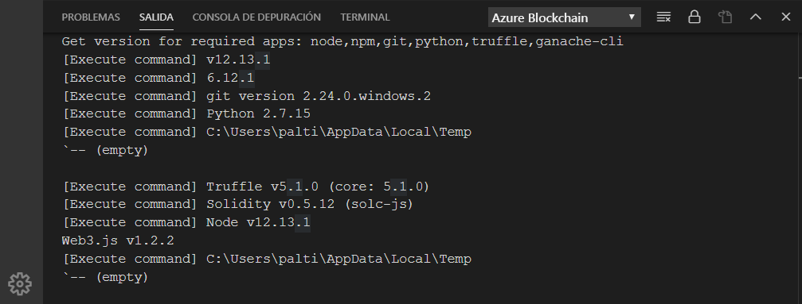
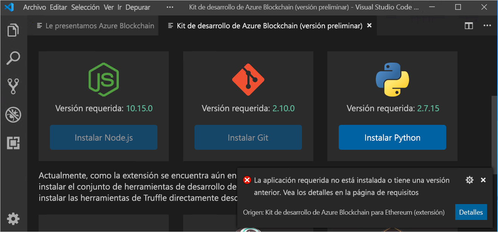

# Inicio rápido: Uso de Visual Studio Code para conectarse a una red del consorcio de Azure Blockchain Service

En este inicio rápido, debe instalar y usar el kit de desarrollo de Azure Blockchain para la extensión de Visual Studio Code para Ethereum a fin de asociar a un consorcio en Azure Blockchain Service. El kit de desarrollo de Azure Blockchain simplifica la creación, conexión, compilación e implementación de contratos inteligentes en libros de contabilidad de Ethereum. 

[!INCLUDE [quickstarts-free-trial-note](../../../includes/quickstarts-free-trial-note.md)]

## Requisitos previos

* Realizar el tutorial [Quickstart: Creación de un miembro de cadena de bloques mediante Azure Portal](create-member.md) o [Inicio rápido: Creación de un miembro de cadena de bloques de Azure Blockchain Service mediante la CLI de Azure](create-member-cli.md)
* [Visual Studio Code](https://code.visualstudio.com/Download)
* [Kit de desarrollo de Azure Blockchain para la extensión de Ethereum](https://marketplace.visualstudio.com/items?itemName=AzBlockchain.azure-blockchain)
* [Node.js](https://nodejs.org)
* [Git](https://git-scm.com)
* [Python](https://www.python.org/downloads/release/python-2715/) Agregue python.exe a la ruta de acceso. Se necesita Python en la ruta de acceso para el kit de desarrollo de Azure Blockchain.
* [Truffle](https://www.trufflesuite.com/docs/truffle/getting-started/installation)
* [CLI de Ganache](https://github.com/trufflesuite/ganache-cli)

### Comprobación del entorno del kit de desarrollo de Azure Blockchain

El kit de desarrollo de Azure Blockchain comprueba que se han cumplido los requisitos previos del entorno de desarrollo. Para comprobar el entorno de desarrollo:

En la paleta de comandos de VS Code, elija **Azure Blockchain: mostrar página de bienvenida**.

El kit de desarrollo de Azure Blockchain ejecuta un script de validación que tarda aproximadamente un minuto en completarse. Para ver la salida, seleccione **Terminal > Nuevo terminal**. En la barra de menús de terminal, seleccione la pestaña **Salida** y **Azure Blockchain** en la lista desplegable. Una validación correcta tiene un aspecto similar al de la siguiente imagen:

 Si falta una herramienta necesaria, en una nueva pestaña denominada **Kit de desarrollo de Azure Blockchain (versión preliminar)** se muestran las aplicaciones necesarias para la instalación y los vínculos para descargar las herramientas.

Instale los requisitos previos que faltan antes de continuar con el inicio rápido.

## Conexión al miembro de un consorcio

Puede conectarse a los miembros de un consorcio mediante la extensión para VS Code del kit de desarrollo de Azure Blockchain. Una vez conectado a un consorcio, puede crear, compilar e implementar contratos inteligentes en un miembro del consorcio de Azure Blockchain Service.

Si no tiene acceso a un miembro del consorcio de Azure Blockchain Service, complete el requisito previo [Inicio rápido: Creación de un miembro de cadena de bloques mediante Azure Portal](create-member.md) o [Inicio rápido: Creación de un miembro de cadena de bloques de Azure Blockchain Service mediante la CLI de Azure](create-member-cli.md).

1. En el panel Explorador de Visual Studio Code (VS Code), expanda la extensión **Azure Blockchain**.
1. Seleccione **Connect to Consortium** (Conectar a un consorcio).

   

    Si se le solicita la autenticación de Azure, siga las indicaciones para autenticarse con un explorador.
1. Elija **Connect to Azure Blockchain Service consortium** (Conectarse a un consorcio de Azure Blockchain Service) en el menú desplegable de la paleta de comandos.
1. Elija la suscripción y el grupo de recursos asociados a su miembro del consorcio de Azure Blockchain Service.
1. Elija su consorcio de la lista.

Los miembros de la cadena de bloques y del consorcio se enumeran en la barra lateral del explorador de Visual Studio.

## Pasos siguientes

En este inicio rápido, se usa el kit de desarrollo de Azure Blockchain para la extensión de Visual Studio Code para Ethereum a fin de asociar a un consorcio en Azure Blockchain Service. Pruebe el siguiente tutorial para usar el kit de desarrollo de Azure Blockchain para Ethereum y Truffle a fin de crear, compilar, implementar y ejecutar una función de contrato inteligente mediante una transacción.

> [!div class="nextstepaction"]
> [Uso de Visual Studio Code para crear, compilar e implementar contratos inteligentes](send-transaction.md)