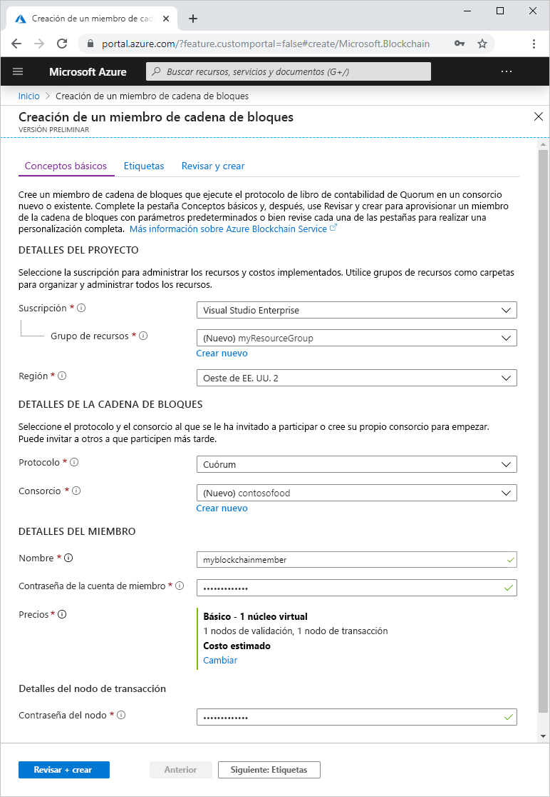
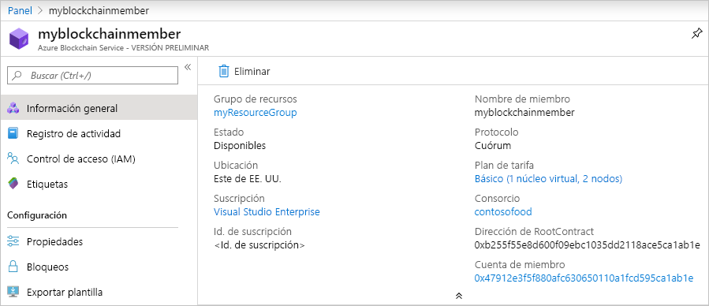

# Inicio rápido: Creación de una instancia de Azure Blockchain Service mediante Azure Portal

Azure Blockchain Service es una plataforma de cadena de bloques que puede ejecutar su lógica de negocios dentro de un contrato inteligente. Para comenzar, en este inicio rápido se muestra cómo crear un libro de contabilidad administrado con Azure Portal.

[!INCLUDE [quickstarts-free-trial-note](../../../includes/quickstarts-free-trial-note.md)]

## Creación de un libro de contabilidad administrado

Azure Blockchain Service se crea con un conjunto definido de recursos de proceso y almacenamiento.

1. Inicie sesión en el [Azure Portal](https://portal.azure.com).
1. Haga clic en **Crear un recurso** en la esquina superior izquierda de Azure Portal.
1. Seleccione **Cadena de bloques** > **Azure Blockchain Service**.
1. Rellene la plantilla.

    

    Configuración | DESCRIPCIÓN
    --------|------------
    Blockchain Member (Miembro de cadena de bloques) | Elija un nombre único que identifique al miembro de Azure Blockchain Service. El nombre del miembro de la cadena de bloques solo puede contener letras minúsculas y números. El primer carácter debe ser una letra. El valor debe tener entre 2 y 20 caracteres.
    Subscription | Seleccione la suscripción de Azure que quiere usar con el servicio. Si tiene varias suscripciones, elija aquella en la que se factura el recurso.
    Grupos de recursos | Un nuevo nombre de grupo de recursos o uno existente de la suscripción.
    Region | La ubicación debe ser la misma para todos los miembros del consorcio.
    Member account password (Contraseña de la cuenta del miembro) | Proporcione una nueva contraseña para la cuenta del miembro. La contraseña de la cuenta del miembro se usa para autenticarse en el punto de conexión público del miembro de cadena de bloques mediante autenticación básica.
    Nombre del consorcio | Si es un nuevo consorcio, escriba un nombre único. Si se va a unir a un consorcio por medio de una invitación, el valor es el consorcio al que se une.
    DESCRIPCIÓN | Descripción del consorcio.
    Protocolo |  La versión preliminar admite el protocolo de quorum.
    Precios | La configuración de nodo del nuevo servicio. Seleccione **Estándar**. La configuración predeterminada es 2 nodos de validación y 1 nodo de transacción.

1. Seleccione **Crear** para aprovisionar el servicio. El aprovisionamiento tarda aproximadamente 10 minutos.
1. Para supervisar el proceso de implementación, seleccione **Notificaciones** en la barra de herramientas.
1. Después de la implementación, vaya al miembro de cadena de bloques.

Seleccione **Información general** para ver la información básica sobre el servicio, como la dirección y la cuenta del miembro RootContract.

## Limpieza de recursos

Puede usar el miembro que ha creado en el siguiente inicio rápido o tutorial. Cuando ya no necesite los recursos, puede eliminarlos; para ello, elimine el grupo de recursos `myResourceGroup` que creó mediante Azure Blockchain Service.

Para eliminar el grupo de recursos:

1. En Azure Portal, vaya a **Grupo de recursos** en el panel de navegación izquierdo y seleccione el grupo de recursos que desea eliminar.
2. Seleccione **Eliminar grupo de recursos**. Compruebe la eliminación escribiendo el nombre del grupo de recursos y seleccionando **Eliminar**.

## Pasos siguientes

> [!div class="nextstepaction"]
> [Uso de MetaMask para conectarse a un contrato inteligente e implementarlo](connect-metamask.md)