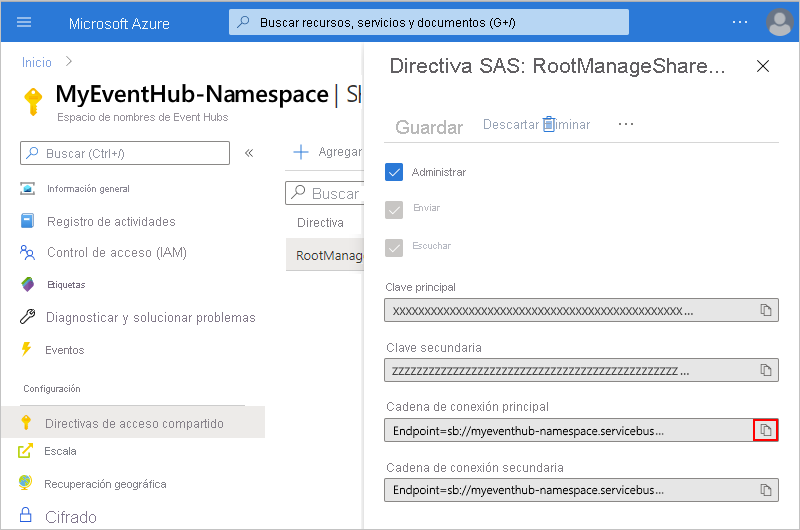
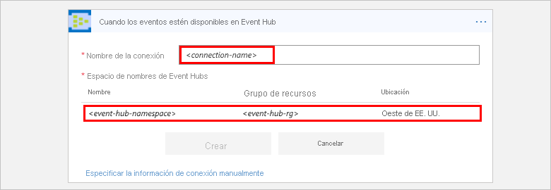
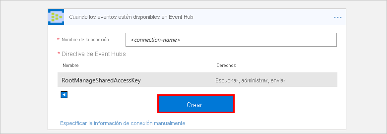

# Supervisión, recepción y envío de eventos con Azure Event Hubs y Azure Logic Apps

En este artículo se muestra cómo puede supervisar y administrar eventos enviados a [Azure Event Hubs](../event-hubs/event-hubs-what-is-event-hubs.md) desde una aplicación lógica con el conector de Azure Event Hubs. De esta forma, puede crear aplicaciones lógicas que automatizan las tareas y los flujos de trabajo para comprobar, enviar y recibir eventos desde su centro de eventos. Para obtener información técnica específica del conector, consulte la [referencia sobre el conector de Azure Event Hubs](https://docs.microsoft.com/connectors/eventhubs/)</a>.

## Requisitos previos

* Una suscripción de Azure. Si no tiene una suscripción de Azure, [regístrese para obtener una cuenta gratuita de Azure](https://azure.microsoft.com/free/). 

* Un [espacio de nombres de Azure Event Hubs y un centro de eventos](../event-hubs/event-hubs-create.md)

* La aplicación lógica donde quiere acceder al centro de eventos. Para iniciar la aplicación lógica con un desencadenador de Azure Event Hubs, necesita una [aplicación lógica en blanco](../logic-apps/quickstart-create-first-logic-app-workflow.md).
Si no está familiarizado con las aplicaciones lógicas, consulte [¿Qué es Azure Logic Apps?](../logic-apps/logic-apps-overview.md) e [Inicio rápido: Creación de la primera aplicación lógica](../logic-apps/quickstart-create-first-logic-app-workflow.md).

## Comprobación de los permisos y obtención de la cadena de conexión

Para asegurarse de que la aplicación lógica accede a la instancia de Event Hubs, debe tener permisos de administrador y la cadena de conexión para el espacio de nombres de Event Hubs.

1. Inicie sesión en el [Azure Portal](https://portal.azure.com).

1. Vaya al *espacio de nombres* de sus instancias de Event Hubs, no a un centro de eventos específico. 

1. En el menú del espacio de nombres, en **Configuración**, seleccione **Directivas de acceso compartido**. En **Notificaciones**, compruebe que tenga permisos de **Administrador** para ese espacio de nombres.

   

1. Si más adelante desea escribir manualmente la información de conexión, obtenga la cadena de conexión para el espacio de nombres de sus instancias de Event Hubs.

   1. En **Directiva**, elija **RootManageSharedAccessKey**.

   1. Busque la cadena de conexión de clave principal. Elija el botón Copiar y guarde la cadena de conexión para su uso posterior.

      

      > [!TIP]
      > Para confirmar si la cadena de conexión está asociada al espacio de nombres de Event Hubs o a un centro de eventos específico, asegúrese de que la cadena de conexión no tiene el parámetro `EntityPath` . Si encuentra este parámetro, la cadena de conexión es para la "entidad" de una instancia de Event Hubs específica y no es la cadena correcta para utilizar con la aplicación lógica.

1. Ahora, continúe con [Adición de un desencadenador de Event Hubs](#add-trigger) o [Adición de una acción de Event Hubs](#add-action).

## Adición de un desencadenador de Event Hubs

En Azure Logic Apps, cada aplicación lógica debe comenzar con un [desencadenador](../logic-apps/logic-apps-overview.md#logic-app-concepts), que se activa cuando sucede un evento específico o cuando se cumple una condición determinada. Cada vez que el desencadenador se activa, el motor de Logic Apps crea una instancia de aplicación lógica y empieza a ejecutar el flujo de trabajo de la aplicación.

En este ejemplo se muestra cómo puede iniciar un flujo de trabajo de aplicaciones lógicas cuando se envían nuevos eventos al centro de eventos. 

1. En Azure Portal o Visual Studio, cree una aplicación lógica en blanco, con lo que se abre el diseñador de Logic Apps. En este ejemplo se usa Azure Portal.

1. En el cuadro de búsqueda, escriba "event hubs" como filtro. En la lista de desencadenadores, seleccione este desencadenador: **When events are available in Event Hub - Event Hubs** (Cuando los eventos estén disponibles en el centro de eventos - Event Hubs)

   

1. Si se le pide indicar los detalles de la conexión, [cree ahora mismo su conexión de Event Hubs](#create-connection). 

1. En el desencadenador, proporcione información sobre el centro de eventos que quiere supervisar. Para ver más propiedades, abra la lista **Agregar nuevo parámetro**. Si selecciona un parámetro, se agrega esa propiedad en la tarjeta de desencadenador.

   

   | Propiedad | Obligatorio | DESCRIPCIÓN |
   |----------|----------|-------------|
   | **Nombre del centro de eventos** | Sí | Nombre del centro de eventos que quiere supervisar. |
   | **Tipo de contenido** | Sin | Tipo de contenido del evento. El valor predeterminado es `application/octet-stream`. |
   | **Nombre del grupo de consumidores** | Sin | [Nombre del grupo de consumidores del centro de eventos](../event-hubs/event-hubs-features.md#consumer-groups) para leer los eventos. Si no se especifica, se utiliza el grupo de consumidores predeterminado. |
   | **Número máximo de eventos**. | Sin | Número máximo de eventos. El desencadenador devuelve entre uno y el número de eventos que especifica esta propiedad. |
   | **Intervalo** | Sí | Entero positivo que describe la frecuencia con la que se ejecuta el flujo de trabajo. |
   | **Frecuencia** | Sí | Unidad de tiempo que se usa para la periodicidad. |
   ||||

   **Propiedades adicionales**

   | Propiedad | Obligatorio | DESCRIPCIÓN |
   |----------|----------|-------------|
   | **Esquema de contenido** | Sin | Esquema de contenido JSON para los eventos que se leerán desde el centro de eventos. Por ejemplo, si especifica el esquema de contenido, puede desencadenar la aplicación lógica solo para los eventos que coinciden con el esquema. |
   | **Clave de partición mínima** | Sin | Escriba el identificador de la [partición](../event-hubs/event-hubs-features.md#partitions) mínima que va a leer. De forma predeterminada, se leen todas las particiones. |
   | **Clave de partición máxima** | Sin | Escriba el identificador de la [partición](../event-hubs/event-hubs-features.md#partitions) máxima que va a leer. De forma predeterminada, se leen todas las particiones. |
   | **Zona horaria** | Sin | Solo se aplica cuando se especifica una hora de inicio porque este desencadenador no acepta diferencia horaria con UTC. Seleccione la zona horaria que desea aplicar. 
Para obtener más información, consulte [Creación y ejecución de tareas y flujos de trabajo repetitivos con Azure Logic Apps](../connectors/connectors-native-recurrence.md). |
   | **Hora de inicio** | Sin | Proporcione una hora de inicio con este formato: 
AAAA-MM-DDThh:mm:ss si selecciona una zona horaria
O bien
AAAA-MM-DDThh:mm:ssZ si no selecciona una zona horaria
Para obtener más información, consulte [Creación y ejecución de tareas y flujos de trabajo repetitivos con Azure Logic Apps](../connectors/connectors-native-recurrence.md). |
   ||||

1. Cuando esté listo, elija **Guardar** en la barra de herramientas del diseñador.

1. Ahora, agregue a la aplicación lógica una o varias acciones, en función de las tareas que desea realizar con los resultados del desencadenador. 

   Por ejemplo, para filtrar eventos basándose en un valor específico, (como una categoría), puede agregar una condición para que la acción **Send event** (Enviar evento) envíe solo los eventos que cumplan la condición. 

> [!NOTE]
> Todos los desencadenadores de Event Hub son de *sondeo largo*, lo que significa que, cuando se activa cualquiera de ellos, procesa todos los eventos y espera 30 segundos a que aparezcan más eventos en la instancia de Event Hubs.
> Si no se recibe ningún evento en 30 segundos, se omite la ejecución del desencadenador. De lo caso contrario, el desencadenador sigue leyendo eventos hasta que su instancia de Event Hubs está vacía.
> El siguiente sondeo del desencadenador ocurre en función del intervalo de periodicidad especificado en las propiedades del desencadenador.

## Adición de una acción de Event Hubs

En Azure Logic Apps, una [acción](../logic-apps/logic-apps-overview.md#logic-app-concepts) es un paso del flujo de trabajo que sigue a un desencadenador u otra acción. Para este ejemplo, la aplicación lógica comienza con un desencadenador de Event Hubs que comprueba si hay nuevos eventos en su centro de eventos.

1. En Azure Portal o Visual Studio, abra la aplicación lógica el Diseñador de Logic Apps. En este ejemplo se usa Azure Portal.

1. En el desencadenador o acción, elija **Nuevo paso**.

   Para agregar una acción entre los pasos existentes, mueva el mouse sobre la flecha de conexión. 
   Elija el signo más ( **+** ) que aparece y seleccione **Agregar una acción**.

1. En el cuadro de búsqueda, escriba "event hubs" como filtro.
En la lista de acciones, seleccione esta acción: **Send event - Event Hubs** (Enviar evento - Event Hubs)

   

1. Si se le pide indicar los detalles de la conexión, [cree ahora mismo su conexión de Event Hubs](#create-connection). 

1. En la acción, proporcione información sobre los eventos que quiere enviar. Para ver más propiedades, abra la lista **Agregar nuevo parámetro**. Si selecciona un parámetro, se agrega esa propiedad en la tarjeta de acción.

   

   | Propiedad | Obligatorio | DESCRIPCIÓN |
   |----------|----------|-------------|
   | **Nombre del centro de eventos** | Sí | Centro de eventos donde quiere enviar el evento. |
   | **Contenido** | Sin | El contenido del evento que quiere enviar |
   | **Propiedades** | Sin | Las propiedades de la aplicación y los valores para enviar |
   | **Clave de partición** | Sin | Identificador de la [partición](../event-hubs/event-hubs-features.md#partitions) a la que se va a enviar el evento. |
   ||||

   Por ejemplo, puede enviar la salida desde el desencadenador de Event Hubs a otro centro de eventos:

   

1. Cuando esté listo, elija **Guardar** en la barra de herramientas del diseñador.

## Conexión al centro de eventos

[!INCLUDE [Create connection general intro](../../includes/connectors-create-connection-general-intro.md)] 

1. Cuando se le solicite la información de conexión, proporcione estos detalles:

   | Propiedad | Obligatorio | Value | DESCRIPCIÓN |
   |----------|----------|-------|-------------|
   | **Nombre de la conexión** | Sí | <*connection-name*> | El nombre que se va a crear para su conexión |
   | **Espacio de nombres de Event Hubs** | Sí | <*event-hubs-namespace*> | Seleccione el espacio de nombres de Event Hubs que desea usar. |
   |||||  

   Por ejemplo:

   

   Para escribir de forma manual la cadena de conexión, seleccione **Especificar la información de conexión manualmente**. 
   Obtenga información acerca de [cómo buscar la cadena de conexión](#permissions-connection-string).

2. Seleccione la directiva de Event Hubs que desea usar, si no está seleccionada. Seleccione **Create**.

   

3. Después de crear la conexión, continúe con [Adición de un desencadenador de Event Hubs](#add-trigger) o [Adición de una acción de Event Hubs](#add-action).

## Referencia de conectores

Para obtener datos técnicos, como los desencadenadores, las acciones y los límites, tal como lo describe el archivo OpenAPI (antes Swagger) del conector, consulte la [página de referencia del conector](/connectors/eventhubs/).

## Pasos siguientes

Obtenga más información sobre otros [conectores de Logic Apps](../connectors/apis-list.md)