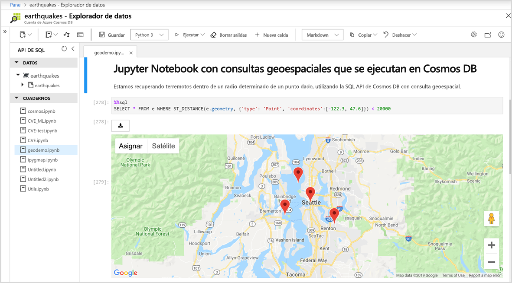

# Compatibilidad con cuadernos de Jupyter Notebook en Azure Cosmos DB

Jupyter Notebook es una aplicación web de código abierto que le permite crear y compartir documentos que contengan código activo, ecuaciones, visualizaciones y texto narrativo. Azure Cosmos DB admite cuadernos de Jupyter Notebook integrados para todas las API, como Cassandra, MongoDB, SQL, Gremlin y Table. La compatibilidad integrada de los cuadernos con todas las API y modelos de datos de Azure Cosmos DB permite ejecutar consultas de forma interactiva. Los cuadernos de Jupyter Notebook se ejecutan en las cuentas de Azure Cosmos y permiten a los desarrolladores realizar exploraciones, limpieza y transformaciones de datos, así como simulaciones numéricas, modelado estadístico, visualización de datos y aprendizaje automático.

Los cuadernos de Jupyter Notebook admiten varias funciones con comandos magic que amplían las funcionalidades del kernel al admitir comandos adicionales. Los comandos magic de Cosmos son comandos que amplían las funcionalidades del kernel de Python en los cuadernos de Jupyter Notebook para que pueda ejecutar consultas de SQL API de Azure Cosmos además de Apache Spark. Puede combinar fácilmente consultas de Python y SQL API para consultar y visualizar datos mediante el uso de bibliotecas de visualización enriquecidas integradas con comandos de representación.
Azure Portal integra de forma nativa la experiencia de los cuadernos de Jupyter Notebook en cuentas de Azure Cosmos, tal como se muestra en la siguiente imagen:

## Ventajas de los cuadernos de Jupyter Notebook

Los cuadernos de Jupyter Notebook se desarrollaron originalmente para aplicaciones de ciencia de datos escritas en Python, R. Sin embargo, se pueden usar de varias maneras para diferentes tipos de proyectos, como:

* ***Visualizaciones de datos:** Los cuadernos de Jupyter Notebook permiten visualizar datos en forma de un cuaderno compartido que representa algún conjunto de datos como un gráfico. El cuaderno de Jupyter Notebook le permite crear visualizaciones, compartirlas y permitir cambios interactivos en el código compartido y en el conjunto de datos.

* **Uso compartido de código:** Los servicios como GitHub proporcionan maneras de compartir código, pero en su mayoría no son interactivos. Con un cuaderno de Jupyter Notebook, puede ver el código, ejecutarlo y mostrar los resultados directamente en Azure Portal.

* **Interacciones activas con código:** El código del cuaderno de Jupyter Notebook es dinámico; se puede editar y volver a ejecutar incrementalmente en tiempo real. Los cuadernos también pueden insertar controles de usuario (por ejemplo, controles deslizantes o campos de entrada de texto) que se pueden usar como orígenes de entrada para el código, demostraciones o prueba de conceptos (POC).

* **Documentación de ejemplos de código y resultados de la exploración de datos:** Si tiene un fragmento de código y desea explicar línea por línea cómo funciona en Azure Cosmos DB, con la salida en tiempo real a lo largo del proceso, puede incrustarla en un cuaderno de Jupyter Notebook. El código seguirá siendo totalmente funcional. Puede agregar interactividad junto con la documentación al mismo tiempo.

* **Comandos magic de Cosmos:** En los cuadernos de Jupyter Notebook, puede usar los comandos magic personalizados para Azure Cosmos DB con el fin de facilitar la informática interactiva. Por ejemplo, el comando magic %%sql, que permite consultar un contenedor de Cosmos mediante la SQL API directamente en un cuaderno.

* **Todo en un solo lugar:** Los cuadernos de Jupyter Notebook combinan código, texto enriquecido, imágenes, vídeos, animaciones, ecuaciones matemáticas, trazados, mapas, figuras interactivas, widgets e interfaces de usuario gráficas en un solo documento.

## Componentes de un cuaderno de Jupyter Notebook

Los cuadernos de Jupyter Notebook pueden incluir varios tipos de componentes, cada uno organizado en bloques discretos:

* **Texto y HTML:** El texto sin formato, o texto anotado en la sintaxis de Markdown para generar HTML, se puede insertar en el documento en cualquier momento. Los estilos de CSS también pueden insertarse o agregarse a la plantilla que se usa para generar el cuaderno.

* **Entrada y salida:** Los cuadernos de Jupyter Notebook admiten el código Python. Los resultados del código ejecutado aparecen inmediatamente después de los bloques de código, y estos se pueden ejecutar varias veces en cualquier orden que desee.

* **Visualizaciones:** Los gráficos y diagramas pueden generarse a partir del código, mediante módulos como Matplotlib, Plotly o Bokeh. De forma similar a la salida, estas visualizaciones aparecen insertadas junto al código que las genera.

* **Multimedia:** Dado que el cuaderno de Jupyter Notebook se basa en la tecnología web, puede mostrar todos los tipos de contenido multimedia que se admiten en una página web. Puede incluirlos en un cuaderno como elementos HTML o puede generarlos mediante programación con el módulo `IPython.display`.

* **Datos:** Los datos de contenedores de Azure Cosmos y los resultados de las consultas se pueden importar a un cuaderno de Jupyter Notebook mediante programación. Por ejemplo, al incluir código en el cuaderno para consultar los datos mediante cualquiera de las API de Cosmos DB o con Apache Spark integrado de forma nativa.

## Pasos siguientes

Para empezar a trabajar con cuadernos de Jupyter Notebook integrados en Azure Cosmos DB, consulte los siguientes artículos:

* [Habilitación de cuadernos en una cuenta de Azure Cosmos](enable-notebooks.md)
* [Uso de las características y los comandos de cuadernos](use-notebook-features-and-commands.md)

