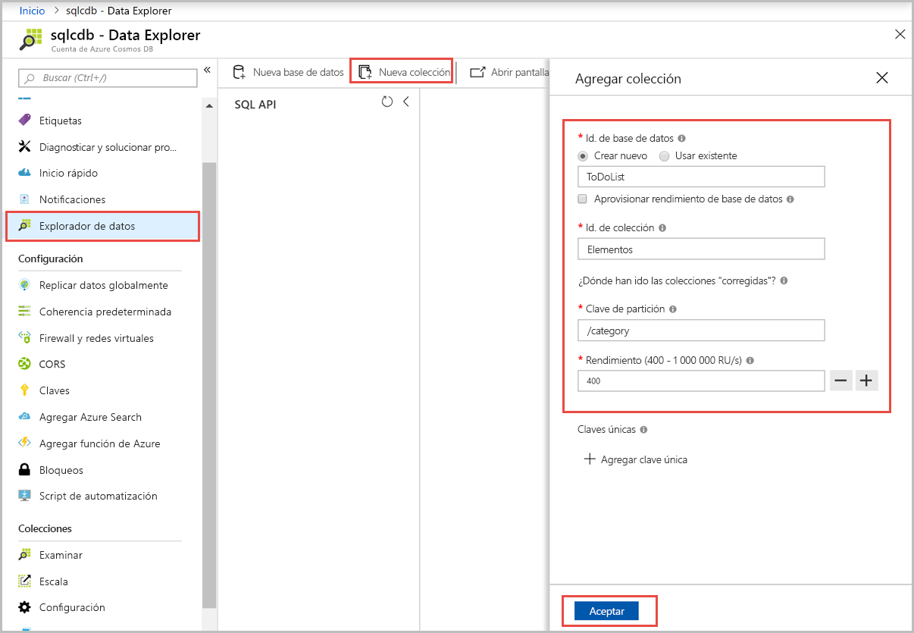
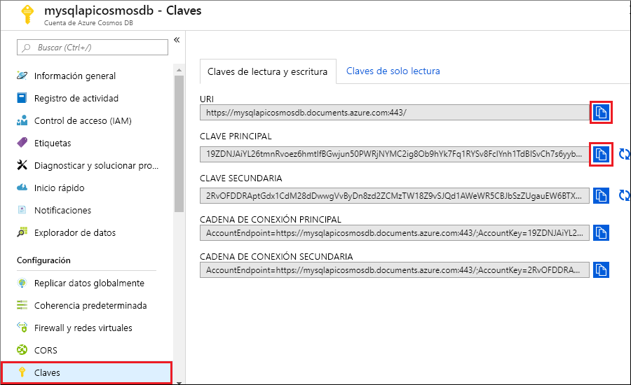

# <a name="quickstart-build-a-net-web-app-using-azure-cosmos-db-sql-api-account"></a>Inicio rápido: Creación de una aplicación web .NET con una cuenta de SQL API de Azure Cosmos DB

> [!div class="op_single_selector"]
> * [.NET](create-sql-api-dotnet.md)
> * [.NET (versión preliminar)](create-sql-api-dotnet-preview.md)
> * [Java](create-sql-api-java.md)
> * [Node.js](create-sql-api-nodejs.md)
> * [Python](create-sql-api-python.md)
> * [Xamarin](create-sql-api-xamarin-dotnet.md)
>  
> 

Azure Cosmos DB es un servicio de base de datos con varios modelos y de distribución global de Microsoft. Puede crear rápidamente bases de datos de documentos, clave-valor y grafos, y realizar consultas en ellas. Todas las bases de datos se beneficiarán de las funcionalidades de distribución global y escala horizontal en Azure Cosmos DB. 

En este inicio rápido se muestra cómo crear una cuenta de [SQL API](sql-api-introduction.md) de Azure Cosmos DB, una base de datos de documentos, una colección y cómo agregar datos de ejemplo a la colección mediante Azure Portal. Luego, se compila e implementa una aplicación web de lista de tareas creada mediante el [SDK de .NET de SQL](sql-api-sdk-dotnet.md), para agregar más datos de administración dentro de la colección. 

## <a name="prerequisites"></a>Requisitos previos

Si aún no tiene Visual Studio de 2017 instalado, puede descargar y usar la versión **gratis** de [Visual Studio 2017 Community Edition](https://www.visualstudio.com/downloads/). Asegúrese de que habilita **Desarrollo de Azure** durante la instalación de Visual Studio.

[!INCLUDE [quickstarts-free-trial-note](../../includes/quickstarts-free-trial-note.md)] 
[!INCLUDE [cosmos-db-emulator-docdb-api](../../includes/cosmos-db-emulator-docdb-api.md)]  

<a id="create-account"></a>
## <a name="create-an-account"></a>Crear una cuenta

[!INCLUDE [cosmos-db-create-dbaccount](../../includes/cosmos-db-create-dbaccount.md)]

<a id="create-collection-database"></a>
## <a name="add-a-database-and-a-collection"></a>Adición de una base de datos y una colección

Ahora puede usar la herramienta Explorador de datos en Azure Portal para crear una base de datos y una colección. 

1. Haga clic en **Explorador de datos** > **Nueva colección**. 
    
    El área **Agregar colección** se muestra en el extremo derecho, pero es posible que haya que desplazarse hacia la derecha para verlo.

    

2. En la página **Agregar colección**, especifique la configuración de la nueva colección.

    Configuración|Valor sugerido|DESCRIPCIÓN
    ---|---|---
    **Id. de base de datos**|ToDoList|Escriba *ToDoList* como nombre de la nueva base de datos. Los nombres de base de datos tienen que tener entre 1 y 255 caracteres y no pueden contener `/, \\, #, ?` o espacios finales.
    **Id. de colección**|Elementos|Escriba *Elementos* como nombre de la nueva colección. Los identificadores de colección tienen los mismos requisitos de caracteres que los nombres de las bases de datos.
    **Clave de partición**| `<your_partition_key>`| Escriba la clave de partición. El ejemplo que se describe en este artículo usa */category* como clave de partición.
    **Rendimiento**|400 RU|Cambie el rendimiento a 400 unidades de solicitud por segundo (RU/s). Si quiere reducir la latencia, puede escalar verticalmente el rendimiento más adelante. 
    
    Además de la configuración anterior, puede agregar opcionalmente **claves únicas** para la colección. En este ejemplo vamos a dejar el campo en blanco. Las claves únicas proporcionan a los desarrolladores la capacidad de agregar una capa de integridad de datos a la base de datos. Mediante la creación de una directiva de clave única al crear una colección, se garantiza la unicidad de uno o varios valores por clave de partición. Para más información, consulte el artículo [Claves únicas en Azure Cosmos DB](unique-keys.md).
    
    Haga clic en **OK**.

    El Explorador de datos muestra la nueva base de datos y la colección.

    

<a id="add-sample-data"></a>
## <a name="add-sample-data"></a>Adición de datos de ejemplo

Ahora puede agregar datos a la nueva colección mediante el Explorador de datos.

1. En el Explorador de datos, la nueva base de datos aparece en el panel Colecciones. Expanda la base de datos **Tareas**, expanda la colección **Elementos**, haga clic en **Documentos** y, después, haga clic en **Nuevos documentos**. 

   
  
2. Ahora agregue un documento a la colección con la estructura siguiente.

     ```json
     {
         "id": "1",
         "category": "personal",
         "name": "groceries",
         "description": "Pick up apples and strawberries.",
         "isComplete": false
     }
     ```

3. Cuando haya agregado el archivo JSON a la pestaña **Documentos**, haga clic en **Guardar**.

    

4. Cree y guarde un documento más donde insertará un valor único para la propiedad `id` y cambie las demás propiedades como corresponda. Los nuevos documentos pueden tener la estructura que quiera, ya que Azure Cosmos DB no impone ningún esquema en los datos.

## <a name="query-your-data"></a>Consulta de los datos

[!INCLUDE [cosmos-db-create-sql-api-query-data](../../includes/cosmos-db-create-sql-api-query-data.md)]

## <a name="clone-the-sample-application"></a>Clonación de la aplicación de ejemplo

Ahora vamos a empezar a trabajar con el código. Vamos a clonar una [aplicación de SQL API desde GitHub](https://github.com/Azure-Samples/documentdb-dotnet-todo-app), establecer la cadena de conexión y ejecutarla. Verá lo fácil que es trabajar con datos mediante programación. 

1. Abra un símbolo del sistema, cree una carpeta nueva denominada ejemplos de GIT y, después, cierre el símbolo del sistema.

    ```bash
    md "C:\git-samples"
    ```

2. Abra una ventana de terminal de Git, como git bash y utilice el comando `cd` para cambiar a la nueva carpeta para instalar la aplicación de ejemplo.

    ```bash
    cd "C:\git-samples"
    ```

3. Ejecute el comando siguiente para clonar el repositorio de ejemplo. Este comando crea una copia de la aplicación de ejemplo en el equipo.

    ```bash
    git clone https://github.com/Azure-Samples/documentdb-dotnet-todo-app.git
    ```

4. Después, abra el archivo de solución de tareas pendientes en Visual Studio. 

## <a name="review-the-code"></a>Revisión del código

Este paso es opcional. Si está interesado en aprender cómo se crean los recursos de base de datos en el código, puede revisar los siguientes fragmentos de código. En caso contrario, puede ir directamente a [Actualización de la cadena de conexión](#update-your-connection-string). En este inicio rápido, cree una base de datos y una colección mediante Azure Portal y agregue datos de ejemplo mediante el ejemplo de .NET. Sin embargo, también puede crear la base de datos y la colección mediante el ejemplo de .NET. 

Los fragmentos de código siguientes se han tomado del archivo DocumentDBRepository.cs.

* DocumentClient se inicializa como se muestra en el código siguiente:

    ```csharp
    client = new DocumentClient(new Uri(ConfigurationManager.AppSettings["endpoint"]), ConfigurationManager.AppSettings["authKey"]);
    ```

* Se crea una nueva base de datos mediante el método `CreateDatabaseAsync`, como se muestra en el código siguiente:

    ```csharp
    await client.CreateDatabaseAsync(new Database { Id = DatabaseId });
    ```

* Se crea una colección mediante el método `CreateDocumentCollectionAsync`, como se muestra en el código siguiente:

    ```csharp
    private static async Task CreateCollectionIfNotExistsAsync()
    {
        try
        {
           await client.ReadDocumentCollectionAsync(UriFactory.CreateDocumentCollectionUri(DatabaseId, CollectionId));
        }
        catch (DocumentClientException e)
        {
           if (e.StatusCode == System.Net.HttpStatusCode.NotFound)
           {
              await client.CreateDocumentCollectionAsync(
              UriFactory.CreateDatabaseUri(DatabaseId),
              new DocumentCollection
              {
                  Id = CollectionId
              },
              new RequestOptions { OfferThroughput = 400 });
           }
           else
           {
             throw;
           }
        }
    }
    ```

## <a name="update-your-connection-string"></a>Actualización de la cadena de conexión

Ahora vuelva a Azure Portal para obtener la información de la cadena de conexión y cópiela en la aplicación.

1. En [Azure Portal](https://portal.azure.com/), en la cuenta de Azure Cosmos DB, en el panel de navegación izquierdo, seleccione **Claves** y, después, **Claves de lectura y escritura**. Deberá usar los botones de copia del lado derecho de la pantalla para copiar el URI y la clave principal en el archivo web.config en el paso siguiente.

    

2. En Visual Studio 2017, abra el archivo web.config. 

3. Copie el valor del URI del portal (con el botón de copia) y conviértalo en el valor de la clave de punto de conexión en web.config. 

    `<add key="endpoint" value="FILLME" />`

4. Después, copie el valor de la clave principal del portal y conviértalo en el valor de la clave de autenticación en web.config. 

    `<add key="authKey" value="FILLME" />`
    
5. A continuación, actualice los valores de la base de datos y de la colección para que coincidan con el nombre de la base de datos que creó anteriormente. Ya ha actualizado la aplicación con toda la información que necesita para comunicarse con Azure Cosmos DB. 

   ```csharp
   <add key="database" value="ToDoList"/>
   <add key="collection" value="Items"/>
   ```
 
## <a name="run-the-web-app"></a>Ejecución de la aplicación web
1. En Visual Studio, haga clic con el botón derecho en el proyecto en el **Explorador de soluciones** y, después, seleccione en **Administrar paquetes NuGet**. 

2. En el cuadro **Examinar** de NuGet, escriba *DocumentDB*.

3. En los resultados, instale la biblioteca **Microsoft.Azure.DocumentDB**. De este modo, se instalan el paquete Microsoft.Azure.DocumentDB y todas las dependencias.

4. Seleccione CTRL+F5 para ejecutar la aplicación. La aplicación se muestra en el explorador. 

5. Seleccione **Crear nuevo** en el explorador y cree algunas tareas en la aplicación de tareas pendientes.

   

Ahora puede volver al Explorador de datos y ver, consultar, modificar y trabajar con estos nuevos datos. 

## <a name="review-slas-in-the-azure-portal"></a>Revisión de los SLA en Azure Portal

[!INCLUDE [cosmosdb-tutorial-review-slas](../../includes/cosmos-db-tutorial-review-slas.md)]

## <a name="clean-up-resources"></a>Limpieza de recursos

[!INCLUDE [cosmosdb-delete-resource-group](../../includes/cosmos-db-delete-resource-group.md)]

## <a name="next-steps"></a>Pasos siguientes

En esta guía de inicio rápido, ha aprendido a crear una cuenta de Azure Cosmos DB, crear una colección mediante el Explorador de datos y ejecutar una aplicación web. Ahora puede importar datos adicionales en la cuenta de Cosmos DB. 

> [!div class="nextstepaction"]
> [Importación de datos a Azure Cosmos DB](import-data.md)


